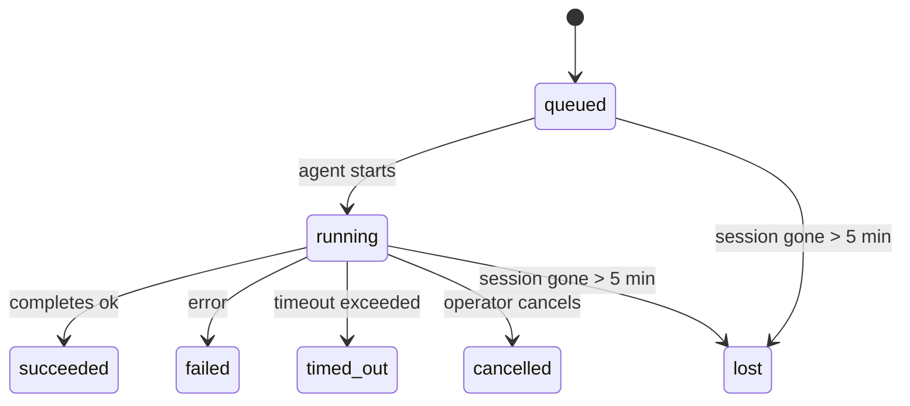

---
read_when:
    - Перевірка фонової роботи, що виконується або нещодавно завершилася
    - Налагодження збоїв доставки для відокремлених запусків агентів
    - Розуміння того, як фонові запуски пов’язані із сесіями, cron і heartbeat
summary: Відстеження фонових завдань для запусків ACP, субагентів, ізольованих cron-завдань і CLI-операцій
title: Фонові завдання
x-i18n:
    generated_at: "2026-04-05T17:57:34Z"
    model: gpt-5.4
    provider: openai
    source_hash: 6c95ccf4388d07e60a7bb68746b161793f4bb5ff2ba3d5ce9e51f2225dab2c4d
    source_path: automation/tasks.md
    workflow: 15
---

# Фонові завдання

> **Шукаєте планування?** Див. [Автоматизація й завдання](/automation), щоб вибрати правильний механізм. Ця сторінка описує **відстеження** фонової роботи, а не її планування.

Фонові завдання відстежують роботу, яка виконується **поза межами вашої основної сесії розмови**:
запуски ACP, запуск субагентів, виконання ізольованих cron-завдань і операції, ініційовані через CLI.

Завдання **не** замінюють сесії, cron-завдання або heartbeat — це **журнал активності**, який фіксує, яка відокремлена робота відбулася, коли саме і чи була вона успішною.

<Note>
Не кожен запуск агента створює завдання. Кроки heartbeat і звичайний інтерактивний чат — ні. Усі виконання cron, запуски ACP, запуски субагентів і команди агента CLI — так.
</Note>

## Коротко

- Завдання — це **записи**, а не планувальники: cron і heartbeat вирішують, _коли_ запускається робота, а завдання відстежують, _що сталося_.
- ACP, субагенти, усі cron-завдання та CLI-операції створюють завдання. Кроки heartbeat — ні.
- Кожне завдання проходить шлях `queued → running → terminal` (succeeded, failed, timed_out, cancelled або lost).
- Cron-завдання залишаються активними, поки середовище виконання cron усе ще володіє завданням; CLI-завдання, пов’язані з чатом, залишаються активними лише поки ще активний їхній контекст запуску-власника.
- Завершення керується push-механізмом: відокремлена робота може напряму сповістити або пробудити сесію запитувача/heartbeat після завершення, тому цикли опитування стану зазвичай є неправильною моделлю.
- Ізольовані cron-запуски та завершення субагентів у режимі best-effort очищають відстежувані вкладки браузера/процеси для своєї дочірньої сесії перед фінальним оформленням очищення.
- Доставка ізольованого cron пригнічує застарілі проміжні відповіді батьківського процесу, поки ще завершуються дочірні роботи субагентів, і надає перевагу фінальному дочірньому виводу, якщо він надходить до доставки.
- Сповіщення про завершення доставляються безпосередньо в канал або ставляться в чергу до наступного heartbeat.
- `openclaw tasks list` показує всі завдання; `openclaw tasks audit` виявляє проблеми.
- Термінальні записи зберігаються 7 днів, після чого автоматично видаляються.

## Швидкий старт

```bash
# Перелічити всі завдання (найновіші спочатку)
openclaw tasks list

# Фільтрувати за середовищем виконання або статусом
openclaw tasks list --runtime acp
openclaw tasks list --status running

# Показати подробиці конкретного завдання (за ID, ID запуску або ключем сесії)
openclaw tasks show <lookup>

# Скасувати запущене завдання (завершує дочірню сесію)
openclaw tasks cancel <lookup>

# Змінити політику сповіщень для завдання
openclaw tasks notify <lookup> state_changes

# Запустити перевірку стану
openclaw tasks audit

# Переглянути або застосувати обслуговування
openclaw tasks maintenance
openclaw tasks maintenance --apply

# Перевірити стан Task Flow
openclaw tasks flow list
openclaw tasks flow show <lookup>
openclaw tasks flow cancel <lookup>
```

## Що створює завдання

| Джерело                | Тип середовища виконання | Коли створюється запис завдання                      | Типова політика сповіщень |
| ---------------------- | ------------------------ | --------------------------------------------------- | ------------------------- |
| Фонові запуски ACP     | `acp`                    | Під час створення дочірньої сесії ACP               | `done_only`               |
| Оркестрація субагентів | `subagent`               | Під час запуску субагента через `sessions_spawn`    | `done_only`               |
| Cron-завдання (усі типи) | `cron`                 | Для кожного виконання cron (основна сесія й ізольоване) | `silent`              |
| CLI-операції           | `cli`                    | Команди `openclaw agent`, що виконуються через gateway | `silent`               |

Cron-завдання основної сесії типово використовують політику сповіщень `silent` — вони створюють записи для відстеження, але не генерують сповіщення. Ізольовані cron-завдання також типово використовують `silent`, але помітніші, бо працюють у власній сесії.

**Що не створює завдання:**

- Кроки heartbeat — основна сесія; див. [Heartbeat](/gateway/heartbeat)
- Звичайні інтерактивні кроки чату
- Прямі відповіді `/command`

## Життєвий цикл завдання



| Статус      | Що це означає                                                            |
| ----------- | ------------------------------------------------------------------------ |
| `queued`    | Створено, очікує на запуск агента                                        |
| `running`   | Крок агента активно виконується                                          |
| `succeeded` | Успішно завершено                                                        |
| `failed`    | Завершено з помилкою                                                     |
| `timed_out` | Перевищено налаштований тайм-аут                                         |
| `cancelled` | Зупинено оператором через `openclaw tasks cancel`                        |
| `lost`      | Середовище виконання втратило авторитетний базовий стан після 5-хвилинного пільгового періоду |

Переходи відбуваються автоматично — коли пов’язаний запуск агента завершується, статус завдання оновлюється відповідно.

`lost` залежить від середовища виконання:

- Завдання ACP: зникли метадані дочірньої сесії ACP.
- Завдання субагента: дочірня сесія зникла зі сховища цільового агента.
- Cron-завдання: середовище виконання cron більше не відстежує завдання як активне.
- CLI-завдання: ізольовані завдання дочірніх сесій використовують дочірню сесію; CLI-завдання, пов’язані з чатом, натомість використовують живий контекст запуску, тому рядки сесій каналу/групи/прямих повідомлень, що лишилися, не підтримують їх активність.

## Доставка та сповіщення

Коли завдання досягає термінального стану, OpenClaw сповіщає вас. Є два шляхи доставки:

**Пряма доставка** — якщо завдання має ціль каналу (`requesterOrigin`), повідомлення про завершення надсилається прямо в цей канал (Telegram, Discord, Slack тощо). Для завершень субагентів OpenClaw також зберігає прив’язану маршрутизацію потоку/теми, якщо вона доступна, і може заповнити відсутній `to` / обліковий запис із збереженого маршруту сесії запитувача (`lastChannel` / `lastTo` / `lastAccountId`) перед тим, як відмовитися від прямої доставки.

**Доставка через чергу сесії** — якщо пряма доставка не вдається або origin не задано, оновлення ставиться в чергу як системна подія в сесії запитувача й відображається під час наступного heartbeat.

<Tip>
Завершення завдання негайно пробуджує heartbeat, щоб ви швидко побачили результат — вам не потрібно чекати наступного запланованого кроку heartbeat.
</Tip>

Це означає, що звичайний робочий процес є push-орієнтованим: один раз запустіть відокремлену роботу, а потім дозвольте середовищу виконання пробудити або сповістити вас після завершення. Опитуйте стан завдання лише тоді, коли вам потрібні налагодження, втручання або явний аудит.

### Політики сповіщень

Керуйте тим, скільки ви будете чути про кожне завдання:

| Політика              | Що доставляється                                                         |
| --------------------- | ------------------------------------------------------------------------ |
| `done_only` (типово)  | Лише термінальний стан (succeeded, failed тощо) — **це типове значення** |
| `state_changes`       | Кожна зміна стану та оновлення прогресу                                  |
| `silent`              | Узагалі нічого                                                            |

Змінити політику під час виконання завдання:

```bash
openclaw tasks notify <lookup> state_changes
```

## Довідка CLI

### `tasks list`

```bash
openclaw tasks list [--runtime <acp|subagent|cron|cli>] [--status <status>] [--json]
```

Стовпці виводу: ID завдання, тип, статус, доставка, ID запуску, дочірня сесія, підсумок.

### `tasks show`

```bash
openclaw tasks show <lookup>
```

Токен lookup приймає ID завдання, ID запуску або ключ сесії. Показує повний запис, зокрема таймінг, стан доставки, помилку та підсумок термінального стану.

### `tasks cancel`

```bash
openclaw tasks cancel <lookup>
```

Для завдань ACP і субагентів це завершує дочірню сесію. Статус переходить у `cancelled`, і надсилається сповіщення про доставку.

### `tasks notify`

```bash
openclaw tasks notify <lookup> <done_only|state_changes|silent>
```

### `tasks audit`

```bash
openclaw tasks audit [--json]
```

Виявляє операційні проблеми. Виявлені проблеми також з’являються в `openclaw status`, коли їх зафіксовано.

| Знахідка                  | Серйозність | Тригер                                                |
| ------------------------- | ----------- | ----------------------------------------------------- |
| `stale_queued`            | warn        | У стані черги понад 10 хвилин                         |
| `stale_running`           | error       | У стані виконання понад 30 хвилин                     |
| `lost`                    | error       | Зникло володіння завданням, підтверджене середовищем виконання |
| `delivery_failed`         | warn        | Доставка не вдалася, а політика сповіщень не `silent` |
| `missing_cleanup`         | warn        | Термінальне завдання без часової позначки очищення    |
| `inconsistent_timestamps` | warn        | Порушення часової шкали (наприклад, завершилося раніше, ніж почалося) |

### `tasks maintenance`

```bash
openclaw tasks maintenance [--json]
openclaw tasks maintenance --apply [--json]
```

Використовуйте це, щоб переглянути або застосувати звірку, проставлення очищення та видалення для завдань і стану Task Flow.

Звірка залежить від середовища виконання:

- Завдання ACP/субагентів перевіряють свою базову дочірню сесію.
- Cron-завдання перевіряють, чи середовище виконання cron усе ще володіє завданням.
- CLI-завдання, пов’язані з чатом, перевіряють контекст живого запуску-власника, а не лише рядок сесії чату.

Очищення після завершення також залежить від середовища виконання:

- Завершення субагента в режимі best-effort закриває відстежувані вкладки браузера/процеси для дочірньої сесії, перш ніж продовжується оголошення очищення.
- Завершення ізольованого cron у режимі best-effort закриває відстежувані вкладки браузера/процеси для cron-сесії, перш ніж запуск буде повністю згорнуто.
- Доставка ізольованого cron за потреби чекає на подальші дочірні дії субагента та пригнічує застарілий текст підтвердження батьківського процесу замість його оголошення.
- Доставка завершення субагента надає перевагу останньому видимому тексту асистента; якщо він порожній, використовується санітизований останній текст tool/toolResult, а запуски виклику інструментів лише з тайм-аутом можуть зводитися до короткого підсумку часткового прогресу.
- Помилки очищення не маскують реальний результат завдання.

### `tasks flow list|show|cancel`

```bash
openclaw tasks flow list [--status <status>] [--json]
openclaw tasks flow show <lookup> [--json]
openclaw tasks flow cancel <lookup>
```

Використовуйте це, коли вас цікавить оркеструвальний Task Flow, а не окремий запис фонового завдання.

## Дошка завдань у чаті (`/tasks`)

Використовуйте `/tasks` у будь-якій чат-сесії, щоб побачити фонові завдання, пов’язані із цією сесією. Дошка показує активні й нещодавно завершені завдання з даними про середовище виконання, статус, таймінг, а також подробицями прогресу або помилки.

Коли поточна сесія не має видимих пов’язаних завдань, `/tasks` повертається до локальних для агента лічильників завдань, щоб ви все одно мали огляд без розкриття подробиць інших сесій.

Для повного журналу оператора використовуйте CLI: `openclaw tasks list`.

## Інтеграція зі статусом (навантаження завдань)

`openclaw status` містить короткий підсумок завдань:

```
Tasks: 3 queued · 2 running · 1 issues
```

Підсумок повідомляє:

- **active** — кількість `queued` + `running`
- **failures** — кількість `failed` + `timed_out` + `lost`
- **byRuntime** — розбивка за `acp`, `subagent`, `cron`, `cli`

І `/status`, і інструмент `session_status` використовують знімок завдань з урахуванням очищення: активні завдання мають пріоритет, застарілі завершені рядки приховуються, а нещодавні збої показуються лише тоді, коли не лишається активної роботи. Це допомагає картці стану зосереджуватися на тому, що важливо саме зараз.

## Зберігання та обслуговування

### Де зберігаються завдання

Записи завдань зберігаються в SQLite за адресою:

```
$OPENCLAW_STATE_DIR/tasks/runs.sqlite
```

Реєстр завантажується в пам’ять під час запуску gateway і синхронізує записи із SQLite для надійності після перезапусків.

### Автоматичне обслуговування

Очищувач запускається кожні **60 секунд** і виконує три дії:

1. **Звірка** — перевіряє, чи активні завдання все ще мають авторитетне підтвердження в середовищі виконання. Завдання ACP/субагентів використовують стан дочірньої сесії, cron-завдання — володіння активним завданням, а CLI-завдання, пов’язані з чатом, — контекст запуску-власника. Якщо цей базовий стан відсутній понад 5 хвилин, завдання позначається як `lost`.
2. **Проставлення очищення** — установлює часову позначку `cleanupAfter` для термінальних завдань (`endedAt + 7 days`).
3. **Видалення** — видаляє записи, дата `cleanupAfter` яких уже минула.

**Термін зберігання**: записи термінальних завдань зберігаються **7 днів**, після чого автоматично видаляються. Налаштування не потрібне.

## Як завдання пов’язані з іншими системами

### Завдання і Task Flow

[Task Flow](/automation/taskflow) — це рівень оркестрації потоків над фоновими завданнями. Один потік протягом свого життєвого циклу може координувати кілька завдань, використовуючи керовані або дзеркальні режими синхронізації. Використовуйте `openclaw tasks`, щоб переглядати окремі записи завдань, і `openclaw tasks flow`, щоб переглядати оркеструвальний потік.

Докладніше див. у [Task Flow](/automation/taskflow).

### Завдання і cron

**Опис** cron-завдання живе в `~/.openclaw/cron/jobs.json`. **Кожне** виконання cron створює запис завдання — і в основній сесії, і в ізольованій. Cron-завдання основної сесії типово використовують політику сповіщень `silent`, тому відстежуються без створення сповіщень.

Див. [Cron-завдання](/automation/cron-jobs).

### Завдання і heartbeat

Запуски heartbeat — це кроки основної сесії, вони не створюють записи завдань. Коли завдання завершується, воно може пробудити heartbeat, щоб ви швидко побачили результат.

Див. [Heartbeat](/gateway/heartbeat).

### Завдання і сесії

Завдання може посилатися на `childSessionKey` (де виконується робота) і `requesterSessionKey` (хто її запустив). Сесії — це контекст розмови; завдання — це відстеження активності поверх нього.

### Завдання і запуски агентів

`runId` завдання пов’язує його із запуском агента, який виконує роботу. Події життєвого циклу агента (запуск, завершення, помилка) автоматично оновлюють статус завдання — вам не потрібно керувати життєвим циклом вручну.

## Пов’язане

- [Автоматизація й завдання](/automation) — усі механізми автоматизації з першого погляду
- [Task Flow](/automation/taskflow) — оркестрація потоків над завданнями
- [Заплановані завдання](/automation/cron-jobs) — планування фонової роботи
- [Heartbeat](/gateway/heartbeat) — періодичні кроки основної сесії
- [CLI: Tasks](/cli/index#tasks) — довідка щодо команд CLI
