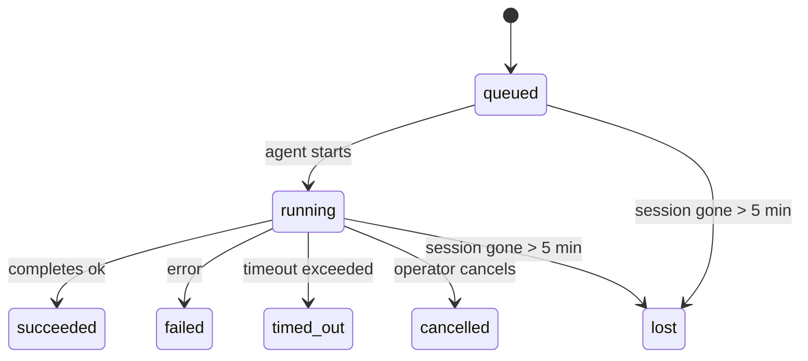

---
read_when:
    - Перегляд фонової роботи, що виконується або була нещодавно завершена
    - Налагодження збоїв доставки для відокремлених запусків агентів
    - Розуміння того, як фонові запуски пов’язані із сесіями, Cron і Heartbeat
summary: Відстеження фонових завдань для запусків ACP, субагентів, ізольованих завдань Cron і операцій CLI
title: Фонові завдання
x-i18n:
    generated_at: "2026-04-26T03:02:55Z"
    model: gpt-5.4
    provider: openai
    source_hash: 71153c54df90aad2b87b657ad68b3d34c618e5e82d63e0fd0d5c04a7d9182da0
    source_path: automation/tasks.md
    workflow: 15
---

> **Шукаєте планування?** Див. [Automation & Tasks](/uk/automation), щоб вибрати правильний механізм. Ця сторінка описує **відстеження** фонової роботи, а не її планування.

Фонові завдання відстежують роботу, яка виконується **поза межами вашої основної сесії розмови**:
запуски ACP, створення субагентів, виконання ізольованих завдань Cron і операції, ініційовані через CLI.

Завдання **не** замінюють сесії, завдання Cron або Heartbeat — це **журнал активності**, який фіксує, яка відокремлена робота відбулася, коли саме і чи була вона успішною.

<Note>
Не кожен запуск агента створює завдання. Цикли Heartbeat і звичайний інтерактивний чат цього не роблять. Усі виконання Cron, створення ACP, створення субагентів і команди агента CLI це роблять.
</Note>

## Коротко

- Завдання — це **записи**, а не планувальники: Cron і Heartbeat визначають, _коли_ запускається робота, а завдання відстежують, _що сталося_.
- ACP, субагенти, усі завдання Cron і операції CLI створюють завдання. Цикли Heartbeat — ні.
- Кожне завдання проходить через `queued → running → terminal` (succeeded, failed, timed_out, cancelled або lost).
- Завдання Cron залишаються активними, поки середовище виконання Cron усе ще володіє цим завданням; завдання CLI на основі чату залишаються активними лише поки їхній контекст запуску-власник ще активний.
- Завершення працює за push-моделлю: відокремлена робота може напряму сповістити або пробудити
  сесію-запитувача/Heartbeat після завершення, тому цикли опитування статусу
  зазвичай є неправильною моделлю.
- Ізольовані запуски Cron і завершення субагентів у межах best-effort очищають відстежувані вкладки браузера/процеси для своєї дочірньої сесії перед фінальним обліком очищення.
- Доставка ізольованих запусків Cron пригнічує застарілі проміжні відповіді батьківського процесу, поки
  робота субагентів-нащадків іще завершується, і надає перевагу фінальному виводу нащадка,
  якщо він надходить до моменту доставки.
- Сповіщення про завершення доставляються безпосередньо в канал або ставляться в чергу до наступного Heartbeat.
- `openclaw tasks list` показує всі завдання; `openclaw tasks audit` виявляє проблеми.
- Термінальні записи зберігаються 7 днів, а потім автоматично видаляються.

## Швидкий старт

```bash
# Показати всі завдання (найновіші спочатку)
openclaw tasks list

# Фільтрувати за середовищем виконання або статусом
openclaw tasks list --runtime acp
openclaw tasks list --status running

# Показати подробиці конкретного завдання (за ID, ID запуску або ключем сесії)
openclaw tasks show <lookup>

# Скасувати завдання, що виконується (завершує дочірню сесію)
openclaw tasks cancel <lookup>

# Змінити політику сповіщень для завдання
openclaw tasks notify <lookup> state_changes

# Запустити перевірку стану
openclaw tasks audit

# Переглянути або застосувати обслуговування
openclaw tasks maintenance
openclaw tasks maintenance --apply

# Переглянути стан TaskFlow
openclaw tasks flow list
openclaw tasks flow show <lookup>
openclaw tasks flow cancel <lookup>
```

## Що створює завдання

| Джерело                | Тип середовища виконання | Коли створюється запис завдання                        | Політика сповіщень за замовчуванням |
| ---------------------- | ------------------------ | ------------------------------------------------------ | ----------------------------------- |
| Фонові запуски ACP     | `acp`                    | Створення дочірньої сесії ACP                          | `done_only`                         |
| Оркестрація субагентів | `subagent`               | Створення субагента через `sessions_spawn`             | `done_only`                         |
| Завдання Cron (усі типи) | `cron`                 | Кожне виконання Cron (в основній сесії та ізольоване)  | `silent`                            |
| Операції CLI           | `cli`                    | Команди `openclaw agent`, що виконуються через Gateway | `silent`                            |
| Медіазавдання агента   | `cli`                    | Запуски `video_generate` на основі сесії               | `silent`                            |

Завдання Cron в основній сесії за замовчуванням використовують політику сповіщень `silent` — вони створюють записи для відстеження, але не генерують сповіщення. Ізольовані завдання Cron також за замовчуванням мають `silent`, але вони помітніші, оскільки виконуються у власній сесії.

Запуски `video_generate` на основі сесії також використовують політику сповіщень `silent`. Вони все одно створюють записи завдань, але завершення повертається до початкової сесії агента як внутрішнє пробудження, щоб агент міг сам написати повідомлення-продовження та прикріпити готове відео. Якщо ви ввімкнете `tools.media.asyncCompletion.directSend`, асинхронні завершення `music_generate` і `video_generate` спочатку намагатимуться доставити результат безпосередньо в канал, а вже потім повертатимуться до шляху пробудження сесії-запитувача.

Поки завдання `video_generate` на основі сесії все ще активне, інструмент також працює як захисне обмеження: повторні виклики `video_generate` у тій самій сесії повертають статус активного завдання замість запуску другого паралельного створення. Використовуйте `action: "status"`, якщо вам потрібен явний запит прогресу/статусу з боку агента.

**Що не створює завдань:**

- Цикли Heartbeat — в основній сесії; див. [Heartbeat](/uk/gateway/heartbeat)
- Звичайні інтерактивні цикли чату
- Прямі відповіді `/command`

## Життєвий цикл завдання



| Статус      | Що це означає                                                             |
| ----------- | ------------------------------------------------------------------------- |
| `queued`    | Створено, очікує запуску агента                                           |
| `running`   | Цикл агента активно виконується                                           |
| `succeeded` | Успішно завершено                                                         |
| `failed`    | Завершено з помилкою                                                      |
| `timed_out` | Перевищено налаштований тайм-аут                                          |
| `cancelled` | Зупинено оператором через `openclaw tasks cancel`                         |
| `lost`      | Середовище виконання втратило авторитетний базовий стан після 5-хвилинного пільгового періоду |

Переходи відбуваються автоматично — коли пов’язаний запуск агента завершується, статус завдання оновлюється відповідно.

`lost` залежить від середовища виконання:

- Завдання ACP: зникли метадані дочірньої сесії ACP.
- Завдання субагентів: дочірня сесія зникла зі сховища цільового агента.
- Завдання Cron: середовище виконання Cron більше не відстежує завдання як активне.
- Завдання CLI: ізольовані завдання дочірньої сесії використовують дочірню сесію; завдання CLI на основі чату натомість використовують активний контекст запуску, тож завислі рядки сесій каналу/групи/прямих повідомлень не підтримують їхню активність.

## Доставка та сповіщення

Коли завдання досягає термінального стану, OpenClaw сповіщає вас. Є два шляхи доставки:

**Пряма доставка** — якщо завдання має ціль каналу (`requesterOrigin`), повідомлення про завершення надсилається безпосередньо в цей канал (Telegram, Discord, Slack тощо). Для завершень субагентів OpenClaw також зберігає маршрутизацію прив’язаного треду/топіка, коли це можливо, і може підставити відсутнє `to` / обліковий запис зі збереженого маршруту сесії-запитувача (`lastChannel` / `lastTo` / `lastAccountId`), перш ніж відмовитися від прямої доставки.

**Доставка через чергу сесії** — якщо пряма доставка не вдалася або origin не задано, оновлення ставиться в чергу як системна подія в сесії запитувача та з’являється під час наступного Heartbeat.

<Tip>
Завершення завдання негайно запускає пробудження Heartbeat, тож ви швидко побачите результат — не потрібно чекати наступного запланованого циклу Heartbeat.
</Tip>

Це означає, що звичайний робочий процес побудовано на push-моделі: один раз запустіть
відокремлену роботу, а потім дозвольте середовищу виконання пробудити або сповістити вас після завершення. Опитуйте стан завдання лише тоді, коли
потрібне налагодження, втручання або явний аудит.

### Політики сповіщень

Керуйте тим, скільки інформації ви отримуєте про кожне завдання:

| Політика              | Що доставляється                                                        |
| --------------------- | ----------------------------------------------------------------------- |
| `done_only` (за замовчуванням) | Лише термінальний стан (succeeded, failed тощо) — **це значення за замовчуванням** |
| `state_changes`       | Кожен перехід стану та оновлення прогресу                               |
| `silent`              | Нічого                                                                   |

Змініть політику, поки завдання виконується:

```bash
openclaw tasks notify <lookup> state_changes
```

## Довідка CLI

### `tasks list`

```bash
openclaw tasks list [--runtime <acp|subagent|cron|cli>] [--status <status>] [--json]
```

Стовпці виводу: ID завдання, тип, статус, доставка, ID запуску, дочірня сесія, зведення.

### `tasks show`

```bash
openclaw tasks show <lookup>
```

Токен пошуку приймає ID завдання, ID запуску або ключ сесії. Показує повний запис, включно з таймінгами, станом доставки, помилкою та підсумком термінального стану.

### `tasks cancel`

```bash
openclaw tasks cancel <lookup>
```

Для завдань ACP і субагентів це завершує дочірню сесію. Для завдань, що відстежуються через CLI, скасування фіксується в реєстрі завдань (окремого дескриптора дочірнього середовища виконання немає). Статус переходить у `cancelled`, і, якщо застосовно, надсилається сповіщення про доставку.

### `tasks notify`

```bash
openclaw tasks notify <lookup> <done_only|state_changes|silent>
```

### `tasks audit`

```bash
openclaw tasks audit [--json]
```

Виявляє операційні проблеми. Результати також з’являються в `openclaw status`, коли виявлено проблеми.

| Результат                  | Серйозність | Умова спрацювання                                                                                           |
| -------------------------- | ----------- | ------------------------------------------------------------------------------------------------------------ |
| `stale_queued`             | warn        | Перебуває в черзі понад 10 хвилин                                                                            |
| `stale_running`            | error       | Виконується понад 30 хвилин                                                                                  |
| `lost`                     | warn/error  | Власність завдання, забезпечена середовищем виконання, зникла; збережені втрачені завдання дають попередження до `cleanupAfter`, потім стають помилками |
| `delivery_failed`          | warn        | Доставка не вдалася, і політика сповіщень не `silent`                                                        |
| `missing_cleanup`          | warn        | Термінальне завдання без позначки часу очищення                                                              |
| `inconsistent_timestamps`  | warn        | Порушення часової послідовності (наприклад, завершення раніше за початок)                                   |

### `tasks maintenance`

```bash
openclaw tasks maintenance [--json]
openclaw tasks maintenance --apply [--json]
```

Використовуйте це, щоб переглянути або застосувати звірку, проставлення позначок очищення та видалення
для завдань і стану Task Flow.

Звірка залежить від середовища виконання:

- Завдання ACP/субагентів перевіряють свою базову дочірню сесію.
- Завдання Cron перевіряють, чи середовище виконання Cron усе ще володіє завданням.
- Завдання CLI на основі чату перевіряють власний активний контекст запуску, а не лише рядок чат-сесії.

Очищення після завершення також залежить від середовища виконання:

- Після завершення субагента у межах best-effort закриваються відстежувані вкладки браузера/процеси для дочірньої сесії, перш ніж продовжиться очищення після оголошення.
- Після завершення ізольованого Cron у межах best-effort закриваються відстежувані вкладки браузера/процеси для сесії Cron, перш ніж запуск повністю завершиться.
- Доставка для ізольованого Cron за потреби очікує на подальшу роботу субагентів-нащадків і
  пригнічує застарілий текст підтвердження від батьківського процесу замість його оголошення.
- Доставка після завершення субагента надає перевагу найновішому видимому тексту помічника; якщо він порожній, використовується очищений найновіший текст tool/toolResult, а запуски tool-call лише з тайм-аутом можуть зводитися до короткого підсумку часткового прогресу. Термінальні невдалі запуски оголошують статус помилки без повторного відтворення захопленого тексту відповіді.
- Помилки очищення не маскують реальний результат завдання.

### `tasks flow list|show|cancel`

```bash
openclaw tasks flow list [--status <status>] [--json]
openclaw tasks flow show <lookup> [--json]
openclaw tasks flow cancel <lookup>
```

Використовуйте їх, коли вас цікавить саме оркеструвальний Task Flow,
а не окремий запис фонового завдання.

## Дошка завдань у чаті (`/tasks`)

Використовуйте `/tasks` у будь-якій чат-сесії, щоб побачити фонові завдання, пов’язані з цією сесією. Дошка показує
активні та нещодавно завершені завдання з типом середовища виконання, статусом, таймінгами, а також деталями прогресу або помилки.

Коли поточна сесія не має видимих пов’язаних завдань, `/tasks` повертається до локальних для агента підрахунків завдань,
щоб ви все одно бачили огляд без розкриття подробиць інших сесій.

Для повного операторського журналу використовуйте CLI: `openclaw tasks list`.

## Інтеграція статусу (навантаження завдань)

`openclaw status` містить коротке зведення завдань:

```
Tasks: 3 queued · 2 running · 1 issues
```

Зведення показує:

- **active** — кількість `queued` + `running`
- **failures** — кількість `failed` + `timed_out` + `lost`
- **byRuntime** — розбивка за `acp`, `subagent`, `cron`, `cli`

І `/status`, і інструмент `session_status` використовують знімок завдань з урахуванням очищення: активні завдання
мають пріоритет, застарілі завершені рядки приховуються, а недавні збої показуються лише тоді, коли активної роботи
вже немає. Це допомагає картці статусу зосереджуватися на тому, що важливо саме зараз.

## Зберігання та обслуговування

### Де зберігаються завдання

Записи завдань зберігаються в SQLite за адресою:

```
$OPENCLAW_STATE_DIR/tasks/runs.sqlite
```

Реєстр завантажується в пам’ять під час запуску Gateway і синхронізує записи з SQLite для стійкості між перезапусками.

### Автоматичне обслуговування

Очищувач запускається кожні **60 секунд** і виконує три дії:

1. **Звірка** — перевіряє, чи активні завдання все ще мають авторитетне базове середовище виконання. Завдання ACP/субагентів використовують стан дочірньої сесії, завдання Cron використовують володіння активним завданням, а завдання CLI на основі чату використовують власний контекст запуску. Якщо цей базовий стан відсутній понад 5 хвилин, завдання позначається як `lost`.
2. **Позначення очищення** — встановлює часову позначку `cleanupAfter` для термінальних завдань (`endedAt + 7 days`). Протягом періоду зберігання втрачені завдання все ще відображаються в аудиті як попередження; після завершення `cleanupAfter` або за відсутності метаданих очищення вони стають помилками.
3. **Видалення** — видаляє записи, дата `cleanupAfter` яких уже минула.

**Період зберігання**: записи термінальних завдань зберігаються **7 днів**, а потім автоматично видаляються. Налаштування не потрібні.

## Як завдання пов’язані з іншими системами

### Завдання і Task Flow

[Task Flow](/uk/automation/taskflow) — це рівень оркестрації потоків над фоновими завданнями. Один потік може координувати кілька завдань протягом свого життєвого циклу, використовуючи керовані або дзеркальні режими синхронізації. Використовуйте `openclaw tasks` для перегляду окремих записів завдань і `openclaw tasks flow` для перегляду оркеструвального потоку.

Докладніше див. у [Task Flow](/uk/automation/taskflow).

### Завдання і Cron

**Визначення** завдання Cron зберігається в `~/.openclaw/cron/jobs.json`; стан виконання середовища зберігається поруч у `~/.openclaw/cron/jobs-state.json`. **Кожне** виконання Cron створює запис завдання — і в основній сесії, і в ізольованій. Завдання Cron в основній сесії за замовчуванням використовують політику сповіщень `silent`, тож вони відстежуються без створення сповіщень.

Див. [Завдання Cron](/uk/automation/cron-jobs).

### Завдання і Heartbeat

Запуски Heartbeat — це цикли основної сесії; вони не створюють записи завдань. Коли завдання завершується, воно може запустити пробудження Heartbeat, щоб ви швидко побачили результат.

Див. [Heartbeat](/uk/gateway/heartbeat).

### Завдання і сесії

Завдання може посилатися на `childSessionKey` (де виконується робота) і `requesterSessionKey` (хто її запустив). Сесії — це контекст розмови; завдання — це шар відстеження активності поверх нього.

### Завдання і запуски агента

`runId` завдання пов’язує його із запуском агента, що виконує роботу. Події життєвого циклу агента (початок, завершення, помилка) автоматично оновлюють статус завдання — вам не потрібно керувати життєвим циклом вручну.

## Пов’язане

- [Automation & Tasks](/uk/automation) — усі механізми автоматизації з одного погляду
- [Task Flow](/uk/automation/taskflow) — оркестрація потоків над завданнями
- [Scheduled Tasks](/uk/automation/cron-jobs) — планування фонової роботи
- [Heartbeat](/uk/gateway/heartbeat) — періодичні цикли основної сесії
- [CLI: Tasks](/uk/cli/tasks) — довідка щодо команд CLI
