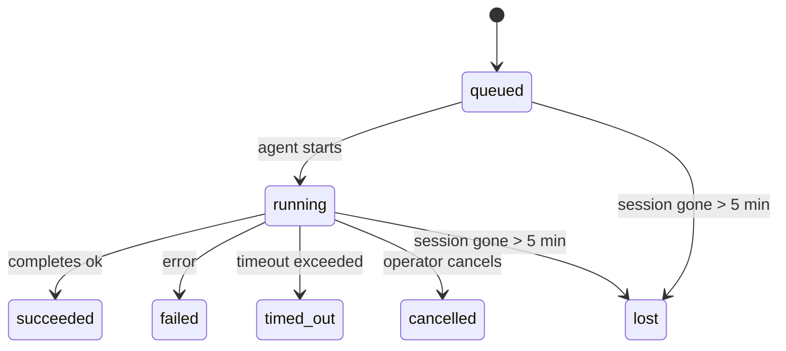

---
read_when:
    - Перегляд фонової роботи, що виконується або була нещодавно завершена
    - Налагодження збоїв доставки для відокремлених запусків агентів
    - Розуміння того, як фонові запуски пов’язані із сесіями, Cron і Heartbeat
summary: Відстеження фонових завдань для запусків ACP, субагентів, ізольованих завдань Cron і операцій CLI
title: Фонові завдання
x-i18n:
    generated_at: "2026-04-26T04:24:26Z"
    model: gpt-5.4
    provider: openai
    source_hash: 6dab04af135f80a75203123e61a63c366519ed355706f12033e825a87e50f36c
    source_path: automation/tasks.md
    workflow: 15
---

> **Шукаєте планування?** Див. [Автоматизація й завдання](/uk/automation), щоб вибрати правильний механізм. Ця сторінка охоплює **відстеження** фонової роботи, а не її планування.

Фонові завдання відстежують роботу, що виконується **поза межами вашої основної сесії розмови**:
запуски ACP, породження субагентів, виконання ізольованих завдань Cron і операції, ініційовані через CLI.

Завдання **не** замінюють сесії, завдання Cron або Heartbeat — це **журнал активності**, який фіксує, яка відокремлена робота відбулася, коли саме і чи була вона успішною.

<Note>
Не кожен запуск агента створює завдання. Heartbeat-цикли й звичайний інтерактивний чат — ні. Усі виконання Cron, породження ACP, породження субагентів і команди агента CLI — так.
</Note>

## Коротко

- Завдання — це **записи**, а не планувальники: Cron і Heartbeat визначають, _коли_ виконується робота, а завдання відстежують, _що сталося_.
- ACP, субагенти, усі завдання Cron і операції CLI створюють завдання. Heartbeat-цикли — ні.
- Кожне завдання проходить через `queued → running → terminal` (`succeeded`, `failed`, `timed_out`, `cancelled` або `lost`).
- Завдання Cron залишаються активними, поки середовище виконання Cron усе ще володіє завданням; CLI-завдання, прив’язані до чату, залишаються активними лише поки їхній контекст запуску-власника все ще активний.
- Завершення керується подіями push: відокремлена робота може напряму надсилати сповіщення або пробуджувати сесію/Heartbeat запитувача після завершення, тож цикли опитування стану зазвичай є хибним підходом.
- Ізольовані запуски Cron і завершення субагентів із найкращими зусиллями очищають відстежувані вкладки браузера/процеси для їхньої дочірньої сесії перед фінальним службовим очищенням.
- Доставка ізольованого Cron пригнічує застарілі проміжні відповіді батьківського процесу, поки ще триває робота нащадкових субагентів, і надає перевагу фінальному виводу нащадка, якщо той надходить до доставки.
- Сповіщення про завершення доставляються безпосередньо в канал або ставляться в чергу до наступного Heartbeat.
- `openclaw tasks list` показує всі завдання; `openclaw tasks audit` виявляє проблеми.
- Термінальні записи зберігаються 7 днів, після чого автоматично видаляються.

## Швидкий старт

```bash
# Показати всі завдання (спочатку найновіші)
openclaw tasks list

# Відфільтрувати за середовищем виконання або статусом
openclaw tasks list --runtime acp
openclaw tasks list --status running

# Показати подробиці для конкретного завдання (за ID, ID запуску або ключем сесії)
openclaw tasks show <lookup>

# Скасувати запущене завдання (завершує дочірню сесію)
openclaw tasks cancel <lookup>

# Змінити політику сповіщень для завдання
openclaw tasks notify <lookup> state_changes

# Запустити аудит стану
openclaw tasks audit

# Переглянути або застосувати обслуговування
openclaw tasks maintenance
openclaw tasks maintenance --apply

# Переглянути стан TaskFlow
openclaw tasks flow list
openclaw tasks flow show <lookup>
openclaw tasks flow cancel <lookup>
```

## Що створює завдання

| Джерело                | Тип середовища виконання | Коли створюється запис завдання                        | Політика сповіщень за замовчуванням |
| ---------------------- | ------------------------ | ------------------------------------------------------ | ----------------------------------- |
| Фонові запуски ACP     | `acp`                    | Під час породження дочірньої сесії ACP                 | `done_only`                         |
| Оркестрація субагентів | `subagent`               | Під час породження субагента через `sessions_spawn`    | `done_only`                         |
| Завдання Cron (усі типи) | `cron`                 | Під час кожного виконання Cron (основна сесія й ізольоване) | `silent`                        |
| Операції CLI           | `cli`                    | Команди `openclaw agent`, що виконуються через Gateway | `silent`                            |
| Медіазавдання агента   | `cli`                    | Запуски `video_generate`, прив’язані до сесії          | `silent`                            |

Завдання Cron основної сесії за замовчуванням використовують політику сповіщень `silent` — вони створюють записи для відстеження, але не генерують сповіщення. Ізольовані завдання Cron також за замовчуванням мають `silent`, але є помітнішими, оскільки виконуються у власній сесії.

Запуски `video_generate`, прив’язані до сесії, також використовують політику сповіщень `silent`. Вони все одно створюють записи завдань, але завершення повертається до початкової сесії агента як внутрішнє пробудження, щоб агент міг сам написати подальше повідомлення й прикріпити готове відео. Якщо ви ввімкнете `tools.media.asyncCompletion.directSend`, асинхронні завершення `music_generate` і `video_generate` спочатку намагаються доставити результат безпосередньо в канал, а вже потім переходять до шляху пробудження сесії запитувача.

Поки завдання `video_generate`, прив’язане до сесії, усе ще активне, інструмент також виконує роль запобіжника: повторні виклики `video_generate` у цій самій сесії повертають статус активного завдання замість запуску другого паралельного генерування. Використовуйте `action: "status"`, коли вам потрібен явний запит прогресу/статусу з боку агента.

**Що не створює завдань:**

- Heartbeat-цикли — основна сесія; див. [Heartbeat](/uk/gateway/heartbeat)
- Звичайні інтерактивні цикли чату
- Прямі відповіді `/command`

## Життєвий цикл завдання



| Статус      | Що це означає                                                            |
| ----------- | ------------------------------------------------------------------------ |
| `queued`    | Створено, очікує запуску агентом                                         |
| `running`   | Цикл агента активно виконується                                          |
| `succeeded` | Успішно завершено                                                        |
| `failed`    | Завершено з помилкою                                                     |
| `timed_out` | Перевищено налаштований тайм-аут                                         |
| `cancelled` | Зупинено оператором через `openclaw tasks cancel`                        |
| `lost`      | Середовище виконання втратило авторитетний підкріплювальний стан після 5-хвилинного пільгового періоду |

Переходи відбуваються автоматично — коли пов’язаний запуск агента завершується, статус завдання оновлюється відповідно.

Завершення запуску агента є авторитетним для активних записів завдань. Успішний відокремлений запуск фіналізується як `succeeded`, звичайні помилки запуску — як `failed`, а наслідки тайм-ауту або переривання — як `timed_out`. Якщо оператор уже скасував завдання або середовище виконання вже зафіксувало сильніший термінальний стан, такий як `failed`, `timed_out` або `lost`, пізніший сигнал про успіх не знижує цей термінальний статус.

`lost` залежить від середовища виконання:

- Завдання ACP: зникли метадані дочірньої сесії ACP.
- Завдання субагентів: дочірня сесія зникла зі сховища цільового агента.
- Завдання Cron: середовище виконання Cron більше не відстежує завдання як активне.
- Завдання CLI: ізольовані завдання дочірньої сесії використовують дочірню сесію; CLI-завдання, прив’язані до чату, натомість використовують активний контекст запуску, тож наявність рядків сесії каналу/групи/прямих повідомлень не утримує їх активними. Запуски `openclaw agent`, що працюють через Gateway, також фіналізуються за результатом свого запуску, тому завершені запуски не залишаються активними, доки sweeper не позначить їх як `lost`.

## Доставка й сповіщення

Коли завдання досягає термінального стану, OpenClaw сповіщає вас. Є два шляхи доставки:

**Пряма доставка** — якщо завдання має ціль каналу (`requesterOrigin`), повідомлення про завершення надсилається безпосередньо в цей канал (Telegram, Discord, Slack тощо). Для завершень субагентів OpenClaw також зберігає маршрутизацію прив’язаного потоку/теми, коли вона доступна, і може підставити відсутні `to` / обліковий запис із збереженого маршруту сесії запитувача (`lastChannel` / `lastTo` / `lastAccountId`), перш ніж відмовитися від прямої доставки.

**Доставка через чергу сесії** — якщо пряма доставка не вдається або походження не задано, оновлення ставиться в чергу як системна подія в сесії запитувача й з’являється під час наступного Heartbeat.

<Tip>
Завершення завдання негайно запускає пробудження Heartbeat, тож ви бачите результат швидко — вам не потрібно чекати наступного запланованого такту Heartbeat.
</Tip>

Це означає, що типовий робочий процес базується на push-подіях: один раз запускайте відокремлену роботу, а далі нехай середовище виконання пробудить або сповістить вас після завершення. Опитуйте стан завдання лише тоді, коли вам потрібні налагодження, втручання або явний аудит.

### Політики сповіщень

Керуйте тим, скільки саме ви отримуєте повідомлень про кожне завдання:

| Політика              | Що доставляється                                                         |
| --------------------- | ------------------------------------------------------------------------ |
| `done_only` (типово)  | Лише термінальний стан (`succeeded`, `failed` тощо) — **це значення за замовчуванням** |
| `state_changes`       | Кожен перехід стану й кожне оновлення прогресу                           |
| `silent`              | Узагалі нічого                                                           |

Змініть політику, поки завдання виконується:

```bash
openclaw tasks notify <lookup> state_changes
```

## Довідка CLI

### `tasks list`

```bash
openclaw tasks list [--runtime <acp|subagent|cron|cli>] [--status <status>] [--json]
```

Стовпці виводу: ID завдання, тип, статус, доставка, ID запуску, дочірня сесія, зведення.

### `tasks show`

```bash
openclaw tasks show <lookup>
```

Токен пошуку приймає ID завдання, ID запуску або ключ сесії. Показує повний запис, включно з часом, станом доставки, помилкою та термінальним підсумком.

### `tasks cancel`

```bash
openclaw tasks cancel <lookup>
```

Для завдань ACP і субагентів це завершує дочірню сесію. Для завдань, що відстежуються через CLI, скасування фіксується в реєстрі завдань (окремого дескриптора дочірнього середовища виконання немає). Статус переходить у `cancelled`, а якщо застосовно, надсилається сповіщення про доставку.

### `tasks notify`

```bash
openclaw tasks notify <lookup> <done_only|state_changes|silent>
```

### `tasks audit`

```bash
openclaw tasks audit [--json]
```

Виявляє операційні проблеми. Висновки також з’являються в `openclaw status`, якщо проблеми виявлено.

| Висновок                  | Серйозність | Умова спрацювання                                                                                              |
| ------------------------- | ----------- | -------------------------------------------------------------------------------------------------------------- |
| `stale_queued`            | warn        | Перебуває в черзі понад 10 хвилин                                                                              |
| `stale_running`           | error       | Виконується понад 30 хвилин                                                                                    |
| `lost`                    | warn/error  | Зникло володіння завданням, підкріплене середовищем виконання; збережені втрачені завдання попереджають до `cleanupAfter`, а потім стають помилками |
| `delivery_failed`         | warn        | Доставка не вдалася, і політика сповіщень не є `silent`                                                        |
| `missing_cleanup`         | warn        | Термінальне завдання без часової позначки очищення                                                             |
| `inconsistent_timestamps` | warn        | Порушення часової шкали (наприклад, завершено раніше, ніж розпочато)                                           |

### `tasks maintenance`

```bash
openclaw tasks maintenance [--json]
openclaw tasks maintenance --apply [--json]
```

Використовуйте це, щоб переглянути або застосувати звіряння, проставлення позначок очищення та видалення для завдань і стану Task Flow.

Звіряння залежить від середовища виконання:

- Завдання ACP/субагентів перевіряють свою підкріплювальну дочірню сесію.
- Завдання Cron перевіряють, чи середовище виконання Cron усе ще володіє завданням.
- CLI-завдання, прив’язані до чату, перевіряють контекст активного запуску-власника, а не лише рядок сесії чату.

Очищення після завершення також залежить від середовища виконання:

- Завершення субагента з найкращими зусиллями закриває відстежувані вкладки браузера/процеси для дочірньої сесії, перш ніж продовжиться очищення після оголошення.
- Завершення ізольованого Cron з найкращими зусиллями закриває відстежувані вкладки браузера/процеси для сесії Cron, перш ніж запуск буде повністю згорнуто.
- Доставка ізольованого Cron за потреби очікує завершення подальших дій нащадкових субагентів і пригнічує застарілий текст підтвердження від батьківського процесу замість його оголошення.
- Доставка завершення субагента надає перевагу найновішому видимому тексту помічника; якщо він порожній, вона повертається до очищеного найновішого тексту `tool`/`toolResult`, а запуски викликів інструментів лише з тайм-аутом можуть зводитися до короткого підсумку часткового прогресу. Термінальні невдалі запуски оголошують статус невдачі без повторного відтворення захопленого тексту відповіді.
- Збої очищення не маскують реальний результат завдання.

### `tasks flow list|show|cancel`

```bash
openclaw tasks flow list [--status <status>] [--json]
openclaw tasks flow show <lookup> [--json]
openclaw tasks flow cancel <lookup>
```

Використовуйте це, коли вас цікавить саме оркеструвальний TaskFlow, а не окремий запис фонового завдання.

## Дошка завдань чату (`/tasks`)

Використовуйте `/tasks` у будь-якій сесії чату, щоб побачити фонові завдання, пов’язані з цією сесією. Дошка показує активні та нещодавно завершені завдання із середовищем виконання, статусом, часом і деталями прогресу або помилки.

Коли поточна сесія не має видимих пов’язаних завдань, `/tasks` повертається до локальних для агента підрахунків завдань, тож ви все одно отримуєте огляд без розкриття деталей інших сесій.

Для повного операторського журналу використовуйте CLI: `openclaw tasks list`.

## Інтеграція зі статусом (навантаження завдань)

`openclaw status` містить коротке зведення про завдання:

```
Tasks: 3 queued · 2 running · 1 issues
```

У зведенні відображається:

- **active** — кількість `queued` + `running`
- **failures** — кількість `failed` + `timed_out` + `lost`
- **byRuntime** — розбивка за `acp`, `subagent`, `cron`, `cli`

І `/status`, і інструмент `session_status` використовують знімок завдань з урахуванням очищення: активні завдання мають пріоритет, застарілі завершені рядки приховуються, а нещодавні збої показуються лише тоді, коли активної роботи вже не залишилося. Це допомагає картці стану зосереджуватися на тому, що важливо саме зараз.

## Зберігання й обслуговування

### Де зберігаються завдання

Записи завдань зберігаються в SQLite за адресою:

```
$OPENCLAW_STATE_DIR/tasks/runs.sqlite
```

Реєстр завантажується в пам’ять під час запуску Gateway і синхронізує записи в SQLite для надійності після перезапусків.

### Автоматичне обслуговування

Очищувач запускається кожні **60 секунд** і виконує три дії:

1. **Звіряння** — перевіряє, чи активні завдання все ще мають авторитетне підкріплення від середовища виконання. Завдання ACP/субагентів використовують стан дочірньої сесії, завдання Cron — володіння активним завданням, а CLI-завдання, прив’язані до чату, — контекст запуску-власника. Якщо цей підкріплювальний стан відсутній понад 5 хвилин, завдання позначається як `lost`.
2. **Проставлення позначок очищення** — встановлює часову позначку `cleanupAfter` для термінальних завдань (`endedAt` + 7 днів). Протягом періоду зберігання втрачені завдання все ще показуються в аудиті як попередження; після спливу `cleanupAfter` або за відсутності метаданих очищення вони стають помилками.
3. **Видалення** — видаляє записи, чия дата `cleanupAfter` вже минула.

**Зберігання**: записи термінальних завдань зберігаються **7 днів**, після чого автоматично видаляються. Додаткове налаштування не потрібне.

## Як завдання пов’язані з іншими системами

### Завдання і TaskFlow

[TaskFlow](/uk/automation/taskflow) — це рівень оркестрації потоків над фоновими завданнями. Один потік протягом свого життєвого циклу може координувати кілька завдань, використовуючи керовані або дзеркальні режими синхронізації. Використовуйте `openclaw tasks` для перегляду окремих записів завдань і `openclaw tasks flow` — для перегляду оркеструвального потоку.

Докладніше див. у [TaskFlow](/uk/automation/taskflow).

### Завдання і Cron

**Визначення** завдання Cron зберігається в `~/.openclaw/cron/jobs.json`; стан виконання середовища зберігається поруч у `~/.openclaw/cron/jobs-state.json`. **Кожне** виконання Cron створює запис завдання — і для основної сесії, і для ізольованої. Завдання Cron основної сесії за замовчуванням використовують політику сповіщень `silent`, тож вони відстежуються без створення сповіщень.

Див. [Завдання Cron](/uk/automation/cron-jobs).

### Завдання і Heartbeat

Запуски Heartbeat — це цикли основної сесії; вони не створюють записів завдань. Коли завдання завершується, воно може запустити пробудження Heartbeat, щоб ви швидко побачили результат.

Див. [Heartbeat](/uk/gateway/heartbeat).

### Завдання і сесії

Завдання може посилатися на `childSessionKey` (де виконується робота) і `requesterSessionKey` (хто її запустив). Сесії — це контекст розмови; завдання — це відстеження активності поверх нього.

### Завдання і запуски агентів

`runId` завдання пов’язує його із запуском агента, що виконує роботу. Події життєвого циклу агента (початок, завершення, помилка) автоматично оновлюють статус завдання — вам не потрібно керувати життєвим циклом вручну.

## Пов’язане

- [Автоматизація й завдання](/uk/automation) — огляд усіх механізмів автоматизації
- [TaskFlow](/uk/automation/taskflow) — оркестрація потоків над завданнями
- [Заплановані завдання](/uk/automation/cron-jobs) — планування фонової роботи
- [Heartbeat](/uk/gateway/heartbeat) — періодичні цикли основної сесії
- [CLI: Завдання](/uk/cli/tasks) — довідка за командами CLI
