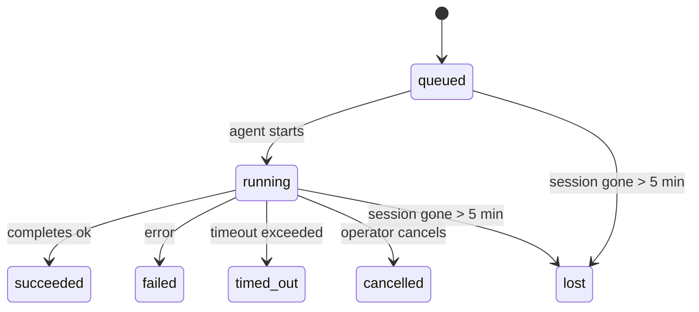

---
read_when:
    - Перевірка фонової роботи, що виконується або нещодавно завершилася
    - Налагодження збоїв доставки для відокремлених запусків агентів
    - Розуміння того, як фонові запуски пов’язані із сеансами, Cron і Heartbeat
summary: Відстеження фонових завдань для запусків ACP, субагентів, ізольованих завдань Cron і операцій CLI
title: Фонові завдання
x-i18n:
    generated_at: "2026-04-20T18:25:02Z"
    model: gpt-5.4
    provider: openai
    source_hash: ba5511b1c421bdf505fc7d34f09e453ac44e85213fcb0f082078fa957aa91fe7
    source_path: automation/tasks.md
    workflow: 15
---

# Фонові завдання

> **Шукаєте планування?** Див. [Автоматизація й завдання](/uk/automation), щоб вибрати правильний механізм. Ця сторінка описує **відстеження** фонової роботи, а не її планування.

Фонові завдання відстежують роботу, яка виконується **поза межами вашого основного сеансу розмови**:
запуски ACP, створення субагентів, виконання ізольованих завдань Cron і операції, ініційовані через CLI.

Завдання **не** замінюють сеанси, завдання Cron або Heartbeat — це **журнал активності**, який фіксує, яка відокремлена робота відбулася, коли саме та чи була вона успішною.

<Note>
Не кожен запуск агента створює завдання. Ходи Heartbeat і звичайний інтерактивний чат — ні. Усі виконання Cron, створення ACP, створення субагентів і команди агента CLI — так.
</Note>

## Коротко

- Завдання — це **записи**, а не планувальники: Cron і Heartbeat вирішують, _коли_ запускається робота, а завдання відстежують, _що сталося_.
- ACP, субагенти, усі завдання Cron і операції CLI створюють завдання. Ходи Heartbeat — ні.
- Кожне завдання проходить шлях `queued → running → terminal` (`succeeded`, `failed`, `timed_out`, `cancelled` або `lost`).
- Завдання Cron залишаються активними, поки середовище виконання Cron усе ще володіє цим завданням; чат-орієнтовані завдання CLI залишаються активними лише доти, доки їхній контекст запуску-власник усе ще активний.
- Завершення працює за push-моделлю: відокремлена робота може напряму сповістити або пробудити сеанс/Heartbeat запитувача після завершення, тому цикли опитування стану зазвичай є неправильною моделлю.
- Ізольовані запуски Cron і завершення субагентів у режимі best-effort очищають відстежувані вкладки браузера/процеси для свого дочірнього сеансу перед фінальним обліком очищення.
- Доставка ізольованого Cron пригнічує застарілі проміжні відповіді батьківського процесу, поки ще триває завершення нащадків-субагентів, і надає перевагу фінальному виводу нащадка, якщо він надходить до доставки.
- Сповіщення про завершення доставляються безпосередньо в канал або ставляться в чергу до наступного Heartbeat.
- `openclaw tasks list` показує всі завдання; `openclaw tasks audit` виявляє проблеми.
- Термінальні записи зберігаються 7 днів, після чого автоматично видаляються.

## Швидкий старт

```bash
# Перелічити всі завдання (спочатку найновіші)
openclaw tasks list

# Відфільтрувати за середовищем виконання або статусом
openclaw tasks list --runtime acp
openclaw tasks list --status running

# Показати подробиці для конкретного завдання (за ID, run ID або session key)
openclaw tasks show <lookup>

# Скасувати запущене завдання (завершує дочірній сеанс)
openclaw tasks cancel <lookup>

# Змінити політику сповіщень для завдання
openclaw tasks notify <lookup> state_changes

# Виконати аудит працездатності
openclaw tasks audit

# Переглянути або застосувати обслуговування
openclaw tasks maintenance
openclaw tasks maintenance --apply

# Переглянути стан TaskFlow
openclaw tasks flow list
openclaw tasks flow show <lookup>
openclaw tasks flow cancel <lookup>
```

## Що створює завдання

| Джерело                | Тип середовища виконання | Коли створюється запис завдання                         | Політика сповіщень за замовчуванням |
| ---------------------- | ------------------------ | ------------------------------------------------------ | ----------------------------------- |
| Фонові запуски ACP     | `acp`                    | Створення дочірнього сеансу ACP                        | `done_only`                         |
| Оркестрація субагентів | `subagent`               | Створення субагента через `sessions_spawn`             | `done_only`                         |
| Завдання Cron (усі типи) | `cron`                 | Кожне виконання Cron (основний сеанс та ізольований)   | `silent`                            |
| Операції CLI           | `cli`                    | Команди `openclaw agent`, що виконуються через Gateway | `silent`                            |
| Медіазавдання агента   | `cli`                    | Запуски `video_generate`, прив’язані до сеансу         | `silent`                            |

Завдання Cron основного сеансу за замовчуванням використовують політику сповіщень `silent` — вони створюють записи для відстеження, але не генерують сповіщень. Ізольовані завдання Cron також за замовчуванням мають `silent`, але є помітнішими, оскільки виконуються у власному сеансі.

Запуски `video_generate`, прив’язані до сеансу, також використовують політику сповіщень `silent`. Вони все одно створюють записи завдань, але завершення повертається до початкового сеансу агента як внутрішнє пробудження, щоб агент міг сам написати наступне повідомлення й прикріпити готове відео. Якщо ви ввімкнете `tools.media.asyncCompletion.directSend`, асинхронні завершення `music_generate` і `video_generate` спочатку намагатимуться доставити результат безпосередньо в канал, а вже потім повертатимуться до шляху пробудження сеансу запитувача.

Поки завдання `video_generate`, прив’язане до сеансу, все ще активне, інструмент також діє як захисне обмеження: повторні виклики `video_generate` у цьому самому сеансі повертають статус активного завдання замість запуску другого паралельного генерування. Використовуйте `action: "status"`, якщо вам потрібен явний перегляд прогресу/статусу з боку агента.

**Що не створює завдань:**

- Ходи Heartbeat — основний сеанс; див. [Heartbeat](/uk/gateway/heartbeat)
- Звичайні ходи інтерактивного чату
- Прямі відповіді `/command`

## Життєвий цикл завдання



| Статус      | Що це означає                                                              |
| ----------- | -------------------------------------------------------------------------- |
| `queued`    | Створено, очікує на запуск агента                                          |
| `running`   | Хід агента активно виконується                                             |
| `succeeded` | Успішно завершено                                                          |
| `failed`    | Завершено з помилкою                                                       |
| `timed_out` | Перевищено налаштований час очікування                                     |
| `cancelled` | Зупинено оператором через `openclaw tasks cancel`                          |
| `lost`      | Середовище виконання втратило авторитетний стан-основу після 5-хвилинного пільгового періоду |

Переходи відбуваються автоматично — коли пов’язаний запуск агента завершується, статус завдання оновлюється відповідно до результату.

`lost` є залежним від середовища виконання:

- Завдання ACP: зникли метадані дочірнього сеансу ACP, на які спиралося завдання.
- Завдання субагента: дочірній сеанс-основа зник зі сховища цільового агента.
- Завдання Cron: середовище виконання Cron більше не відстежує завдання як активне.
- Завдання CLI: ізольовані завдання дочірнього сеансу використовують дочірній сеанс; чат-орієнтовані завдання CLI натомість використовують живий контекст запуску, тому завислі рядки сеансів каналу/групи/прямих повідомлень не підтримують їх у живому стані.

## Доставка і сповіщення

Коли завдання досягає термінального стану, OpenClaw надсилає вам сповіщення. Є два шляхи доставки:

**Пряма доставка** — якщо завдання має ціль каналу (`requesterOrigin`), повідомлення про завершення надсилається прямо в цей канал (Telegram, Discord, Slack тощо). Для завершення субагента OpenClaw також зберігає прив’язане маршрутизування thread/topic, коли воно доступне, і може заповнити відсутні `to` / account із збереженого маршруту сеансу запитувача (`lastChannel` / `lastTo` / `lastAccountId`) перед тим, як відмовитися від прямої доставки.

**Доставка через чергу сеансу** — якщо пряма доставка не вдалася або origin не задано, оновлення ставиться в чергу як системна подія в сеансі запитувача й з’являється під час наступного Heartbeat.

<Tip>
Завершення завдання негайно запускає пробудження Heartbeat, щоб ви швидко побачили результат — вам не потрібно чекати наступного запланованого тіку Heartbeat.
</Tip>

Це означає, що типовий робочий процес побудований на push-моделі: один раз запускаєте відокремлену роботу, а далі середовище виконання саме пробуджує або сповіщає вас після завершення. Опитуйте стан завдання лише тоді, коли вам потрібні налагодження, втручання або явний аудит.

### Політики сповіщень

Керуйте тим, скільки інформації ви отримуєте про кожне завдання:

| Політика              | Що доставляється                                                        |
| --------------------- | ----------------------------------------------------------------------- |
| `done_only` (default) | Лише термінальний стан (`succeeded`, `failed` тощо) — **це значення за замовчуванням** |
| `state_changes`       | Кожна зміна стану та оновлення прогресу                                 |
| `silent`              | Нічого                                                                   |

Змінити політику під час виконання завдання:

```bash
openclaw tasks notify <lookup> state_changes
```

## Довідка CLI

### `tasks list`

```bash
openclaw tasks list [--runtime <acp|subagent|cron|cli>] [--status <status>] [--json]
```

Стовпці виводу: ID завдання, Тип, Статус, Доставка, Run ID, Дочірній сеанс, Підсумок.

### `tasks show`

```bash
openclaw tasks show <lookup>
```

Токен lookup приймає ID завдання, run ID або ключ сеансу. Показує повний запис, включно з часом, станом доставки, помилкою та термінальним підсумком.

### `tasks cancel`

```bash
openclaw tasks cancel <lookup>
```

Для завдань ACP і субагентів це завершує дочірній сеанс. Для завдань, що відстежуються через CLI, скасування фіксується в реєстрі завдань (окремого дескриптора дочірнього середовища виконання немає). Статус переходить у `cancelled`, і, коли це доречно, надсилається сповіщення про доставку.

### `tasks notify`

```bash
openclaw tasks notify <lookup> <done_only|state_changes|silent>
```

### `tasks audit`

```bash
openclaw tasks audit [--json]
```

Виявляє операційні проблеми. За наявності проблем результати також з’являються в `openclaw status`.

| Ознака проблеми            | Серйозність | Тригер                                                |
| -------------------------- | ----------- | ----------------------------------------------------- |
| `stale_queued`             | warn        | У черзі понад 10 хвилин                               |
| `stale_running`            | error       | Виконується понад 30 хвилин                           |
| `lost`                     | error       | Зникла належність завдання до середовища виконання    |
| `delivery_failed`          | warn        | Доставка не вдалася, а політика сповіщень не `silent` |
| `missing_cleanup`          | warn        | Термінальне завдання без часової позначки очищення    |
| `inconsistent_timestamps`  | warn        | Порушення часової шкали (наприклад, завершено раніше, ніж розпочато) |

### `tasks maintenance`

```bash
openclaw tasks maintenance [--json]
openclaw tasks maintenance --apply [--json]
```

Використовуйте це, щоб переглянути або застосувати звіряння, проставлення позначок очищення та видалення застарілих даних для завдань і стану Task Flow.

Звіряння залежить від середовища виконання:

- Завдання ACP/субагентів перевіряють свій дочірній сеанс-основу.
- Завдання Cron перевіряють, чи середовище виконання Cron усе ще володіє цим завданням.
- Чат-орієнтовані завдання CLI перевіряють контекст активного запуску-власника, а не лише рядок чат-сеансу.

Очищення після завершення також залежить від середовища виконання:

- Під час завершення субагента в режимі best-effort закриваються відстежувані вкладки браузера/процеси для дочірнього сеансу, перш ніж продовжиться очищення оголошення.
- Під час завершення ізольованого Cron у режимі best-effort закриваються відстежувані вкладки браузера/процеси для сеансу Cron, перш ніж виконання буде повністю згорнуто.
- Доставка ізольованого Cron за потреби очікує завершення подальших дій нащадків-субагентів і пригнічує застарілий текст підтвердження батьківського процесу замість його оголошення.
- Доставка завершення субагента надає перевагу найновішому видимому тексту асистента; якщо він порожній, використовується очищений найновіший текст `tool`/`toolResult`, а запуски лише з викликом інструмента, що завершилися через тайм-аут, можуть згортатися до короткого підсумку часткового прогресу.
- Помилки очищення не маскують реальний результат завдання.

### `tasks flow list|show|cancel`

```bash
openclaw tasks flow list [--status <status>] [--json]
openclaw tasks flow show <lookup> [--json]
openclaw tasks flow cancel <lookup>
```

Використовуйте ці команди, коли вас цікавить саме оркеструвальний Task Flow, а не окремий запис фонового завдання.

## Дошка завдань чату (`/tasks`)

Використовуйте `/tasks` у будь-якому чат-сеансі, щоб побачити фонові завдання, пов’язані з цим сеансом. Дошка показує
активні й нещодавно завершені завдання з інформацією про середовище виконання, статус, час, а також подробицями прогресу або помилки.

Якщо в поточному сеансі немає видимих пов’язаних завдань, `/tasks` переключається на локальні для агента підрахунки завдань,
щоб ви все одно бачили огляд без витоку подробиць з інших сеансів.

Для повного журналу оператора використовуйте CLI: `openclaw tasks list`.

## Інтеграція статусу (тиск завдань)

`openclaw status` містить стислий підсумок завдань:

```
Tasks: 3 queued · 2 running · 1 issues
```

Підсумок показує:

- **active** — кількість `queued` + `running`
- **failures** — кількість `failed` + `timed_out` + `lost`
- **byRuntime** — розбивка за `acp`, `subagent`, `cron`, `cli`

І `/status`, і інструмент `session_status` використовують знімок завдань з урахуванням очищення: пріоритет надається активним завданням, застарілі завершені рядки приховуються, а нещодавні збої показуються лише тоді, коли активної роботи вже не залишилося. Це допомагає картці статусу зосереджуватися на тому, що важливо саме зараз.

## Зберігання та обслуговування

### Де зберігаються завдання

Записи завдань зберігаються в SQLite за адресою:

```
$OPENCLAW_STATE_DIR/tasks/runs.sqlite
```

Реєстр завантажується в пам’ять під час запуску Gateway і синхронізує записи в SQLite для надійності між перезапусками.

### Автоматичне обслуговування

Очищувач запускається кожні **60 секунд** і виконує три дії:

1. **Звіряння** — перевіряє, чи активні завдання все ще мають авторитетну основу в середовищі виконання. Завдання ACP/субагентів використовують стан дочірнього сеансу, завдання Cron — належність до активного завдання, а чат-орієнтовані завдання CLI — контекст запуску-власника. Якщо цей стан-основа відсутній понад 5 хвилин, завдання позначається як `lost`.
2. **Проставлення позначок очищення** — встановлює часову позначку `cleanupAfter` для термінальних завдань (`endedAt + 7 days`).
3. **Видалення застарілих даних** — видаляє записи після настання дати `cleanupAfter`.

**Термін зберігання**: записи термінальних завдань зберігаються **7 днів**, після чого автоматично видаляються. Додаткового налаштування не потрібно.

## Як завдання пов’язані з іншими системами

### Завдання і Task Flow

[Task Flow](/uk/automation/taskflow) — це рівень оркестрації потоків над фоновими завданнями. Один потік може координувати кілька завдань протягом свого життєвого циклу, використовуючи керовані або дзеркальні режими синхронізації. Використовуйте `openclaw tasks` для перегляду окремих записів завдань і `openclaw tasks flow` для перегляду оркеструвального потоку.

Докладніше див. у [Task Flow](/uk/automation/taskflow).

### Завдання і Cron

**Визначення** завдання Cron зберігається в `~/.openclaw/cron/jobs.json`; стан виконання під час роботи зберігається поруч у `~/.openclaw/cron/jobs-state.json`. **Кожне** виконання Cron створює запис завдання — і в основному сеансі, і в ізольованому. Завдання Cron основного сеансу за замовчуванням мають політику сповіщень `silent`, тому вони відстежуються без створення сповіщень.

Див. [Завдання Cron](/uk/automation/cron-jobs).

### Завдання і Heartbeat

Запуски Heartbeat — це ходи основного сеансу, вони не створюють записів завдань. Коли завдання завершується, воно може ініціювати пробудження Heartbeat, щоб ви швидше побачили результат.

Див. [Heartbeat](/uk/gateway/heartbeat).

### Завдання і сеанси

Завдання може посилатися на `childSessionKey` (де виконується робота) і `requesterSessionKey` (хто її запустив). Сеанси — це контекст розмови; завдання — це відстеження активності поверх нього.

### Завдання і запуски агентів

`runId` завдання пов’язує його із запуском агента, який виконує роботу. Події життєвого циклу агента (початок, завершення, помилка) автоматично оновлюють статус завдання — вам не потрібно керувати життєвим циклом вручну.

## Пов’язане

- [Автоматизація й завдання](/uk/automation) — огляд усіх механізмів автоматизації
- [Task Flow](/uk/automation/taskflow) — оркестрація потоків над завданнями
- [Заплановані завдання](/uk/automation/cron-jobs) — планування фонової роботи
- [Heartbeat](/uk/gateway/heartbeat) — періодичні ходи основного сеансу
- [CLI: Tasks](/cli/index#tasks) — довідка з команд CLI
