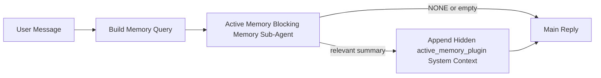

---
read_when:
    - Ви хочете зрозуміти, для чого потрібна Active Memory
    - Ви хочете увімкнути Active Memory для розмовного агента
    - Ви хочете налаштувати поведінку Active Memory, не вмикаючи її всюди
summary: Підагент блокувальної пам’яті, що належить Plugin, який впроваджує релевантну пам’ять в інтерактивні сеанси чату
title: Active Memory
x-i18n:
    generated_at: "2026-04-12T19:24:37Z"
    model: gpt-5.4
    provider: openai
    source_hash: 10fd37790ef54498679d10718c4874b3683824a4a198542e9851f219e736b58b
    source_path: concepts/active-memory.md
    workflow: 15
---

# Active Memory

Active Memory — це необов’язковий підагент блокувальної пам’яті, що належить Plugin і запускається
перед основною відповіддю для відповідних розмовних сеансів.

Він існує тому, що більшість систем пам’яті є потужними, але реактивними. Вони покладаються на
те, що головний агент сам вирішить, коли шукати в пам’яті, або на те, що користувач скаже щось на кшталт
«запам’ятай це» чи «пошукай у пам’яті». На той момент мить, коли пам’ять могла б зробити відповідь природною,
вже минає.

Active Memory дає системі одну обмежену можливість підняти релевантну пам’ять
до того, як буде згенерована основна відповідь.

## Вставте це у свого агента

Вставте це у свого агента, якщо хочете ввімкнути Active Memory із
самодостатнім налаштуванням із безпечними значеннями за замовчуванням:

```json5
{
  plugins: {
    entries: {
      "active-memory": {
        enabled: true,
        config: {
          enabled: true,
          agents: ["main"],
          allowedChatTypes: ["direct"],
          modelFallback: "google/gemini-3-flash",
          queryMode: "recent",
          promptStyle: "balanced",
          timeoutMs: 15000,
          maxSummaryChars: 220,
          persistTranscripts: false,
          logging: true,
        },
      },
    },
  },
}
```

Це вмикає Plugin для агента `main`, за замовчуванням обмежує його
сеансами у стилі прямих повідомлень, дозволяє спочатку успадкувати поточну модель сеансу, а
налаштовану резервну модель використовує лише тоді, коли немає явно заданої або успадкованої моделі.

Після цього перезапустіть Gateway:

```bash
openclaw gateway
```

Щоб переглядати це наживо в розмові:

```text
/verbose on
/trace on
```

## Увімкнення active memory

Найбезпечніше налаштування таке:

1. увімкнути Plugin
2. націлити його на одного розмовного агента
3. залишати журналювання ввімкненим лише під час налаштування

Почніть із цього в `openclaw.json`:

```json5
{
  plugins: {
    entries: {
      "active-memory": {
        enabled: true,
        config: {
          agents: ["main"],
          allowedChatTypes: ["direct"],
          modelFallback: "google/gemini-3-flash",
          queryMode: "recent",
          promptStyle: "balanced",
          timeoutMs: 15000,
          maxSummaryChars: 220,
          persistTranscripts: false,
          logging: true,
        },
      },
    },
  },
}
```

Потім перезапустіть Gateway:

```bash
openclaw gateway
```

Що це означає:

- `plugins.entries.active-memory.enabled: true` вмикає Plugin
- `config.agents: ["main"]` підключає до active memory лише агента `main`
- `config.allowedChatTypes: ["direct"]` за замовчуванням залишає active memory ввімкненою лише для сеансів у стилі прямих повідомлень
- якщо `config.model` не задано, active memory спочатку успадковує поточну модель сеансу
- `config.modelFallback` за бажанням задає власного резервного провайдера/модель для пошуку
- `config.promptStyle: "balanced"` використовує типовий універсальний стиль підказки для режиму `recent`
- active memory однаково запускається лише в придатних інтерактивних постійних сеансах чату

## Як це побачити

Active Memory впроваджує прихований системний контекст для моделі. Вона не показує
клієнту сирі теги `<active_memory_plugin>...</active_memory_plugin>`.

## Перемикач сеансу

Використовуйте команду Plugin, якщо хочете призупинити або відновити active memory для
поточного сеансу чату без редагування конфігурації:

```text
/active-memory status
/active-memory off
/active-memory on
```

Це діє в межах сеансу. Воно не змінює
`plugins.entries.active-memory.enabled`, націлювання агента чи іншу глобальну
конфігурацію.

Якщо ви хочете, щоб команда записувала конфігурацію та призупиняла або відновлювала active memory для
усіх сеансів, використовуйте явну глобальну форму:

```text
/active-memory status --global
/active-memory off --global
/active-memory on --global
```

Глобальна форма записує `plugins.entries.active-memory.config.enabled`. Вона залишає
`plugins.entries.active-memory.enabled` увімкненим, щоб команда й надалі була доступна для
повторного ввімкнення active memory пізніше.

Якщо ви хочете бачити, що робить active memory у живому сеансі, увімкніть
перемикачі сеансу, які відповідають потрібному вам виводу:

```text
/verbose on
/trace on
```

Коли вони ввімкнені, OpenClaw може показувати:

- рядок стану active memory на кшталт `Active Memory: ok 842ms recent 34 chars`, коли ввімкнено `/verbose on`
- зрозуміле налагоджувальне резюме на кшталт `Active Memory Debug: Lemon pepper wings with blue cheese.`, коли ввімкнено `/trace on`

Ці рядки походять із того самого проходу Active Memory, який подає прихований
системний контекст, але вони відформатовані для людей, а не для показу сирої розмітки
підказки. Вони надсилаються як діагностичне повідомлення після
звичайної відповіді помічника, щоб клієнти каналів на кшталт Telegram не показували окрему
діагностичну бульбашку до відповіді.

За замовчуванням стенограма підагента блокувальної пам’яті є тимчасовою й видаляється
після завершення виконання.

Приклад потоку:

```text
/verbose on
/trace on
what wings should i order?
```

Очікувана форма видимої відповіді:

```text
...normal assistant reply...

🧩 Active Memory: ok 842ms recent 34 chars
🔎 Active Memory Debug: Lemon pepper wings with blue cheese.
```

## Коли вона запускається

Active Memory використовує два фільтри:

1. **Увімкнення через конфігурацію**
   Plugin має бути ввімкнений, а поточний ідентифікатор агента має бути присутній у
   `plugins.entries.active-memory.config.agents`.
2. **Сувора придатність під час виконання**
   Навіть якщо Active Memory ввімкнена й націлена, вона запускається лише для придатних
   інтерактивних постійних сеансів чату.

Фактичне правило таке:

```text
plugin enabled
+
agent id targeted
+
allowed chat type
+
eligible interactive persistent chat session
=
active memory runs
```

Якщо будь-яка з цих умов не виконується, active memory не запускається.

## Типи сеансів

`config.allowedChatTypes` визначає, у яких типах розмов узагалі може запускатися Active
Memory.

Значення за замовчуванням:

```json5
allowedChatTypes: ["direct"]
```

Це означає, що Active Memory за замовчуванням запускається в сеансах у стилі прямих повідомлень, але
не в групових сеансах або сеансах каналів, якщо ви явно не ввімкнете їх.

Приклади:

```json5
allowedChatTypes: ["direct"]
```

```json5
allowedChatTypes: ["direct", "group"]
```

```json5
allowedChatTypes: ["direct", "group", "channel"]
```

## Де вона запускається

Active Memory — це функція збагачення розмови, а не загальноплатформна
функція інференсу.

| Поверхня                                                            | Active Memory запускається?                              |
| ------------------------------------------------------------------- | -------------------------------------------------------- |
| Постійні сеанси чату в Control UI / вебчаті                         | Так, якщо Plugin увімкнений і агент націлений            |
| Інші інтерактивні сеанси каналів на тому самому шляху постійного чату | Так, якщо Plugin увімкнений і агент націлений            |
| Безголові одноразові запуски                                        | Ні                                                       |
| Запуски Heartbeat/фонові запуски                                    | Ні                                                       |
| Загальні внутрішні шляхи `agent-command`                            | Ні                                                       |
| Виконання підагента/внутрішнього допоміжного компонента             | Ні                                                       |

## Навіщо це використовувати

Використовуйте active memory, коли:

- сеанс є постійним і орієнтованим на користувача
- агент має змістовну довгострокову пам’ять для пошуку
- безперервність і персоналізація важливіші за чисту детермінованість підказки

Вона особливо добре працює для:

- сталих уподобань
- повторюваних звичок
- довгострокового контексту користувача, який має з’являтися природно

Вона погано підходить для:

- автоматизації
- внутрішніх виконавців
- одноразових API-завдань
- місць, де прихована персоналізація була б несподіваною

## Як це працює

Форма виконання така:



Підагент блокувальної пам’яті може використовувати лише:

- `memory_search`
- `memory_get`

Якщо з’єднання слабке, він має повернути `NONE`.

## Режими запиту

`config.queryMode` визначає, яку частину розмови бачить підагент блокувальної пам’яті.

## Стилі підказок

`config.promptStyle` визначає, наскільки охоче або суворо підагент блокувальної пам’яті
вирішує, чи повертати пам’ять.

Доступні стилі:

- `balanced`: універсальний варіант за замовчуванням для режиму `recent`
- `strict`: найменш охочий; найкраще підходить, коли ви хочете мінімального просочування з близького контексту
- `contextual`: найбільш дружній до безперервності; найкраще підходить, коли історія розмови має більше значення
- `recall-heavy`: охочіше піднімає пам’ять навіть за слабших, але все ще правдоподібних збігів
- `precision-heavy`: агресивно віддає перевагу `NONE`, якщо збіг не є очевидним
- `preference-only`: оптимізований для фаворитів, звичок, рутин, смаків і повторюваних особистих фактів

Типове зіставлення, коли `config.promptStyle` не задано:

```text
message -> strict
recent -> balanced
full -> contextual
```

Якщо ви явно задаєте `config.promptStyle`, цей пріоритетний параметр має силу.

Приклад:

```json5
promptStyle: "preference-only"
```

## Політика резервної моделі

Якщо `config.model` не задано, Active Memory намагається визначити модель у такому порядку:

```text
explicit plugin model
-> current session model
-> agent primary model
-> optional configured fallback model
```

`config.modelFallback` керує кроком із налаштованою резервною моделлю.

Необов’язкова власна резервна модель:

```json5
modelFallback: "google/gemini-3-flash"
```

Якщо не вдається визначити жодну явну, успадковану або налаштовану резервну модель, Active Memory
пропускає пошук для цього ходу.

`config.modelFallbackPolicy` збережено лише як застаріле поле сумісності
для старіших конфігурацій. Воно більше не змінює поведінку під час виконання.

## Додаткові аварійні параметри

Ці параметри навмисно не входять до рекомендованого налаштування.

`config.thinking` може перевизначити рівень thinking для підагента блокувальної пам’яті:

```json5
thinking: "medium"
```

Значення за замовчуванням:

```json5
thinking: "off"
```

Не вмикайте це за замовчуванням. Active Memory працює на шляху відповіді, тож додатковий
час на thinking безпосередньо збільшує видиму для користувача затримку.

`config.promptAppend` додає додаткові інструкції оператора після стандартної підказки Active
Memory і перед контекстом розмови:

```json5
promptAppend: "Prefer stable long-term preferences over one-off events."
```

`config.promptOverride` замінює стандартну підказку Active Memory. OpenClaw
усе одно додає контекст розмови після неї:

```json5
promptOverride: "You are a memory search agent. Return NONE or one compact user fact."
```

Налаштування підказки не рекомендується, якщо тільки ви свідомо не тестуєте
інший контракт пошуку. Стандартну підказку налаштовано так, щоб вона повертала або `NONE`,
або компактний контекст фактів про користувача для основної моделі.

### `message`

Надсилається лише останнє повідомлення користувача.

```text
Latest user message only
```

Використовуйте це, коли:

- вам потрібна найшвидша поведінка
- вам потрібен найсильніший ухил у бік пошуку сталих уподобань
- подальшим ходам не потрібен розмовний контекст

Рекомендований тайм-аут:

- починайте приблизно з `3000` до `5000` мс

### `recent`

Надсилається останнє повідомлення користувача разом із невеликим хвостом недавньої розмови.

```text
Recent conversation tail:
user: ...
assistant: ...
user: ...

Latest user message:
...
```

Використовуйте це, коли:

- вам потрібен кращий баланс між швидкістю та прив’язкою до розмовного контексту
- уточнювальні запитання часто залежать від кількох останніх ходів

Рекомендований тайм-аут:

- починайте приблизно з `15000` мс

### `full`

Уся розмова надсилається підагенту блокувальної пам’яті.

```text
Full conversation context:
user: ...
assistant: ...
user: ...
...
```

Використовуйте це, коли:

- найвища якість пошуку важливіша за затримку
- розмова містить важливі налаштування далеко вище по гілці

Рекомендований тайм-аут:

- суттєво збільшуйте його порівняно з `message` або `recent`
- починайте приблизно з `15000` мс або вище залежно від розміру гілки

Загалом тайм-аут має зростати разом із розміром контексту:

```text
message < recent < full
```

## Збереження стенограм

Запуски підагента блокувальної пам’яті Active memory створюють реальну
стенограму `session.jsonl` під час виклику підагента блокувальної пам’яті.

За замовчуванням ця стенограма є тимчасовою:

- вона записується до тимчасового каталогу
- вона використовується лише для запуску підагента блокувальної пам’яті
- вона видаляється одразу після завершення запуску

Якщо ви хочете зберігати ці стенограми підагента блокувальної пам’яті на диску для налагодження або
перевірки, явно увімкніть збереження:

```json5
{
  plugins: {
    entries: {
      "active-memory": {
        enabled: true,
        config: {
          agents: ["main"],
          persistTranscripts: true,
          transcriptDir: "active-memory",
        },
      },
    },
  },
}
```

Коли це ввімкнено, active memory зберігає стенограми в окремому каталозі в
папці сеансів цільового агента, а не в основному шляху стенограми
розмови користувача.

Типове компонування концептуально виглядає так:

```text
agents/<agent>/sessions/active-memory/<blocking-memory-sub-agent-session-id>.jsonl
```

Ви можете змінити відносний підкаталог за допомогою `config.transcriptDir`.

Використовуйте це обережно:

- стенограми підагента блокувальної пам’яті можуть швидко накопичуватися в активних сеансах
- режим запиту `full` може дублювати великий обсяг контексту розмови
- ці стенограми містять прихований контекст підказки та відновлені спогади

## Конфігурація

Уся конфігурація active memory розташована в:

```text
plugins.entries.active-memory
```

Найважливіші поля:

| Key                         | Type                                                                                                 | Meaning                                                                                               |
| --------------------------- | ---------------------------------------------------------------------------------------------------- | ----------------------------------------------------------------------------------------------------- |
| `enabled`                   | `boolean`                                                                                            | Вмикає сам Plugin                                                                                     |
| `config.agents`             | `string[]`                                                                                           | Ідентифікатори агентів, які можуть використовувати active memory                                      |
| `config.model`              | `string`                                                                                             | Необов’язкове посилання на модель підагента блокувальної пам’яті; якщо не задано, active memory використовує поточну модель сеансу |
| `config.queryMode`          | `"message" \| "recent" \| "full"`                                                                    | Керує тим, який обсяг розмови бачить підагент блокувальної пам’яті                                    |
| `config.promptStyle`        | `"balanced" \| "strict" \| "contextual" \| "recall-heavy" \| "precision-heavy" \| "preference-only"` | Керує тим, наскільки охоче або суворо підагент блокувальної пам’яті вирішує, чи повертати пам’ять    |
| `config.thinking`           | `"off" \| "minimal" \| "low" \| "medium" \| "high" \| "xhigh" \| "adaptive"`                         | Додаткове перевизначення thinking для підагента блокувальної пам’яті; за замовчуванням `off` для швидкості |
| `config.promptOverride`     | `string`                                                                                             | Розширена повна заміна підказки; не рекомендовано для звичайного використання                        |
| `config.promptAppend`       | `string`                                                                                             | Додаткові розширені інструкції, додані до типової або перевизначеної підказки                         |
| `config.timeoutMs`          | `number`                                                                                             | Жорсткий тайм-аут для підагента блокувальної пам’яті                                                  |
| `config.maxSummaryChars`    | `number`                                                                                             | Максимальна загальна кількість символів, дозволена в резюме active-memory                             |
| `config.logging`            | `boolean`                                                                                            | Виводить журнали active memory під час налаштування                                                   |
| `config.persistTranscripts` | `boolean`                                                                                            | Зберігає стенограми підагента блокувальної пам’яті на диску замість видалення тимчасових файлів      |
| `config.transcriptDir`      | `string`                                                                                             | Відносний каталог стенограм підагента блокувальної пам’яті в папці сеансів агента                    |

Корисні поля для налаштування:

| Key                           | Type     | Meaning                                                      |
| ----------------------------- | -------- | ------------------------------------------------------------ |
| `config.maxSummaryChars`      | `number` | Максимальна загальна кількість символів, дозволена в резюме active-memory |
| `config.recentUserTurns`      | `number` | Попередні ходи користувача, які слід включати, коли `queryMode` має значення `recent` |
| `config.recentAssistantTurns` | `number` | Попередні ходи помічника, які слід включати, коли `queryMode` має значення `recent` |
| `config.recentUserChars`      | `number` | Максимум символів на один нещодавній хід користувача         |
| `config.recentAssistantChars` | `number` | Максимум символів на один нещодавній хід помічника           |
| `config.cacheTtlMs`           | `number` | Повторне використання кешу для повторюваних однакових запитів |

## Рекомендоване налаштування

Почніть із `recent`.

```json5
{
  plugins: {
    entries: {
      "active-memory": {
        enabled: true,
        config: {
          agents: ["main"],
          queryMode: "recent",
          promptStyle: "balanced",
          timeoutMs: 15000,
          maxSummaryChars: 220,
          logging: true,
        },
      },
    },
  },
}
```

Якщо ви хочете перевіряти поведінку наживо під час налаштування, використовуйте `/verbose on` для
звичайного рядка стану та `/trace on` для налагоджувального резюме active-memory замість
пошуку окремої команди налагодження active-memory. У чат-каналах ці
діагностичні рядки надсилаються після основної відповіді помічника, а не до неї.

Потім переходьте до:

- `message`, якщо вам потрібна менша затримка
- `full`, якщо ви вирішили, що додатковий контекст вартий повільнішого підагента блокувальної пам’яті

## Налагодження

Якщо active memory не з’являється там, де ви очікуєте:

1. Підтвердьте, що Plugin увімкнений у `plugins.entries.active-memory.enabled`.
2. Підтвердьте, що ідентифікатор поточного агента вказаний у `config.agents`.
3. Підтвердьте, що ви тестуєте через інтерактивний постійний сеанс чату.
4. Увімкніть `config.logging: true` і переглядайте журнали Gateway.
5. Переконайтеся, що сам пошук у пам’яті працює, за допомогою `openclaw memory status --deep`.

Якщо результати пам’яті зашумлені, зробіть жорсткішим:

- `maxSummaryChars`

Якщо active memory надто повільна:

- зменште `queryMode`
- зменште `timeoutMs`
- зменште кількість недавніх ходів
- зменште ліміти символів на хід

## Поширені проблеми

### Провайдер embeddings неочікувано змінився

Active Memory використовує звичайний конвеєр `memory_search` у
`agents.defaults.memorySearch`. Це означає, що налаштування провайдера embeddings є
вимогою лише тоді, коли ваше налаштування `memorySearch` вимагає embeddings для бажаної вами поведінки.

На практиці:

- явне налаштування провайдера **обов’язкове**, якщо вам потрібен провайдер, який не
  визначається автоматично, наприклад `ollama`
- явне налаштування провайдера **обов’язкове**, якщо автоматичне визначення не знаходить
  жодного придатного провайдера embeddings для вашого середовища
- явне налаштування провайдера **настійно рекомендоване**, якщо ви хочете детермінований
  вибір провайдера замість принципу «перший доступний перемагає»
- явне налаштування провайдера зазвичай **не є обов’язковим**, якщо автоматичне визначення вже
  знаходить потрібного вам провайдера і цей провайдер стабільний у вашому розгортанні

Якщо `memorySearch.provider` не задано, OpenClaw автоматично визначає перший доступний
провайдер embeddings.

У реальних розгортаннях це може збивати з пантелику:

- новий доступний API-ключ може змінити провайдера, якого використовує пошук у пам’яті
- одна команда або діагностична поверхня може створювати враження, що вибраний провайдер
  відрізняється від того шляху, який ви фактично використовуєте під час живої синхронізації пам’яті або
  початкового завантаження пошуку
- хостовані провайдери можуть завершуватися помилками квоти або обмеження швидкості, які проявляються лише
  коли Active Memory починає надсилати пошукові запити перед кожною відповіддю

Active Memory все ще може працювати, коли embeddings недоступні, якщо ваше
налаштування `memorySearch` може перейти до суто лексичного пошуку, але якість
семантичного відновлення зазвичай погіршується. Якщо ви залежите від відновлення на основі embeddings,
мультимодальної індексації або конкретного локального/віддаленого провайдера, закріпіть провайдера
явно замість покладання на автоматичне визначення.

Поширені приклади закріплення:

OpenAI:

```json5
{
  agents: {
    defaults: {
      memorySearch: {
        provider: "openai",
        model: "text-embedding-3-small",
      },
    },
  },
}
```

Gemini:

```json5
{
  agents: {
    defaults: {
      memorySearch: {
        provider: "gemini",
        model: "gemini-embedding-001",
      },
    },
  },
}
```

Ollama:

```json5
{
  agents: {
    defaults: {
      memorySearch: {
        provider: "ollama",
        model: "nomic-embed-text",
      },
    },
  },
}
```

Якщо ви очікуєте автоматичне перемикання провайдера при помилках під час виконання, таких як вичерпання квоти,
самого закріплення провайдера недостатньо. Налаштуйте також явний резервний варіант:

```json5
{
  agents: {
    defaults: {
      memorySearch: {
        provider: "openai",
        fallback: "gemini",
      },
    },
  },
}
```

### Налагодження проблем із провайдером

Якщо Active Memory працює повільно, повертає порожній результат або здається, що неочікувано перемикає провайдерів:

- переглядайте журнали Gateway під час відтворення проблеми; шукайте рядки на кшталт
  `active-memory: ... start|done`, `memory sync failed (search-bootstrap)` або
  помилки embeddings, специфічні для провайдера
- увімкніть `/trace on`, щоб показувати в сеансі налагоджувальне резюме Active Memory, що належить Plugin
- увімкніть `/verbose on`, якщо ви також хочете бачити звичайний рядок стану
  `🧩 Active Memory: ...` після кожної відповіді
- виконайте `openclaw memory status --deep`, щоб перевірити поточний
  бекенд пошуку в пам’яті та стан індексу
- перевірте `agents.defaults.memorySearch.provider` і пов’язану автентифікацію/конфігурацію, щоб
  переконатися, що провайдер, якого ви очікуєте, справді може визначатися під час виконання
- якщо ви використовуєте `ollama`, переконайтеся, що налаштовану модель embeddings встановлено, наприклад через `ollama list`

Приклад циклу налагодження:

```text
1. Запустіть Gateway і переглядайте його журнали
2. У сеансі чату виконайте /trace on
3. Надішліть одне повідомлення, яке має запустити Active Memory
4. Порівняйте видимий у чаті рядок налагодження з рядками журналу Gateway
5. Якщо вибір провайдера неоднозначний, явно закріпіть agents.defaults.memorySearch.provider
```

Приклад:

```json5
{
  agents: {
    defaults: {
      memorySearch: {
        provider: "ollama",
        model: "nomic-embed-text",
      },
    },
  },
}
```

Або, якщо ви хочете embeddings Gemini:

```json5
{
  agents: {
    defaults: {
      memorySearch: {
        provider: "gemini",
      },
    },
  },
}
```

Після зміни провайдера перезапустіть Gateway і виконайте новий тест із
`/trace on`, щоб рядок налагодження Active Memory відображав новий шлях embeddings.

## Пов’язані сторінки

- [Пошук у пам’яті](/uk/concepts/memory-search)
- [Довідник із конфігурації пам’яті](/uk/reference/memory-config)
- [Налаштування Plugin SDK](/uk/plugins/sdk-setup)
