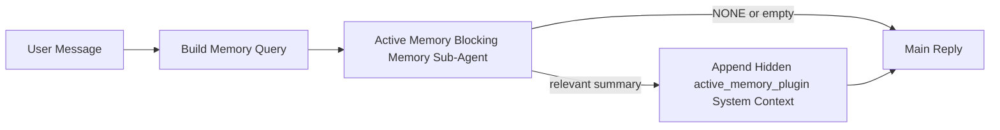

---
read_when:
    - Ви хочете зрозуміти, для чого потрібна активна пам’ять
    - Ви хочете увімкнути активну пам’ять для розмовного агента
    - Ви хочете налаштувати поведінку активної пам’яті, не вмикаючи її всюди
summary: Плагін-власний блокувальний підагент пам’яті, який впроваджує релевантну пам’ять в інтерактивні сеанси чату
title: Активна пам’ять
x-i18n:
    generated_at: "2026-04-12T01:25:44Z"
    model: gpt-5.4
    provider: openai
    source_hash: 8407d8f877429a6fa76b3bb5688e33fdab372766288e6de4944b26073b383ddc
    source_path: concepts/active-memory.md
    workflow: 15
---

# Активна пам’ять

Активна пам’ять — це необов’язковий плагін-власний блокувальний підагент пам’яті, який запускається
перед основною відповіддю для придатних розмовних сеансів.

Вона існує тому, що більшість систем пам’яті є потужними, але реактивними. Вони покладаються на
те, що основний агент вирішить, коли шукати в пам’яті, або на те, що користувач скаже щось на кшталт
«запам’ятай це» чи «пошукай у пам’яті». На той момент мить, коли пам’ять могла б
зробити відповідь природною, уже минає.

Активна пам’ять дає системі одну обмежену можливість підняти релевантну пам’ять
до того, як буде згенеровано основну відповідь.

## Вставте це у свого агента

Вставте це у свого агента, якщо хочете ввімкнути Активну пам’ять із
самодостатнім налаштуванням за замовчуванням:

```json5
{
  plugins: {
    entries: {
      "active-memory": {
        enabled: true,
        config: {
          enabled: true,
          agents: ["main"],
          allowedChatTypes: ["direct"],
          modelFallbackPolicy: "default-remote",
          queryMode: "recent",
          promptStyle: "balanced",
          timeoutMs: 15000,
          maxSummaryChars: 220,
          persistTranscripts: false,
          logging: true,
        },
      },
    },
  },
}
```

Це вмикає плагін для агента `main`, за замовчуванням обмежує його сеансами
у стилі прямих повідомлень, дає змогу спочатку успадковувати поточну модель сеансу, а також
дозволяє вбудований віддалений резервний варіант, якщо явна або успадкована модель недоступна.

Після цього перезапустіть шлюз:

```bash
openclaw gateway
```

Щоб перевірити це наживо в розмові:

```text
/verbose on
```

## Увімкнення активної пам’яті

Найбезпечніше налаштування:

1. увімкнути плагін
2. націлити його на одного розмовного агента
3. залишати журналювання увімкненим лише під час налаштування

Почніть із такого в `openclaw.json`:

```json5
{
  plugins: {
    entries: {
      "active-memory": {
        enabled: true,
        config: {
          agents: ["main"],
          allowedChatTypes: ["direct"],
          modelFallbackPolicy: "default-remote",
          queryMode: "recent",
          promptStyle: "balanced",
          timeoutMs: 15000,
          maxSummaryChars: 220,
          persistTranscripts: false,
          logging: true,
        },
      },
    },
  },
}
```

Потім перезапустіть шлюз:

```bash
openclaw gateway
```

Що це означає:

- `plugins.entries.active-memory.enabled: true` вмикає плагін
- `config.agents: ["main"]` підключає до активної пам’яті лише агента `main`
- `config.allowedChatTypes: ["direct"]` за замовчуванням залишає активну пам’ять увімкненою лише для сеансів у стилі прямих повідомлень
- якщо `config.model` не задано, активна пам’ять спочатку успадковує поточну модель сеансу
- `config.modelFallback` за потреби надає ваш власний резервний провайдер/модель для відновлення
- `config.promptStyle: "balanced"` використовує типовий універсальний стиль запиту для режиму `recent`
- активна пам’ять однаково запускається лише для придатних інтерактивних постійних чат-сеансів

## Як це побачити

Активна пам’ять впроваджує прихований системний контекст для моделі. Вона не показує
сирі теги `<active_memory_plugin>...</active_memory_plugin>` клієнту.

## Перемикач сеансу

Використовуйте команду плагіна, якщо хочете призупинити або відновити активну пам’ять для
поточного чат-сеансу без редагування конфігурації:

```text
/active-memory status
/active-memory off
/active-memory on
```

Це працює на рівні сеансу. Це не змінює
`plugins.entries.active-memory.enabled`, націлювання агента чи іншу глобальну
конфігурацію.

Якщо ви хочете, щоб команда записувала конфігурацію та призупиняла або відновлювала активну пам’ять для
всіх сеансів, використовуйте явну глобальну форму:

```text
/active-memory status --global
/active-memory off --global
/active-memory on --global
```

Глобальна форма записує `plugins.entries.active-memory.config.enabled`. Вона залишає
`plugins.entries.active-memory.enabled` увімкненим, щоб команда й надалі була доступна для
повторного ввімкнення активної пам’яті пізніше.

Якщо ви хочете бачити, що робить активна пам’ять у живому сеансі, увімкніть
докладний режим для цього сеансу:

```text
/verbose on
```

Коли докладний режим увімкнено, OpenClaw може показувати:

- рядок стану активної пам’яті, наприклад `Active Memory: ok 842ms recent 34 chars`
- зрозумілий підсумок налагодження, наприклад `Active Memory Debug: Lemon pepper wings with blue cheese.`

Ці рядки походять із того самого проходу активної пам’яті, який живить прихований
системний контекст, але вони відформатовані для людей замість показу сирої розмітки
запиту.

За замовчуванням транскрипт блокувального підагента пам’яті є тимчасовим і видаляється
після завершення виконання.

Приклад потоку:

```text
/verbose on
what wings should i order?
```

Очікувана видима форма відповіді:

```text
...normal assistant reply...

🧩 Active Memory: ok 842ms recent 34 chars
🔎 Active Memory Debug: Lemon pepper wings with blue cheese.
```

## Коли вона запускається

Активна пам’ять використовує два бар’єри:

1. **Явне ввімкнення в конфігурації**
   Плагін має бути ввімкнений, а поточний ідентифікатор агента має бути вказаний у
   `plugins.entries.active-memory.config.agents`.
2. **Сувора придатність під час виконання**
   Навіть коли активна пам’ять увімкнена й націлена, вона запускається лише для придатних
   інтерактивних постійних чат-сеансів.

Фактичне правило таке:

```text
plugin enabled
+
agent id targeted
+
allowed chat type
+
eligible interactive persistent chat session
=
active memory runs
```

Якщо будь-яка з цих умов не виконується, активна пам’ять не запускається.

## Типи сеансів

`config.allowedChatTypes` керує тим, у яких типах розмов узагалі може запускатися Активна
пам’ять.

Значення за замовчуванням:

```json5
allowedChatTypes: ["direct"]
```

Це означає, що за замовчуванням Активна пам’ять працює в сеансах у стилі прямих повідомлень, але
не в групових сеансах або сеансах каналів, якщо ви явно не ввімкнете їх.

Приклади:

```json5
allowedChatTypes: ["direct"]
```

```json5
allowedChatTypes: ["direct", "group"]
```

```json5
allowedChatTypes: ["direct", "group", "channel"]
```

## Де вона запускається

Активна пам’ять — це функція покращення розмов, а не загальноплатформна
функція інференсу.

| Поверхня                                                            | Активна пам’ять запускається?                           |
| ------------------------------------------------------------------- | ------------------------------------------------------- |
| Постійні сеанси Control UI / вебчату                                | Так, якщо плагін увімкнено й агент націлений            |
| Інші інтерактивні сеанси каналів на тому самому шляху постійного чату | Так, якщо плагін увімкнено й агент націлений            |
| Безголові одноразові запуски                                        | Ні                                                      |
| Запуски heartbeat/фонові запуски                                    | Ні                                                      |
| Загальні внутрішні шляхи `agent-command`                            | Ні                                                      |
| Виконання підагентів/внутрішніх допоміжних компонентів              | Ні                                                      |

## Навіщо її використовувати

Використовуйте активну пам’ять, коли:

- сеанс є постійним і орієнтованим на користувача
- агент має значущу довгострокову пам’ять для пошуку
- безперервність і персоналізація важливіші за чистий детермінізм запиту

Вона особливо добре працює для:

- стабільних уподобань
- повторюваних звичок
- довгострокового контексту користувача, який має спливати природно

Вона погано підходить для:

- автоматизації
- внутрішніх воркерів
- одноразових API-завдань
- місць, де прихована персоналізація була б неочікуваною

## Як вона працює

Форма виконання така:



Блокувальний підагент пам’яті може використовувати лише:

- `memory_search`
- `memory_get`

Якщо з’єднання слабке, він має повернути `NONE`.

## Режими запиту

`config.queryMode` керує тим, яку частину розмови бачить блокувальний підагент пам’яті.

## Стилі запиту

`config.promptStyle` керує тим, наскільки охоче чи суворо блокувальний підагент пам’яті
вирішує, чи повертати пам’ять.

Доступні стилі:

- `balanced`: типовий універсальний варіант для режиму `recent`
- `strict`: найменш охочий; найкраще підходить, коли ви хочете мінімального впливу від сусіднього контексту
- `contextual`: найбільш дружній до безперервності; найкраще підходить, коли історія розмови має важити більше
- `recall-heavy`: охочіше піднімає пам’ять за м’якших, але все ще правдоподібних збігів
- `precision-heavy`: агресивно віддає перевагу `NONE`, якщо збіг не є очевидним
- `preference-only`: оптимізований для улюбленого, звичок, рутин, смаків і повторюваних особистих фактів

Типове зіставлення, коли `config.promptStyle` не задано:

```text
message -> strict
recent -> balanced
full -> contextual
```

Якщо ви явно задаєте `config.promptStyle`, цей пріоритет має перевагу.

Приклад:

```json5
promptStyle: "preference-only"
```

## Політика резервної моделі

Якщо `config.model` не задано, Активна пам’ять намагається визначити модель у такому порядку:

```text
explicit plugin model
-> current session model
-> agent primary model
-> optional configured fallback model
```

`config.modelFallback` керує кроком із налаштованою резервною моделлю.

Необов’язковий власний резервний варіант:

```json5
modelFallback: "google/gemini-3-flash"
```

Якщо не вдається визначити явну, успадковану або налаштовану резервну модель, Активна пам’ять
пропускає відновлення для цього ходу.

`config.modelFallbackPolicy` збережено лише як застаріле поле сумісності
для старіших конфігурацій. Воно більше не змінює поведінку під час виконання.

## Розширені запасні варіанти

Ці параметри навмисно не входять до рекомендованого налаштування.

`config.thinking` може перевизначити рівень thinking блокувального підагента пам’яті:

```json5
thinking: "medium"
```

Значення за замовчуванням:

```json5
thinking: "off"
```

Не вмикайте це за замовчуванням. Активна пам’ять працює на шляху відповіді, тому додатковий
час на thinking напряму збільшує видиму для користувача затримку.

`config.promptAppend` додає додаткові операторські інструкції після типового запиту Active
Memory і перед контекстом розмови:

```json5
promptAppend: "Prefer stable long-term preferences over one-off events."
```

`config.promptOverride` замінює типовий запит Active Memory. OpenClaw
усе одно додає контекст розмови після нього:

```json5
promptOverride: "You are a memory search agent. Return NONE or one compact user fact."
```

Налаштування запиту не рекомендується, якщо тільки ви не тестуєте навмисно
інший контракт відновлення. Типовий запит налаштовано на повернення або `NONE`,
або компактного контексту фактів про користувача для основної моделі.

### `message`

Надсилається лише останнє повідомлення користувача.

```text
Latest user message only
```

Використовуйте це, коли:

- ви хочете найшвидшу поведінку
- ви хочете найсильніший ухил у бік відновлення стабільних уподобань
- ходи продовження не потребують розмовного контексту

Рекомендований тайм-аут:

- починайте приблизно з `3000` до `5000` мс

### `recent`

Надсилається останнє повідомлення користувача плюс невеликий хвіст нещодавньої розмови.

```text
Recent conversation tail:
user: ...
assistant: ...
user: ...

Latest user message:
...
```

Використовуйте це, коли:

- ви хочете кращий баланс між швидкістю та розмовним контекстом
- запитання-продовження часто залежать від кількох останніх ходів

Рекомендований тайм-аут:

- починайте приблизно з `15000` мс

### `full`

Уся розмова надсилається блокувальному підагенту пам’яті.

```text
Full conversation context:
user: ...
assistant: ...
user: ...
...
```

Використовуйте це, коли:

- найвища якість відновлення важливіша за затримку
- розмова містить важливу підготовку далеко вище в гілці

Рекомендований тайм-аут:

- суттєво збільшіть його порівняно з `message` або `recent`
- починайте приблизно з `15000` мс або більше, залежно від розміру гілки

Загалом тайм-аут має зростати разом із розміром контексту:

```text
message < recent < full
```

## Збереження транскриптів

Запуски блокувального підагента пам’яті активної пам’яті створюють реальний
транскрипт `session.jsonl` під час виклику блокувального підагента пам’яті.

За замовчуванням цей транскрипт є тимчасовим:

- він записується до тимчасового каталогу
- він використовується лише для запуску блокувального підагента пам’яті
- він видаляється одразу після завершення запуску

Якщо ви хочете зберігати ці транскрипти блокувального підагента пам’яті на диску для налагодження або
перевірки, явно ввімкніть збереження:

```json5
{
  plugins: {
    entries: {
      "active-memory": {
        enabled: true,
        config: {
          agents: ["main"],
          persistTranscripts: true,
          transcriptDir: "active-memory",
        },
      },
    },
  },
}
```

Коли цей параметр увімкнено, активна пам’ять зберігає транскрипти в окремому каталозі в теці
сеансів цільового агента, а не в основному шляху транскрипту розмови
користувача.

Типова структура концептуально виглядає так:

```text
agents/<agent>/sessions/active-memory/<blocking-memory-sub-agent-session-id>.jsonl
```

Ви можете змінити відносний підкаталог за допомогою `config.transcriptDir`.

Використовуйте це обережно:

- транскрипти блокувального підагента пам’яті можуть швидко накопичуватися в активних сеансах
- режим запиту `full` може дублювати велику частину контексту розмови
- ці транскрипти містять прихований контекст запиту та відновлені спогади

## Конфігурація

Уся конфігурація активної пам’яті розміщується тут:

```text
plugins.entries.active-memory
```

Найважливіші поля:

| Ключ                        | Тип                                                                                                 | Значення                                                                                                      |
| --------------------------- | --------------------------------------------------------------------------------------------------- | ------------------------------------------------------------------------------------------------------------- |
| `enabled`                   | `boolean`                                                                                           | Вмикає сам плагін                                                                                             |
| `config.agents`             | `string[]`                                                                                          | Ідентифікатори агентів, які можуть використовувати активну пам’ять                                            |
| `config.model`              | `string`                                                                                            | Необов’язкове посилання на модель блокувального підагента пам’яті; якщо не задано, активна пам’ять використовує поточну модель сеансу |
| `config.queryMode`          | `"message" \| "recent" \| "full"`                                                                   | Керує тим, яку частину розмови бачить блокувальний підагент пам’яті                                           |
| `config.promptStyle`        | `"balanced" \| "strict" \| "contextual" \| "recall-heavy" \| "precision-heavy" \| "preference-only"` | Керує тим, наскільки охоче чи суворо блокувальний підагент пам’яті вирішує, чи повертати пам’ять             |
| `config.thinking`           | `"off" \| "minimal" \| "low" \| "medium" \| "high" \| "xhigh" \| "adaptive"`                        | Розширене перевизначення thinking для блокувального підагента пам’яті; за замовчуванням `off` для швидкості |
| `config.promptOverride`     | `string`                                                                                            | Розширена повна заміна запиту; не рекомендується для звичайного використання                                  |
| `config.promptAppend`       | `string`                                                                                            | Розширені додаткові інструкції, додані до типового або перевизначеного запиту                                 |
| `config.timeoutMs`          | `number`                                                                                            | Жорсткий тайм-аут для блокувального підагента пам’яті                                                         |
| `config.maxSummaryChars`    | `number`                                                                                            | Максимальна загальна кількість символів, дозволена в підсумку active-memory                                   |
| `config.logging`            | `boolean`                                                                                           | Виводить журнали активної пам’яті під час налаштування                                                        |
| `config.persistTranscripts` | `boolean`                                                                                           | Зберігає транскрипти блокувального підагента пам’яті на диску замість видалення тимчасових файлів            |
| `config.transcriptDir`      | `string`                                                                                            | Відносний каталог транскриптів блокувального підагента пам’яті в теці сеансів агента                          |

Корисні поля для налаштування:

| Ключ                          | Тип      | Значення                                                     |
| ----------------------------- | -------- | ------------------------------------------------------------ |
| `config.maxSummaryChars`      | `number` | Максимальна загальна кількість символів, дозволена в підсумку active-memory |
| `config.recentUserTurns`      | `number` | Попередні ходи користувача, які включаються, коли `queryMode` має значення `recent` |
| `config.recentAssistantTurns` | `number` | Попередні ходи асистента, які включаються, коли `queryMode` має значення `recent` |
| `config.recentUserChars`      | `number` | Максимальна кількість символів на один недавній хід користувача |
| `config.recentAssistantChars` | `number` | Максимальна кількість символів на один недавній хід асистента |
| `config.cacheTtlMs`           | `number` | Повторне використання кешу для повторюваних однакових запитів |

## Рекомендоване налаштування

Починайте з `recent`.

```json5
{
  plugins: {
    entries: {
      "active-memory": {
        enabled: true,
        config: {
          agents: ["main"],
          queryMode: "recent",
          promptStyle: "balanced",
          timeoutMs: 15000,
          maxSummaryChars: 220,
          logging: true,
        },
      },
    },
  },
}
```

Якщо ви хочете перевіряти поведінку наживо під час налаштування, використовуйте `/verbose on` у
сеансі замість пошуку окремої команди налагодження active-memory.

Потім переходьте до:

- `message`, якщо хочете меншої затримки
- `full`, якщо вирішите, що додатковий контекст вартий повільнішого блокувального підагента пам’яті

## Налагодження

Якщо активна пам’ять не з’являється там, де ви очікуєте:

1. Переконайтеся, що плагін увімкнено в `plugins.entries.active-memory.enabled`.
2. Переконайтеся, що поточний ідентифікатор агента вказано в `config.agents`.
3. Переконайтеся, що ви тестуєте через інтерактивний постійний чат-сеанс.
4. Увімкніть `config.logging: true` і переглядайте журнали шлюзу.
5. Переконайтеся, що сам пошук у пам’яті працює, за допомогою `openclaw memory status --deep`.

Якщо збіги пам’яті шумні, зменште:

- `maxSummaryChars`

Якщо активна пам’ять працює надто повільно:

- зменште `queryMode`
- зменште `timeoutMs`
- зменште кількість недавніх ходів
- зменште обмеження кількості символів на хід

## Пов’язані сторінки

- [Пошук у пам’яті](/uk/concepts/memory-search)
- [Довідник із конфігурації пам’яті](/uk/reference/memory-config)
- [Налаштування Plugin SDK](/uk/plugins/sdk-setup)
