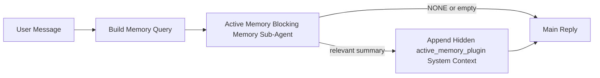

---
read_when:
    - Ви хочете зрозуміти, для чого потрібна активна пам’ять
    - Ви хочете увімкнути активну пам’ять для розмовного агента
    - Ви хочете налаштувати поведінку активної пам’яті, не вмикаючи її всюди
summary: Плагінний блокувальний підагент пам’яті, який впроваджує релевантну пам’ять в інтерактивні сеанси чату
title: Активна пам’ять
x-i18n:
    generated_at: "2026-04-11T04:03:44Z"
    model: gpt-5.4
    provider: openai
    source_hash: e8b0e6539e09678e9e8def68795f8bcb992f98509423da3da3123eda88ec1dd5
    source_path: concepts/active-memory.md
    workflow: 15
---

# Активна пам’ять

Активна пам’ять — це необов’язковий плагінний блокувальний підагент пам’яті, який запускається
перед основною відповіддю для відповідних розмовних сеансів.

Вона існує тому, що більшість систем пам’яті є потужними, але реактивними. Вони покладаються на
те, що основний агент вирішить, коли шукати в пам’яті, або на те, що користувач скаже щось
на кшталт «запам’ятай це» чи «пошукай у пам’яті». На той момент мить, коли пам’ять могла б
зробити відповідь природною, уже минула.

Активна пам’ять дає системі одну обмежену можливість показати релевантну пам’ять
до того, як буде згенерована основна відповідь.

## Вставте це у свого агента

Вставте це у свого агента, якщо хочете ввімкнути активну пам’ять із
самодостатнім налаштуванням за замовчуванням із безпечними параметрами:

```json5
{
  plugins: {
    entries: {
      "active-memory": {
        enabled: true,
        config: {
          enabled: true,
          agents: ["main"],
          allowedChatTypes: ["direct"],
          modelFallbackPolicy: "default-remote",
          queryMode: "recent",
          promptStyle: "balanced",
          timeoutMs: 15000,
          maxSummaryChars: 220,
          persistTranscripts: false,
          logging: true,
        },
      },
    },
  },
}
```

Це вмикає плагін для агента `main`, за замовчуванням обмежує його сеансами
у стилі прямих повідомлень, дає змогу спочатку успадкувати модель поточного сеансу і
водночас дозволяє використовувати вбудований віддалений резервний варіант, якщо явна або
успадкована модель недоступна.

Після цього перезапустіть шлюз:

```bash
openclaw gateway
```

Щоб переглянути це наживо в розмові:

```text
/verbose on
```

## Увімкнення активної пам’яті

Найбезпечніше налаштування таке:

1. увімкнути плагін
2. націлити його на одного розмовного агента
3. залишити журналювання ввімкненим лише на час налаштування

Почніть із цього в `openclaw.json`:

```json5
{
  plugins: {
    entries: {
      "active-memory": {
        enabled: true,
        config: {
          agents: ["main"],
          allowedChatTypes: ["direct"],
          modelFallbackPolicy: "default-remote",
          queryMode: "recent",
          promptStyle: "balanced",
          timeoutMs: 15000,
          maxSummaryChars: 220,
          persistTranscripts: false,
          logging: true,
        },
      },
    },
  },
}
```

Потім перезапустіть шлюз:

```bash
openclaw gateway
```

Що це означає:

- `plugins.entries.active-memory.enabled: true` вмикає плагін
- `config.agents: ["main"]` підключає до активної пам’яті лише агента `main`
- `config.allowedChatTypes: ["direct"]` за замовчуванням залишає активну пам’ять увімкненою лише для сеансів у стилі прямих повідомлень
- якщо `config.model` не задано, активна пам’ять спочатку успадковує модель поточного сеансу
- `config.modelFallbackPolicy: "default-remote"` зберігає вбудований віддалений резервний варіант як типовий, коли явна або успадкована модель недоступна
- `config.promptStyle: "balanced"` використовує типовий універсальний стиль запиту для режиму `recent`
- активна пам’ять усе одно запускається лише для відповідних інтерактивних постійних сеансів чату

## Як це побачити

Активна пам’ять впроваджує прихований системний контекст для моделі. Вона не показує
клієнту сирі теги `<active_memory_plugin>...</active_memory_plugin>`.

## Перемикач сеансу

Використовуйте команду плагіна, якщо хочете призупинити або відновити активну пам’ять для
поточного сеансу чату без редагування конфігурації:

```text
/active-memory status
/active-memory off
/active-memory on
```

Це налаштування в межах сеансу. Воно не змінює
`plugins.entries.active-memory.enabled`, націлення на агентів чи іншу глобальну
конфігурацію.

Якщо ви хочете, щоб команда записувала конфігурацію та призупиняла або відновлювала активну пам’ять для
всіх сеансів, використовуйте явну глобальну форму:

```text
/active-memory status --global
/active-memory off --global
/active-memory on --global
```

Глобальна форма записує `plugins.entries.active-memory.config.enabled`. Вона залишає
`plugins.entries.active-memory.enabled` увімкненим, щоб команда й надалі була доступною для
повторного ввімкнення активної пам’яті пізніше.

Якщо ви хочете бачити, що робить активна пам’ять у поточному сеансі, увімкніть докладний режим
для цього сеансу:

```text
/verbose on
```

Коли докладний режим увімкнено, OpenClaw може показувати:

- рядок стану активної пам’яті, наприклад `Active Memory: ok 842ms recent 34 chars`
- зрозумілий підсумок для налагодження, наприклад `Active Memory Debug: Lemon pepper wings with blue cheese.`

Ці рядки походять із того самого проходу активної пам’яті, який подає прихований
системний контекст, але вони відформатовані для людей замість показу сирої розмітки
запиту.

За замовчуванням стенограма блокувального підагента пам’яті є тимчасовою і видаляється
після завершення виконання.

Приклад потоку:

```text
/verbose on
what wings should i order?
```

Очікувана видима форма відповіді:

```text
...normal assistant reply...

🧩 Active Memory: ok 842ms recent 34 chars
🔎 Active Memory Debug: Lemon pepper wings with blue cheese.
```

## Коли вона запускається

Активна пам’ять використовує два фільтри:

1. **Явне ввімкнення в конфігурації**
   Плагін має бути ввімкнений, а поточний id агента має бути вказаний у
   `plugins.entries.active-memory.config.agents`.
2. **Строга відповідність умовам середовища виконання**
   Навіть якщо її ввімкнено і націлено, активна пам’ять запускається лише для відповідних
   інтерактивних постійних сеансів чату.

Фактичне правило таке:

```text
plugin enabled
+
agent id targeted
+
allowed chat type
+
eligible interactive persistent chat session
=
active memory runs
```

Якщо будь-яка з цих умов не виконується, активна пам’ять не запускається.

## Типи сеансів

`config.allowedChatTypes` визначає, у яких типах розмов узагалі може працювати Активна
пам’ять.

Значення за замовчуванням:

```json5
allowedChatTypes: ["direct"]
```

Це означає, що за замовчуванням Активна пам’ять працює в сеансах у стилі прямих повідомлень, але
не в групових сеансах або сеансах каналів, якщо ви явно не ввімкнете їх.

Приклади:

```json5
allowedChatTypes: ["direct"]
```

```json5
allowedChatTypes: ["direct", "group"]
```

```json5
allowedChatTypes: ["direct", "group", "channel"]
```

## Де вона працює

Активна пам’ять — це функція покращення розмов, а не загальноплатформна
функція інференсу.

| Поверхня                                                            | Активна пам’ять запускається?                           |
| ------------------------------------------------------------------- | ------------------------------------------------------- |
| Постійні сеанси Control UI / вебчату                                | Так, якщо плагін увімкнено і агент націлений            |
| Інші інтерактивні сеанси каналів на тому самому шляху постійного чату | Так, якщо плагін увімкнено і агент націлений            |
| Одноразові headless-запуски                                         | Ні                                                      |
| Запуски heartbeat/фонові запуски                                    | Ні                                                      |
| Загальні внутрішні шляхи `agent-command`                            | Ні                                                      |
| Виконання підагентів/внутрішніх допоміжних компонентів              | Ні                                                      |

## Навіщо її використовувати

Використовуйте активну пам’ять, коли:

- сеанс є постійним і орієнтованим на користувача
- агент має змістовну довгострокову пам’ять для пошуку
- безперервність і персоналізація важливіші за чистий детермінізм запиту

Вона особливо добре підходить для:

- сталих уподобань
- повторюваних звичок
- довгострокового контексту користувача, який має природно з’являтися

Вона погано підходить для:

- автоматизації
- внутрішніх працівників
- одноразових API-завдань
- місць, де прихована персоналізація була б несподіваною

## Як це працює

Форма виконання така:



Блокувальний підагент пам’яті може використовувати лише:

- `memory_search`
- `memory_get`

Якщо з’єднання слабке, він має повернути `NONE`.

## Режими запиту

`config.queryMode` визначає, яку частину розмови бачить блокувальний підагент пам’яті.

## Стилі запиту

`config.promptStyle` визначає, наскільки охоче або строго блокувальний підагент пам’яті
вирішує, чи повертати пам’ять.

Доступні стилі:

- `balanced`: типовий універсальний варіант для режиму `recent`
- `strict`: найменш охочий; найкраще підходить, коли ви хочете мінімального впливу сусіднього контексту
- `contextual`: найсприятливіший для безперервності; найкраще підходить, коли історія розмови має більшу вагу
- `recall-heavy`: охочіше показує пам’ять за слабших, але все ще правдоподібних збігів
- `precision-heavy`: агресивно віддає перевагу `NONE`, якщо збіг не є очевидним
- `preference-only`: оптимізовано для улюбленого, звичок, рутин, смаків і повторюваних особистих фактів

Типове зіставлення, коли `config.promptStyle` не задано:

```text
message -> strict
recent -> balanced
full -> contextual
```

Якщо ви явно задасте `config.promptStyle`, цей пріоритет матиме перевагу.

Приклад:

```json5
promptStyle: "preference-only"
```

## Політика резервного варіанта моделі

Якщо `config.model` не задано, Активна пам’ять намагається визначити модель у такому порядку:

```text
explicit plugin model
-> current session model
-> agent primary model
-> optional built-in remote fallback
```

`config.modelFallbackPolicy` керує останнім кроком.

За замовчуванням:

```json5
modelFallbackPolicy: "default-remote"
```

Інший варіант:

```json5
modelFallbackPolicy: "resolved-only"
```

Використовуйте `resolved-only`, якщо хочете, щоб Активна пам’ять пропускала пригадування замість
використання вбудованого віддаленого типового резервного варіанта, коли явна або успадкована модель
недоступна.

## Розширені аварійні налаштування

Ці параметри навмисно не входять до рекомендованого налаштування.

`config.thinking` може перевизначити рівень thinking для блокувального підагента пам’яті:

```json5
thinking: "medium"
```

За замовчуванням:

```json5
thinking: "off"
```

Не вмикайте це за замовчуванням. Активна пам’ять працює на шляху відповіді, тож додатковий
час на thinking безпосередньо збільшує затримку, помітну користувачу.

`config.promptAppend` додає додаткові інструкції оператора після типового запиту Активної
пам’яті та перед контекстом розмови:

```json5
promptAppend: "Prefer stable long-term preferences over one-off events."
```

`config.promptOverride` замінює типовий запит Активної пам’яті. OpenClaw
усе одно додає контекст розмови після нього:

```json5
promptOverride: "You are a memory search agent. Return NONE or one compact user fact."
```

Налаштування запиту не рекомендується, якщо ви цілеспрямовано не тестуєте інший
контракт пригадування. Типовий запит налаштований на повернення або `NONE`,
або компактного контексту фактів про користувача для основної моделі.

### `message`

Надсилається лише останнє повідомлення користувача.

```text
Latest user message only
```

Використовуйте це, коли:

- ви хочете найшвидшу поведінку
- ви хочете найсильніший ухил у бік пригадування сталих уподобань
- наступні ходи не потребують розмовного контексту

Рекомендований тайм-аут:

- починайте приблизно з `3000` до `5000` мс

### `recent`

Надсилається останнє повідомлення користувача плюс невеликий хвіст нещодавньої розмови.

```text
Recent conversation tail:
user: ...
assistant: ...
user: ...

Latest user message:
...
```

Використовуйте це, коли:

- ви хочете кращий баланс між швидкістю та опорою на розмовний контекст
- подальші запитання часто залежать від кількох останніх ходів

Рекомендований тайм-аут:

- починайте приблизно з `15000` мс

### `full`

Уся розмова надсилається блокувальному підагенту пам’яті.

```text
Full conversation context:
user: ...
assistant: ...
user: ...
...
```

Використовуйте це, коли:

- найвища якість пригадування важливіша за затримку
- розмова містить важливі підготовчі дані далеко вгорі гілки

Рекомендований тайм-аут:

- значно збільште його порівняно з `message` або `recent`
- починайте приблизно з `15000` мс або вище залежно від розміру гілки

Загалом тайм-аут має зростати разом із розміром контексту:

```text
message < recent < full
```

## Збереження стенограми

Запуски блокувального підагента пам’яті активної пам’яті створюють справжню стенограму `session.jsonl`
під час виклику блокувального підагента пам’яті.

За замовчуванням ця стенограма є тимчасовою:

- її записують до тимчасового каталогу
- вона використовується лише для виконання блокувального підагента пам’яті
- її видаляють одразу після завершення виконання

Якщо ви хочете зберігати ці стенограми блокувального підагента пам’яті на диску для налагодження або
перевірки, явно ввімкніть збереження:

```json5
{
  plugins: {
    entries: {
      "active-memory": {
        enabled: true,
        config: {
          agents: ["main"],
          persistTranscripts: true,
          transcriptDir: "active-memory",
        },
      },
    },
  },
}
```

Коли це ввімкнено, активна пам’ять зберігає стенограми в окремому каталозі в папці
сеансів цільового агента, а не в основному шляху стенограми розмови користувача.

Типова структура концептуально така:

```text
agents/<agent>/sessions/active-memory/<blocking-memory-sub-agent-session-id>.jsonl
```

Ви можете змінити відносний підкаталог за допомогою `config.transcriptDir`.

Використовуйте це обережно:

- стенограми блокувального підагента пам’яті можуть швидко накопичуватися в активних сеансах
- режим запиту `full` може дублювати значну частину контексту розмови
- ці стенограми містять прихований контекст запиту та пригадані спогади

## Конфігурація

Уся конфігурація активної пам’яті розміщена в:

```text
plugins.entries.active-memory
```

Найважливіші поля:

| Ключ                        | Тип                                                                                                  | Значення                                                                                               |
| --------------------------- | ---------------------------------------------------------------------------------------------------- | ------------------------------------------------------------------------------------------------------ |
| `enabled`                   | `boolean`                                                                                            | Вмикає сам плагін                                                                                      |
| `config.agents`             | `string[]`                                                                                           | ID агентів, які можуть використовувати активну пам’ять                                                 |
| `config.model`              | `string`                                                                                             | Необов’язкове посилання на модель блокувального підагента пам’яті; якщо не задано, активна пам’ять використовує модель поточного сеансу |
| `config.queryMode`          | `"message" \| "recent" \| "full"`                                                                    | Визначає, яку частину розмови бачить блокувальний підагент пам’яті                                     |
| `config.promptStyle`        | `"balanced" \| "strict" \| "contextual" \| "recall-heavy" \| "precision-heavy" \| "preference-only"` | Визначає, наскільки охоче або строго блокувальний підагент пам’яті вирішує, чи повертати пам’ять      |
| `config.thinking`           | `"off" \| "minimal" \| "low" \| "medium" \| "high" \| "xhigh" \| "adaptive"`                         | Розширене перевизначення thinking для блокувального підагента пам’яті; за замовчуванням `off` для швидкості |
| `config.promptOverride`     | `string`                                                                                             | Розширена повна заміна запиту; не рекомендується для звичайного використання                           |
| `config.promptAppend`       | `string`                                                                                             | Розширені додаткові інструкції, додані до типового або перевизначеного запиту                          |
| `config.timeoutMs`          | `number`                                                                                             | Жорсткий тайм-аут для блокувального підагента пам’яті                                                  |
| `config.maxSummaryChars`    | `number`                                                                                             | Максимальна загальна кількість символів, дозволена в підсумку active-memory                            |
| `config.logging`            | `boolean`                                                                                            | Виводить журнали активної пам’яті під час налаштування                                                 |
| `config.persistTranscripts` | `boolean`                                                                                            | Зберігає стенограми блокувального підагента пам’яті на диску замість видалення тимчасових файлів      |
| `config.transcriptDir`      | `string`                                                                                             | Відносний каталог стенограм блокувального підагента пам’яті в папці сеансів агента                    |

Корисні поля для налаштування:

| Ключ                          | Тип      | Значення                                                      |
| ----------------------------- | -------- | ------------------------------------------------------------- |
| `config.maxSummaryChars`      | `number` | Максимальна загальна кількість символів, дозволена в підсумку active-memory |
| `config.recentUserTurns`      | `number` | Попередні ходи користувача, які слід включити, коли `queryMode` дорівнює `recent` |
| `config.recentAssistantTurns` | `number` | Попередні ходи помічника, які слід включити, коли `queryMode` дорівнює `recent` |
| `config.recentUserChars`      | `number` | Максимум символів на один нещодавній хід користувача          |
| `config.recentAssistantChars` | `number` | Максимум символів на один нещодавній хід помічника            |
| `config.cacheTtlMs`           | `number` | Повторне використання кешу для повторюваних ідентичних запитів |

## Рекомендоване налаштування

Почніть із `recent`.

```json5
{
  plugins: {
    entries: {
      "active-memory": {
        enabled: true,
        config: {
          agents: ["main"],
          queryMode: "recent",
          promptStyle: "balanced",
          timeoutMs: 15000,
          maxSummaryChars: 220,
          logging: true,
        },
      },
    },
  },
}
```

Якщо ви хочете переглядати поведінку наживо під час налаштування, використовуйте `/verbose on` у
сеансі замість пошуку окремої команди налагодження active-memory.

Потім перейдіть до:

- `message`, якщо хочете меншу затримку
- `full`, якщо вирішите, що додатковий контекст вартий повільнішого блокувального підагента пам’яті

## Налагодження

Якщо активна пам’ять не з’являється там, де ви очікуєте:

1. Переконайтеся, що плагін увімкнено в `plugins.entries.active-memory.enabled`.
2. Переконайтеся, що поточний ID агента вказаний у `config.agents`.
3. Переконайтеся, що ви тестуєте через інтерактивний постійний сеанс чату.
4. Увімкніть `config.logging: true` і стежте за журналами шлюзу.
5. Перевірте, що сам пошук у пам’яті працює, за допомогою `openclaw memory status --deep`.

Якщо збіги пам’яті занадто шумні, зменште:

- `maxSummaryChars`

Якщо активна пам’ять надто повільна:

- зменште `queryMode`
- зменште `timeoutMs`
- зменште кількість нещодавніх ходів
- зменште обмеження символів на хід

## Пов’язані сторінки

- [Пошук у пам’яті](/uk/concepts/memory-search)
- [Довідник із конфігурації пам’яті](/uk/reference/memory-config)
- [Налаштування Plugin SDK](/uk/plugins/sdk-setup)
