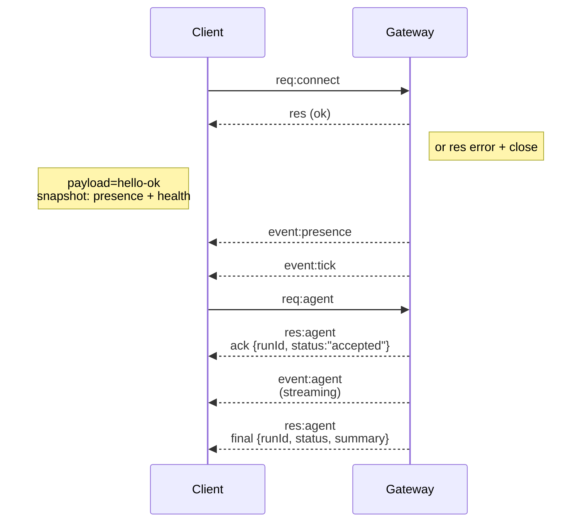

---
read_when:
    - Робота над протоколом gateway, клієнтами або транспортами
summary: Архітектура gateway WebSocket, компоненти та потоки клієнтів
title: Архітектура Gateway
x-i18n:
    generated_at: "2026-04-05T18:00:29Z"
    model: gpt-5.4
    provider: openai
    source_hash: 2b12a2a29e94334c6d10787ac85c34b5b046f9a14f3dd53be453368ca4a7547d
    source_path: concepts/architecture.md
    workflow: 15
---

# Архітектура gateway

## Огляд

- Один довготривалий **Gateway** володіє всіма поверхнями обміну повідомленнями (WhatsApp через
  Baileys, Telegram через grammY, Slack, Discord, Signal, iMessage, WebChat).
- Клієнти control plane (застосунок macOS, CLI, веб-інтерфейс, автоматизації) підключаються до
  Gateway через **WebSocket** на налаштованому bind host (за замовчуванням
  `127.0.0.1:18789`).
- **Nodes** (macOS/iOS/Android/headless) також підключаються через **WebSocket**, але
  оголошують `role: node` з явними caps/commands.
- Один Gateway на хост; це єдине місце, яке відкриває сесію WhatsApp.
- **canvas host** обслуговується HTTP-сервером Gateway за адресами:
  - `/__openclaw__/canvas/` (HTML/CSS/JS, які можна редагувати агентом)
  - `/__openclaw__/a2ui/` (хост A2UI)
    Він використовує той самий порт, що й Gateway (за замовчуванням `18789`).

## Компоненти та потоки

### Gateway (демон)

- Підтримує з’єднання з провайдерами.
- Надає типізований WS API (запити, відповіді, server-push-події).
- Перевіряє вхідні фрейми за JSON Schema.
- Генерує події, такі як `agent`, `chat`, `presence`, `health`, `heartbeat`, `cron`.

### Клієнти (застосунок macOS / CLI / веб-адмінка)

- Одне WS-з’єднання на клієнта.
- Надсилають запити (`health`, `status`, `send`, `agent`, `system-presence`).
- Підписуються на події (`tick`, `agent`, `presence`, `shutdown`).

### Nodes (macOS / iOS / Android / headless)

- Підключаються до **того самого WS-сервера** з `role: node`.
- Надають ідентичність пристрою в `connect`; pairing є **на основі пристрою** (role `node`), а
  схвалення зберігається в сховищі pairing пристроїв.
- Надають команди, такі як `canvas.*`, `camera.*`, `screen.record`, `location.get`.

Докладно про протокол:

- [Протокол Gateway](/gateway/protocol)

### WebChat

- Статичний UI, який використовує WS API Gateway для історії чату та надсилання.
- У віддалених конфігураціях підключається через той самий SSH/Tailscale tunnel, що й інші
  клієнти.

## Життєвий цикл з’єднання (один клієнт)



## Протокол на дроті (коротко)

- Транспорт: WebSocket, текстові фрейми з JSON payload.
- Перший фрейм **має** бути `connect`.
- Після handshake:
  - Запити: `{type:"req", id, method, params}` → `{type:"res", id, ok, payload|error}`
  - Події: `{type:"event", event, payload, seq?, stateVersion?}`
- `hello-ok.features.methods` / `events` — це метадані виявлення, а не
  згенерований дамп кожного доступного допоміжного маршруту.
- Автентифікація за shared secret використовує `connect.params.auth.token` або
  `connect.params.auth.password` залежно від налаштованого режиму автентифікації gateway.
- Режими з автентифікацією на основі ідентичності, такі як Tailscale Serve
  (`gateway.auth.allowTailscale: true`) або bind не до loopback
  `gateway.auth.mode: "trusted-proxy"`, задовольняють вимоги автентифікації через заголовки запиту
  замість `connect.params.auth.*`.
- `gateway.auth.mode: "none"` для приватного ingress вимикає автентифікацію за shared secret
  повністю; не використовуйте цей режим для публічного або недовіреного ingress.
- Ключі ідемпотентності потрібні для методів із побічними ефектами (`send`, `agent`), щоб
  безпечно повторювати спроби; сервер зберігає короткоживучий кеш дедуплікації.
- Nodes мають включати `role: "node"` плюс caps/commands/permissions у `connect`.

## Pairing + локальна довіра

- Усі WS-клієнти (оператори + nodes) включають **ідентичність пристрою** у `connect`.
- Нові ID пристроїв потребують схвалення pairing; Gateway видає **токен пристрою**
  для наступних підключень.
- Прямі локальні підключення через local loopback можуть автоматично схвалюватися, щоб зберегти зручний UX на тому самому хості.
- OpenClaw також має вузький шлях self-connect для довірених helper-потоків у локальному backend/container.
- Підключення через tailnet і LAN, включно з bind через tailnet на тому самому хості, однаково потребують явного схвалення pairing.
- Усі підключення мають підписувати nonce `connect.challenge`.
- Payload підпису `v3` також прив’язує `platform` + `deviceFamily`; gateway закріплює paired metadata при повторному підключенні й вимагає repair pairing у разі зміни метаданих.
- **Нелокальні** підключення все одно потребують явного схвалення.
- Автентифікація gateway (`gateway.auth.*`) усе одно застосовується до **всіх** підключень, локальних чи
  віддалених.

Докладніше: [Протокол Gateway](/gateway/protocol), [Pairing](/channels/pairing),
[Безпека](/gateway/security).

## Типізація протоколу та codegen

- Схеми TypeBox визначають протокол.
- JSON Schema генерується з цих схем.
- Моделі Swift генеруються з JSON Schema.

## Віддалений доступ

- Рекомендовано: Tailscale або VPN.
- Альтернатива: SSH tunnel

  ```bash
  ssh -N -L 18789:127.0.0.1:18789 user@host
  ```

- Той самий handshake + auth token застосовуються через tunnel.
- Для WS у віддалених конфігураціях можна ввімкнути TLS + необов’язковий pinning.

## Операційний знімок

- Запуск: `openclaw gateway` (foreground, логи в stdout).
- Стан: `health` через WS (також включено в `hello-ok`).
- Нагляд: launchd/systemd для автоматичного перезапуску.

## Інваріанти

- Рівно один Gateway керує однією сесією Baileys на хост.
- Handshake є обов’язковим; будь-який перший фрейм, що не є JSON або `connect`, призводить до жорсткого закриття.
- Події не відтворюються повторно; клієнти мають оновлювати стан у разі пропусків.

## Пов’язане

- [Цикл агента](/concepts/agent-loop) — докладний цикл виконання агента
- [Протокол Gateway](/gateway/protocol) — контракт протоколу WebSocket
- [Черга](/concepts/queue) — черга команд і паралелізм
- [Безпека](/gateway/security) — модель довіри та посилення захисту
