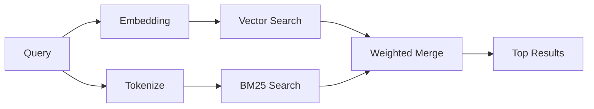

---
read_when:
    - Ви хочете зрозуміти, як працює memory_search
    - Ви хочете вибрати провайдера ембедингів
    - Ви хочете налаштувати якість пошуку
summary: Як пошук пам’яті знаходить релевантні нотатки за допомогою ембедингів і гібридного пошуку
title: Пошук пам’яті
x-i18n:
    generated_at: "2026-04-06T00:33:21Z"
    model: gpt-5.4
    provider: openai
    source_hash: b6541cd702bff41f9a468dad75ea438b70c44db7c65a4b793cbacaf9e583c7e9
    source_path: concepts/memory-search.md
    workflow: 15
---

# Пошук пам’яті

`memory_search` знаходить релевантні нотатки з ваших файлів пам’яті, навіть якщо
формулювання відрізняється від початкового тексту. Це працює шляхом індексації пам’яті на малі
фрагменти та пошуку в них за допомогою ембедингів, ключових слів або обох підходів.

## Швидкий старт

Якщо у вас налаштовано API-ключ OpenAI, Gemini, Voyage або Mistral, пошук у
пам’яті працює автоматично. Щоб явно вказати провайдера:

```json5
{
  agents: {
    defaults: {
      memorySearch: {
        provider: "openai", // або "gemini", "local", "ollama" тощо
      },
    },
  },
}
```

Для локальних ембедингів без API-ключа використовуйте `provider: "local"` (потрібен
node-llama-cpp).

## Підтримувані провайдери

| Провайдер | ID        | Потрібен API-ключ | Примітки                                             |
| --------- | --------- | ----------------- | ---------------------------------------------------- |
| OpenAI    | `openai`  | Так               | Автовизначення, швидко                               |
| Gemini    | `gemini`  | Так               | Підтримує індексацію зображень/аудіо                 |
| Voyage    | `voyage`  | Так               | Автовизначення                                       |
| Mistral   | `mistral` | Так               | Автовизначення                                       |
| Bedrock   | `bedrock` | Ні                | Автовизначення, коли ланцюжок облікових даних AWS розв’язується |
| Ollama    | `ollama`  | Ні                | Локально, потрібно вказати явно                      |
| Local     | `local`   | Ні                | Модель GGUF, завантаження ~0.6 ГБ                    |

## Як працює пошук

OpenClaw паралельно запускає два шляхи пошуку та об’єднує результати:



- **Векторний пошук** знаходить нотатки зі схожим змістом ("gateway host" відповідає
  "машина, на якій працює OpenClaw").
- **Пошук за ключовими словами BM25** знаходить точні збіги (ID, рядки помилок, ключі
  конфігурації).

Якщо доступний лише один шлях (немає ембедингів або немає FTS), інший не використовується.

## Покращення якості пошуку

Дві необов’язкові можливості допомагають, коли у вас велика історія нотаток:

### Часове згасання

Старі нотатки поступово втрачають вагу в ранжуванні, тож новіша інформація з’являється першою.
За типовим періодом напіврозпаду 30 днів нотатка з минулого місяця отримує 50% від
своєї початкової ваги. Для незмінних файлів, як-от `MEMORY.md`, згасання ніколи не застосовується.

<Tip>
Увімкніть часове згасання, якщо ваш агент має щоденні нотатки за багато місяців і застаріла
інформація постійно випереджає недавній контекст.
</Tip>

### MMR (різноманітність)

Зменшує кількість надлишкових результатів. Якщо п’ять нотаток згадують одну й ту саму конфігурацію маршрутизатора, MMR
гарантує, що верхні результати охоплюють різні теми, а не повторюються.

<Tip>
Увімкніть MMR, якщо `memory_search` постійно повертає майже дубльовані фрагменти з
різних щоденних нотаток.
</Tip>

### Увімкнути обидва

```json5
{
  agents: {
    defaults: {
      memorySearch: {
        query: {
          hybrid: {
            mmr: { enabled: true },
            temporalDecay: { enabled: true },
          },
        },
      },
    },
  },
}
```

## Мультимодальна пам’ять

З Gemini Embedding 2 ви можете індексувати зображення й аудіофайли разом із
Markdown. Пошукові запити залишаються текстовими, але вони зіставляються з візуальним і аудіовмістом. Див.
[довідник із конфігурації пам’яті](/uk/reference/memory-config) для
налаштування.

## Пошук у пам’яті сеансу

Ви можете за бажанням індексувати стенограми сеансів, щоб `memory_search` міг згадувати
попередні розмови. Це вмикається явно через
`memorySearch.experimental.sessionMemory`. Див.
[довідник із конфігурації](/uk/reference/memory-config) для деталей.

## Усунення несправностей

**Немає результатів?** Виконайте `openclaw memory status`, щоб перевірити індекс. Якщо він порожній, виконайте
`openclaw memory index --force`.

**Лише збіги за ключовими словами?** Можливо, ваш провайдер ембедингів не налаштований. Перевірте
`openclaw memory status --deep`.

**Не знаходиться текст CJK?** Перебудуйте індекс FTS за допомогою
`openclaw memory index --force`.

## Подальше читання

- [Пам’ять](/uk/concepts/memory) -- структура файлів, бекенди, інструменти
- [Довідник із конфігурації пам’яті](/uk/reference/memory-config) -- усі параметри конфігурації
