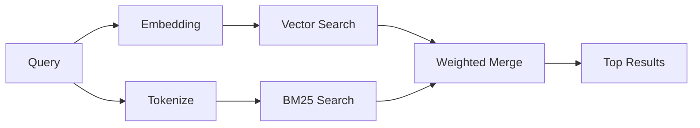

---
read_when:
    - Ви хочете зрозуміти, як працює `memory_search`
    - Ви хочете вибрати постачальника ембедингів
    - Ви хочете налаштувати якість пошуку
summary: Як пошук у пам’яті знаходить релевантні нотатки за допомогою ембедингів і гібридного пошуку
title: Пошук у пам’яті
x-i18n:
    generated_at: "2026-04-25T23:15:06Z"
    model: gpt-5.4
    provider: openai
    source_hash: 95d86fb3efe79aae92f5e3590f1c15fb0d8f3bb3301f8fe9a41f891e290d7a14
    source_path: concepts/memory-search.md
    workflow: 15
---

`memory_search` знаходить релевантні нотатки у ваших файлах пам’яті, навіть коли
формулювання відрізняється від оригінального тексту. Він працює, індексуючи пам’ять у невеликі
фрагменти та шукаючи їх за допомогою ембедингів, ключових слів або обох способів.

## Швидкий старт

Якщо у вас налаштовано підписку GitHub Copilot або API-ключ OpenAI, Gemini, Voyage чи Mistral,
пошук у пам’яті працює автоматично. Щоб явно вказати постачальника:

```json5
{
  agents: {
    defaults: {
      memorySearch: {
        provider: "openai", // або "gemini", "local", "ollama" тощо.
      },
    },
  },
}
```

Для локальних ембедингів без API-ключа встановіть необов’язковий пакет середовища виконання `node-llama-cpp`
поруч з OpenClaw і використовуйте `provider: "local"`.

## Підтримувані постачальники

| Постачальник   | ID               | Потрібен API-ключ | Примітки                                              |
| -------------- | ---------------- | ----------------- | ----------------------------------------------------- |
| Bedrock        | `bedrock`        | Ні                | Визначається автоматично, коли успішно розв’язується ланцюжок облікових даних AWS |
| Gemini         | `gemini`         | Так               | Підтримує індексацію зображень і аудіо                |
| GitHub Copilot | `github-copilot` | Ні                | Визначається автоматично, використовує підписку Copilot |
| Local          | `local`          | Ні                | Модель GGUF, завантаження ~0.6 ГБ                     |
| Mistral        | `mistral`        | Так               | Визначається автоматично                              |
| Ollama         | `ollama`         | Ні                | Локальний, потрібно вказати явно                      |
| OpenAI         | `openai`         | Так               | Визначається автоматично, швидкий                     |
| Voyage         | `voyage`         | Так               | Визначається автоматично                              |

## Як працює пошук

OpenClaw запускає два шляхи пошуку паралельно й об’єднує результати:



- **Векторний пошук** знаходить нотатки зі схожим змістом ("gateway host" відповідає
  "машина, на якій працює OpenClaw").
- **Пошук за ключовими словами BM25** знаходить точні збіги (ID, рядки помилок, ключі
  конфігурації).

Якщо доступний лише один шлях (немає ембедингів або немає FTS), інший не використовується, і пошук виконується лише доступним шляхом.

Коли ембединги недоступні, OpenClaw усе одно використовує лексичне ранжування поверх результатів FTS замість того, щоб повертатися лише до сирого впорядкування за точним збігом. У цьому деградованому режимі підвищуються фрагменти з кращим покриттям термінів запиту та релевантними шляхами до файлів, що зберігає корисну повноту навіть без `sqlite-vec` або постачальника ембедингів.

## Покращення якості пошуку

Дві необов’язкові функції допомагають, коли у вас велика історія нотаток:

### Часове згасання

Старі нотатки поступово втрачають вагу в ранжуванні, тому новіша інформація з’являється першою.
За замовчуванням період напіврозпаду становить 30 днів, тож нотатка з минулого місяця матиме 50% від
своєї початкової ваги. Для постійно актуальних файлів, як-от `MEMORY.md`, згасання ніколи не застосовується.

<Tip>
Увімкніть часове згасання, якщо ваш агент має щоденні нотатки за багато місяців і застаріла
інформація постійно випереджає новіший контекст.
</Tip>

### MMR (різноманітність)

Зменшує кількість надлишкових результатів. Якщо п’ять нотаток усі згадують ту саму конфігурацію маршрутизатора, MMR
гарантує, що верхні результати охоплюватимуть різні теми, а не повторюватимуться.

<Tip>
Увімкніть MMR, якщо `memory_search` постійно повертає майже дубльовані фрагменти з
різних щоденних нотаток.
</Tip>

### Увімкнути обидва

```json5
{
  agents: {
    defaults: {
      memorySearch: {
        query: {
          hybrid: {
            mmr: { enabled: true },
            temporalDecay: { enabled: true },
          },
        },
      },
    },
  },
}
```

## Мультимодальна пам’ять

З Gemini Embedding 2 ви можете індексувати зображення й аудіофайли разом із
Markdown. Пошукові запити залишаються текстовими, але вони зіставляються з візуальним і аудіовмістом. Див. [довідник з конфігурації пам’яті](/uk/reference/memory-config) для
налаштування.

## Пошук у пам’яті сесії

За бажанням ви можете індексувати стенограми сесій, щоб `memory_search` міг згадувати
попередні розмови. Це вмикається явно через
`memorySearch.experimental.sessionMemory`. Докладніше див. у
[довіднику з конфігурації](/uk/reference/memory-config).

## Усунення несправностей

**Немає результатів?** Запустіть `openclaw memory status`, щоб перевірити індекс. Якщо він порожній, виконайте
`openclaw memory index --force`.

**Лише збіги за ключовими словами?** Можливо, ваш постачальник ембедингів не налаштований. Перевірте
`openclaw memory status --deep`.

**Локальні ембединги завершуються за тайм-аутом?** `ollama`, `lmstudio` і `local` за замовчуванням використовують довший
тайм-аут для вбудованих пакетних запитів. Якщо хост просто повільний, задайте
`agents.defaults.memorySearch.sync.embeddingBatchTimeoutSeconds` і знову виконайте
`openclaw memory index --force`.

**Текст CJK не знаходиться?** Перебудуйте індекс FTS за допомогою
`openclaw memory index --force`.

## Подальше читання

- [Active Memory](/uk/concepts/active-memory) -- пам’ять субагента для інтерактивних чат-сесій
- [Пам’ять](/uk/concepts/memory) -- структура файлів, бекенди, інструменти
- [Довідник з конфігурації пам’яті](/uk/reference/memory-config) -- усі параметри конфігурації

## Пов’язане

- [Огляд пам’яті](/uk/concepts/memory)
- [Active Memory](/uk/concepts/active-memory)
- [Вбудований рушій пам’яті](/uk/concepts/memory-builtin)
