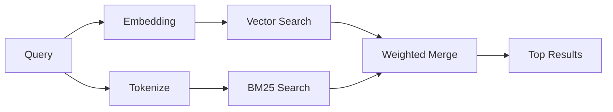

---
read_when:
    - Ви хочете зрозуміти, як працює `memory_search`
    - Ви хочете вибрати provider embeddings
    - Ви хочете налаштувати якість пошуку
summary: Як пошук у пам’яті знаходить релевантні нотатки за допомогою embeddings і гібридного пошуку
title: Пошук у пам’яті
x-i18n:
    generated_at: "2026-04-23T22:58:40Z"
    model: gpt-5.4
    provider: openai
    source_hash: 04db62e519a691316ce40825c082918094bcaa9c36042cc8101c6504453d238e
    source_path: concepts/memory-search.md
    workflow: 15
---

`memory_search` знаходить релевантні нотатки з ваших файлів пам’яті, навіть коли
формулювання відрізняється від оригінального тексту. Це працює шляхом індексації пам’яті на невеликі
фрагменти та пошуку по них за допомогою embeddings, ключових слів або обох підходів.

## Швидкий старт

Якщо у вас налаштовано підписку GitHub Copilot, API-ключ OpenAI, Gemini, Voyage або Mistral,
пошук у пам’яті працює автоматично. Щоб явно вказати provider:

```json5
{
  agents: {
    defaults: {
      memorySearch: {
        provider: "openai", // or "gemini", "local", "ollama", etc.
      },
    },
  },
}
```

Для локальних embeddings без API-ключа використовуйте `provider: "local"` (потрібен
node-llama-cpp).

## Підтримувані providers

| Provider       | ID               | Needs API key | Notes                                                |
| -------------- | ---------------- | ------------- | ---------------------------------------------------- |
| Bedrock        | `bedrock`        | No            | Визначається автоматично, коли ланцюжок облікових даних AWS успішно розв’язується |
| Gemini         | `gemini`         | Yes           | Підтримує індексацію зображень/аудіо                 |
| GitHub Copilot | `github-copilot` | No            | Визначається автоматично, використовує підписку Copilot |
| Local          | `local`          | No            | Модель GGUF, завантаження ~0.6 GB                    |
| Mistral        | `mistral`        | Yes           | Визначається автоматично                             |
| Ollama         | `ollama`         | No            | Локальний, потрібно вказати явно                     |
| OpenAI         | `openai`         | Yes           | Визначається автоматично, швидкий                    |
| Voyage         | `voyage`         | Yes           | Визначається автоматично                             |

## Як працює пошук

OpenClaw запускає два шляхи пошуку паралельно та об’єднує результати:



- **Векторний пошук** знаходить нотатки зі схожим змістом (`"gateway host"` відповідає
  `"the machine running OpenClaw"`).
- **Пошук за ключовими словами BM25** знаходить точні збіги (ID, рядки помилок, ключі
  конфігурації).

Якщо доступний лише один шлях (немає embeddings або немає FTS), інший працює окремо.

Коли embeddings недоступні, OpenClaw усе одно використовує лексичне ранжування поверх результатів FTS замість повернення лише до сирого впорядкування за точним збігом. Цей деградований режим підсилює фрагменти з кращим покриттям термінів запиту та релевантними шляхами до файлів, що зберігає корисну повноту навіть без `sqlite-vec` або provider embeddings.

## Покращення якості пошуку

Дві необов’язкові функції допомагають, коли у вас велика історія нотаток:

### Часове згасання

Старі нотатки поступово втрачають вагу в ранжуванні, тому новіша інформація з’являється першою.
Із типовим періодом напіврозпаду в 30 днів нотатка минулого місяця матиме 50% від
своєї початкової ваги. Файли постійної актуальності, як-от `MEMORY.md`, ніколи не згасають.

<Tip>
Увімкніть часове згасання, якщо ваш агент має місяці щоденних нотаток і застаріла
інформація постійно випереджає нещодавній контекст.
</Tip>

### MMR (різноманітність)

Зменшує надлишкові результати. Якщо п’ять нотаток згадують ту саму конфігурацію роутера, MMR
забезпечує, щоб верхні результати охоплювали різні теми, а не повторювалися.

<Tip>
Увімкніть MMR, якщо `memory_search` постійно повертає майже дубльовані фрагменти з
різних щоденних нотаток.
</Tip>

### Увімкнути обидві

```json5
{
  agents: {
    defaults: {
      memorySearch: {
        query: {
          hybrid: {
            mmr: { enabled: true },
            temporalDecay: { enabled: true },
          },
        },
      },
    },
  },
}
```

## Мультимодальна пам’ять

З Gemini Embedding 2 ви можете індексувати зображення та аудіофайли разом із
Markdown. Пошукові запити залишаються текстовими, але зіставляються з візуальним і аудіовмістом. Див. [довідник із конфігурації пам’яті](/uk/reference/memory-config) для
налаштування.

## Пошук у пам’яті сесії

За бажанням ви можете індексувати транскрипти сесій, щоб `memory_search` міг згадувати
попередні розмови. Це вмикається явно через
`memorySearch.experimental.sessionMemory`. Див.
[довідник із конфігурації](/uk/reference/memory-config) для подробиць.

## Усунення несправностей

**Немає результатів?** Запустіть `openclaw memory status`, щоб перевірити індекс. Якщо він порожній, запустіть
`openclaw memory index --force`.

**Лише збіги за ключовими словами?** Можливо, provider embeddings не налаштовано. Перевірте
`openclaw memory status --deep`.

**Не знаходиться текст CJK?** Перебудуйте індекс FTS за допомогою
`openclaw memory index --force`.

## Додаткове читання

- [Active Memory](/uk/concepts/active-memory) -- пам’ять субагента для інтерактивних сеансів чату
- [Пам’ять](/uk/concepts/memory) -- макет файлів, бекенди, інструменти
- [Довідник із конфігурації пам’яті](/uk/reference/memory-config) -- усі параметри конфігурації

## Пов’язане

- [Огляд пам’яті](/uk/concepts/memory)
- [Active Memory](/uk/concepts/active-memory)
- [Вбудований рушій пам’яті](/uk/concepts/memory-builtin)
