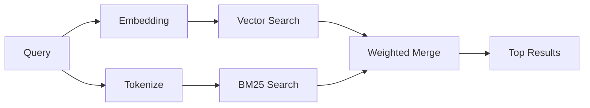

---
read_when:
    - Ви хочете зрозуміти, як працює `memory_search`
    - Ви хочете вибрати постачальника ембедингів
    - Ви хочете налаштувати якість пошуку
summary: Як пошук у пам’яті знаходить релевантні нотатки за допомогою ембедингів і гібридного пошуку
title: Пошук у пам’яті
x-i18n:
    generated_at: "2026-04-25T07:28:37Z"
    model: gpt-5.4
    provider: openai
    source_hash: 5cc6bbaf7b0a755bbe44d3b1b06eed7f437ebdc41a81c48cca64bd08bbc546b7
    source_path: concepts/memory-search.md
    workflow: 15
---

`memory_search` знаходить релевантні нотатки з ваших файлів пам’яті, навіть коли
формулювання відрізняється від оригінального тексту. Це працює шляхом індексації пам’яті на малі
фрагменти та пошуку в них за допомогою ембедингів, ключових слів або обох підходів.

## Швидкий старт

Якщо у вас налаштовано підписку GitHub Copilot, ключ API OpenAI, Gemini, Voyage або Mistral,
пошук у пам’яті працює автоматично. Щоб явно вказати постачальника:

```json5
{
  agents: {
    defaults: {
      memorySearch: {
        provider: "openai", // or "gemini", "local", "ollama", etc.
      },
    },
  },
}
```

Для локальних ембедингів без ключа API встановіть необов’язковий пакет середовища виконання `node-llama-cpp`
поруч з OpenClaw і використовуйте `provider: "local"`.

## Підтримувані постачальники

| Постачальник   | ID               | Потребує ключ API | Примітки                                             |
| -------------- | ---------------- | ----------------- | ---------------------------------------------------- |
| Bedrock        | `bedrock`        | Ні                | Визначається автоматично, коли ланцюжок облікових даних AWS розв’язується |
| Gemini         | `gemini`         | Так               | Підтримує індексацію зображень/аудіо                 |
| GitHub Copilot | `github-copilot` | Ні                | Визначається автоматично, використовує підписку Copilot |
| Local          | `local`          | Ні                | Модель GGUF, завантаження ~0.6 GB                    |
| Mistral        | `mistral`        | Так               | Визначається автоматично                             |
| Ollama         | `ollama`         | Ні                | Локальний, потрібно вказати явно                     |
| OpenAI         | `openai`         | Так               | Визначається автоматично, швидкий                    |
| Voyage         | `voyage`         | Так               | Визначається автоматично                             |

## Як працює пошук

OpenClaw запускає два шляхи пошуку паралельно й об’єднує результати:



- **Векторний пошук** знаходить нотатки зі схожим змістом ("gateway host" відповідає
  "машина, на якій працює OpenClaw").
- **Пошук за ключовими словами BM25** знаходить точні збіги (ID, рядки помилок, ключі
  конфігурації).

Якщо доступний лише один шлях (немає ембедингів або немає FTS), окремо запускається лише він.

Коли ембединги недоступні, OpenClaw усе одно використовує лексичне ранжування за результатами FTS замість того, щоб повертатися лише до сирого впорядкування за точним збігом. У цьому деградованому режимі підвищуються фрагменти з кращим покриттям термінів запиту та релевантними шляхами файлів, що зберігає корисну повноту навіть без `sqlite-vec` або постачальника ембедингів.

## Покращення якості пошуку

Дві необов’язкові функції допомагають, якщо у вас велика історія нотаток:

### Часовий спад

Старі нотатки поступово втрачають вагу в ранжуванні, щоб новіша інформація з’являлася першою.
Із типовим періодом напіврозпаду 30 днів нотатка з минулого місяця матиме 50% від
своєї початкової ваги. Для evergreen-файлів, таких як `MEMORY.md`, спад ніколи не застосовується.

<Tip>
Увімкніть часовий спад, якщо ваш агент має щоденні нотатки за кілька місяців і застаріла
інформація постійно випереджає недавній контекст.
</Tip>

### MMR (різноманітність)

Зменшує кількість повторюваних результатів. Якщо п’ять нотаток згадують одну й ту саму конфігурацію маршрутизатора, MMR
гарантує, що верхні результати охоплюють різні теми замість повторів.

<Tip>
Увімкніть MMR, якщо `memory_search` постійно повертає майже однакові фрагменти з
різних щоденних нотаток.
</Tip>

### Увімкнути обидва

```json5
{
  agents: {
    defaults: {
      memorySearch: {
        query: {
          hybrid: {
            mmr: { enabled: true },
            temporalDecay: { enabled: true },
          },
        },
      },
    },
  },
}
```

## Мультимодальна пам’ять

З Gemini Embedding 2 ви можете індексувати зображення та аудіофайли разом із
Markdown. Пошукові запити залишаються текстовими, але вони зіставляються з візуальним і аудіовмістом. Див. [довідник конфігурації Memory](/uk/reference/memory-config) для
налаштування.

## Пошук у пам’яті сесії

За бажанням ви можете індексувати транскрипти сесій, щоб `memory_search` міг згадувати
попередні розмови. Це вмикається через
`memorySearch.experimental.sessionMemory`. Докладніше див. у
[довіднику з конфігурації](/uk/reference/memory-config).

## Усунення проблем

**Немає результатів?** Виконайте `openclaw memory status`, щоб перевірити індекс. Якщо він порожній, виконайте
`openclaw memory index --force`.

**Лише збіги за ключовими словами?** Можливо, ваш постачальник ембедингів не налаштований. Перевірте
`openclaw memory status --deep`.

**Не знаходиться текст CJK?** Перебудуйте індекс FTS за допомогою
`openclaw memory index --force`.

## Подальше читання

- [Active Memory](/uk/concepts/active-memory) -- пам’ять субагента для інтерактивних чат-сесій
- [Memory](/uk/concepts/memory) -- структура файлів, бекенди, інструменти
- [Довідник конфігурації Memory](/uk/reference/memory-config) -- усі параметри конфігурації

## Пов’язане

- [Огляд Memory](/uk/concepts/memory)
- [Огляд Active Memory](/uk/concepts/active-memory)
- [Вбудований рушій пам’яті](/uk/concepts/memory-builtin)
