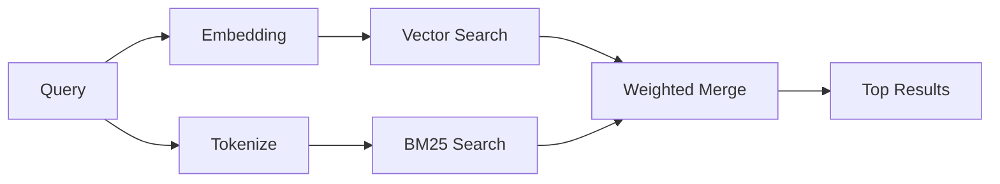

---
read_when:
    - Ви хочете зрозуміти, як працює memory_search
    - Ви хочете вибрати провайдера embeddings
    - Ви хочете налаштувати якість пошуку
summary: Як memory search знаходить релевантні нотатки за допомогою embeddings і гібридного пошуку
title: Пошук у пам’яті
x-i18n:
    generated_at: "2026-04-05T18:01:12Z"
    model: gpt-5.4
    provider: openai
    source_hash: 87b1cb3469c7805f95bca5e77a02919d1e06d626ad3633bbc5465f6ab9db12a2
    source_path: concepts/memory-search.md
    workflow: 15
---

# Пошук у пам’яті

`memory_search` знаходить релевантні нотатки з ваших файлів пам’яті, навіть якщо
формулювання відрізняється від оригінального тексту. Він працює, індексуючи пам’ять у невеликі
фрагменти та шукаючи в них за допомогою embeddings, ключових слів або обох підходів.

## Швидкий старт

Якщо у вас налаштовано API-ключ OpenAI, Gemini, Voyage або Mistral, пошук у пам’яті
працює автоматично. Щоб явно вказати провайдера:

```json5
{
  agents: {
    defaults: {
      memorySearch: {
        provider: "openai", // or "gemini", "local", "ollama", etc.
      },
    },
  },
}
```

Для локальних embeddings без API-ключа використовуйте `provider: "local"` (потрібен
node-llama-cpp).

## Підтримувані провайдери

| Провайдер | ID        | Потрібен API-ключ | Примітки                         |
| --------- | --------- | ----------------- | -------------------------------- |
| OpenAI    | `openai`  | Так               | Автовиявлення, швидко            |
| Gemini    | `gemini`  | Так               | Підтримує індексування зображень/аудіо |
| Voyage    | `voyage`  | Так               | Автовиявлення                    |
| Mistral   | `mistral` | Так               | Автовиявлення                    |
| Ollama    | `ollama`  | Ні                | Локальний, потрібно вказати явно |
| Local     | `local`   | Ні                | Модель GGUF, завантаження ~0.6 ГБ |

## Як працює пошук

OpenClaw запускає два шляхи пошуку паралельно й об’єднує результати:



- **Векторний пошук** знаходить нотатки зі схожим змістом («gateway host» відповідає
  «машина, на якій працює OpenClaw»).
- **Пошук за ключовими словами BM25** знаходить точні збіги (ID, рядки помилок, ключі
  конфігурації).

Якщо доступний лише один шлях (немає embeddings або FTS), окремо працює лише він.

## Поліпшення якості пошуку

Дві необов’язкові функції допомагають, коли у вас велика історія нотаток:

### Temporal decay

Старі нотатки поступово втрачають вагу в ранжуванні, щоб новіша інформація піднімалася вище.
Із типовим періодом напіврозпаду 30 днів нотатка з минулого місяця матиме 50% від
своєї початкової ваги. Evergreen-файли на кшталт `MEMORY.md` ніколи не піддаються зниженню ваги.

<Tip>
Увімкніть temporal decay, якщо ваш агент має щоденні нотатки за багато місяців і застаріла
інформація постійно випереджає недавній контекст.
</Tip>

### MMR (різноманітність)

Зменшує кількість повторюваних результатів. Якщо п’ять нотаток згадують ту саму конфігурацію роутера, MMR
гарантує, що верхні результати охоплюватимуть різні теми замість повторень.

<Tip>
Увімкніть MMR, якщо `memory_search` постійно повертає майже однакові фрагменти з
різних щоденних нотаток.
</Tip>

### Увімкнення обох

```json5
{
  agents: {
    defaults: {
      memorySearch: {
        query: {
          hybrid: {
            mmr: { enabled: true },
            temporalDecay: { enabled: true },
          },
        },
      },
    },
  },
}
```

## Мультимодальна пам’ять

З Gemini Embedding 2 ви можете індексувати зображення та аудіофайли разом із
Markdown. Пошукові запити лишаються текстовими, але зіставляються з візуальним та аудіовмістом. Див. [довідник конфігурації пам’яті](/reference/memory-config) для
налаштування.

## Пошук у пам’яті сесій

За бажанням ви можете індексувати транскрипти сесій, щоб `memory_search` міг пригадувати
попередні розмови. Це вмикається окремо через
`memorySearch.experimental.sessionMemory`. Докладніше див. у
[довіднику конфігурації](/reference/memory-config).

## Усунення несправностей

**Немає результатів?** Виконайте `openclaw memory status`, щоб перевірити індекс. Якщо він порожній, запустіть
`openclaw memory index --force`.

**Лише збіги за ключовими словами?** Можливо, ваш провайдер embeddings не налаштований. Перевірте
`openclaw memory status --deep`.

**Не знаходиться текст CJK?** Перебудуйте індекс FTS за допомогою
`openclaw memory index --force`.

## Додаткове читання

- [Пам’ять](/concepts/memory) -- структура файлів, бекенди, інструменти
- [Довідник конфігурації пам’яті](/reference/memory-config) -- усі параметри конфігурації
