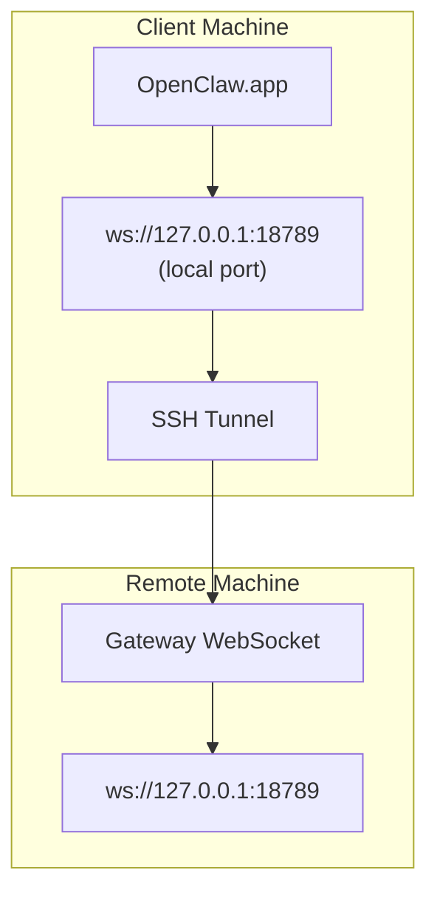

> Цей вміст об’єднано в [Віддалений доступ](/gateway/remote#macos-persistent-ssh-tunnel-via-launchagent). Поточний посібник див. на цій сторінці.

# Запуск OpenClaw.app із віддаленим Gateway

OpenClaw.app використовує SSH-тунелювання для підключення до віддаленого gateway. У цьому посібнику показано, як це налаштувати.

## Огляд



## Швидке налаштування

### Крок 1: Додайте конфігурацію SSH

Відредагуйте `~/.ssh/config` і додайте:

```ssh
Host remote-gateway
    HostName <REMOTE_IP>          # e.g., 172.27.187.184
    User <REMOTE_USER>            # e.g., jefferson
    LocalForward 18789 127.0.0.1:18789
    IdentityFile ~/.ssh/id_rsa
```

Замініть `<REMOTE_IP>` і `<REMOTE_USER>` на свої значення.

### Крок 2: Скопіюйте SSH-ключ

Скопіюйте свій публічний ключ на віддалену машину (введіть пароль один раз):

```bash
ssh-copy-id -i ~/.ssh/id_rsa <REMOTE_USER>@<REMOTE_IP>
```

### Крок 3: Налаштуйте автентифікацію віддаленого Gateway

```bash
openclaw config set gateway.remote.token "<your-token>"
```

Використовуйте `gateway.remote.password`, якщо ваш віддалений gateway використовує автентифікацію паролем.
`OPENCLAW_GATEWAY_TOKEN` усе ще дійсний як перевизначення на рівні shell, але
для постійного налаштування віддаленого клієнта слід використовувати `gateway.remote.token` / `gateway.remote.password`.

### Крок 4: Запустіть SSH-тунель

```bash
ssh -N remote-gateway &
```

### Крок 5: Перезапустіть OpenClaw.app

```bash
# Quit OpenClaw.app (⌘Q), then reopen:
open /path/to/OpenClaw.app
```

Тепер застосунок підключатиметься до віддаленого gateway через SSH-тунель.

---

## Автоматичний запуск тунелю під час входу

Щоб SSH-тунель автоматично запускався, коли ви входите в систему, створіть Launch Agent.

### Створіть файл PLIST

Збережіть це як `~/Library/LaunchAgents/ai.openclaw.ssh-tunnel.plist`:

```xml
<?xml version="1.0" encoding="UTF-8"?>
<!DOCTYPE plist PUBLIC "-//Apple//DTD PLIST 1.0//EN" "http://www.apple.com/DTDs/PropertyList-1.0.dtd">
<plist version="1.0">
<dict>
    <key>Label</key>
    <string>ai.openclaw.ssh-tunnel</string>
    <key>ProgramArguments</key>
    <array>
        <string>/usr/bin/ssh</string>
        <string>-N</string>
        <string>remote-gateway</string>
    </array>
    <key>KeepAlive</key>
    <true/>
    <key>RunAtLoad</key>
    <true/>
</dict>
</plist>
```

### Завантажте Launch Agent

```bash
launchctl bootstrap gui/$UID ~/Library/LaunchAgents/ai.openclaw.ssh-tunnel.plist
```

Тепер тунель:

- Автоматично запускатиметься, коли ви входите в систему
- Перезапускатиметься в разі збою
- Працюватиме у фоновому режимі

Примітка щодо застарілого: видаліть будь-який залишковий LaunchAgent `com.openclaw.ssh-tunnel`, якщо він присутній.

---

## Усунення несправностей

**Перевірте, чи запущено тунель:**

```bash
ps aux | grep "ssh -N remote-gateway" | grep -v grep
lsof -i :18789
```

**Перезапустіть тунель:**

```bash
launchctl kickstart -k gui/$UID/ai.openclaw.ssh-tunnel
```

**Зупиніть тунель:**

```bash
launchctl bootout gui/$UID/ai.openclaw.ssh-tunnel
```

---

## Як це працює

| Компонент                            | Що він робить                                               |
| ------------------------------------ | ----------------------------------------------------------- |
| `LocalForward 18789 127.0.0.1:18789` | Переспрямовує локальний порт 18789 на віддалений порт 18789 |
| `ssh -N`                             | SSH без виконання віддалених команд (лише переспрямування портів) |
| `KeepAlive`                          | Автоматично перезапускає тунель у разі збою                 |
| `RunAtLoad`                          | Запускає тунель, коли агент завантажується                  |

OpenClaw.app підключається до `ws://127.0.0.1:18789` на вашій клієнтській машині. SSH-тунель переспрямовує це підключення на порт 18789 віддаленої машини, де запущено Gateway.
