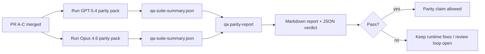

---
x-i18n:
    generated_at: "2026-04-11T13:24:07Z"
    model: gpt-5.4
    provider: openai
    source_hash: 910bcf7668becf182ef48185b43728bf2fa69629d6d50189d47d47b06f807a9e
    source_path: help/gpt54-codex-agentic-parity-maintainers.md
    workflow: 15
---

# Нотатки для супроводжувачів щодо паритету GPT-5.4 / Codex

У цій нотатці пояснюється, як розглядати програму паритету GPT-5.4 / Codex як чотири одиниці злиття, не втрачаючи при цьому початкову архітектуру з шести контрактів.

## Одиниці злиття

### PR A: суворе agentic-виконання

Володіє:

- `executionContract`
- GPT-5-first same-turn follow-through
- `update_plan` як нетермінальне відстеження прогресу
- явні заблоковані стани замість тихих зупинок лише через план

Не володіє:

- класифікацією збоїв автентифікації/середовища виконання
- правдивістю щодо дозволів
- переробкою повтору/продовження
- бенчмаркінгом паритету

### PR B: правдивість середовища виконання

Володіє:

- коректністю Codex OAuth scope
- типізованою класифікацією збоїв провайдера/середовища виконання
- правдивою доступністю `/elevated full` і причинами блокування

Не володіє:

- нормалізацією схем інструментів
- станом повтору/живучості
- керуванням бенчмарком

### PR C: коректність виконання

Володіє:

- сумісністю інструментів OpenAI/Codex, що належить провайдеру
- суворою обробкою схем без параметрів
- відображенням replay-invalid
- видимістю станів paused, blocked і abandoned для довготривалих завдань

Не володіє:

- самостійно обраним продовженням
- загальною поведінкою діалекту Codex поза хуками провайдера
- керуванням бенчмарком

### PR D: harness паритету

Володіє:

- першим пакетом сценаріїв GPT-5.4 vs Opus 4.6
- документацією щодо паритету
- механікою звіту про паритет і release-gate

Не володіє:

- змінами поведінки середовища виконання поза QA-lab
- симуляцією auth/proxy/DNS усередині harness

## Відображення назад до початкових шести контрактів

| Початковий контракт                     | Одиниця злиття |
| --------------------------------------- | -------------- |
| Коректність транспорту/автентифікації провайдера | PR B           |
| Сумісність контракту/схеми інструментів | PR C           |
| Виконання в тому ж ході                 | PR A           |
| Правдивість щодо дозволів               | PR B           |
| Коректність повтору/продовження/живучості | PR C         |
| Бенчмарк/release gate                   | PR D           |

## Порядок рев’ю

1. PR A
2. PR B
3. PR C
4. PR D

PR D — це доказовий шар. Він не повинен бути причиною, через яку затримуються PR з коректністю середовища виконання.

## На що звертати увагу

### PR A

- GPT-5 runs виконують дію або завершуються з fail closed, а не зупиняються на коментарі
- `update_plan` більше не виглядає як прогрес сам по собі
- поведінка лишається GPT-5-first і scoped для embedded-Pi

### PR B

- збої auth/proxy/runtime більше не зводяться до загальної обробки “model failed”
- `/elevated full` описується як доступний лише тоді, коли він справді доступний
- причини блокування видимі як моделі, так і user-facing runtime

### PR C

- сувора реєстрація інструментів OpenAI/Codex поводиться передбачувано
- інструменти без параметрів не провалюють перевірки strict schema
- результати replay і compaction зберігають правдивий стан живучості

### PR D

- пакет сценаріїв зрозумілий і відтворюваний
- пакет включає mutating replay-safety lane, а не лише read-only flows
- звіти читабельні для людей і автоматизації
- твердження про паритет підкріплені доказами, а не анекдотичні

Очікувані артефакти від PR D:

- `qa-suite-report.md` / `qa-suite-summary.json` для кожного запуску моделі
- `qa-agentic-parity-report.md` з агрегованим порівнянням і порівнянням на рівні сценаріїв
- `qa-agentic-parity-summary.json` з машиночитним вердиктом

## Release gate

Не стверджуйте про паритет GPT-5.4 або його перевагу над Opus 4.6, доки:

- PR A, PR B і PR C не злиті
- PR D не запускає перший пакет сценаріїв паритету без помилок
- регресійні набори runtime-truthfulness лишаються зеленими
- звіт про паритет не показує випадків fake-success і регресій у поведінці зупинки

harness паритету — не єдине джерело доказів. Під час рев’ю чітко зберігайте цей поділ:

- PR D володіє порівнянням GPT-5.4 vs Opus 4.6 на основі сценаріїв
- детерміновані набори PR B і далі володіють доказами щодо auth/proxy/DNS і правдивості full-access

## Відображення цілі до доказів

| Елемент completion gate                  | Основний власник | Артефакт рев’ю                                                      |
| ---------------------------------------- | ---------------- | ------------------------------------------------------------------- |
| Жодних зупинок лише на плані             | PR A             | strict-agentic runtime tests і `approval-turn-tool-followthrough`   |
| Жодного фальшивого прогресу чи фальшивого завершення інструменту | PR A + PR D | кількість fake-success у паритеті плюс деталі звіту на рівні сценаріїв |
| Жодних хибних підказок `/elevated full`  | PR B             | детерміновані набори runtime-truthfulness                           |
| Збої replay/liveness лишаються явними    | PR C + PR D      | набори lifecycle/replay плюс `compaction-retry-mutating-tool`       |
| GPT-5.4 відповідає Opus 4.6 або перевершує його | PR D      | `qa-agentic-parity-report.md` і `qa-agentic-parity-summary.json`    |

## Скорочення для рев’ю: до vs після

| Видима користувачу проблема до змін                     | Сигнал під час рев’ю після змін                                                         |
| ------------------------------------------------------- | --------------------------------------------------------------------------------------- |
| GPT-5.4 зупинявся після планування                      | PR A показує поведінку act-or-block замість завершення лише на коментарі               |
| Використання інструментів здавалося крихким із суворими схемами OpenAI/Codex | PR C зберігає передбачуваність реєстрації інструментів і викликів без параметрів |
| Підказки `/elevated full` іноді вводили в оману         | PR B прив’язує підказки до реальних можливостей runtime і причин блокування             |
| Довгі завдання могли зникати в неоднозначності replay/compaction | PR C видає явний стан paused, blocked, abandoned і replay-invalid              |
| Твердження про паритет були анекдотичними               | PR D створює звіт і JSON verdict з однаковим покриттям сценаріїв для обох моделей |
