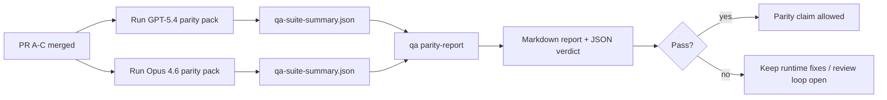

---
read_when:
    - Перевірка серії PR для паритету GPT-5.4 / Codex
    - Підтримка агентної архітектури з шести контрактів, що лежить в основі програми паритету
summary: Як перевірити програму паритету GPT-5.4 / Codex як чотири одиниці злиття
title: Нотатки супроводжувача щодо паритету GPT-5.4 / Codex
x-i18n:
    generated_at: "2026-04-24T04:14:35Z"
    model: gpt-5.4
    provider: openai
    source_hash: 803b62bf5bb6b00125f424fa733e743ecdec7f8410dec0782096f9d1ddbed6c0
    source_path: help/gpt54-codex-agentic-parity-maintainers.md
    workflow: 15
---

Ця нотатка пояснює, як перевіряти програму паритету GPT-5.4 / Codex як чотири одиниці злиття, не втрачаючи початкову архітектуру з шести контрактів.

## Одиниці злиття

### PR A: суворе агентне виконання

Володіє:

- `executionContract`
- виконанням GPT-5-first у тому самому ході
- `update_plan` як нетермінальним відстеженням поступу
- явними заблокованими станами замість тихих зупинок лише на рівні плану

Не володіє:

- класифікацією збоїв автентифікації/runtime
- правдивістю щодо дозволів
- переробкою replay/continuation
- бенчмаркінгом паритету

### PR B: правдивість runtime

Володіє:

- коректністю OAuth scope Codex
- типізованою класифікацією збоїв provider/runtime
- правдивою доступністю `/elevated full` і причинами блокування

Не володіє:

- нормалізацією схем інструментів
- станом replay/liveness
- бенчмарк-гейтінгом

### PR C: коректність виконання

Володіє:

- сумісністю інструментів OpenAI/Codex, що належить provider
- обробкою суворих схем без параметрів
- відображенням replay-invalid
- видимістю станів paused, blocked і abandoned для довгих завдань

Не володіє:

- самостійно обраним continuation
- загальною поведінкою діалекту Codex поза хуками provider
- бенчмарк-гейтінгом

### PR D: каркас паритету

Володіє:

- першим пакетом сценаріїв GPT-5.4 vs Opus 4.6
- документацією паритету
- механікою звіту паритету та release gate

Не володіє:

- змінами поведінки runtime поза QA-lab
- симуляцією auth/proxy/DNS усередині каркаса

## Відображення назад до початкових шести контрактів

| Початковий контракт                     | Одиниця злиття |
| --------------------------------------- | -------------- |
| Коректність транспорту/автентифікації provider | PR B           |
| Сумісність контракту/схеми інструментів | PR C           |
| Виконання в тому самому ході            | PR A           |
| Правдивість щодо дозволів               | PR B           |
| Коректність replay/continuation/liveness | PR C          |
| Бенчмарк/release gate                   | PR D           |

## Порядок перевірки

1. PR A
2. PR B
3. PR C
4. PR D

PR D — це рівень доказів. Він не має бути причиною затримки PR із коректністю runtime.

## На що звертати увагу

### PR A

- запуски GPT-5 діють або безпечно завершуються з блокуванням, а не зупиняються на коментарі
- `update_plan` більше не виглядає як поступ сам по собі
- поведінка лишається GPT-5-first і обмеженою embedded-Pi

### PR B

- збої auth/proxy/runtime перестають зливатися в загальну обробку “model failed”
- `/elevated full` описується як доступний лише тоді, коли він справді доступний
- причини блокування видимі і для моделі, і для runtime, орієнтованого на користувача

### PR C

- сувора реєстрація інструментів OpenAI/Codex поводиться передбачувано
- інструменти без параметрів не провалюють перевірки суворої схеми
- результати replay і Compaction зберігають правдивий стан liveness

### PR D

- пакет сценаріїв зрозумілий і відтворюваний
- пакет включає lane безпеки replay зі змінами стану, а не лише read-only потоки
- звіти читабельні і для людей, і для автоматизації
- твердження про паритет підкріплені доказами, а не анекдотичні

Очікувані артефакти від PR D:

- `qa-suite-report.md` / `qa-suite-summary.json` для кожного запуску моделі
- `qa-agentic-parity-report.md` з агрегованим порівнянням і порівнянням на рівні сценаріїв
- `qa-agentic-parity-summary.json` з машиночитаним вердиктом

## Release gate

Не стверджуйте паритет або перевагу GPT-5.4 над Opus 4.6, доки:

- PR A, PR B і PR C не злиті
- PR D не виконає чисто першу хвилю пакета паритету
- набори регресійних тестів правдивості runtime залишаються зеленими
- звіт про паритет не показує фальшиво-успішних випадків і регресій у поведінці зупинки

Каркас паритету — не єдине джерело доказів. Під час перевірки зберігайте цей поділ явним:

- PR D володіє порівнянням GPT-5.4 vs Opus 4.6 на основі сценаріїв
- детерміновані набори PR B і далі володіють доказами для auth/proxy/DNS і правдивості повного доступу

## Відображення цілей на докази

| Елемент completion gate                  | Основний власник | Артефакт перевірки                                                  |
| ---------------------------------------- | ---------------- | ------------------------------------------------------------------- |
| Немає зупинок лише на плані              | PR A             | тести runtime strict-agentic і `approval-turn-tool-followthrough`   |
| Немає фальшивого поступу або фальшивого завершення інструмента | PR A + PR D | кількість фальшивих успіхів паритету плюс деталі звіту на рівні сценаріїв |
| Немає хибних підказок `/elevated full`   | PR B             | детерміновані набори перевірок правдивості runtime                  |
| Збої replay/liveness лишаються явними    | PR C + PR D      | набори lifecycle/replay плюс `compaction-retry-mutating-tool`       |
| GPT-5.4 відповідає або перевершує Opus 4.6 | PR D           | `qa-agentic-parity-report.md` і `qa-agentic-parity-summary.json`    |

## Скорочений огляд для рецензента: до vs після

| Видима користувачу проблема до                              | Сигнал перевірки після                                                                  |
| ----------------------------------------------------------- | --------------------------------------------------------------------------------------- |
| GPT-5.4 зупинявся після планування                          | PR A показує поведінку діяти-або-блокуватись замість завершення лише коментарем         |
| Використання інструментів здавалося крихким із суворими схемами OpenAI/Codex | PR C зберігає передбачуваність реєстрації інструментів і викликів без параметрів |
| Підказки `/elevated full` іноді вводили в оману             | PR B прив’язує підказки до реальних можливостей runtime і причин блокування            |
| Довгі завдання могли зникати в неоднозначності replay/Compaction | PR C показує явний стан paused, blocked, abandoned і replay-invalid                |
| Твердження про паритет були анекдотичними                   | PR D створює звіт плюс JSON-вердикт з однаковим покриттям сценаріїв для обох моделей    |

## Пов’язане

- [Агентний паритет GPT-5.4 / Codex](/uk/help/gpt54-codex-agentic-parity)
