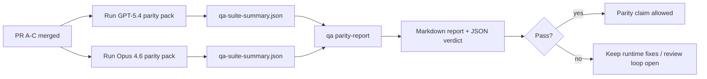

---
read_when:
    - Перегляд серії PR паритету GPT-5.4 / Codex
    - Підтримка шестиконтрактної агентної архітектури, що лежить в основі програми паритету
summary: Як переглянути програму паритету GPT-5.4 / Codex як чотири одиниці злиття
title: Примітки супровідника паритету GPT-5.4 / Codex
x-i18n:
    generated_at: "2026-04-25T10:35:04Z"
    model: gpt-5.4
    provider: openai
    source_hash: 162ea68476880d4dbf9b8c3b9397a51a2732c3eb10ac52e421a9c9d90e04eec2
    source_path: help/gpt54-codex-agentic-parity-maintainers.md
    workflow: 15
---

Ця примітка пояснює, як переглядати програму паритету GPT-5.4 / Codex як чотири одиниці злиття, не втрачаючи початкову шестиконтрактну архітектуру.

## Одиниці злиття

### PR A: суворе агентне виконання

Відповідає за:

- `executionContract`
- GPT-5-first same-turn follow-through
- `update_plan` як нетермінальне відстеження прогресу
- явні заблоковані стани замість мовчазних зупинок лише з планом

Не відповідає за:

- класифікацію збоїв auth/runtime
- правдивість permission
- перероблення replay/continuation
- бенчмаркінг паритету

### PR B: правдивість runtime

Відповідає за:

- коректність OAuth scope у Codex
- типізовану класифікацію збоїв provider/runtime
- правдиву доступність `/elevated full` і причини блокування

Не відповідає за:

- нормалізацію схем інструментів
- стан replay/liveness
- benchmark gating

### PR C: коректність виконання

Відповідає за:

- сумісність інструментів OpenAI/Codex, що належить provider
- сувору обробку схем без параметрів
- відображення replay-invalid
- видимість станів paused, blocked і abandoned для довгих завдань

Не відповідає за:

- самостійно обране continuation
- загальну поведінку діалекту Codex поза provider hooks
- benchmark gating

### PR D: набір засобів паритету

Відповідає за:

- першу хвилю набору сценаріїв GPT-5.4 vs Opus 4.6
- документацію паритету
- механіку звіту про паритет і release gate

Не відповідає за:

- зміни поведінки runtime поза QA-lab
- симуляцію auth/proxy/DNS усередині набору засобів

## Відображення назад до початкових шести контрактів

| Початковий контракт                      | Одиниця злиття |
| ---------------------------------------- | -------------- |
| Коректність provider transport/auth      | PR B           |
| Сумісність контрактів/схем інструментів  | PR C           |
| Виконання в межах того самого ходу       | PR A           |
| Правдивість permission                   | PR B           |
| Коректність replay/continuation/liveness | PR C           |
| Benchmark/release gate                   | PR D           |

## Порядок перегляду

1. PR A
2. PR B
3. PR C
4. PR D

PR D — це рівень доказовості. Він не повинен бути причиною, через яку затримуються PR із коректністю runtime.

## На що звертати увагу

### PR A

- запуски GPT-5 виконують дію або завершуються у безпечний спосіб, а не зупиняються на коментарі
- `update_plan` більше не виглядає як прогрес сам по собі
- поведінка залишається GPT-5-first і обмеженою embedded-Pi

### PR B

- збої auth/proxy/runtime перестають зводитися до загальної обробки “model failed”
- `/elevated full` описується як доступний лише тоді, коли він справді доступний
- причини блокування видимі і моделі, і runtime, видимому для користувача

### PR C

- сувора реєстрація інструментів OpenAI/Codex поводиться передбачувано
- інструменти без параметрів не провалюють перевірки суворої схеми
- результати replay і Compaction зберігають правдивий стан liveness

### PR D

- набір сценаріїв зрозумілий і відтворюваний
- набір містить маршрут mutating replay-safety, а не лише read-only потоки
- звіти читабельні для людей і автоматизації
- твердження про паритет підтверджені доказами, а не анекдотичні

Очікувані артефакти від PR D:

- `qa-suite-report.md` / `qa-suite-summary.json` для кожного запуску моделі
- `qa-agentic-parity-report.md` з агрегованим і посценарним порівнянням
- `qa-agentic-parity-summary.json` із вердиктом у машиночитному форматі

## Release gate

Не заявляйте про паритет або перевагу GPT-5.4 над Opus 4.6, доки:

- PR A, PR B і PR C не злиті
- PR D не запускає чисто першу хвилю набору паритету
- набори регресійної перевірки правдивості runtime залишаються зеленими
- звіт про паритет не показує випадків фальшивого успіху і регресії в поведінці зупинки

Набір засобів паритету — не єдине джерело доказів. Під час перегляду чітко зберігайте цей поділ:

- PR D відповідає за порівняння GPT-5.4 vs Opus 4.6 на основі сценаріїв
- детерміновані набори PR B все ще відповідають за докази auth/proxy/DNS і правдивості повного доступу

## Короткий робочий процес злиття для супровідника

Використовуйте це, коли ви готові зливати parity PR і хочете повторювану послідовність із низьким ризиком.

1. Підтвердьте, що планка доказовості досягнута перед злиттям:
   - відтворюваний симптом або тест, що падає
   - перевірена першопричина в зачепленому коді
   - виправлення в ураженому шляху
   - регресійний тест або явна примітка про ручну перевірку
2. Проведіть тріаж/маркування перед злиттям:
   - застосуйте всі авто-закривальні мітки `r:*`, якщо PR не повинен бути злитий
   - кандидати на злиття мають бути без нерозв’язаних блокувальних обговорень
3. Перевірте локально зачеплену поверхню:
   - `pnpm check:changed`
   - `pnpm test:changed`, якщо тести змінювалися або впевненість у виправленні бага залежить від покриття тестами
4. Злийте через стандартний процес супровідника (`/landpr`), а потім перевірте:
   - поведінку авто-закриття пов’язаних issues
   - CI і статус після злиття на `main`
5. Після злиття виконайте пошук дублікатів серед пов’язаних відкритих PR/issues і закривайте лише з канонічним посиланням.

Якщо бракує хоча б одного елемента планки доказовості, запитуйте зміни замість злиття.

## Мапа цілей до доказів

| Елемент completion gate                  | Основний відповідальний | Артефакт перегляду                                                  |
| ---------------------------------------- | ----------------------- | ------------------------------------------------------------------- |
| Немає зависань лише на плані             | PR A                    | тести runtime суворого агентного режиму і `approval-turn-tool-followthrough` |
| Немає фальшивого прогресу чи фальшивого завершення інструмента | PR A + PR D             | кількість фальшивих успіхів у паритеті плюс деталі посценарного звіту |
| Немає хибних підказок `/elevated full`   | PR B                    | детерміновані набори перевірки правдивості runtime                  |
| Збої replay/liveness залишаються явними  | PR C + PR D             | набори lifecycle/replay плюс `compaction-retry-mutating-tool`       |
| GPT-5.4 відповідає Opus 4.6 або перевершує його | PR D              | `qa-agentic-parity-report.md` і `qa-agentic-parity-summary.json`    |

## Скорочення для рецензента: до vs після

| Видима для користувача проблема до                         | Сигнал після перегляду                                                                 |
| --------------------------------------------------------- | -------------------------------------------------------------------------------------- |
| GPT-5.4 зупинявся після планування                        | PR A показує поведінку дії-або-блокування замість завершення лише на коментарі        |
| Використання інструментів здавалося крихким із суворими схемами OpenAI/Codex | PR C зберігає передбачуваність реєстрації інструментів і виклику без параметрів |
| Підказки `/elevated full` інколи вводили в оману          | PR B прив’язує підказки до реальних можливостей runtime і причин блокування           |
| Довгі завдання могли зникати в неоднозначності replay/Compaction | PR C видає явний стан paused, blocked, abandoned і replay-invalid                |
| Твердження про паритет були анекдотичними                 | PR D формує звіт і JSON-вердикт з однаковим покриттям сценаріїв для обох моделей      |

## Пов’язане

- [Агентний паритет GPT-5.4 / Codex](/uk/help/gpt54-codex-agentic-parity)
