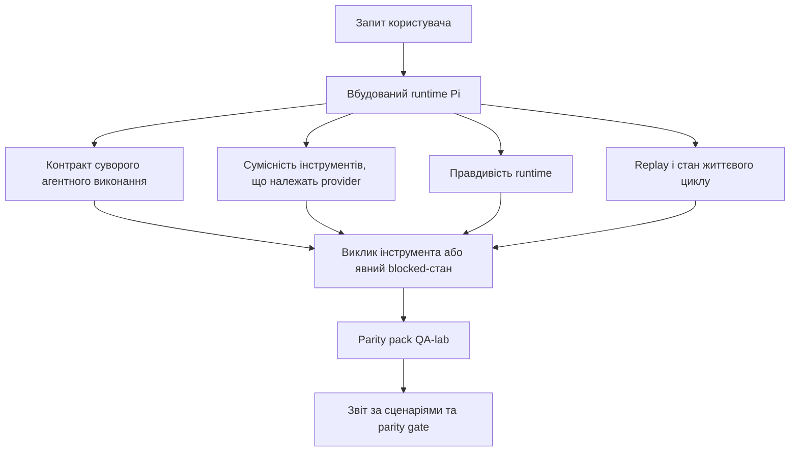
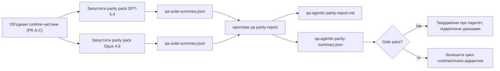

---
x-i18n:
    generated_at: "2026-04-11T13:24:07Z"
    model: gpt-5.4
    provider: openai
    source_hash: 7ee6b925b8a0f8843693cea9d50b40544657b5fb8a9e0860e2ff5badb273acb6
    source_path: help/gpt54-codex-agentic-parity.md
    workflow: 15
---

# Паритет агентної поведінки GPT-5.4 / Codex в OpenClaw

OpenClaw уже добре працював із frontier-моделями, що використовують інструменти, але моделі у стилі GPT-5.4 і Codex все ще поступалися в кількох практичних аспектах:

- вони могли зупинятися після планування замість виконання роботи
- вони могли неправильно використовувати суворі схеми інструментів OpenAI/Codex
- вони могли просити `/elevated full`, навіть коли повний доступ був неможливий
- вони могли втрачати стан довготривалих завдань під час replay або compaction
- твердження про паритет із Claude Opus 4.6 ґрунтувалися на анекдотичних випадках, а не на відтворюваних сценаріях

Ця програма паритету усуває ці прогалини у чотирьох окремих частинах, придатних для рев'ю.

## Що змінилося

### PR A: суворе агентне виконання

Ця частина додає контракт виконання `strict-agentic` з можливістю opt-in для вбудованих запусків Pi GPT-5.

Коли його ввімкнено, OpenClaw більше не приймає ходи лише з планом як «достатньо хороше» завершення. Якщо модель лише каже, що вона збирається зробити, але фактично не використовує інструменти й не просувається вперед, OpenClaw повторює спробу з вказівкою діяти негайно, а потім завершує з явним blocked-станом замість того, щоб тихо завершити завдання.

Це найбільше покращує досвід GPT-5.4 у таких випадках:

- короткі підтвердження на кшталт «ок, зроби це»
- завдання з кодом, де перший крок очевидний
- потоки, де `update_plan` має бути відстеженням прогресу, а не текстом-заповнювачем

### PR B: правдивість runtime

Ця частина змушує OpenClaw говорити правду про дві речі:

- чому виклик provider/runtime завершився помилкою
- чи справді доступний `/elevated full`

Це означає, що GPT-5.4 отримує кращі сигнали runtime щодо відсутнього scope, помилок оновлення auth, HTML 403 auth failures, проблем із proxy, DNS або timeout, а також заблокованих режимів повного доступу. Модель менше схильна вигадувати неправильний спосіб усунення проблеми або продовжувати просити режим дозволів, який runtime не може надати.

### PR C: коректність виконання

Ця частина покращує два види коректності:

- сумісність схем інструментів OpenAI/Codex, що належать provider
- видимість replay і життєвого циклу довгих завдань

Робота над сумісністю інструментів зменшує тертя зі схемами для суворої реєстрації інструментів OpenAI/Codex, особливо навколо інструментів без параметрів і очікувань суворого object-root. Робота над replay/liveness робить довготривалі завдання більш спостережуваними, тож paused, blocked і abandoned-стани стають видимими замість того, щоб зникати у загальному тексті помилки.

### PR D: harness паритету

Ця частина додає перший набір parity pack для QA-lab, щоб GPT-5.4 і Opus 4.6 можна було проганяти через ті самі сценарії й порівнювати за спільними доказами.

Parity pack — це рівень доказів. Сам по собі він не змінює поведінку runtime.

Після того як у вас є два артефакти `qa-suite-summary.json`, згенеруйте порівняння release gate командою:

```bash
pnpm openclaw qa parity-report \
  --repo-root . \
  --candidate-summary .artifacts/qa-e2e/gpt54/qa-suite-summary.json \
  --baseline-summary .artifacts/qa-e2e/opus46/qa-suite-summary.json \
  --output-dir .artifacts/qa-e2e/parity
```

Ця команда записує:

- Markdown-звіт, читабельний для людини
- JSON-вердикт, читабельний для машини
- явний результат gate `pass` / `fail`

## Чому це практично покращує GPT-5.4

До цієї роботи GPT-5.4 в OpenClaw міг здаватися менш агентним, ніж Opus, у реальних сесіях кодування, тому що runtime допускав поведінки, які особливо шкідливі для моделей у стилі GPT-5:

- ходи лише з коментарями
- тертя схем навколо інструментів
- нечіткий зворотний зв'язок щодо дозволів
- тихі збої replay або compaction

Мета не в тому, щоб змусити GPT-5.4 імітувати Opus. Мета в тому, щоб дати GPT-5.4 контракт runtime, який винагороджує реальний прогрес, надає чистішу семантику інструментів і дозволів та перетворює режими збоїв на явні стани, читабельні і для машини, і для людини.

Це змінює користувацький досвід із такого:

- «модель мала хороший план, але зупинилася»

на такий:

- «модель або подіяла, або OpenClaw показав точну причину, чому вона не змогла»

## До і після для користувачів GPT-5.4

| До цієї програми                                                                              | Після PR A-D                                                                            |
| --------------------------------------------------------------------------------------------- | ---------------------------------------------------------------------------------------- |
| GPT-5.4 міг зупинитися після розумного плану, не зробивши наступний крок з інструментом      | PR A перетворює «лише план» на «дій зараз або покажи blocked-стан»                     |
| Суворі схеми інструментів могли відхиляти інструменти без параметрів або у форматі OpenAI/Codex у заплутаний спосіб | PR C робить реєстрацію та виклик інструментів, що належать provider, більш передбачуваними |
| Підказки щодо `/elevated full` могли бути нечіткими або хибними в заблокованих runtime       | PR B дає GPT-5.4 і користувачу правдиві підказки runtime та дозволів                    |
| Збої replay або compaction могли виглядати так, ніби завдання тихо зникло                    | PR C явно показує paused, blocked, abandoned і replay-invalid результати                |
| «GPT-5.4 відчувається гірше за Opus» було здебільшого анекдотичним                            | PR D перетворює це на той самий набір сценаріїв, ті самі метрики й жорсткий gate pass/fail |

## Архітектура



## Потік релізу



## Набір сценаріїв

Поточний parity pack першої хвилі охоплює п'ять сценаріїв:

### `approval-turn-tool-followthrough`

Перевіряє, що модель не зупиняється на «Я це зроблю» після короткого підтвердження. Вона має виконати першу конкретну дію в тому ж самому ході.

### `model-switch-tool-continuity`

Перевіряє, що робота з інструментами залишається узгодженою через межі перемикання моделі/runtime, а не скидається до коментарів чи не втрачає контекст виконання.

### `source-docs-discovery-report`

Перевіряє, що модель може читати вихідний код і документацію, синтезувати висновки й продовжувати завдання агентно, а не видавати коротке резюме й рано зупинятися.

### `image-understanding-attachment`

Перевіряє, що змішані завдання з вкладеннями залишаються виконуваними й не зводяться до розмитого опису.

### `compaction-retry-mutating-tool`

Перевіряє, що завдання з реальним mutating write зберігає явну ознаку небезпеки replay замість того, щоб тихо виглядати безпечним для replay, якщо виконання зазнає compaction, retry або втрачає стан відповіді під навантаженням.

## Матриця сценаріїв

| Сценарій                           | Що він перевіряє                         | Хороша поведінка GPT-5.4                                                       | Сигнал збою                                                                    |
| ---------------------------------- | ---------------------------------------- | ------------------------------------------------------------------------------ | ------------------------------------------------------------------------------ |
| `approval-turn-tool-followthrough` | Короткі підтвердження після плану        | Одразу починає першу конкретну дію з інструментом замість повторення наміру   | підтвердження лише з планом, без активності інструментів або blocked-хід без реального блокера |
| `model-switch-tool-continuity`     | Перемикання runtime/моделі під час роботи з інструментами | Зберігає контекст завдання й продовжує діяти узгоджено                         | скидається до коментарів, втрачає контекст інструментів або зупиняється після перемикання |
| `source-docs-discovery-report`     | Читання коду + синтез + дія              | Знаходить джерела, використовує інструменти й створює корисний звіт без зависання | коротке резюме, відсутня робота з інструментами або зупинка на незавершеному ході |
| `image-understanding-attachment`   | Агентна робота на основі вкладень        | Інтерпретує вкладення, пов'язує його з інструментами й продовжує завдання      | розмитий опис, вкладення проігноровано або немає конкретної наступної дії     |
| `compaction-retry-mutating-tool`   | Змінювальна робота під тиском compaction | Виконує реальний запис і зберігає явну ознаку небезпеки replay після побічного ефекту | mutating write відбувається, але безпечність replay мається на увазі, відсутня або суперечлива |

## Release gate

GPT-5.4 можна вважати таким, що досяг паритету або перевершив його, лише коли об'єднаний runtime одночасно проходить parity pack і регресійні перевірки правдивості runtime.

Необхідні результати:

- відсутність зупинки на плані, коли наступна дія з інструментом очевидна
- відсутність фальшивого завершення без реального виконання
- відсутність неправильних підказок щодо `/elevated full`
- відсутність тихого abandon через replay або compaction
- метрики parity pack щонайменше такі самі сильні, як у погодженого baseline Opus 4.6

Для harness першої хвилі gate порівнює:

- completion rate
- unintended-stop rate
- valid-tool-call rate
- fake-success count

Докази паритету навмисно розділено на два рівні:

- PR D доводить поведінку GPT-5.4 vs Opus 4.6 на тих самих сценаріях за допомогою QA-lab
- детерміновані набори PR B доводять правдивість auth, proxy, DNS і `/elevated full` поза межами harness

## Матриця «ціль → доказ»

| Елемент completion gate                                | Власник PR  | Джерело доказів                                                    | Сигнал проходження                                                                      |
| ------------------------------------------------------ | ----------- | ------------------------------------------------------------------ | --------------------------------------------------------------------------------------- |
| GPT-5.4 більше не зависає після планування             | PR A        | `approval-turn-tool-followthrough` плюс runtime-набори PR A        | ходи з підтвердженням запускають реальну роботу або явний blocked-стан                  |
| GPT-5.4 більше не імітує прогрес або фальшиве завершення інструментів | PR A + PR D | результати сценаріїв у parity report і fake-success count          | немає підозрілих pass-результатів і немає завершення лише з коментарями                 |
| GPT-5.4 більше не дає хибних підказок щодо `/elevated full` | PR B        | детерміновані набори перевірки правдивості                         | причини блокування й підказки повного доступу залишаються точними щодо runtime          |
| Збої replay/liveness залишаються явними                | PR C + PR D | lifecycle/replay-набори PR C плюс `compaction-retry-mutating-tool` | змінювальна робота зберігає явну ознаку небезпеки replay замість того, щоб тихо зникати |
| GPT-5.4 відповідає або перевершує Opus 4.6 за погодженими метриками | PR D        | `qa-agentic-parity-report.md` і `qa-agentic-parity-summary.json`   | те саме покриття сценаріїв і відсутність регресу в completion, stop-behavior або коректному використанні інструментів |

## Як читати parity verdict

Використовуйте verdict у `qa-agentic-parity-summary.json` як фінальне машиночитне рішення для parity pack першої хвилі.

- `pass` означає, що GPT-5.4 покрив ті самі сценарії, що й Opus 4.6, і не погіршив погоджені агреговані метрики.
- `fail` означає, що спрацював принаймні один жорсткий gate: слабше completion, гірші unintended stops, слабше коректне використання інструментів, будь-який випадок fake-success або невідповідне покриття сценаріїв.
- «shared/base CI issue» саме по собі не є результатом паритету. Якщо шум CI поза межами PR D блокує прогін, verdict має чекати на чисте виконання merged-runtime, а не виводитися з логів епохи гілки.
- Правдивість auth, proxy, DNS і `/elevated full` як і раніше підтверджується детермінованими наборами PR B, тож фінальне твердження для релізу потребує обох умов: verdict паритету PR D із результатом pass і зелений статус покриття правдивості PR B.

## Кому слід вмикати `strict-agentic`

Використовуйте `strict-agentic`, коли:

- очікується, що агент діятиме негайно, якщо наступний крок очевидний
- GPT-5.4 або моделі сімейства Codex є основним runtime
- ви віддаєте перевагу явним blocked-станам замість «корисних» відповідей лише з підсумком

Залишайте контракт за замовчуванням, коли:

- вам потрібна наявна, менш сувора поведінка
- ви не використовуєте моделі сімейства GPT-5
- ви тестуєте prompt, а не enforcement на рівні runtime
