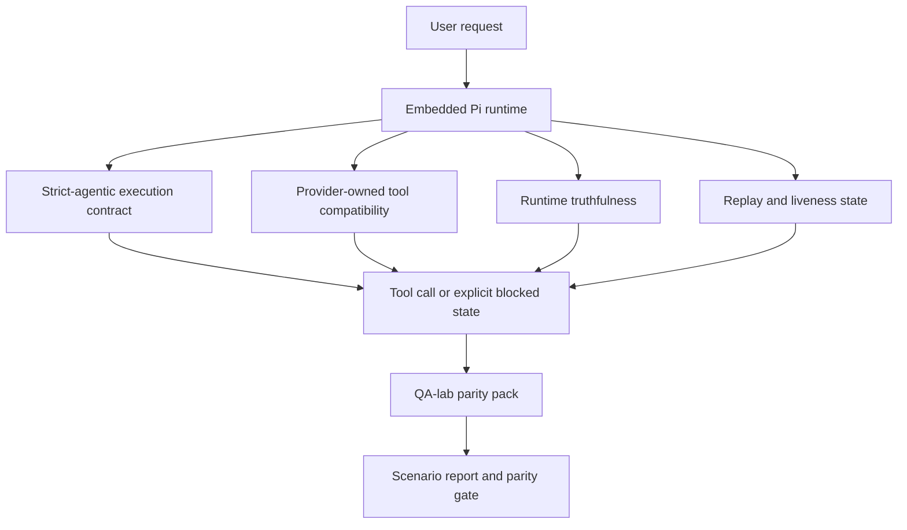
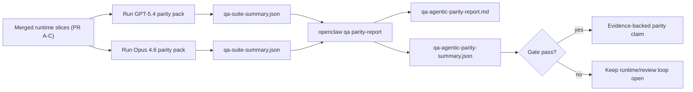

---
read_when:
    - Налагодження агентної поведінки GPT-5.4 або Codex
    - Порівняння агентної поведінки OpenClaw у різних frontier-моделях
    - Огляд виправлень strict-agentic, схем інструментів, підвищення привілеїв і відтворення
summary: Як OpenClaw закриває прогалини агентного виконання для GPT-5.4 і моделей у стилі Codex
title: Агентна паритетність GPT-5.4 / Codex
x-i18n:
    generated_at: "2026-04-24T04:14:46Z"
    model: gpt-5.4
    provider: openai
    source_hash: 9f8c7dcf21583e6dbac80da9ddd75f2dc9af9b80801072ade8fa14b04258d4dc
    source_path: help/gpt54-codex-agentic-parity.md
    workflow: 15
---

# Агентна паритетність GPT-5.4 / Codex в OpenClaw

OpenClaw уже добре працював із frontier-моделями, що використовують інструменти, але GPT-5.4 і моделі у стилі Codex усе ще відставали в кількох практичних аспектах:

- вони могли зупинятися після планування замість виконання роботи
- вони могли неправильно використовувати строгі схеми інструментів OpenAI/Codex
- вони могли запитувати `/elevated full`, навіть коли повний доступ був неможливий
- вони могли втрачати стан довготривалого завдання під час відтворення або Compaction
- твердження про паритет із Claude Opus 4.6 ґрунтувалися на анекдотах, а не на відтворюваних сценаріях

Ця програма паритетності закриває ці прогалини чотирма придатними до рев’ю частинами.

## Що змінилося

### PR A: strict-agentic виконання

Ця частина додає контракт виконання `strict-agentic` з увімкненням за бажанням для вбудованих запусків Pi GPT-5.

Коли його ввімкнено, OpenClaw більше не приймає ходи лише з планом як “достатньо добре” завершення. Якщо модель лише каже, що вона збирається зробити, але фактично не використовує інструменти й не просувається далі, OpenClaw повторює спробу з настановою діяти негайно, а потім завершує роботу в закритому режимі з явним заблокованим станом замість тихого завершення завдання.

Найбільше це покращує досвід GPT-5.4 у таких випадках:

- короткі уточнення на кшталт “гаразд, зроби це”
- задачі з кодом, де перший крок очевидний
- потоки, у яких `update_plan` має відстежувати прогрес, а не бути текстом-заповнювачем

### PR B: правдивість часу виконання

Ця частина змушує OpenClaw казати правду про дві речі:

- чому виклик провайдера/часу виконання не вдався
- чи справді доступний `/elevated full`

Це означає, що GPT-5.4 отримує кращі сигнали часу виконання щодо відсутньої області дії, збоїв оновлення автентифікації, збоїв автентифікації HTML 403, проблем із проксі, збоїв DNS або тайм-аутів, а також заблокованих режимів повного доступу. Імовірність того, що модель вигадає неправильний спосіб виправлення або й далі проситиме режим дозволів, який середовище виконання не може надати, зменшується.

### PR C: коректність виконання

Ця частина покращує два типи коректності:

- сумісність схем інструментів OpenAI/Codex, що належать провайдеру
- видимість відтворення та живучості довгих завдань

Робота над сумісністю інструментів зменшує тертя зі схемами для суворої реєстрації інструментів OpenAI/Codex, особливо навколо інструментів без параметрів і суворих очікувань кореня-об’єкта. Робота над відтворенням/живучістю робить довготривалі завдання більш спостережуваними, тож призупинені, заблоковані та покинуті стани стають видимими замість того, щоб губитися в загальному тексті помилки.

### PR D: каркас паритетності

Ця частина додає перший набір паритетності QA-lab, щоб GPT-5.4 і Opus 4.6 можна було запускати через однакові сценарії та порівнювати за спільними доказами.

Набір паритетності є рівнем доказу. Сам по собі він не змінює поведінку часу виконання.

Після того як у вас буде два артефакти `qa-suite-summary.json`, згенеруйте порівняння для релізного шлюзу так:

```bash
pnpm openclaw qa parity-report \
  --repo-root . \
  --candidate-summary .artifacts/qa-e2e/gpt54/qa-suite-summary.json \
  --baseline-summary .artifacts/qa-e2e/opus46/qa-suite-summary.json \
  --output-dir .artifacts/qa-e2e/parity
```

Ця команда записує:

- Markdown-звіт, придатний для читання людиною
- JSON-результат, придатний для читання машиною
- явний результат шлюзу `pass` / `fail`

## Чому це покращує GPT-5.4 на практиці

До цієї роботи GPT-5.4 в OpenClaw міг здаватися менш агентним, ніж Opus, у реальних сесіях програмування, тому що середовище виконання допускало поведінку, особливо шкідливу для моделей стилю GPT-5:

- ходи лише з коментарями
- тертя зі схемами навколо інструментів
- нечіткий зворотний зв’язок щодо дозволів
- тихе ламання відтворення або Compaction

Мета не в тому, щоб змусити GPT-5.4 імітувати Opus. Мета в тому, щоб дати GPT-5.4 контракт часу виконання, який винагороджує реальний прогрес, надає чистішу семантику інструментів і дозволів та перетворює режими збоїв на явні машиночитані й людиночитані стани.

Це змінює користувацький досвід із:

- “модель мала хороший план, але зупинилася”

на:

- “модель або подіяла, або OpenClaw явно показав точну причину, чому не зміг”

## До і після для користувачів GPT-5.4

| До цієї програми                                                                            | Після PR A-D                                                                               |
| ------------------------------------------------------------------------------------------- | ------------------------------------------------------------------------------------------- |
| GPT-5.4 міг зупинитися після розумного плану, не зробивши наступного кроку з інструментом | PR A перетворює “лише план” на “дій зараз або покажи заблокований стан”                    |
| Строгі схеми інструментів могли плутано відхиляти інструменти без параметрів або форми OpenAI/Codex | PR C робить реєстрацію та виклик інструментів, що належать провайдеру, передбачуванішими |
| Підказки для `/elevated full` могли бути нечіткими або неправильними в заблокованих середовищах | PR B дає GPT-5.4 і користувачу правдиві підказки часу виконання та дозволів             |
| Збої відтворення або Compaction могли виглядати так, ніби завдання тихо зникло             | PR C явно показує призупинені, заблоковані, покинуті та replay-invalid результати          |
| “GPT-5.4 здається гіршим за Opus” було переважно анекдотичним                               | PR D перетворює це на однаковий набір сценаріїв, однакові метрики та жорсткий шлюз pass/fail |

## Архітектура



## Потік релізу



## Набір сценаріїв

Поточний перший набір паритетності охоплює п’ять сценаріїв:

### `approval-turn-tool-followthrough`

Перевіряє, що модель не зупиняється на “я це зроблю” після короткого підтвердження. Вона має виконати першу конкретну дію в тому самому ході.

### `model-switch-tool-continuity`

Перевіряє, що робота з використанням інструментів залишається узгодженою при переході між моделями/середовищами виконання, а не скидається до коментарів чи не втрачає контекст виконання.

### `source-docs-discovery-report`

Перевіряє, що модель може читати вихідний код і документацію, синтезувати висновки та продовжувати завдання агентно, а не видавати тонкий підсумок і зупинятися зарано.

### `image-understanding-attachment`

Перевіряє, що змішані задачі з вкладеннями залишаються придатними до дії й не зводяться до нечіткої оповіді.

### `compaction-retry-mutating-tool`

Перевіряє, що завдання з реальною змінювальною операцією запису зберігає явну небезпеку відтворення, а не тихо виглядає безпечним для відтворення, якщо виконання зазнає Compaction, повторюється або втрачає стан відповіді під навантаженням.

## Матриця сценаріїв

| Сценарій                           | Що він перевіряє                        | Хороша поведінка GPT-5.4                                                        | Сигнал збою                                                                     |
| ---------------------------------- | --------------------------------------- | -------------------------------------------------------------------------------- | -------------------------------------------------------------------------------- |
| `approval-turn-tool-followthrough` | Короткі ходи підтвердження після плану  | Негайно починає першу конкретну дію з інструментом замість повторення наміру     | уточнення лише планом, відсутність активності інструментів або заблокований хід без реального блокера |
| `model-switch-tool-continuity`     | Перемикання середовища виконання/моделі під час використання інструментів | Зберігає контекст завдання й продовжує діяти узгоджено                           | скидається до коментарів, втрачає контекст інструментів або зупиняється після перемикання |
| `source-docs-discovery-report`     | Читання джерел + синтез + дія           | Знаходить джерела, використовує інструменти й створює корисний звіт без зависання | тонкий підсумок, відсутня робота з інструментами або зупинка на неповному ході  |
| `image-understanding-attachment`   | Агентна робота на основі вкладень       | Інтерпретує вкладення, пов’язує його з інструментами й продовжує завдання        | нечітка оповідь, вкладення проігноровано або відсутня конкретна наступна дія     |
| `compaction-retry-mutating-tool`   | Змінювальна робота під тиском Compaction | Виконує реальний запис і зберігає явну небезпеку відтворення після побічного ефекту | змінювальний запис відбувається, але безпечність відтворення мається на увазі, відсутня або суперечлива |

## Релізний шлюз

GPT-5.4 можна вважати таким, що досяг паритету або перевершує його, лише коли об’єднане середовище виконання проходить набір паритетності та регресії правдивості часу виконання одночасно.

Потрібні результати:

- жодного зависання на одному лише плані, коли наступна дія інструмента очевидна
- жодного фальшивого завершення без реального виконання
- жодних неправильних підказок для `/elevated full`
- жодного тихого покидання через відтворення або Compaction
- метрики набору паритетності щонайменше не слабші за узгоджену базову лінію Opus 4.6

Для першого каркаса шлюз порівнює:

- рівень завершення
- рівень ненавмисних зупинок
- рівень коректних викликів інструментів
- кількість фальшивих успіхів

Докази паритетності навмисно розділено на два шари:

- PR D доводить поведінку GPT-5.4 проти Opus 4.6 на однакових сценаріях через QA-lab
- детерміновані набори PR B доводять правдивість автентифікації, проксі, DNS і `/elevated full` поза каркасом

## Матриця відповідності цілей і доказів

| Елемент шлюзу завершення                                 | Власний PR  | Джерело доказів                                                   | Сигнал проходження                                                                      |
| -------------------------------------------------------- | ----------- | ----------------------------------------------------------------- | --------------------------------------------------------------------------------------- |
| GPT-5.4 більше не зависає після планування               | PR A        | `approval-turn-tool-followthrough` плюс набори часу виконання PR A | ходи підтвердження запускають реальну роботу або явний заблокований стан               |
| GPT-5.4 більше не підробляє прогрес або фальшиве завершення інструменту | PR A + PR D | результати сценаріїв у звіті паритетності та кількість фальшивих успіхів | немає підозрілих результатів проходження й немає завершення лише коментарем            |
| GPT-5.4 більше не дає хибних підказок `/elevated full`   | PR B        | детерміновані набори правдивості                                  | причини блокування й підказки повного доступу залишаються точними щодо часу виконання  |
| Збої відтворення/живучості залишаються явними            | PR C + PR D | набори життєвого циклу/відтворення PR C плюс `compaction-retry-mutating-tool` | змінювальна робота зберігає явну небезпеку відтворення замість тихого зникнення     |
| GPT-5.4 відповідає або перевершує Opus 4.6 за узгодженими метриками | PR D        | `qa-agentic-parity-report.md` і `qa-agentic-parity-summary.json` | однакове покриття сценаріїв і відсутність регресії у завершенні, поведінці зупинок або коректному використанні інструментів |

## Як читати вердикт паритетності

Використовуйте вердикт у `qa-agentic-parity-summary.json` як остаточне машиночитане рішення для першого набору паритетності.

- `pass` означає, що GPT-5.4 покрив ті самі сценарії, що й Opus 4.6, і не показав регресії за узгодженими агрегованими метриками.
- `fail` означає, що спрацював принаймні один жорсткий шлюз: слабше завершення, гірші ненавмисні зупинки, слабше коректне використання інструментів, будь-який випадок фальшивого успіху або невідповідне покриття сценаріїв.
- “shared/base CI issue” сам по собі не є результатом паритетності. Якщо шум CI поза PR D блокує запуск, вердикт має чекати чистого виконання об’єднаного середовища, а не виводитися з логів епохи гілки.
- Правдивість автентифікації, проксі, DNS і `/elevated full`, як і раніше, походить із детермінованих наборів PR B, тому для фінального релізного твердження потрібні обидва пункти: позитивний вердикт паритетності PR D і зелене покриття правдивості PR B.

## Кому слід увімкнути `strict-agentic`

Використовуйте `strict-agentic`, коли:

- очікується, що агент діятиме негайно, якщо наступний крок очевидний
- основним середовищем виконання є GPT-5.4 або моделі сімейства Codex
- ви надаєте перевагу явним заблокованим станам замість “корисних” відповідей лише з переказом

Залишайте типовий контракт, коли:

- вам потрібна наявна м’якша поведінка
- ви не використовуєте моделі сімейства GPT-5
- ви тестуєте підказки, а не примусове застосування правил часу виконання

## Пов’язане

- [Нотатки для супроводу паритетності GPT-5.4 / Codex](/uk/help/gpt54-codex-agentic-parity-maintainers)
