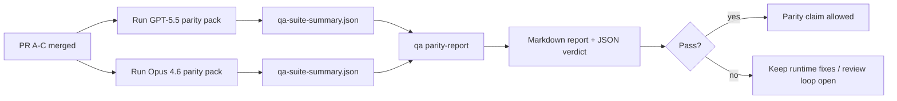

---
read_when:
    - Перегляд серії PR паритету GPT-5.5 / Codex
    - Підтримка шестиконтрактної агентної архітектури, що лежить в основі програми паритету
summary: Як переглянути програму паритету GPT-5.5 / Codex як чотири одиниці злиття
title: Нотатки супровідника паритету GPT-5.5 / Codex
x-i18n:
    generated_at: "2026-04-25T17:09:45Z"
    model: gpt-5.4
    provider: openai
    source_hash: 8de69081f5985954b88583880c36388dc47116c3351c15d135b8ab3a660058e3
    source_path: help/gpt55-codex-agentic-parity-maintainers.md
    workflow: 15
---

Ця нотатка пояснює, як переглядати програму паритету GPT-5.5 / Codex як чотири одиниці злиття, не втрачаючи початкову шестиконтрактну архітектуру.

## Одиниці злиття

### PR A: strict-agentic виконання

Відповідає за:

- `executionContract`
- GPT-5-first same-turn follow-through
- `update_plan` як нетермінальне відстеження прогресу
- явні заблоковані стани замість тихих зупинок лише на рівні плану

Не відповідає за:

- класифікацію збоїв auth/runtime
- правдивість permission
- redesign replay/continuation
- parity benchmarking

### PR B: правдивість runtime

Відповідає за:

- коректність Codex OAuth scope
- типізовану класифікацію збоїв provider/runtime
- правдиву доступність `/elevated full` і причини блокування

Не відповідає за:

- нормалізацію схеми tool
- стан replay/liveness
- benchmark gating

### PR C: коректність виконання

Відповідає за:

- сумісність tool OpenAI/Codex, якою володіє provider
- обробку strict schema без параметрів
- відображення replay-invalid
- видимість станів paused, blocked і abandoned для довгих завдань

Не відповідає за:

- self-elected continuation
- загальну поведінку Codex dialect поза provider hooks
- benchmark gating

### PR D: parity harness

Відповідає за:

- first-wave GPT-5.5 vs Opus 4.6 scenario pack
- документацію parity
- механіку parity report і release-gate

Не відповідає за:

- зміни поведінки runtime поза QA-lab
- симуляцію auth/proxy/DNS усередині harness

## Відображення назад на початкові шість контрактів

| Початковий контракт                     | Одиниця злиття |
| --------------------------------------- | -------------- |
| Коректність provider transport/auth     | PR B           |
| Сумісність contract/schema для tool     | PR C           |
| Виконання в тому самому ході            | PR A           |
| Правдивість permission                  | PR B           |
| Коректність replay/continuation/liveness | PR C           |
| Benchmark/release gate                  | PR D           |

## Порядок перегляду

1. PR A
2. PR B
3. PR C
4. PR D

PR D — це доказовий шар. Він не має бути причиною затримки PR із коректністю runtime.

## На що звертати увагу

### PR A

- запуски GPT-5 виконують дію або fail closed замість зупинки на commentary
- `update_plan` більше не виглядає як прогрес сам по собі
- поведінка залишається GPT-5-first і обмеженою embedded-Pi scope

### PR B

- збої auth/proxy/runtime більше не згортаються в загальну обробку “model failed”
- `/elevated full` описується як доступний лише тоді, коли він справді доступний
- причини блокування видимі і моделі, і user-facing runtime

### PR C

- strict реєстрація tool OpenAI/Codex поводиться передбачувано
- tools без параметрів не провалюють перевірки strict schema
- результати replay і Compaction зберігають правдивий стан liveness

### PR D

- scenario pack зрозумілий і відтворюваний
- pack включає mutating replay-safety lane, а не лише read-only flows
- звіти читабельні для людей і automation
- твердження про parity підкріплені доказами, а не анекдотами

Очікувані артефакти від PR D:

- `qa-suite-report.md` / `qa-suite-summary.json` для кожного запуску моделі
- `qa-agentic-parity-report.md` з aggregate і comparison на рівні scenario
- `qa-agentic-parity-summary.json` з verdict у machine-readable форматі

## Release gate

Не стверджуйте про паритет або перевагу GPT-5.5 над Opus 4.6, доки:

- PR A, PR B і PR C не злиті
- PR D не виконає first-wave parity pack без помилок
- regression suites для runtime-truthfulness залишаються зеленими
- parity report не показує випадків fake-success і regressions у stop behavior

Parity harness — не єдине джерело доказів. Явно зберігайте цей поділ під час перегляду:

- PR D відповідає за scenario-based comparison GPT-5.5 vs Opus 4.6
- детерміновані suites PR B і надалі відповідають за докази щодо auth/proxy/DNS і правдивості full-access

## Швидкий робочий процес злиття для супровідника

Використовуйте це, коли готові зливати parity PR і хочете повторювану послідовність із низьким ризиком.

1. Підтвердьте, що планка доказів досягнута перед злиттям:
   - відтворюваний симптом або failing test
   - підтверджена root cause у зміненому коді
   - виправлення в шляху, якого стосується проблема
   - regression test або явна примітка про manual verification
2. Виконайте triage/label перед злиттям:
   - застосуйте будь-які `r:*` auto-close labels, якщо PR не має бути злитий
   - не залишайте кандидатів на злиття з невирішеними blocker threads
3. Локально перевірте змінену поверхню:
   - `pnpm check:changed`
   - `pnpm test:changed`, якщо змінювалися тести або впевненість у bug fix залежить від test coverage
4. Виконайте злиття через стандартний maintainer flow (процес `/landpr`), потім перевірте:
   - поведінку auto-close для пов’язаних issues
   - статус CI і post-merge на `main`
5. Після злиття виконайте пошук дублікатів пов’язаних відкритих PR/issues і закривайте їх лише з канонічним посиланням.

Якщо бракує хоча б одного пункту з планки доказів, запитуйте зміни замість злиття.

## Відображення цілей на докази

| Пункт completion gate                    | Основний відповідальний | Артефакт перегляду                                                   |
| ---------------------------------------- | ----------------------- | -------------------------------------------------------------------- |
| Немає зависань лише на рівні плану       | PR A                    | strict-agentic runtime tests і `approval-turn-tool-followthrough`    |
| Немає fake progress або fake tool completion | PR A + PR D         | кількість fake-success у parity плюс деталі звіту на рівні scenario  |
| Немає хибних підказок `/elevated full`   | PR B                    | детерміновані suites runtime-truthfulness                            |
| Збої replay/liveness залишаються явними  | PR C + PR D             | suites lifecycle/replay плюс `compaction-retry-mutating-tool`        |
| GPT-5.5 відповідає або перевершує Opus 4.6 | PR D                  | `qa-agentic-parity-report.md` і `qa-agentic-parity-summary.json`     |

## Скорочення для рецензента: до vs після

| Видима для користувача проблема до                       | Сигнал під час перегляду після                                                        |
| -------------------------------------------------------- | -------------------------------------------------------------------------------------- |
| GPT-5.5 зупинявся після планування                       | PR A показує поведінку act-or-block замість завершення лише з commentary              |
| Використання tool здавалося крихким зі strict schema OpenAI/Codex | PR C зберігає передбачуваність реєстрації tool і викликів без параметрів     |
| Підказки `/elevated full` іноді вводили в оману          | PR B прив’язує підказки до фактичних можливостей runtime і причин блокування           |
| Довгі завдання могли зникати в неоднозначності replay/Compaction | PR C виводить явний стан paused, blocked, abandoned і replay-invalid            |
| Твердження про parity були анекдотичними                 | PR D створює звіт і JSON verdict з однаковим покриттям scenario для обох моделей      |

## Пов’язане

- [Агентний паритет GPT-5.5 / Codex](/uk/help/gpt55-codex-agentic-parity)
