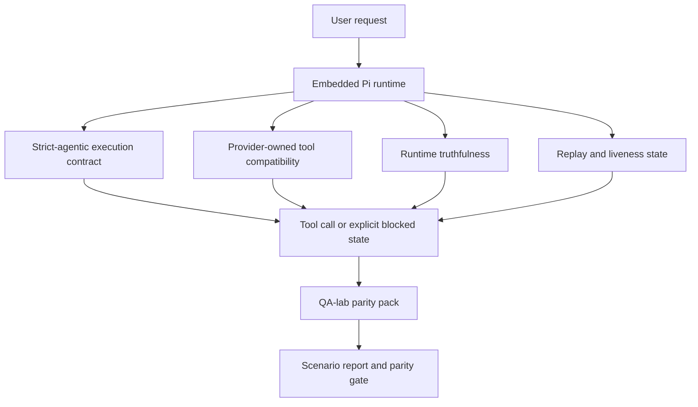
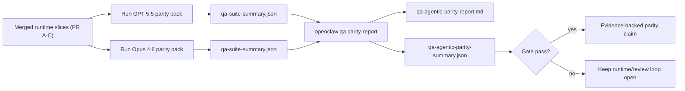

---
read_when:
    - Налагодження агентної поведінки GPT-5.5 або Codex
    - Порівняння агентної поведінки OpenClaw у різних frontier-моделях
    - Огляд виправлень strict-agentic, tool-schema, elevation і replay
summary: Як OpenClaw закриває прогалини агентного виконання для GPT-5.5 і моделей у стилі Codex
title: Паритет агентної роботи GPT-5.5 / Codex
x-i18n:
    generated_at: "2026-04-25T17:09:50Z"
    model: gpt-5.4
    provider: openai
    source_hash: 8a3b9375cd9e9d95855c4a1135953e00fd7a939e52fb7b75342da3bde2d83fe1
    source_path: help/gpt55-codex-agentic-parity.md
    workflow: 15
---

# Паритет агентної роботи GPT-5.5 / Codex в OpenClaw

OpenClaw уже добре працював із frontier-моделями, що використовують інструменти, але GPT-5.5 і моделі у стилі Codex все ще показували гірші результати в кількох практичних аспектах:

- вони могли зупинятися після планування замість виконання роботи
- вони могли некоректно використовувати суворі схеми інструментів OpenAI/Codex
- вони могли запитувати `/elevated full`, навіть коли повний доступ був неможливий
- вони могли втрачати стан довготривалих завдань під час replay або Compaction
- твердження про паритет із Claude Opus 4.6 ґрунтувалися на анекдотичних випадках, а не на відтворюваних сценаріях

Ця програма паритету усуває ці прогалини чотирма окремими частинами, придатними для рев'ю.

## Що змінилося

### PR A: суворе агентне виконання

Ця частина додає опціональний контракт виконання `strict-agentic` для вбудованих запусків Pi GPT-5.

Коли його ввімкнено, OpenClaw більше не вважає ходи лише з планом «достатньо хорошим» завершенням. Якщо модель лише каже, що збирається зробити, але фактично не використовує інструменти й не просувається вперед, OpenClaw повторює спробу з настановою діяти негайно, а потім завершує із явним заблокованим станом замість того, щоб мовчки завершити завдання.

Це найбільше покращує роботу GPT-5.5 у таких випадках:

- короткі уточнення на кшталт «ок, зроби це»
- завдання з кодом, де перший крок очевидний
- потоки, де `update_plan` має бути відстеженням прогресу, а не текстом-заповнювачем

### PR B: правдивість середовища виконання

Ця частина змушує OpenClaw говорити правду про дві речі:

- чому виклик провайдера/середовища виконання завершився помилкою
- чи справді доступний `/elevated full`

Це означає, що GPT-5.5 отримує кращі сигнали від середовища виконання щодо відсутнього scope, збоїв оновлення auth, помилок auth HTML 403, проблем із proxy, DNS або таймаутами, а також заблокованих режимів повного доступу. Модель з меншою ймовірністю вигадуватиме неправильний спосіб виправлення або продовжуватиме просити режим дозволів, який середовище виконання не може надати.

### PR C: коректність виконання

Ця частина покращує два види коректності:

- сумісність схем інструментів OpenAI/Codex, якими володіє провайдер
- видимість replay і життєздатності довгих завдань

Робота над сумісністю інструментів зменшує тертя зі схемами під час суворої реєстрації інструментів OpenAI/Codex, особливо навколо інструментів без параметрів і суворих очікувань щодо кореня-об'єкта. Робота над replay/життєздатністю робить довготривалі завдання більш спостережуваними, тож стани паузи, блокування та покинутості стають видимими замість того, щоб зникати в загальному тексті про помилку.

### PR D: набір перевірок паритету

Ця частина додає першу хвилю набору перевірок паритету QA-lab, щоб GPT-5.5 і Opus 4.6 можна було проганяти через однакові сценарії й порівнювати за спільними доказами.

Набір перевірок паритету — це доказовий шар. Сам по собі він не змінює поведінку середовища виконання.

Після того як у вас буде два артефакти `qa-suite-summary.json`, згенеруйте порівняння для release gate за допомогою:

```bash
pnpm openclaw qa parity-report \
  --repo-root . \
  --candidate-summary .artifacts/qa-e2e/gpt55/qa-suite-summary.json \
  --baseline-summary .artifacts/qa-e2e/opus46/qa-suite-summary.json \
  --output-dir .artifacts/qa-e2e/parity
```

Ця команда записує:

- Markdown-звіт, зручний для читання людиною
- JSON-версію рішення, зручну для читання машиною
- явний результат перевірки `pass` / `fail`

## Чому це практично покращує GPT-5.5

До цієї роботи GPT-5.5 в OpenClaw міг здаватися менш агентним, ніж Opus, у реальних сесіях програмування, тому що середовище виконання допускало поведінку, яка особливо шкідлива для моделей у стилі GPT-5:

- ходи лише з коментарями
- тертя зі схемами навколо інструментів
- нечіткий зворотний зв'язок щодо дозволів
- тихі збої replay або Compaction

Мета не в тому, щоб змусити GPT-5.5 імітувати Opus. Мета в тому, щоб дати GPT-5.5 контракт середовища виконання, який винагороджує реальний прогрес, надає чистішу семантику інструментів і дозволів та перетворює режими відмови на явні стани, читабельні і для машини, і для людини.

Це змінює користувацький досвід із такого:

- «модель мала хороший план, але зупинилася»

на такий:

- «модель або виконала дію, або OpenClaw показав точну причину, чому вона не змогла цього зробити»

## До і після для користувачів GPT-5.5

| До цієї програми                                                                              | Після PR A-D                                                                            |
| --------------------------------------------------------------------------------------------- | ---------------------------------------------------------------------------------------- |
| GPT-5.5 міг зупинитися після розумного плану, не зробивши наступний крок з інструментом      | PR A перетворює «лише план» на «дій зараз або покажи заблокований стан»                 |
| Суворі схеми інструментів могли незрозуміло відхиляти інструменти без параметрів або OpenAI/Codex-подібні інструменти | PR C робить реєстрацію та виклик інструментів, якими володіє провайдер, передбачуванішими |
| Вказівки щодо `/elevated full` могли бути нечіткими або неправильними в заблокованих середовищах виконання | PR B дає GPT-5.5 і користувачеві правдиві підказки про середовище виконання й дозволи |
| Збої replay або Compaction могли виглядати так, ніби завдання просто тихо зникло             | PR C явно показує результати paused, blocked, abandoned і replay-invalid                |
| «GPT-5.5 відчувається гірше за Opus» було переважно анекдотичним                              | PR D перетворює це на один і той самий набір сценаріїв, ті самі метрики й жорстку перевірку pass/fail |

## Архітектура



## Потік релізу



## Набір сценаріїв

Наразі набір перевірок паритету першої хвилі охоплює п'ять сценаріїв:

### `approval-turn-tool-followthrough`

Перевіряє, що модель не зупиняється на «я це зроблю» після короткого підтвердження. Вона має виконати першу конкретну дію в тому самому ході.

### `model-switch-tool-continuity`

Перевіряє, що робота з використанням інструментів залишається узгодженою під час перемикання моделі/середовища виконання, а не скидається до коментарів чи не втрачає контекст виконання.

### `source-docs-discovery-report`

Перевіряє, що модель може читати вихідний код і документацію, синтезувати висновки та продовжувати завдання агентно, а не видавати поверхневе резюме й зупинятися зарано.

### `image-understanding-attachment`

Перевіряє, що завдання змішаного типу з вкладеннями залишаються придатними до дії й не скочуються до розпливчастого опису.

### `compaction-retry-mutating-tool`

Перевіряє, що завдання з реальним записом, який змінює стан, зберігає явну небезпеку replay замість того, щоб тихо виглядати replay-safe, якщо під час виконання відбуваються Compaction, повторна спроба або втрата стану відповіді під навантаженням.

## Матриця сценаріїв

| Сценарій                           | Що він перевіряє                         | Хороша поведінка GPT-5.5                                                        | Сигнал збою                                                                     |
| ---------------------------------- | ---------------------------------------- | ------------------------------------------------------------------------------- | -------------------------------------------------------------------------------- |
| `approval-turn-tool-followthrough` | Короткі підтвердження після плану        | Одразу починає першу конкретну дію з інструментом замість повторення наміру    | хід лише з планом, відсутність активності інструментів або blocked-хід без реальної причини |
| `model-switch-tool-continuity`     | Перемикання середовища виконання/моделі під час використання інструментів | Зберігає контекст завдання і продовжує діяти узгоджено                         | скидання до коментарів, втрата контексту інструментів або зупинка після перемикання |
| `source-docs-discovery-report`     | Читання джерел + синтез + дія            | Знаходить джерела, використовує інструменти й створює корисний звіт без зависання | поверхневе резюме, відсутня робота інструментів або зупинка на незавершеному ході |
| `image-understanding-attachment`   | Агентна робота на основі вкладення       | Інтерпретує вкладення, пов'язує його з інструментами й продовжує завдання      | розпливчастий опис, ігнорування вкладення або відсутність конкретної наступної дії |
| `compaction-retry-mutating-tool`   | Робота зі змінами під тиском Compaction  | Виконує реальний запис і зберігає явну небезпеку replay після побічного ефекту | запис, що змінює стан, відбувається, але безпека replay мається на увазі, відсутня або суперечлива |

## Перевірка релізу

GPT-5.5 можна вважати таким, що досяг паритету або перевищив його, лише коли об'єднане середовище виконання одночасно проходить набір перевірок паритету та регресійні перевірки правдивості середовища виконання.

Необхідні результати:

- жодного зависання на плані, коли наступна дія з інструментом очевидна
- жодного фальшивого завершення без реального виконання
- жодних неправильних вказівок щодо `/elevated full`
- жодного тихого покидання через replay або Compaction
- метрики набору перевірок паритету щонайменше не гірші за узгоджену базову лінію Opus 4.6

Для набору перевірок першої хвилі gate порівнює:

- рівень завершення
- рівень ненавмисних зупинок
- рівень коректних викликів інструментів
- кількість fake-success

Докази паритету навмисно розділено на два шари:

- PR D доводить поведінку GPT-5.5 проти Opus 4.6 в однакових сценаріях за допомогою QA-lab
- детерміновані набори перевірок PR B доводять правдивість auth, proxy, DNS і `/elevated full` поза межами цього набору перевірок

## Матриця «ціль → доказ»

| Пункт перевірки завершення                              | Відповідальний PR | Джерело доказу                                                    | Сигнал проходження                                                                     |
| ------------------------------------------------------- | ----------------- | ----------------------------------------------------------------- | -------------------------------------------------------------------------------------- |
| GPT-5.5 більше не зависає після планування              | PR A              | `approval-turn-tool-followthrough` плюс набори перевірок середовища виконання PR A | ходи підтвердження запускають реальну роботу або явний заблокований стан              |
| GPT-5.5 більше не імітує прогрес чи фальшиве завершення інструмента | PR A + PR D       | результати сценаріїв у звіті паритету та кількість fake-success   | немає підозрілих результатів проходження й немає завершення лише з коментарями        |
| GPT-5.5 більше не дає хибних вказівок щодо `/elevated full` | PR B              | детерміновані набори перевірок правдивості                        | причини блокування та підказки щодо повного доступу залишаються точними щодо середовища виконання |
| Збої replay/життєздатності залишаються явними           | PR C + PR D       | набори перевірок життєвого циклу/replay PR C плюс `compaction-retry-mutating-tool` | робота зі змінами зберігає явну небезпеку replay замість того, щоб тихо зникати       |
| GPT-5.5 відповідає Opus 4.6 або перевершує його за узгодженими метриками | PR D              | `qa-agentic-parity-report.md` і `qa-agentic-parity-summary.json`  | однакове покриття сценаріїв і відсутність регресій у завершенні, поведінці зупинки чи коректному використанні інструментів |

## Як читати рішення про паритет

Використовуйте рішення у `qa-agentic-parity-summary.json` як фінальне машинно-читабельне рішення для набору перевірок паритету першої хвилі.

- `pass` означає, що GPT-5.5 охопив ті самі сценарії, що й Opus 4.6, і не показав регресії за узгодженими агрегованими метриками.
- `fail` означає, що спрацювала принаймні одна жорстка перевірка: слабше завершення, гірші ненавмисні зупинки, слабше коректне використання інструментів, будь-який випадок fake-success або невідповідне покриття сценаріїв.
- «shared/base CI issue» саме по собі не є результатом паритету. Якщо шум у CI поза межами PR D блокує запуск, рішення має чекати на чисте виконання об'єднаного середовища виконання, а не виводитися з логів епохи гілки.
- Правдивість auth, proxy, DNS і `/elevated full` як і раніше походить із детермінованих наборів перевірок PR B, тому фінальне твердження для релізу потребує обох умов: рішення про паритет PR D зі статусом проходження і зеленого покриття правдивості PR B.

## Хто має вмикати `strict-agentic`

Використовуйте `strict-agentic`, коли:

- очікується, що агент діятиме негайно, якщо наступний крок очевидний
- моделі GPT-5.5 або сімейства Codex є основним середовищем виконання
- ви віддаєте перевагу явним заблокованим станам замість «корисних» відповідей лише з підсумком

Залишайте типовий контракт, коли:

- вам потрібна наявна, менш сувора поведінка
- ви не використовуєте моделі сімейства GPT-5
- ви тестуєте prompt-и, а не примусове дотримання правил середовища виконання

## Пов'язане

- [Нотатки для супроводу паритету GPT-5.5 / Codex](/uk/help/gpt55-codex-agentic-parity-maintainers)
