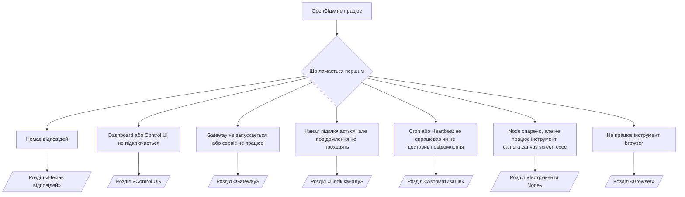

---
read_when:
    - OpenClaw не працює, і вам потрібен найшвидший шлях до виправлення
    - Ви хочете пройти потік тріажу, перш ніж занурюватися в детальні інструкції щодо усунення проблем
summary: Центр усунення несправностей OpenClaw за симптомами
title: Загальне усунення несправностей
x-i18n:
    generated_at: "2026-04-20T06:31:12Z"
    model: gpt-5.4
    provider: openai
    source_hash: cc5d8c9f804084985c672c5a003ce866e8142ab99fe81abb7a0d38e22aea4b88
    source_path: help/troubleshooting.md
    workflow: 15
---

# Усунення несправностей

Якщо у вас є лише 2 хвилини, використайте цю сторінку як початкову точку тріажу.

## Перші 60 секунд

Виконайте цю точну послідовність команд по порядку:

```bash
openclaw status
openclaw status --all
openclaw gateway probe
openclaw gateway status
openclaw doctor
openclaw channels status --probe
openclaw logs --follow
```

Ознаки коректного виводу в одному рядку:

- `openclaw status` → показує налаштовані канали й відсутність очевидних помилок автентифікації.
- `openclaw status --all` → повний звіт присутній і ним можна поділитися.
- `openclaw gateway probe` → очікуваний Gateway призначення доступний (`Reachable: yes`). `Capability: ...` показує, який рівень автентифікації змогла підтвердити перевірка, а `Read probe: limited - missing scope: operator.read` означає погіршену діагностику, а не збій з’єднання.
- `openclaw gateway status` → `Runtime: running`, `Connectivity probe: ok` і правдоподібний рядок `Capability: ...`. Використовуйте `--require-rpc`, якщо вам також потрібне підтвердження RPC з доступом на читання.
- `openclaw doctor` → немає блокувальних помилок конфігурації/сервісу.
- `openclaw channels status --probe` → доступний Gateway повертає поточний стан транспорту для кожного облікового запису разом із результатами перевірки/аудиту, наприклад `works` або `audit ok`; якщо Gateway недоступний, команда повертається до зведень лише за конфігурацією.
- `openclaw logs --follow` → стабільна активність, без повторюваних фатальних помилок.

## 429 для довгого контексту Anthropic

Якщо ви бачите:
`HTTP 429: rate_limit_error: Extra usage is required for long context requests`,
перейдіть до [/gateway/troubleshooting#anthropic-429-extra-usage-required-for-long-context](/uk/gateway/troubleshooting#anthropic-429-extra-usage-required-for-long-context).

## Локальний OpenAI-compatible бекенд працює напряму, але не працює в OpenClaw

Якщо ваш локальний або self-hosted бекенд `/v1` відповідає на малі прямі перевірки
`/v1/chat/completions`, але завершується помилкою на `openclaw infer model run` або під час звичайних
ходів агента:

1. Якщо в помилці згадується, що `messages[].content` очікує рядок, установіть
   `models.providers.<provider>.models[].compat.requiresStringContent: true`.
2. Якщо бекенд і далі дає збій лише під час ходів агента OpenClaw, установіть
   `models.providers.<provider>.models[].compat.supportsTools: false` і повторіть спробу.
3. Якщо крихітні прямі виклики все ще працюють, але більші запити OpenClaw аварійно завершують
   бекенд, вважайте решту проблеми обмеженням моделі/сервера на боці вищого рівня і
   продовжуйте в детальній інструкції:
   [/gateway/troubleshooting#local-openai-compatible-backend-passes-direct-probes-but-agent-runs-fail](/uk/gateway/troubleshooting#local-openai-compatible-backend-passes-direct-probes-but-agent-runs-fail)

## Не вдається встановити Plugin через відсутні openclaw extensions

Якщо встановлення завершується помилкою `package.json missing openclaw.extensions`, пакет Plugin
використовує стару структуру, яку OpenClaw більше не приймає.

Виправлення в пакеті Plugin:

1. Додайте `openclaw.extensions` до `package.json`.
2. Спрямуйте записи на зібрані runtime-файли (зазвичай `./dist/index.js`).
3. Повторно опублікуйте Plugin і знову виконайте `openclaw plugins install <package>`.

Приклад:

```json
{
  "name": "@openclaw/my-plugin",
  "version": "1.2.3",
  "openclaw": {
    "extensions": ["./dist/index.js"]
  }
}
```

Довідка: [Архітектура Plugin](/uk/plugins/architecture)

## Дерево рішень



<AccordionGroup>
  <Accordion title="Немає відповідей">
    ```bash
    openclaw status
    openclaw gateway status
    openclaw channels status --probe
    openclaw pairing list --channel <channel> [--account <id>]
    openclaw logs --follow
    ```

    Коректний вивід виглядає так:

    - `Runtime: running`
    - `Connectivity probe: ok`
    - `Capability: read-only`, `write-capable` або `admin-capable`
    - Ваш канал показує підключений транспорт і, де це підтримується, `works` або `audit ok` у `channels status --probe`
    - Відправника показано як схваленого (або політика DM відкрита/є в allowlist)

    Типові сигнатури в журналах:

    - `drop guild message (mention required` → обробку повідомлення було заблоковано вимогою згадки в Discord.
    - `pairing request` → відправника не схвалено, він очікує на схвалення спарювання в DM.
    - `blocked` / `allowlist` у журналах каналу → відправника, кімнату або групу відфільтровано.

    Детальні сторінки:

    - [/gateway/troubleshooting#no-replies](/uk/gateway/troubleshooting#no-replies)
    - [/channels/troubleshooting](/uk/channels/troubleshooting)
    - [/channels/pairing](/uk/channels/pairing)

  </Accordion>

  <Accordion title="Dashboard або Control UI не підключається">
    ```bash
    openclaw status
    openclaw gateway status
    openclaw logs --follow
    openclaw doctor
    openclaw channels status --probe
    ```

    Коректний вивід виглядає так:

    - `Dashboard: http://...` показано в `openclaw gateway status`
    - `Connectivity probe: ok`
    - `Capability: read-only`, `write-capable` або `admin-capable`
    - У журналах немає циклу автентифікації

    Типові сигнатури в журналах:

    - `device identity required` → HTTP/незахищений контекст не може завершити автентифікацію пристрою.
    - `origin not allowed` → `Origin` браузера не дозволений для Gateway призначення Control UI.
    - `AUTH_TOKEN_MISMATCH` із підказками повторної спроби (`canRetryWithDeviceToken=true`) → автоматично може відбутися одна повторна спроба з довіреним токеном пристрою.
    - Ця повторна спроба з кешованим токеном повторно використовує кешований набір scope, збережений разом зі спареним токеном пристрою. Виклики з явним `deviceToken` / явними `scopes` натомість зберігають запитаний ними набір scope.
    - На асинхронному шляху Tailscale Serve для Control UI невдалі спроби для одного й того ж `{scope, ip}` серіалізуються до того, як лімітер зафіксує збій, тому друга одночасна хибна повторна спроба вже може показувати `retry later`.
    - `too many failed authentication attempts (retry later)` з браузерного localhost-origin → повторні невдалі спроби з того самого `Origin` тимчасово блокуються; інший localhost-origin використовує окремий bucket.
    - повторювані `unauthorized` після цієї повторної спроби → неправильний токен/пароль, невідповідність режиму автентифікації або застарілий спарений токен пристрою.
    - `gateway connect failed:` → UI націлено на неправильний URL/порт або Gateway недоступний.

    Детальні сторінки:

    - [/gateway/troubleshooting#dashboard-control-ui-connectivity](/uk/gateway/troubleshooting#dashboard-control-ui-connectivity)
    - [/web/control-ui](/web/control-ui)
    - [/gateway/authentication](/uk/gateway/authentication)

  </Accordion>

  <Accordion title="Gateway не запускається або сервіс встановлено, але він не працює">
    ```bash
    openclaw status
    openclaw gateway status
    openclaw logs --follow
    openclaw doctor
    openclaw channels status --probe
    ```

    Коректний вивід виглядає так:

    - `Service: ... (loaded)`
    - `Runtime: running`
    - `Connectivity probe: ok`
    - `Capability: read-only`, `write-capable` або `admin-capable`

    Типові сигнатури в журналах:

    - `Gateway start blocked: set gateway.mode=local` або `existing config is missing gateway.mode` → режим Gateway встановлено як remote, або у файлі конфігурації відсутня позначка local-mode і його слід виправити.
    - `refusing to bind gateway ... without auth` → прив’язка не до loopback без дійсного шляху автентифікації Gateway (token/password або trusted-proxy, де налаштовано).
    - `another gateway instance is already listening` або `EADDRINUSE` → порт уже зайнято.

    Детальні сторінки:

    - [/gateway/troubleshooting#gateway-service-not-running](/uk/gateway/troubleshooting#gateway-service-not-running)
    - [/gateway/background-process](/uk/gateway/background-process)
    - [/gateway/configuration](/uk/gateway/configuration)

  </Accordion>

  <Accordion title="Канал підключається, але повідомлення не проходять">
    ```bash
    openclaw status
    openclaw gateway status
    openclaw logs --follow
    openclaw doctor
    openclaw channels status --probe
    ```

    Коректний вивід виглядає так:

    - Транспорт каналу підключений.
    - Перевірки pairing/allowlist проходять.
    - Згадки визначаються там, де вони обов’язкові.

    Типові сигнатури в журналах:

    - `mention required` → обробку заблоковано вимогою згадки в групі.
    - `pairing` / `pending` → відправника DM ще не схвалено.
    - `not_in_channel`, `missing_scope`, `Forbidden`, `401/403` → проблема з токеном дозволів каналу.

    Детальні сторінки:

    - [/gateway/troubleshooting#channel-connected-messages-not-flowing](/uk/gateway/troubleshooting#channel-connected-messages-not-flowing)
    - [/channels/troubleshooting](/uk/channels/troubleshooting)

  </Accordion>

  <Accordion title="Cron або Heartbeat не спрацював чи не доставив повідомлення">
    ```bash
    openclaw status
    openclaw gateway status
    openclaw cron status
    openclaw cron list
    openclaw cron runs --id <jobId> --limit 20
    openclaw logs --follow
    ```

    Коректний вивід виглядає так:

    - `cron.status` показує, що його ввімкнено, і вказує час наступного пробудження.
    - `cron runs` показує нещодавні записи `ok`.
    - Heartbeat увімкнено й він не поза межами активних годин.

    Типові сигнатури в журналах:

    - `cron: scheduler disabled; jobs will not run automatically` → Cron вимкнено.
    - `heartbeat skipped` з `reason=quiet-hours` → поза налаштованими активними годинами.
    - `heartbeat skipped` з `reason=empty-heartbeat-file` → `HEARTBEAT.md` існує, але містить лише порожній/header-only каркас.
    - `heartbeat skipped` з `reason=no-tasks-due` → увімкнено режим завдань `HEARTBEAT.md`, але час для жодного з інтервалів завдань ще не настав.
    - `heartbeat skipped` з `reason=alerts-disabled` → усю видимість Heartbeat вимкнено (`showOk`, `showAlerts` і `useIndicator` усі вимкнені).
    - `requests-in-flight` → основна смуга зайнята; пробудження Heartbeat було відкладено.
    - `unknown accountId` → цільовий account доставки Heartbeat не існує.

    Детальні сторінки:

    - [/gateway/troubleshooting#cron-and-heartbeat-delivery](/uk/gateway/troubleshooting#cron-and-heartbeat-delivery)
    - [/automation/cron-jobs#troubleshooting](/uk/automation/cron-jobs#troubleshooting)
    - [/gateway/heartbeat](/uk/gateway/heartbeat)

    </Accordion>

    <Accordion title="Node спарено, але інструмент не працює: camera canvas screen exec">
      ```bash
      openclaw status
      openclaw gateway status
      openclaw nodes status
      openclaw nodes describe --node <idOrNameOrIp>
      openclaw logs --follow
      ```

      Коректний вивід виглядає так:

      - Node показано як підключений і спарений для ролі `node`.
      - Для команди, яку ви викликаєте, існує Capability.
      - Для інструмента надано стан дозволу.

      Типові сигнатури в журналах:

      - `NODE_BACKGROUND_UNAVAILABLE` → переведіть застосунок Node на передній план.
      - `*_PERMISSION_REQUIRED` → дозвіл ОС було відхилено/він відсутній.
      - `SYSTEM_RUN_DENIED: approval required` → очікується схвалення exec.
      - `SYSTEM_RUN_DENIED: allowlist miss` → команди немає в allowlist для exec.

      Детальні сторінки:

      - [/gateway/troubleshooting#node-paired-tool-fails](/uk/gateway/troubleshooting#node-paired-tool-fails)
      - [/nodes/troubleshooting](/uk/nodes/troubleshooting)
      - [/tools/exec-approvals](/uk/tools/exec-approvals)

    </Accordion>

    <Accordion title="Exec раптом почав просити схвалення">
      ```bash
      openclaw config get tools.exec.host
      openclaw config get tools.exec.security
      openclaw config get tools.exec.ask
      openclaw gateway restart
      ```

      Що змінилося:

      - Якщо `tools.exec.host` не встановлено, значенням за замовчуванням є `auto`.
      - `host=auto` визначається як `sandbox`, коли активне sandbox runtime, і як `gateway` в іншому разі.
      - `host=auto` впливає лише на маршрутизацію; поведінка "YOLO" без запитів походить від `security=full` разом із `ask=off` на gateway/node.
      - Для `gateway` і `node`, якщо `tools.exec.security` не встановлено, значенням за замовчуванням є `full`.
      - Якщо `tools.exec.ask` не встановлено, значенням за замовчуванням є `off`.
      - Результат: якщо ви бачите запити на схвалення, значить якась локальна для хоста або поточної сесії політика зробила exec суворішим порівняно з поточними значеннями за замовчуванням.

      Відновіть поточну поведінку без схвалень за замовчуванням:

      ```bash
      openclaw config set tools.exec.host gateway
      openclaw config set tools.exec.security full
      openclaw config set tools.exec.ask off
      openclaw gateway restart
      ```

      Безпечніші альтернативи:

      - Установіть лише `tools.exec.host=gateway`, якщо вам потрібна просто стабільна маршрутизація хоста.
      - Використовуйте `security=allowlist` разом із `ask=on-miss`, якщо хочете exec на хості, але все одно хочете перевірку для промахів повз allowlist.
      - Увімкніть sandbox mode, якщо хочете, щоб `host=auto` знову визначався як `sandbox`.

      Типові сигнатури в журналах:

      - `Approval required.` → команда очікує на `/approve ...`.
      - `SYSTEM_RUN_DENIED: approval required` → очікується схвалення exec на вузлі-хості.
      - `exec host=sandbox requires a sandbox runtime for this session` → неявний/явний вибір sandbox, але sandbox mode вимкнено.

      Детальні сторінки:

      - [/tools/exec](/uk/tools/exec)
      - [/tools/exec-approvals](/uk/tools/exec-approvals)
      - [/gateway/security#what-the-audit-checks-high-level](/uk/gateway/security#what-the-audit-checks-high-level)

    </Accordion>

    <Accordion title="Не працює інструмент browser">
      ```bash
      openclaw status
      openclaw gateway status
      openclaw browser status
      openclaw logs --follow
      openclaw doctor
      ```

      Коректний вивід виглядає так:

      - Статус browser показує `running: true` і вибраний browser/profile.
      - `openclaw` запускається, або `user` може бачити локальні вкладки Chrome.

      Типові сигнатури в журналах:

      - `unknown command "browser"` або `unknown command 'browser'` → встановлено `plugins.allow`, і воно не містить `browser`.
      - `Failed to start Chrome CDP on port` → не вдалося запустити локальний browser Chrome.
      - `browser.executablePath not found` → налаштований шлях до бінарного файла неправильний.
      - `browser.cdpUrl must be http(s) or ws(s)` → налаштований CDP URL використовує непідтримувану схему.
      - `browser.cdpUrl has invalid port` → налаштований CDP URL має неправильний або неприпустимий порт.
      - `No Chrome tabs found for profile="user"` → профіль приєднання Chrome MCP не має відкритих локальних вкладок Chrome.
      - `Remote CDP for profile "<name>" is not reachable` → налаштована віддалена кінцева точка CDP недоступна з цього хоста.
      - `Browser attachOnly is enabled ... not reachable` або `Browser attachOnly is enabled and CDP websocket ... is not reachable` → профіль attach-only не має активної цілі CDP.
      - застарілі перевизначення viewport / dark-mode / locale / offline на профілях attach-only або remote CDP → виконайте `openclaw browser stop --browser-profile <name>`, щоб закрити активну керовану сесію й скинути стан емуляції без перезапуску gateway.

      Детальні сторінки:

      - [/gateway/troubleshooting#browser-tool-fails](/uk/gateway/troubleshooting#browser-tool-fails)
      - [/tools/browser#missing-browser-command-or-tool](/uk/tools/browser#missing-browser-command-or-tool)
      - [/tools/browser-linux-troubleshooting](/uk/tools/browser-linux-troubleshooting)
      - [/tools/browser-wsl2-windows-remote-cdp-troubleshooting](/uk/tools/browser-wsl2-windows-remote-cdp-troubleshooting)

    </Accordion>

  </AccordionGroup>

## Пов’язане

- [FAQ](/uk/help/faq) — поширені запитання
- [Усунення несправностей Gateway](/uk/gateway/troubleshooting) — проблеми, пов’язані з Gateway
- [Doctor](/uk/gateway/doctor) — автоматизовані перевірки стану й виправлення
- [Усунення несправностей каналів](/uk/channels/troubleshooting) — проблеми з підключенням каналів
- [Усунення несправностей автоматизації](/uk/automation/cron-jobs#troubleshooting) — проблеми з Cron і Heartbeat
