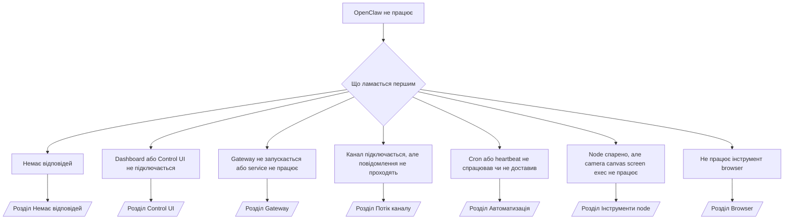

---
read_when:
    - OpenClaw не працює, і вам потрібен найшвидший шлях до виправлення
    - Вам потрібен процес первинної діагностики перед переходом до глибоких runbook
summary: Центр усунення несправностей OpenClaw з підходом «спершу симптом»
title: Загальне усунення несправностей
x-i18n:
    generated_at: "2026-04-05T18:06:22Z"
    model: gpt-5.4
    provider: openai
    source_hash: 23ae9638af5edf5a5e0584ccb15ba404223ac3b16c2d62eb93b2c9dac171c252
    source_path: help/troubleshooting.md
    workflow: 15
---

# Усунення несправностей

Якщо у вас є лише 2 хвилини, використовуйте цю сторінку як вхідну точку для первинної діагностики.

## Перші 60 секунд

Виконайте цю точну послідовність команд у такому порядку:

```bash
openclaw status
openclaw status --all
openclaw gateway probe
openclaw gateway status
openclaw doctor
openclaw channels status --probe
openclaw logs --follow
```

Хороший результат в один рядок:

- `openclaw status` → показує налаштовані канали й не має очевидних помилок auth.
- `openclaw status --all` → повний звіт присутній і ним можна поділитися.
- `openclaw gateway probe` → очікувана ціль gateway доступна (`Reachable: yes`). `RPC: limited - missing scope: operator.read` означає погіршену діагностику, а не збій підключення.
- `openclaw gateway status` → `Runtime: running` і `RPC probe: ok`.
- `openclaw doctor` → немає блокувальних помилок config/service.
- `openclaw channels status --probe` → за доступного gateway повертає live-стан транспорту для кожного облікового запису
  плюс результати probe/audit, наприклад `works` або `audit ok`; якщо
  gateway недоступний, команда повертається до зведень лише з config.
- `openclaw logs --follow` → стабільна активність, без повторюваних фатальних помилок.

## Anthropic long context 429

Якщо ви бачите:
`HTTP 429: rate_limit_error: Extra usage is required for long context requests`,
перейдіть до [/gateway/troubleshooting#anthropic-429-extra-usage-required-for-long-context](/gateway/troubleshooting#anthropic-429-extra-usage-required-for-long-context).

## Не вдається встановити plugin через відсутні openclaw extensions

Якщо встановлення завершується помилкою `package.json missing openclaw.extensions`, пакет plugin
використовує стару структуру, яку OpenClaw більше не приймає.

Виправлення в пакеті plugin:

1. Додайте `openclaw.extensions` до `package.json`.
2. Спрямуйте записи на зібрані runtime-файли (зазвичай `./dist/index.js`).
3. Опублікуйте plugin знову й ще раз виконайте `openclaw plugins install <package>`.

Приклад:

```json
{
  "name": "@openclaw/my-plugin",
  "version": "1.2.3",
  "openclaw": {
    "extensions": ["./dist/index.js"]
  }
}
```

Довідка: [Архітектура plugins](/plugins/architecture)

## Дерево рішень



<AccordionGroup>
  <Accordion title="Немає відповідей">
    ```bash
    openclaw status
    openclaw gateway status
    openclaw channels status --probe
    openclaw pairing list --channel <channel> [--account <id>]
    openclaw logs --follow
    ```

    Хороший результат виглядає так:

    - `Runtime: running`
    - `RPC probe: ok`
    - Ваш канал показує підключений транспорт і, де це підтримується, `works` або `audit ok` у `channels status --probe`
    - Відправник схвалений (або політика DM має значення open/allowlist)

    Поширені сигнатури в логах:

    - `drop guild message (mention required` → gating згадувань заблокував повідомлення в Discord.
    - `pairing request` → відправник не схвалений і чекає схвалення pairing у DM.
    - `blocked` / `allowlist` у логах каналу → відправник, кімната або група відфільтровані.

    Детальні сторінки:

    - [/gateway/troubleshooting#no-replies](/gateway/troubleshooting#no-replies)
    - [/channels/troubleshooting](/channels/troubleshooting)
    - [/channels/pairing](/channels/pairing)

  </Accordion>

  <Accordion title="Dashboard або Control UI не підключається">
    ```bash
    openclaw status
    openclaw gateway status
    openclaw logs --follow
    openclaw doctor
    openclaw channels status --probe
    ```

    Хороший результат виглядає так:

    - `Dashboard: http://...` показано в `openclaw gateway status`
    - `RPC probe: ok`
    - У логах немає циклу auth

    Поширені сигнатури в логах:

    - `device identity required` → контекст HTTP/non-secure не може завершити auth пристрою.
    - `origin not allowed` → `Origin` браузера не дозволений для цілі gateway Control UI.
    - `AUTH_TOKEN_MISMATCH` із підказками повторної спроби (`canRetryWithDeviceToken=true`) → може автоматично відбутися одна довірена повторна спроба з токеном пристрою.
    - Ця повторна спроба з кешованим токеном повторно використовує кешований набір scope, збережений разом із токеном спареного
      пристрою. Викликачі з явним `deviceToken` / явними `scopes` зберігають
      свій запитаний набір scope.
    - В асинхронному шляху Tailscale Serve для Control UI невдалі спроби для того самого
      `{scope, ip}` серіалізуються до того, як обмежувач зафіксує невдачу, тож
      друга одночасна хибна повторна спроба вже може показати `retry later`.
    - `too many failed authentication attempts (retry later)` від origin браузера на localhost → повторні невдалі спроби з того самого `Origin` тимчасово
      блокуються; інший origin localhost використовує окремий bucket.
    - повторювані `unauthorized` після цієї повторної спроби → неправильний token/password, невідповідність режиму auth або застарілий токен спареного пристрою.
    - `gateway connect failed:` → UI націлено на неправильний URL/порт або на недоступний gateway.

    Детальні сторінки:

    - [/gateway/troubleshooting#dashboard-control-ui-connectivity](/gateway/troubleshooting#dashboard-control-ui-connectivity)
    - [/web/control-ui](/web/control-ui)
    - [/gateway/authentication](/gateway/authentication)

  </Accordion>

  <Accordion title="Gateway не запускається або service встановлено, але він не працює">
    ```bash
    openclaw status
    openclaw gateway status
    openclaw logs --follow
    openclaw doctor
    openclaw channels status --probe
    ```

    Хороший результат виглядає так:

    - `Service: ... (loaded)`
    - `Runtime: running`
    - `RPC probe: ok`

    Поширені сигнатури в логах:

    - `Gateway start blocked: set gateway.mode=local` або `existing config is missing gateway.mode` → режим gateway має значення remote або у файлі config немає позначки local-mode, і це слід виправити.
    - `refusing to bind gateway ... without auth` → bind не на loopback без дійсного шляху auth для gateway (token/password або trusted-proxy, де це налаштовано).
    - `another gateway instance is already listening` або `EADDRINUSE` → порт уже зайнято.

    Детальні сторінки:

    - [/gateway/troubleshooting#gateway-service-not-running](/gateway/troubleshooting#gateway-service-not-running)
    - [/gateway/background-process](/gateway/background-process)
    - [/gateway/configuration](/gateway/configuration)

  </Accordion>

  <Accordion title="Канал підключається, але повідомлення не проходять">
    ```bash
    openclaw status
    openclaw gateway status
    openclaw logs --follow
    openclaw doctor
    openclaw channels status --probe
    ```

    Хороший результат виглядає так:

    - Транспорт каналу підключений.
    - Перевірки pairing/allowlist проходять.
    - Згадування виявляються там, де це потрібно.

    Поширені сигнатури в логах:

    - `mention required` → gating згадувань заблокував обробку.
    - `pairing` / `pending` → відправник DM ще не схвалений.
    - `not_in_channel`, `missing_scope`, `Forbidden`, `401/403` → проблема з token дозволів каналу.

    Детальні сторінки:

    - [/gateway/troubleshooting#channel-connected-messages-not-flowing](/gateway/troubleshooting#channel-connected-messages-not-flowing)
    - [/channels/troubleshooting](/channels/troubleshooting)

  </Accordion>

  <Accordion title="Cron або heartbeat не спрацював чи не доставив">
    ```bash
    openclaw status
    openclaw gateway status
    openclaw cron status
    openclaw cron list
    openclaw cron runs --id <jobId> --limit 20
    openclaw logs --follow
    ```

    Хороший результат виглядає так:

    - `cron.status` показує, що функцію ввімкнено і є наступне пробудження.
    - `cron runs` показує нещодавні записи `ok`.
    - Heartbeat увімкнено і він не поза активними годинами.

    Поширені сигнатури в логах:

- `cron: scheduler disabled; jobs will not run automatically` → cron вимкнено.
- `heartbeat skipped` з `reason=quiet-hours` → поза налаштованими активними годинами.
- `heartbeat skipped` з `reason=empty-heartbeat-file` → `HEARTBEAT.md` існує, але містить лише порожній або суто заголовковий шаблон.
- `heartbeat skipped` з `reason=no-tasks-due` → у `HEARTBEAT.md` активний режим завдань, але жоден із інтервалів завдань ще не настав.
- `heartbeat skipped` з `reason=alerts-disabled` → усю видимість heartbeat вимкнено (`showOk`, `showAlerts` і `useIndicator` усі вимкнені).
- `requests-in-flight` → основна смуга зайнята; heartbeat wake було відкладено. - `unknown accountId` → accountId цілі доставки heartbeat не існує.

      Детальні сторінки:

      - [/gateway/troubleshooting#cron-and-heartbeat-delivery](/gateway/troubleshooting#cron-and-heartbeat-delivery)
      - [/automation/cron-jobs#troubleshooting](/automation/cron-jobs#troubleshooting)
      - [/gateway/heartbeat](/gateway/heartbeat)

    </Accordion>

    <Accordion title="Node спарено, але інструмент не працює: camera canvas screen exec">
      ```bash
      openclaw status
      openclaw gateway status
      openclaw nodes status
      openclaw nodes describe --node <idOrNameOrIp>
      openclaw logs --follow
      ```

      Хороший результат виглядає так:

      - Node показано як підключений і спарений для role `node`.
      - Для команди, яку ви викликаєте, існує відповідна capability.
      - Стан permission для інструмента дозволений.

      Поширені сигнатури в логах:

      - `NODE_BACKGROUND_UNAVAILABLE` → переведіть застосунок node на передній план.
      - `*_PERMISSION_REQUIRED` → permission ОС відсутній або був відхилений.
      - `SYSTEM_RUN_DENIED: approval required` → approval для exec очікує рішення.
      - `SYSTEM_RUN_DENIED: allowlist miss` → команди немає в allowlist exec.

      Детальні сторінки:

      - [/gateway/troubleshooting#node-paired-tool-fails](/gateway/troubleshooting#node-paired-tool-fails)
      - [/nodes/troubleshooting](/nodes/troubleshooting)
      - [/tools/exec-approvals](/tools/exec-approvals)

    </Accordion>

    <Accordion title="Exec раптом почав запитувати approval">
      ```bash
      openclaw config get tools.exec.host
      openclaw config get tools.exec.security
      openclaw config get tools.exec.ask
      openclaw gateway restart
      ```

      Що змінилося:

      - Якщо `tools.exec.host` не задано, типовим є `auto`.
      - `host=auto` визначається як `sandbox`, коли активний runtime sandbox, і як `gateway` — в іншому разі.
      - `host=auto` відповідає лише за маршрутизацію; поведінка без запитів у стилі "YOLO" походить від `security=full` плюс `ask=off` на gateway/node.
      - Для `gateway` і `node`, якщо `tools.exec.security` не задано, типове значення — `full`.
      - Якщо `tools.exec.ask` не задано, типове значення — `off`.
      - Підсумок: якщо ви бачите approval, значить якась локальна для хоста або для сесії політика посилила exec порівняно з поточними типовими значеннями.

      Відновлення поточної типової поведінки без approval:

      ```bash
      openclaw config set tools.exec.host gateway
      openclaw config set tools.exec.security full
      openclaw config set tools.exec.ask off
      openclaw gateway restart
      ```

      Безпечніші альтернативи:

      - Задайте лише `tools.exec.host=gateway`, якщо вам просто потрібна стабільна маршрутизація до хоста.
      - Використовуйте `security=allowlist` з `ask=on-miss`, якщо хочете exec на хості, але все одно хочете перевірку при промахах по allowlist.
      - Увімкніть режим sandbox, якщо хочете, щоб `host=auto` знову визначався як `sandbox`.

      Поширені сигнатури в логах:

      - `Approval required.` → команда чекає на `/approve ...`.
      - `SYSTEM_RUN_DENIED: approval required` → approval для exec на хості node очікує рішення.
      - `exec host=sandbox requires a sandbox runtime for this session` → неявний/явний вибір sandbox, але режим sandbox вимкнено.

      Детальні сторінки:

      - [/tools/exec](/tools/exec)
      - [/tools/exec-approvals](/tools/exec-approvals)
      - [/gateway/security#runtime-expectation-drift](/gateway/security#runtime-expectation-drift)

    </Accordion>

    <Accordion title="Не працює інструмент browser">
      ```bash
      openclaw status
      openclaw gateway status
      openclaw browser status
      openclaw logs --follow
      openclaw doctor
      ```

      Хороший результат виглядає так:

      - Статус browser показує `running: true` і вибраний browser/profile.
      - `openclaw` запускається, або `user` бачить локальні вкладки Chrome.

      Поширені сигнатури в логах:

      - `unknown command "browser"` або `unknown command 'browser'` → `plugins.allow` задано, але не містить `browser`.
      - `Failed to start Chrome CDP on port` → не вдалося запустити локальний browser.
      - `browser.executablePath not found` → налаштований шлях до бінарного файлу неправильний.
      - `browser.cdpUrl must be http(s) or ws(s)` → налаштований URL CDP використовує непідтримувану схему.
      - `browser.cdpUrl has invalid port` → налаштований URL CDP містить неправильний або неприпустимий порт.
      - `No Chrome tabs found for profile="user"` → у профілі приєднання Chrome MCP немає відкритих локальних вкладок Chrome.
      - `Remote CDP for profile "<name>" is not reachable` → налаштований віддалений ендпоїнт CDP недоступний із цього хоста.
      - `Browser attachOnly is enabled ... not reachable` або `Browser attachOnly is enabled and CDP websocket ... is not reachable` → профіль attach-only не має живої цілі CDP.
      - застарілі перевизначення viewport / dark-mode / locale / offline для профілів attach-only або remote CDP → виконайте `openclaw browser stop --browser-profile <name>`, щоб закрити активну сесію керування й скинути стан емуляції без перезапуску gateway.

      Детальні сторінки:

      - [/gateway/troubleshooting#browser-tool-fails](/gateway/troubleshooting#browser-tool-fails)
      - [/tools/browser#missing-browser-command-or-tool](/tools/browser#missing-browser-command-or-tool)
      - [/tools/browser-linux-troubleshooting](/tools/browser-linux-troubleshooting)
      - [/tools/browser-wsl2-windows-remote-cdp-troubleshooting](/tools/browser-wsl2-windows-remote-cdp-troubleshooting)

    </Accordion>
  </AccordionGroup>

## Пов’язане

- [FAQ](/help/faq) — часті запитання
- [Усунення несправностей Gateway](/gateway/troubleshooting) — проблеми, специфічні для gateway
- [Doctor](/gateway/doctor) — автоматичні перевірки стану та виправлення
- [Усунення несправностей каналів](/channels/troubleshooting) — проблеми з підключенням каналів
- [Усунення несправностей автоматизації](/automation/cron-jobs#troubleshooting) — проблеми cron і heartbeat
