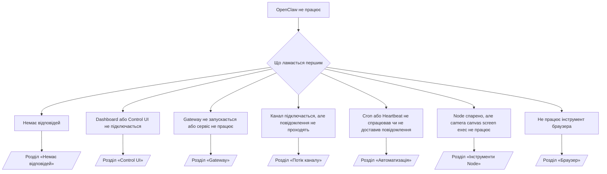

---
read_when:
    - OpenClaw не працює, і вам потрібен найшвидший шлях до виправлення
    - Ви хочете пройти процес тріажу, перш ніж заглиблюватися в докладні інструкції з усунення проблем
summary: Центр усунення несправностей OpenClaw за симптомами
title: Загальне усунення несправностей
x-i18n:
    generated_at: "2026-04-23T18:24:13Z"
    model: gpt-5.4
    provider: openai
    source_hash: c6931ea9a8f29de0aa42c0afdf554e223fd2a794e95dce4f4795db99301d2c44
    source_path: help/troubleshooting.md
    workflow: 15
---

# Усунення несправностей

Якщо у вас є лише 2 хвилини, використовуйте цю сторінку як вхідну точку для тріажу.

## Перші 60 секунд

Виконайте цю точну послідовність команд у вказаному порядку:

```bash
openclaw status
openclaw status --all
openclaw gateway probe
openclaw gateway status
openclaw doctor
openclaw channels status --probe
openclaw logs --follow
```

Хороший результат в один рядок:

- `openclaw status` → показує налаштовані канали та відсутність явних помилок автентифікації.
- `openclaw status --all` → повний звіт наявний і ним можна поділитися.
- `openclaw gateway probe` → очікувана ціль Gateway доступна (`Reachable: yes`). `Capability: ...` показує, який рівень автентифікації вдалося підтвердити перевіркою, а `Read probe: limited - missing scope: operator.read` означає погіршену діагностику, а не збій з’єднання.
- `openclaw gateway status` → `Runtime: running`, `Connectivity probe: ok` і правдоподібний рядок `Capability: ...`. Використовуйте `--require-rpc`, якщо вам також потрібне підтвердження RPC з областю читання.
- `openclaw doctor` → відсутні блокувальні помилки конфігурації або сервісу.
- `openclaw channels status --probe` → доступний Gateway повертає живий стан транспорту для кожного облікового запису разом із результатами probe/audit, такими як `works` або `audit ok`; якщо Gateway недоступний, команда повертається до зведень лише на основі конфігурації.
- `openclaw logs --follow` → стабільна активність, без повторюваних фатальних помилок.

## 429 для довгого контексту Anthropic

Якщо ви бачите:
`HTTP 429: rate_limit_error: Extra usage is required for long context requests`,
перейдіть до [/gateway/troubleshooting#anthropic-429-extra-usage-required-for-long-context](/uk/gateway/troubleshooting#anthropic-429-extra-usage-required-for-long-context).

## Локальний OpenAI-compatible бекенд працює напряму, але не працює в OpenClaw

Якщо ваш локальний або самостійно розгорнутий `/v1` бекенд відповідає на невеликі прямі перевірки `/v1/chat/completions`, але не працює з `openclaw infer model run` або під час звичайних ходів агента:

1. Якщо в помилці згадується, що `messages[].content` очікує рядок, встановіть `models.providers.<provider>.models[].compat.requiresStringContent: true`.
2. Якщо бекенд і далі не працює лише під час ходів агента OpenClaw, встановіть `models.providers.<provider>.models[].compat.supportsTools: false` і повторіть спробу.
3. Якщо крихітні прямі виклики все ще працюють, але більші підказки OpenClaw аварійно завершують роботу бекенда, розглядайте решту проблеми як обмеження моделі/сервера на боці upstream і переходьте до докладної інструкції:
   [/gateway/troubleshooting#local-openai-compatible-backend-passes-direct-probes-but-agent-runs-fail](/uk/gateway/troubleshooting#local-openai-compatible-backend-passes-direct-probes-but-agent-runs-fail)

## Не вдається встановити Plugin через відсутні openclaw extensions

Якщо встановлення завершується помилкою `package.json missing openclaw.extensions`, пакет Plugin використовує старий формат, який OpenClaw більше не приймає.

Виправлення в пакеті Plugin:

1. Додайте `openclaw.extensions` до `package.json`.
2. Спрямуйте записи на зібрані runtime-файли (зазвичай `./dist/index.js`).
3. Повторно опублікуйте Plugin і знову виконайте `openclaw plugins install <package>`.

Приклад:

```json
{
  "name": "@openclaw/my-plugin",
  "version": "1.2.3",
  "openclaw": {
    "extensions": ["./dist/index.js"]
  }
}
```

Довідка: [Архітектура Plugin](/uk/plugins/architecture)

## Дерево рішень



<AccordionGroup>
  <Accordion title="Немає відповідей">
    ```bash
    openclaw status
    openclaw gateway status
    openclaw channels status --probe
    openclaw pairing list --channel <channel> [--account <id>]
    openclaw logs --follow
    ```

    Хороший результат виглядає так:

    - `Runtime: running`
    - `Connectivity probe: ok`
    - `Capability: read-only`, `write-capable` або `admin-capable`
    - Ваш канал показує підключений транспорт і, де це підтримується, `works` або `audit ok` у `channels status --probe`
    - Відправника показано як схваленого (або політика DM відкрита/дозволений список)

    Поширені сигнатури в журналах:

    - `drop guild message (mention required` → у Discord повідомлення було заблоковане вимогою згадки.
    - `pairing request` → відправник не схвалений і очікує підтвердження спарювання DM.
    - `blocked` / `allowlist` у журналах каналу → відправник, кімната або група фільтруються.

    Докладні сторінки:

    - [/gateway/troubleshooting#no-replies](/uk/gateway/troubleshooting#no-replies)
    - [/channels/troubleshooting](/uk/channels/troubleshooting)
    - [/channels/pairing](/uk/channels/pairing)

  </Accordion>

  <Accordion title="Dashboard або Control UI не підключається">
    ```bash
    openclaw status
    openclaw gateway status
    openclaw logs --follow
    openclaw doctor
    openclaw channels status --probe
    ```

    Хороший результат виглядає так:

    - `Dashboard: http://...` показано в `openclaw gateway status`
    - `Connectivity probe: ok`
    - `Capability: read-only`, `write-capable` або `admin-capable`
    - У журналах немає циклу автентифікації

    Поширені сигнатури в журналах:

    - `device identity required` → HTTP/незахищений контекст не може завершити автентифікацію пристрою.
    - `origin not allowed` → `Origin` браузера не дозволений для цілі Gateway у Control UI.
    - `AUTH_TOKEN_MISMATCH` із підказками для повтору (`canRetryWithDeviceToken=true`) → одна довірена повторна спроба з токеном пристрою може відбутися автоматично.
    - Ця повторна спроба з кешованим токеном повторно використовує кешований набір областей, збережений разом зі спареним токеном пристрою. Виклики з явним `deviceToken` / явними `scopes` замість цього зберігають власний запитаний набір областей.
    - В асинхронному шляху Tailscale Serve для Control UI невдалі спроби для того самого `{scope, ip}` серіалізуються до того, як обмежувач зафіксує збій, тому друга одночасна хибна повторна спроба вже може показувати `retry later`.
    - `too many failed authentication attempts (retry later)` з локального джерела браузера localhost → повторні невдалі спроби з цього самого `Origin` тимчасово блокуються; інше джерело localhost використовує окремий bucket.
    - повторюване `unauthorized` після цієї повторної спроби → неправильний токен/пароль, невідповідний режим автентифікації або застарілий спарений токен пристрою.
    - `gateway connect failed:` → UI націлений на неправильний URL/порт або Gateway недоступний.

    Докладні сторінки:

    - [/gateway/troubleshooting#dashboard-control-ui-connectivity](/uk/gateway/troubleshooting#dashboard-control-ui-connectivity)
    - [/web/control-ui](/uk/web/control-ui)
    - [/gateway/authentication](/uk/gateway/authentication)

  </Accordion>

  <Accordion title="Gateway не запускається або сервіс встановлено, але він не працює">
    ```bash
    openclaw status
    openclaw gateway status
    openclaw logs --follow
    openclaw doctor
    openclaw channels status --probe
    ```

    Хороший результат виглядає так:

    - `Service: ... (loaded)`
    - `Runtime: running`
    - `Connectivity probe: ok`
    - `Capability: read-only`, `write-capable` або `admin-capable`

    Поширені сигнатури в журналах:

    - `Gateway start blocked: set gateway.mode=local` або `existing config is missing gateway.mode` → режим Gateway віддалений, або у файлі конфігурації відсутня позначка локального режиму і його слід відновити.
    - `refusing to bind gateway ... without auth` → прив’язка не-loopback без дійсного шляху автентифікації Gateway (токен/пароль або trusted-proxy, якщо налаштовано).
    - `another gateway instance is already listening` або `EADDRINUSE` → порт уже зайнятий.

    Докладні сторінки:

    - [/gateway/troubleshooting#gateway-service-not-running](/uk/gateway/troubleshooting#gateway-service-not-running)
    - [/gateway/background-process](/uk/gateway/background-process)
    - [/gateway/configuration](/uk/gateway/configuration)

  </Accordion>

  <Accordion title="Канал підключається, але повідомлення не проходять">
    ```bash
    openclaw status
    openclaw gateway status
    openclaw logs --follow
    openclaw doctor
    openclaw channels status --probe
    ```

    Хороший результат виглядає так:

    - Транспорт каналу підключений.
    - Перевірки pairing/allowlist успішні.
    - Згадки виявляються там, де вони потрібні.

    Поширені сигнатури в журналах:

    - `mention required` → обробку заблоковано вимогою згадки в групі.
    - `pairing` / `pending` → відправника в DM ще не схвалено.
    - `not_in_channel`, `missing_scope`, `Forbidden`, `401/403` → проблема з токеном дозволів каналу.

    Докладні сторінки:

    - [/gateway/troubleshooting#channel-connected-messages-not-flowing](/uk/gateway/troubleshooting#channel-connected-messages-not-flowing)
    - [/channels/troubleshooting](/uk/channels/troubleshooting)

  </Accordion>

  <Accordion title="Cron або Heartbeat не спрацював чи не доставив повідомлення">
    ```bash
    openclaw status
    openclaw gateway status
    openclaw cron status
    openclaw cron list
    openclaw cron runs --id <jobId> --limit 20
    openclaw logs --follow
    ```

    Хороший результат виглядає так:

    - `cron.status` показує, що все ввімкнено і є наступне пробудження.
    - `cron runs` показує недавні записи `ok`.
    - Heartbeat увімкнено і він не поза межами активних годин.

    Поширені сигнатури в журналах:

    - `cron: scheduler disabled; jobs will not run automatically` → Cron вимкнено.
    - `heartbeat skipped` з `reason=quiet-hours` → поза налаштованими активними годинами.
    - `heartbeat skipped` з `reason=empty-heartbeat-file` → `HEARTBEAT.md` існує, але містить лише порожній/лише-заголовки каркас.
    - `heartbeat skipped` з `reason=no-tasks-due` → у `HEARTBEAT.md` активний режим завдань, але ще не настав час для жодного з інтервалів завдань.
    - `heartbeat skipped` з `reason=alerts-disabled` → усю видимість Heartbeat вимкнено (`showOk`, `showAlerts` і `useIndicator` усі вимкнені).
    - `requests-in-flight` → основна смуга зайнята; пробудження Heartbeat було відкладене.
    - `unknown accountId` → цільовий обліковий запис доставки Heartbeat не існує.

    Докладні сторінки:

    - [/gateway/troubleshooting#cron-and-heartbeat-delivery](/uk/gateway/troubleshooting#cron-and-heartbeat-delivery)
    - [/automation/cron-jobs#troubleshooting](/uk/automation/cron-jobs#troubleshooting)
    - [/gateway/heartbeat](/uk/gateway/heartbeat)

  </Accordion>

  <Accordion title="Node спарено, але інструмент не працює: camera canvas screen exec">
    ```bash
    openclaw status
    openclaw gateway status
    openclaw nodes status
    openclaw nodes describe --node <idOrNameOrIp>
    openclaw logs --follow
    ```

    Хороший результат виглядає так:

    - Node указано як підключений і спарений для ролі `node`.
    - Для команди, яку ви викликаєте, існує Capability.
    - Стан дозволів для інструмента надано.

    Поширені сигнатури в журналах:

    - `NODE_BACKGROUND_UNAVAILABLE` → переведіть застосунок node на передній план.
    - `*_PERMISSION_REQUIRED` → дозвіл ОС було відхилено/відсутній.
    - `SYSTEM_RUN_DENIED: approval required` → очікується схвалення exec.
    - `SYSTEM_RUN_DENIED: allowlist miss` → команди немає в allowlist exec.

    Докладні сторінки:

    - [/gateway/troubleshooting#node-paired-tool-fails](/uk/gateway/troubleshooting#node-paired-tool-fails)
    - [/nodes/troubleshooting](/uk/nodes/troubleshooting)
    - [/tools/exec-approvals](/uk/tools/exec-approvals)

  </Accordion>

  <Accordion title="Exec раптово просить схвалення">
    ```bash
    openclaw config get tools.exec.host
    openclaw config get tools.exec.security
    openclaw config get tools.exec.ask
    openclaw gateway restart
    ```

    Що змінилося:

    - Якщо `tools.exec.host` не задано, значенням за замовчуванням є `auto`.
    - `host=auto` перетворюється на `sandbox`, коли активне runtime sandbox, і на `gateway` в іншому випадку.
    - `host=auto` відповідає лише за маршрутизацію; поведінка без запитів "YOLO" походить від `security=full` разом із `ask=off` на gateway/node.
    - Для `gateway` і `node`, якщо `tools.exec.security` не задано, за замовчуванням використовується `full`.
    - Якщо `tools.exec.ask` не задано, за замовчуванням використовується `off`.
    - Результат: якщо ви бачите запити на схвалення, це означає, що якась локальна для хоста або поточної сесії політика зробила exec суворішим порівняно з поточними значеннями за замовчуванням.

    Відновлення поточної стандартної поведінки без схвалення:

    ```bash
    openclaw config set tools.exec.host gateway
    openclaw config set tools.exec.security full
    openclaw config set tools.exec.ask off
    openclaw gateway restart
    ```

    Безпечніші альтернативи:

    - Встановіть лише `tools.exec.host=gateway`, якщо вам просто потрібна стабільна маршрутизація хоста.
    - Використовуйте `security=allowlist` разом із `ask=on-miss`, якщо вам потрібен host exec, але ви все ще хочете перевірку в разі промахів по allowlist.
    - Увімкніть режим sandbox, якщо хочете, щоб `host=auto` знову перетворювався на `sandbox`.

    Поширені сигнатури в журналах:

    - `Approval required.` → команда очікує на `/approve ...`.
    - `SYSTEM_RUN_DENIED: approval required` → очікується схвалення exec для хоста node.
    - `exec host=sandbox requires a sandbox runtime for this session` → неявно/явно вибрано sandbox, але режим sandbox вимкнено.

    Докладні сторінки:

    - [/tools/exec](/uk/tools/exec)
    - [/tools/exec-approvals](/uk/tools/exec-approvals)
    - [/gateway/security#what-the-audit-checks-high-level](/uk/gateway/security#what-the-audit-checks-high-level)

  </Accordion>

  <Accordion title="Не працює інструмент браузера">
    ```bash
    openclaw status
    openclaw gateway status
    openclaw browser status
    openclaw logs --follow
    openclaw doctor
    ```

    Хороший результат виглядає так:

    - Стан браузера показує `running: true` і вибраний браузер/профіль.
    - `openclaw` запускається, або `user` може бачити локальні вкладки Chrome.

    Поширені сигнатури в журналах:

    - `unknown command "browser"` або `unknown command 'browser'` → задано `plugins.allow`, і воно не містить `browser`.
    - `Failed to start Chrome CDP on port` → не вдалося запустити локальний браузер.
    - `browser.executablePath not found` → налаштований шлях до бінарного файла неправильний.
    - `browser.cdpUrl must be http(s) or ws(s)` → налаштований URL CDP використовує непідтримувану схему.
    - `browser.cdpUrl has invalid port` → налаштований URL CDP містить неправильний або недопустимий порт.
    - `No Chrome tabs found for profile="user"` → у профілі Chrome MCP attach немає відкритих локальних вкладок Chrome.
    - `Remote CDP for profile "<name>" is not reachable` → налаштована віддалена кінцева точка CDP недоступна з цього хоста.
    - `Browser attachOnly is enabled ... not reachable` або `Browser attachOnly is enabled and CDP websocket ... is not reachable` → для профілю attach-only немає живої цілі CDP.
    - застарілі перевизначення viewport / dark-mode / locale / offline для профілів attach-only або remote CDP → виконайте `openclaw browser stop --browser-profile <name>`, щоб закрити активну керувальну сесію та звільнити стан емуляції без перезапуску gateway.

    Докладні сторінки:

    - [/gateway/troubleshooting#browser-tool-fails](/uk/gateway/troubleshooting#browser-tool-fails)
    - [/tools/browser#missing-browser-command-or-tool](/uk/tools/browser#missing-browser-command-or-tool)
    - [/tools/browser-linux-troubleshooting](/uk/tools/browser-linux-troubleshooting)
    - [/tools/browser-wsl2-windows-remote-cdp-troubleshooting](/uk/tools/browser-wsl2-windows-remote-cdp-troubleshooting)

  </Accordion>

</AccordionGroup>

## Пов’язані матеріали

- [FAQ](/uk/help/faq) — часті запитання
- [Усунення несправностей Gateway](/uk/gateway/troubleshooting) — проблеми, пов’язані з Gateway
- [Doctor](/uk/gateway/doctor) — автоматизовані перевірки стану та відновлення
- [Усунення несправностей каналів](/uk/channels/troubleshooting) — проблеми з підключенням каналів
- [Усунення несправностей автоматизації](/uk/automation/cron-jobs#troubleshooting) — проблеми з Cron і Heartbeat
