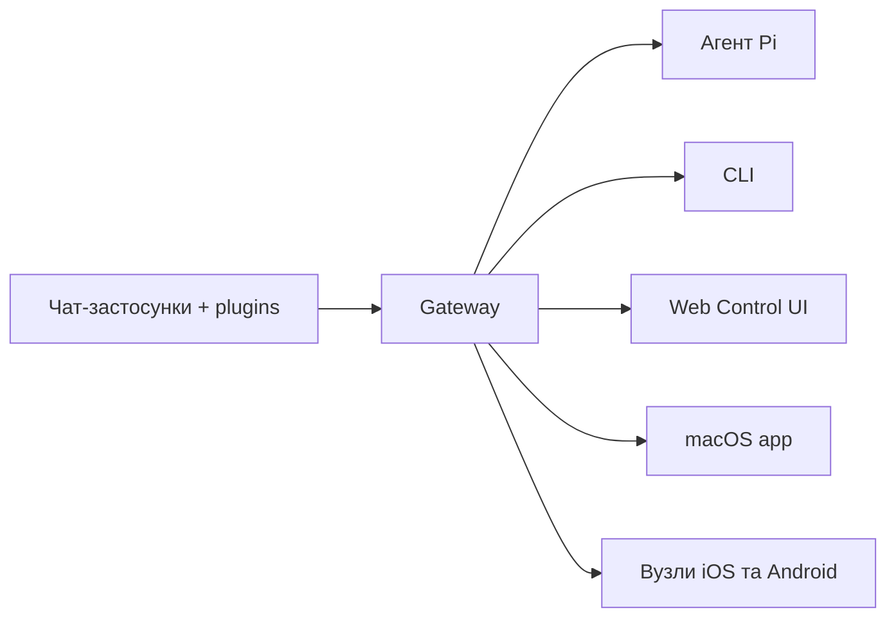

---
read_when:
    - Знайомство новачків з OpenClaw
summary: OpenClaw — це мультиканальний gateway для AI-агентів, який працює на будь-якій ОС.
title: OpenClaw
x-i18n:
    generated_at: "2026-04-05T18:06:05Z"
    model: gpt-5.4
    provider: openai
    source_hash: 9c29a8d9fc41a94b650c524bb990106f134345560e6d615dac30e8815afff481
    source_path: index.md
    workflow: 15
---

# OpenClaw 🦞

<p align="center">
    
    
</p>

> _"ВІДЛУЩУЙТЕ! ВІДЛУЩУЙТЕ!"_ — Космічний лобстер, мабуть

<p align="center">
  <strong>Gateway для AI-агентів на будь-якій ОС через Discord, Google Chat, iMessage, Matrix, Microsoft Teams, Signal, Slack, Telegram, WhatsApp, Zalo та інші сервіси.</strong><br />
  Надішліть повідомлення — і отримайте відповідь агента прямо з кишені. Запускайте один Gateway через вбудовані канали, вбудовані channel plugins, WebChat і мобільні вузли.
</p>

<Columns>
  <Card title="Початок роботи" href="/start/getting-started" icon="rocket">
    Установіть OpenClaw і запустіть Gateway за лічені хвилини.
  </Card>
  <Card title="Запустити онбординг" href="/start/wizard" icon="sparkles">
    Покрокове налаштування з `openclaw onboard` і потоками парування.
  </Card>
  <Card title="Відкрити Control UI" href="/web/control-ui" icon="layout-dashboard">
    Запустіть панель керування в браузері для чату, конфігурації та сесій.
  </Card>
</Columns>

## Що таке OpenClaw?

OpenClaw — це **self-hosted gateway**, який з’єднує ваші улюблені чат-застосунки та канальні поверхні — вбудовані канали, а також вбудовані чи зовнішні channel plugins, як-от Discord, Google Chat, iMessage, Matrix, Microsoft Teams, Signal, Slack, Telegram, WhatsApp, Zalo та інші — з AI coding agents, такими як Pi. Ви запускаєте один процес Gateway на власній машині (або сервері), і він стає мостом між вашими застосунками для обміну повідомленнями та завжди доступним AI-помічником.

**Для кого це?** Для розробників і досвідчених користувачів, яким потрібен персональний AI-помічник, якому можна писати звідусіль, — без втрати контролю над своїми даними й без залежності від hosted-сервісу.

**Що робить його іншим?**

- **Self-hosted**: працює на вашому обладнанні, за вашими правилами
- **Мультиканальність**: один Gateway одночасно обслуговує вбудовані канали та вбудовані чи зовнішні channel plugins
- **Орієнтованість на агентів**: створений для coding agents з використанням інструментів, сесіями, пам’яттю та мультиагентною маршрутизацією
- **Відкритий код**: ліцензія MIT, розвиток спільнотою

**Що вам потрібно?** Node 24 (рекомендовано) або Node 22 LTS (`22.14+`) для сумісності, API key від вибраного провайдера і 5 хвилин. Для найкращої якості та безпеки використовуйте найсильнішу доступну модель останнього покоління.

## Як це працює



Gateway є єдиним джерелом істини для сесій, маршрутизації та підключень каналів.

## Ключові можливості

<Columns>
  <Card title="Мультиканальний gateway" icon="network">
    Discord, iMessage, Signal, Slack, Telegram, WhatsApp, WebChat та інші сервіси через один процес Gateway.
  </Card>
  <Card title="Канальні plugins" icon="plug">
    Вбудовані plugins додають Matrix, Nostr, Twitch, Zalo та інші сервіси у звичайних поточних випусках.
  </Card>
  <Card title="Мультиагентна маршрутизація" icon="route">
    Ізольовані сесії для кожного агента, робочого простору або відправника.
  </Card>
  <Card title="Підтримка медіа" icon="image">
    Надсилайте й отримуйте зображення, аудіо та документи.
  </Card>
  <Card title="Web Control UI" icon="monitor">
    Панель керування в браузері для чату, конфігурації, сесій і вузлів.
  </Card>
  <Card title="Мобільні вузли" icon="smartphone">
    Паруйте вузли iOS та Android для Canvas, камери й робочих процесів із голосовими можливостями.
  </Card>
</Columns>

## Швидкий старт

<Steps>
  <Step title="Установіть OpenClaw">
    ```bash
    npm install -g openclaw@latest
    ```
  </Step>
  <Step title="Пройдіть онбординг і встановіть сервіс">
    ```bash
    openclaw onboard --install-daemon
    ```
  </Step>
  <Step title="Почніть чат">
    Відкрийте Control UI у браузері та надішліть повідомлення:

    ```bash
    openclaw dashboard
    ```

    Або підключіть канал ([Telegram](/channels/telegram) — найшвидший варіант) і спілкуйтеся зі свого телефона.

  </Step>
</Steps>

Потрібне повне встановлення й налаштування для розробки? Див. [Початок роботи](/start/getting-started).

## Панель керування

Відкрийте браузерний Control UI після запуску Gateway.

- Локальна адреса за замовчуванням: [http://127.0.0.1:18789/](http://127.0.0.1:18789/)
- Віддалений доступ: [Web surfaces](/web) і [Tailscale](/gateway/tailscale)

<p align="center">
  
</p>

## Конфігурація (необов’язково)

Конфігурація зберігається в `~/.openclaw/openclaw.json`.

- Якщо ви **нічого не робите**, OpenClaw використовує вбудований бінарний файл Pi у режимі RPC із сесіями для кожного відправника.
- Якщо ви хочете обмежити доступ, почніть із `channels.whatsapp.allowFrom` і (для груп) правил згадки.

Приклад:

```json5
{
  channels: {
    whatsapp: {
      allowFrom: ["+15555550123"],
      groups: { "*": { requireMention: true } },
    },
  },
  messages: { groupChat: { mentionPatterns: ["@openclaw"] } },
}
```

## Почніть звідси

<Columns>
  <Card title="Центри документації" href="/start/hubs" icon="book-open">
    Уся документація та посібники, згруповані за сценаріями використання.
  </Card>
  <Card title="Конфігурація" href="/gateway/configuration" icon="settings">
    Основні параметри Gateway, токени та конфігурація провайдерів.
  </Card>
  <Card title="Віддалений доступ" href="/gateway/remote" icon="globe">
    Шаблони доступу через SSH і tailnet.
  </Card>
  <Card title="Канали" href="/channels/telegram" icon="message-square">
    Налаштування каналів для Feishu, Microsoft Teams, WhatsApp, Telegram, Discord та інших сервісів.
  </Card>
  <Card title="Вузли" href="/nodes" icon="smartphone">
    Вузли iOS та Android із паруванням, Canvas, камерою та діями пристрою.
  </Card>
  <Card title="Довідка" href="/help" icon="life-buoy">
    Точка входу для типових виправлень і усунення проблем.
  </Card>
</Columns>

## Дізнайтеся більше

<Columns>
  <Card title="Повний список можливостей" href="/concepts/features" icon="list">
    Повний перелік можливостей каналів, маршрутизації та медіа.
  </Card>
  <Card title="Мультиагентна маршрутизація" href="/concepts/multi-agent" icon="route">
    Ізоляція робочого простору та сесії для окремих агентів.
  </Card>
  <Card title="Безпека" href="/gateway/security" icon="shield">
    Токени, списки дозволених і засоби контролю безпеки.
  </Card>
  <Card title="Усунення проблем" href="/gateway/troubleshooting" icon="wrench">
    Діагностика Gateway і типові помилки.
  </Card>
  <Card title="Про проєкт і подяки" href="/reference/credits" icon="info">
    Походження проєкту, учасники та ліцензія.
  </Card>
</Columns>
