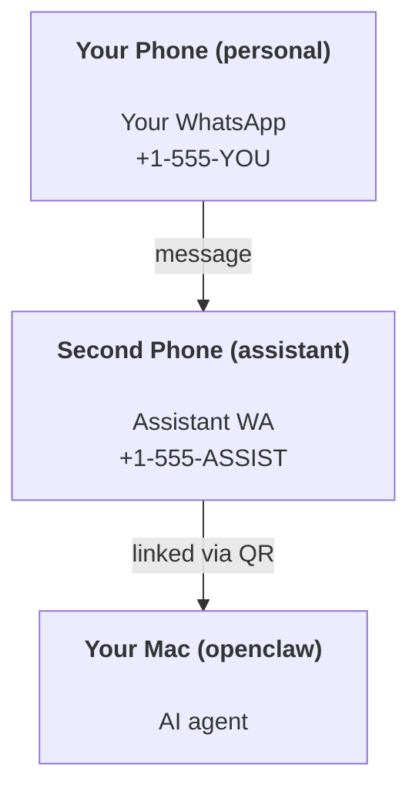

---
read_when:
    - Онбординг нового екземпляра помічника
    - Перегляд наслідків для безпеки та дозволів
summary: Повний посібник із запуску OpenClaw як персонального помічника із застереженнями щодо безпеки
title: Налаштування персонального помічника
x-i18n:
    generated_at: "2026-04-05T18:18:08Z"
    model: gpt-5.4
    provider: openai
    source_hash: 02f10a9f7ec08f71143cbae996d91cbdaa19897a40f725d8ef524def41cf2759
    source_path: start/openclaw.md
    workflow: 15
---

# Створення персонального помічника з OpenClaw

OpenClaw — це self-hosted gateway, який з’єднує Discord, Google Chat, iMessage, Matrix, Microsoft Teams, Signal, Slack, Telegram, WhatsApp, Zalo та інші сервіси з AI-агентами. У цьому посібнику описано сценарій налаштування "персонального помічника": окремий номер WhatsApp, який працює як ваш постійно активний AI-помічник.

## ⚠️ Спочатку безпека

Ви надаєте агенту можливість:

- виконувати команди на вашій машині (залежно від вашої політики інструментів)
- читати/записувати файли у вашому workspace
- надсилати повідомлення назад через WhatsApp/Telegram/Discord/Mattermost та інші вбудовані канали

Починайте обережно:

- Завжди задавайте `channels.whatsapp.allowFrom` (ніколи не запускайте все відкритим для всіх на своєму особистому Mac).
- Використовуйте окремий номер WhatsApp для помічника.
- Heartbeat тепер типово виконується кожні 30 хвилин. Вимкніть його, доки не почнете довіряти цій конфігурації, задавши `agents.defaults.heartbeat.every: "0m"`.

## Передумови

- OpenClaw встановлено й онбординг пройдено — див. [Getting Started](/start/getting-started), якщо ви ще цього не зробили
- Другий номер телефону (SIM/eSIM/передплачений) для помічника

## Схема з двома телефонами (рекомендовано)

Потрібна така схема:



Якщо ви прив’яжете свій особистий WhatsApp до OpenClaw, кожне повідомлення вам стане "входом агента". Зазвичай це не те, що вам потрібно.

## Швидкий старт за 5 хвилин

1. Підключіть WhatsApp Web (з’явиться QR-код; відскануйте його телефоном помічника):

```bash
openclaw channels login
```

2. Запустіть Gateway (залиште його працювати):

```bash
openclaw gateway --port 18789
```

3. Додайте мінімальну конфігурацію в `~/.openclaw/openclaw.json`:

```json5
{
  gateway: { mode: "local" },
  channels: { whatsapp: { allowFrom: ["+15555550123"] } },
}
```

Тепер надішліть повідомлення на номер помічника зі свого телефону зі списку дозволених.

Після завершення онбордингу ми автоматично відкриваємо панель керування та виводимо чисте посилання (без токена). Якщо вона запитує автентифікацію, вставте налаштований спільний секрет у налаштуваннях Control UI. Під час онбордингу типово використовується token (`gateway.auth.token`), але також працює автентифікація за паролем, якщо ви змінили `gateway.auth.mode` на `password`. Щоб відкрити знову пізніше: `openclaw dashboard`.

## Надайте агенту workspace (AGENTS)

OpenClaw читає робочі інструкції та “пам’ять” із каталогу workspace.

Типово OpenClaw використовує `~/.openclaw/workspace` як workspace агента та автоматично створює його (разом із початковими `AGENTS.md`, `SOUL.md`, `TOOLS.md`, `IDENTITY.md`, `USER.md`, `HEARTBEAT.md`) під час налаштування/першого запуску агента. `BOOTSTRAP.md` створюється лише тоді, коли workspace абсолютно новий (він не має з’являтися знову після видалення). `MEMORY.md` є необов’язковим (не створюється автоматично); якщо він наявний, то завантажується для звичайних сесій. Сесії субагентів додають лише `AGENTS.md` і `TOOLS.md`.

Порада: ставтеся до цієї папки як до “пам’яті” OpenClaw і зробіть її git-репозиторієм (ідеально — приватним), щоб `AGENTS.md` і файли пам’яті мали резервну копію. Якщо встановлено git, абсолютно нові workspace автоматично ініціалізуються.

```bash
openclaw setup
```

Повна структура workspace + інструкція з резервного копіювання: [Agent workspace](/uk/concepts/agent-workspace)
Процес роботи з пам’яттю: [Memory](/uk/concepts/memory)

Необов’язково: виберіть інший workspace через `agents.defaults.workspace` (підтримується `~`).

```json5
{
  agent: {
    workspace: "~/.openclaw/workspace",
  },
}
```

Якщо ви вже постачаєте власні файли workspace з репозиторію, можна повністю вимкнути створення bootstrap-файлів:

```json5
{
  agent: {
    skipBootstrap: true,
  },
}
```

## Конфігурація, яка перетворює це на "помічника"

OpenClaw типово має хорошу конфігурацію для помічника, але зазвичай вам захочеться налаштувати:

- persona/інструкції в [`SOUL.md`](/uk/concepts/soul)
- типові параметри thinking (за потреби)
- heartbeat (коли почнете йому довіряти)

Приклад:

```json5
{
  logging: { level: "info" },
  agent: {
    model: "anthropic/claude-opus-4-6",
    workspace: "~/.openclaw/workspace",
    thinkingDefault: "high",
    timeoutSeconds: 1800,
    // Починайте з 0; увімкнете пізніше.
    heartbeat: { every: "0m" },
  },
  channels: {
    whatsapp: {
      allowFrom: ["+15555550123"],
      groups: {
        "*": { requireMention: true },
      },
    },
  },
  routing: {
    groupChat: {
      mentionPatterns: ["@openclaw", "openclaw"],
    },
  },
  session: {
    scope: "per-sender",
    resetTriggers: ["/new", "/reset"],
    reset: {
      mode: "daily",
      atHour: 4,
      idleMinutes: 10080,
    },
  },
}
```

## Сесії та пам’ять

- Файли сесій: `~/.openclaw/agents/<agentId>/sessions/{{SessionId}}.jsonl`
- Метадані сесій (використання токенів, останній маршрут тощо): `~/.openclaw/agents/<agentId>/sessions/sessions.json` (застаріле: `~/.openclaw/sessions/sessions.json`)
- `/new` або `/reset` запускає нову сесію для цього чату (налаштовується через `resetTriggers`). Якщо надіслати лише цю команду, агент відповість коротким привітанням для підтвердження скидання.
- `/compact [instructions]` стискає контекст сесії та повідомляє про залишок бюджету контексту.

## Heartbeat (проактивний режим)

Типово OpenClaw запускає heartbeat кожні 30 хвилин із таким prompt:
`Read HEARTBEAT.md if it exists (workspace context). Follow it strictly. Do not infer or repeat old tasks from prior chats. If nothing needs attention, reply HEARTBEAT_OK.`
Щоб вимкнути, задайте `agents.defaults.heartbeat.every: "0m"`.

- Якщо `HEARTBEAT.md` існує, але фактично порожній (лише порожні рядки та markdown-заголовки на кшталт `# Heading`), OpenClaw пропускає запуск heartbeat, щоб заощадити API-виклики.
- Якщо файл відсутній, heartbeat усе одно виконується, а модель сама вирішує, що робити.
- Якщо агент відповідає `HEARTBEAT_OK` (за потреби з коротким заповненням; див. `agents.defaults.heartbeat.ackMaxChars`), OpenClaw пригнічує вихідну доставку для цього heartbeat.
- Типово доставку heartbeat до цілей у стилі DM `user:<id>` дозволено. Задайте `agents.defaults.heartbeat.directPolicy: "block"`, щоб придушити доставку до прямих цілей, залишивши самі запуски heartbeat активними.
- Heartbeat виконують повні ходи агента — коротші інтервали спалюють більше токенів.

```json5
{
  agent: {
    heartbeat: { every: "30m" },
  },
}
```

## Медіа на вхід і вихід

Вхідні вкладення (зображення/аудіо/документи) можуть передаватися вашій команді через шаблони:

- `{{MediaPath}}` (шлях до локального тимчасового файла)
- `{{MediaUrl}}` (псевдо-URL)
- `{{Transcript}}` (якщо ввімкнено транскрипцію аудіо)

Вихідні вкладення від агента: додайте `MEDIA:<path-or-url>` в окремому рядку (без пробілів). Приклад:

```
Here’s the screenshot.
MEDIA:https://example.com/screenshot.png
```

OpenClaw витягує їх і надсилає як медіа разом із текстом.

Поведінка локальних шляхів відповідає тій самій моделі довіри для читання файлів, що й для агента:

- Якщо `tools.fs.workspaceOnly` дорівнює `true`, локальні шляхи у вихідному `MEDIA:` залишаються обмеженими тимчасовим кореневим каталогом OpenClaw, кешем медіа, шляхами workspace агента та файлами, згенерованими sandbox.
- Якщо `tools.fs.workspaceOnly` дорівнює `false`, вихідний `MEDIA:` може використовувати локальні файли хоста, які агенту вже дозволено читати.
- Для надсилання локальних файлів хоста все одно дозволені лише медіа та безпечні типи документів (зображення, аудіо, відео, PDF і документи Office). Звичайний текст і файли, схожі на секрети, не вважаються медіа, які можна надсилати.

Це означає, що згенеровані зображення/файли поза workspace тепер можна надсилати, якщо ваша політика fs уже дозволяє таке читання, без повторного відкриття довільної ексфільтрації текстових вкладень із хоста.

## Контрольний список операцій

```bash
openclaw status          # локальний статус (облікові дані, сесії, події в черзі)
openclaw status --all    # повна діагностика (лише читання, можна вставляти)
openclaw status --deep   # запитує у gateway live health probe з probe каналів, коли це підтримується
openclaw health --json   # знімок стану gateway (WS; типово може повертати свіжий кешований знімок)
```

Журнали зберігаються в `/tmp/openclaw/` (типово: `openclaw-YYYY-MM-DD.log`).

## Наступні кроки

- WebChat: [WebChat](/web/webchat)
- Операції Gateway: [Gateway runbook](/uk/gateway)
- Cron + wakeups: [Cron jobs](/uk/automation/cron-jobs)
- Супутній застосунок macOS у рядку меню: [OpenClaw macOS app](/uk/platforms/macos)
- Застосунок вузла iOS: [iOS app](/uk/platforms/ios)
- Застосунок вузла Android: [Android app](/uk/platforms/android)
- Стан Windows: [Windows (WSL2)](/uk/platforms/windows)
- Стан Linux: [Linux app](/uk/platforms/linux)
- Безпека: [Security](/uk/gateway/security)
