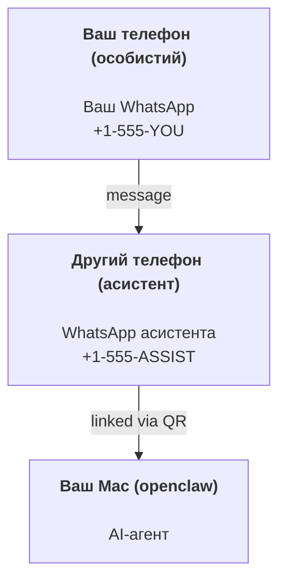

---
read_when:
    - Початкове налаштування нового екземпляра асистента
    - Оцінка наслідків для безпеки та дозволів
summary: Наскрізний посібник із запуску OpenClaw як персонального асистента із застереженнями щодо безпеки
title: Налаштування персонального асистента
x-i18n:
    generated_at: "2026-04-24T19:53:07Z"
    model: gpt-5.4
    provider: openai
    source_hash: 1647b78e8cf23a3a025969c52fbd8a73aed78df27698abf36bbf62045dc30e3b
    source_path: start/openclaw.md
    workflow: 15
---

# Створення персонального асистента з OpenClaw

OpenClaw — це self-hosted gateway, який підключає Discord, Google Chat, iMessage, Matrix, Microsoft Teams, Signal, Slack, Telegram, WhatsApp, Zalo та інші сервіси до AI-агентів. У цьому посібнику розглядається сценарій "персонального асистента": окремий номер WhatsApp, який працює як ваш постійно активний AI-асистент.

## ⚠️ Безпека передусім

Ви надаєте агенту можливість:

- виконувати команди на вашій машині (залежно від вашої політики інструментів)
- читати/записувати файли у вашому workspace
- надсилати повідомлення назад через WhatsApp/Telegram/Discord/Mattermost та інші вбудовані канали

Починайте обережно:

- Завжди встановлюйте `channels.whatsapp.allowFrom` (ніколи не запускайте це відкритим для всіх на вашому персональному Mac).
- Використовуйте окремий номер WhatsApp для асистента.
- Heartbeat тепер за замовчуванням виконується кожні 30 хвилин. Вимкніть його, доки не переконаєтеся, що налаштуванням можна довіряти, встановивши `agents.defaults.heartbeat.every: "0m"`.

## Передумови

- OpenClaw установлено й пройдено початкове налаштування — див. [Getting Started](/uk/start/getting-started), якщо ви ще цього не зробили
- Другий номер телефону (SIM/eSIM/prepaid) для асистента

## Налаштування з двома телефонами (рекомендовано)

Вам потрібна така схема:



Якщо ви прив’яжете свій особистий WhatsApp до OpenClaw, кожне повідомлення вам стане “входом агента”. Зазвичай це не те, чого ви хочете.

## Швидкий старт за 5 хвилин

1. Прив’яжіть WhatsApp Web (покаже QR; відскануйте його телефоном асистента):

```bash
openclaw channels login
```

2. Запустіть Gateway (залиште його працювати):

```bash
openclaw gateway --port 18789
```

3. Додайте мінімальну конфігурацію в `~/.openclaw/openclaw.json`:

```json5
{
  gateway: { mode: "local" },
  channels: { whatsapp: { allowFrom: ["+15555550123"] } },
}
```

Тепер надішліть повідомлення на номер асистента зі свого телефону з allowlist.

Коли початкове налаштування завершиться, OpenClaw автоматично відкриє dashboard і виведе чисте посилання (без токена). Якщо dashboard попросить автентифікацію, вставте налаштований спільний секрет у налаштуваннях Control UI. Під час початкового налаштування за замовчуванням використовується токен (`gateway.auth.token`), але також працює автентифікація паролем, якщо ви змінили `gateway.auth.mode` на `password`. Щоб відкрити знову пізніше: `openclaw dashboard`.

## Надайте агенту workspace (AGENTS)

OpenClaw зчитує робочі інструкції та “пам’ять” із каталогу workspace.

За замовчуванням OpenClaw використовує `~/.openclaw/workspace` як workspace агента і автоматично створює його (разом із початковими файлами `AGENTS.md`, `SOUL.md`, `TOOLS.md`, `IDENTITY.md`, `USER.md`, `HEARTBEAT.md`) під час налаштування/першого запуску агента. `BOOTSTRAP.md` створюється лише тоді, коли workspace зовсім новий (після видалення він не повинен з’являтися знову). `MEMORY.md` необов’язковий (автоматично не створюється); якщо він є, його завантажують для звичайних сесій. Сесії subagent інжектують лише `AGENTS.md` і `TOOLS.md`.

Порада: сприймайте цю папку як “пам’ять” OpenClaw і зробіть її git-репозиторієм (бажано приватним), щоб ваші `AGENTS.md` і файли пам’яті мали резервні копії. Якщо git установлено, нові workspace автоматично ініціалізуються.

```bash
openclaw setup
```

Повна структура workspace + посібник із резервного копіювання: [Agent workspace](/uk/concepts/agent-workspace)
Робочий процес пам’яті: [Memory](/uk/concepts/memory)

Необов’язково: виберіть інший workspace через `agents.defaults.workspace` (підтримує `~`).

```json5
{
  agents: {
    defaults: {
      workspace: "~/.openclaw/workspace",
    },
  },
}
```

Якщо ви вже постачаєте власні файли workspace з репозиторію, можна повністю вимкнути створення bootstrap-файлів:

```json5
{
  agents: {
    defaults: {
      skipBootstrap: true,
    },
  },
}
```

## Конфігурація, яка перетворює це на "асистента"

OpenClaw за замовчуванням має хороше налаштування для асистента, але зазвичай вам варто налаштувати:

- persona/інструкції у [`SOUL.md`](/uk/concepts/soul)
- типові параметри thinking (за потреби)
- Heartbeat (коли вже почнете йому довіряти)

Приклад:

```json5
{
  logging: { level: "info" },
  agent: {
    model: "anthropic/claude-opus-4-6",
    workspace: "~/.openclaw/workspace",
    thinkingDefault: "high",
    timeoutSeconds: 1800,
    // Почніть з 0; увімкнете пізніше.
    heartbeat: { every: "0m" },
  },
  channels: {
    whatsapp: {
      allowFrom: ["+15555550123"],
      groups: {
        "*": { requireMention: true },
      },
    },
  },
  routing: {
    groupChat: {
      mentionPatterns: ["@openclaw", "openclaw"],
    },
  },
  session: {
    scope: "per-sender",
    resetTriggers: ["/new", "/reset"],
    reset: {
      mode: "daily",
      atHour: 4,
      idleMinutes: 10080,
    },
  },
}
```

## Сесії та пам’ять

- Файли сесій: `~/.openclaw/agents/<agentId>/sessions/{{SessionId}}.jsonl`
- Метадані сесії (використання токенів, останній маршрут тощо): `~/.openclaw/agents/<agentId>/sessions/sessions.json` (застарілий шлях: `~/.openclaw/sessions/sessions.json`)
- `/new` або `/reset` запускає нову сесію для цього чату (налаштовується через `resetTriggers`). Якщо надіслати окремо, агент відповідає коротким привітанням для підтвердження скидання.
- `/compact [instructions]` стискає контекст сесії та повідомляє про залишок бюджету контексту.

## Heartbeat (проактивний режим)

За замовчуванням OpenClaw запускає Heartbeat кожні 30 хвилин із запитом:
`Read HEARTBEAT.md if it exists (workspace context). Follow it strictly. Do not infer or repeat old tasks from prior chats. If nothing needs attention, reply HEARTBEAT_OK.`
Щоб вимкнути, установіть `agents.defaults.heartbeat.every: "0m"`.

- Якщо `HEARTBEAT.md` існує, але фактично порожній (лише порожні рядки та markdown-заголовки, як-от `# Heading`), OpenClaw пропускає запуск Heartbeat, щоб зекономити API-виклики.
- Якщо файл відсутній, Heartbeat усе одно запускається, і модель сама вирішує, що робити.
- Якщо агент відповідає `HEARTBEAT_OK` (необов’язково з коротким доповненням; див. `agents.defaults.heartbeat.ackMaxChars`), OpenClaw пригнічує вихідну доставку для цього Heartbeat.
- За замовчуванням доставка Heartbeat до цілей типу DM `user:<id>` дозволена. Установіть `agents.defaults.heartbeat.directPolicy: "block"`, щоб заборонити доставку до прямих цілей, залишивши самі запуски Heartbeat активними.
- Heartbeat виконують повні ходи агента — коротші інтервали спалюють більше токенів.

```json5
{
  agent: {
    heartbeat: { every: "30m" },
  },
}
```

## Медіа на вхід і вихід

Вхідні вкладення (зображення/аудіо/документи) можуть передаватися вашій команді через шаблони:

- `{{MediaPath}}` (шлях до локального тимчасового файла)
- `{{MediaUrl}}` (псевдо-URL)
- `{{Transcript}}` (якщо ввімкнено транскрибування аудіо)

Вихідні вкладення від агента: додайте `MEDIA:<path-or-url>` в окремому рядку (без пробілів). Приклад:

```
Ось знімок екрана.
MEDIA:https://example.com/screenshot.png
```

OpenClaw витягує це і надсилає як медіа разом із текстом.

Поведінка локальних шляхів дотримується тієї самої моделі довіри до читання файлів, що й агент:

- Якщо `tools.fs.workspaceOnly` має значення `true`, локальні шляхи вихідного `MEDIA:` залишаються обмеженими тимчасовим коренем OpenClaw, кешем медіа, шляхами workspace агента та файлами, створеними в sandbox.
- Якщо `tools.fs.workspaceOnly` має значення `false`, вихідний `MEDIA:` може використовувати локальні файли хоста, які агенту вже дозволено читати.
- Надсилання з локального хоста все одно дозволяє лише медіа та безпечні типи документів (зображення, аудіо, відео, PDF і документи Office). Звичайний текст і файли, схожі на секрети, не вважаються медіа, які можна надсилати.

Це означає, що згенеровані зображення/файли поза workspace тепер можна надсилати, якщо ваша політика fs уже дозволяє таке читання, без повторного відкриття довільної ексфільтрації текстових вкладень з хоста.

## Контрольний список операцій

```bash
openclaw status          # локальний стан (облікові дані, сесії, події в черзі)
openclaw status --all    # повна діагностика (лише читання, можна вставляти)
openclaw status --deep   # запитує в gateway живу перевірку працездатності з перевірками каналів, де це підтримується
openclaw health --json   # знімок стану gateway (WS; за замовчуванням може повертати свіжий кешований знімок)
```

Журнали зберігаються в `/tmp/openclaw/` (типово: `openclaw-YYYY-MM-DD.log`).

## Наступні кроки

- WebChat: [WebChat](/uk/web/webchat)
- Операції Gateway: [Runbook Gateway](/uk/gateway)
- Cron + пробудження: [Cron jobs](/uk/automation/cron-jobs)
- Помічник для рядка меню macOS: [Застосунок OpenClaw для macOS](/uk/platforms/macos)
- Node-застосунок iOS: [Застосунок iOS](/uk/platforms/ios)
- Node-застосунок Android: [Застосунок Android](/uk/platforms/android)
- Стан Windows: [Windows (WSL2)](/uk/platforms/windows)
- Стан Linux: [Застосунок Linux](/uk/platforms/linux)
- Безпека: [Security](/uk/gateway/security)

## Пов’язане

- [Getting started](/uk/start/getting-started)
- [Setup](/uk/start/setup)
- [Огляд каналів](/uk/channels)
