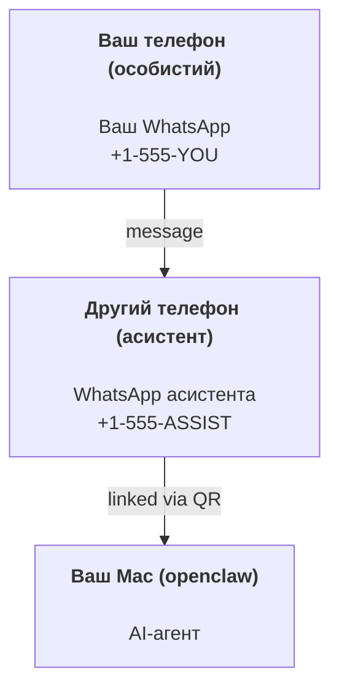

---
read_when:
    - Початкове налаштування нового екземпляра асистента
    - Огляд наслідків для безпеки/дозволів
summary: Наскрізний посібник із запуску OpenClaw як персонального асистента із застереженнями щодо безпеки
title: Налаштування персонального асистента
x-i18n:
    generated_at: "2026-04-23T23:06:34Z"
    model: gpt-5.4
    provider: openai
    source_hash: 72d2a95065124416123e35c93eb0da1e470995249bd4908a9eae0d5564c191ac
    source_path: start/openclaw.md
    workflow: 15
---

# Створення персонального асистента з OpenClaw

OpenClaw — це self-hosted gateway, який підключає Discord, Google Chat, iMessage, Matrix, Microsoft Teams, Signal, Slack, Telegram, WhatsApp, Zalo та інші сервіси до AI-агентів. Цей посібник охоплює налаштування “персонального асистента”: окремий номер WhatsApp, який поводиться як ваш постійно активний AI-асистент.

## ⚠️ Безпека передусім

Ви ставите агента в позицію, де він може:

- запускати команди на вашій машині (залежно від вашої політики інструментів)
- читати/записувати файли у вашому workspace
- надсилати повідомлення назад через WhatsApp/Telegram/Discord/Mattermost та інші bundled channels

Починайте обережно:

- Завжди встановлюйте `channels.whatsapp.allowFrom` (ніколи не запускайте це відкритим для всього світу на своєму особистому Mac).
- Використовуйте окремий номер WhatsApp для асистента.
- Heartbeat тепер типово запускається кожні 30 хвилин. Вимкніть його, доки не почнете довіряти налаштуванню, встановивши `agents.defaults.heartbeat.every: "0m"`.

## Передумови

- OpenClaw встановлено й початково налаштовано — див. [Початок роботи](/uk/start/getting-started), якщо ви ще цього не зробили
- Другий номер телефону (SIM/eSIM/передплачений) для асистента

## Схема з двома телефонами (рекомендовано)

Потрібно ось так:



Якщо ви під’єднаєте свій особистий WhatsApp до OpenClaw, кожне повідомлення вам стане “входом агента”. Зазвичай це не те, що вам потрібно.

## Швидкий старт за 5 хвилин

1. Сполучіть WhatsApp Web (покаже QR; відскануйте його телефоном асистента):

```bash
openclaw channels login
```

2. Запустіть Gateway (залиште його працювати):

```bash
openclaw gateway --port 18789
```

3. Додайте мінімальну конфігурацію в `~/.openclaw/openclaw.json`:

```json5
{
  gateway: { mode: "local" },
  channels: { whatsapp: { allowFrom: ["+15555550123"] } },
}
```

Тепер надішліть повідомлення на номер асистента зі свого телефона, доданого до allowlist.

Коли onboarding завершиться, OpenClaw автоматично відкриє dashboard і виведе чисте посилання (без токенів). Якщо dashboard запитує auth, вставте налаштований спільний секрет у налаштуваннях UI Control. Onboarding типово використовує токен (`gateway.auth.token`), але auth за паролем також працює, якщо ви перемкнули `gateway.auth.mode` на `password`. Щоб відкрити знову пізніше: `openclaw dashboard`.

## Дайте агенту workspace (AGENTS)

OpenClaw читає робочі інструкції та “пам’ять” зі свого каталогу workspace.

За замовчуванням OpenClaw використовує `~/.openclaw/workspace` як workspace агента і автоматично створює його (разом із початковими `AGENTS.md`, `SOUL.md`, `TOOLS.md`, `IDENTITY.md`, `USER.md`, `HEARTBEAT.md`) під час налаштування/першого запуску агента. `BOOTSTRAP.md` створюється лише тоді, коли workspace зовсім новий (він не має з’являтися знову після видалення). `MEMORY.md` необов’язковий (не створюється автоматично); якщо він присутній, його завантажують для звичайних сесій. Сесії субагентів ін’єктують лише `AGENTS.md` і `TOOLS.md`.

Порада: ставтеся до цієї папки як до “пам’яті” OpenClaw і зробіть її git-репозиторієм (бажано приватним), щоб ваші `AGENTS.md` + файли пам’яті мали резервну копію. Якщо git встановлено, абсолютно нові workspace автоматично ініціалізуються.

```bash
openclaw setup
```

Повна структура workspace + посібник із резервного копіювання: [Workspace агента](/uk/concepts/agent-workspace)
Робочий процес пам’яті: [Пам’ять](/uk/concepts/memory)

Необов’язково: виберіть інший workspace через `agents.defaults.workspace` (підтримує `~`).

```json5
{
  agent: {
    workspace: "~/.openclaw/workspace",
  },
}
```

Якщо ви вже постачаєте власні файли workspace з репозиторію, можете повністю вимкнути створення bootstrap-файлів:

```json5
{
  agent: {
    skipBootstrap: true,
  },
}
```

## Конфігурація, яка перетворює це на “асистента”

OpenClaw типово має хороше налаштування для асистента, але зазвичай вам потрібно налаштувати:

- persona/інструкції в [`SOUL.md`](/uk/concepts/soul)
- типові значення мислення (за бажанням)
- Heartbeat (коли почнете довіряти системі)

Приклад:

```json5
{
  logging: { level: "info" },
  agent: {
    model: "anthropic/claude-opus-4-6",
    workspace: "~/.openclaw/workspace",
    thinkingDefault: "high",
    timeoutSeconds: 1800,
    // Start with 0; enable later.
    heartbeat: { every: "0m" },
  },
  channels: {
    whatsapp: {
      allowFrom: ["+15555550123"],
      groups: {
        "*": { requireMention: true },
      },
    },
  },
  routing: {
    groupChat: {
      mentionPatterns: ["@openclaw", "openclaw"],
    },
  },
  session: {
    scope: "per-sender",
    resetTriggers: ["/new", "/reset"],
    reset: {
      mode: "daily",
      atHour: 4,
      idleMinutes: 10080,
    },
  },
}
```

## Сесії та пам’ять

- Файли сесій: `~/.openclaw/agents/<agentId>/sessions/{{SessionId}}.jsonl`
- Метадані сесій (використання токенів, останній route тощо): `~/.openclaw/agents/<agentId>/sessions/sessions.json` (застарілий шлях: `~/.openclaw/sessions/sessions.json`)
- `/new` або `/reset` починає нову сесію для цього чату (налаштовується через `resetTriggers`). Якщо надіслати команду окремо, агент відповість коротким привітанням для підтвердження скидання.
- `/compact [instructions]` стискає контекст сесії та повідомляє про залишковий бюджет контексту.

## Heartbeat (проактивний режим)

За замовчуванням OpenClaw запускає Heartbeat кожні 30 хвилин із prompt:
`Read HEARTBEAT.md if it exists (workspace context). Follow it strictly. Do not infer or repeat old tasks from prior chats. If nothing needs attention, reply HEARTBEAT_OK.`
Установіть `agents.defaults.heartbeat.every: "0m"`, щоб вимкнути його.

- Якщо `HEARTBEAT.md` існує, але фактично порожній (лише порожні рядки й Markdown-заголовки на кшталт `# Heading`), OpenClaw пропускає запуск Heartbeat, щоб зекономити API-виклики.
- Якщо файла немає, Heartbeat усе одно запускається, і модель сама вирішує, що робити.
- Якщо агент відповідає `HEARTBEAT_OK` (необов’язково з коротким доповненням; див. `agents.defaults.heartbeat.ackMaxChars`), OpenClaw пригнічує вихідну доставку для цього Heartbeat.
- За замовчуванням доставку Heartbeat до цілей у стилі DM `user:<id>` дозволено. Установіть `agents.defaults.heartbeat.directPolicy: "block"`, щоб пригнічувати доставку до прямих цілей, зберігаючи активні запуски Heartbeat.
- Heartbeat виконує повні ходи агента — коротші інтервали спалюють більше токенів.

```json5
{
  agent: {
    heartbeat: { every: "30m" },
  },
}
```

## Вхідні та вихідні медіа

Вхідні вкладення (зображення/аудіо/документи) можуть бути доступні вашій команді через шаблони:

- `{{MediaPath}}` (шлях до локального тимчасового файла)
- `{{MediaUrl}}` (псевдо-URL)
- `{{Transcript}}` (якщо ввімкнено транскрипцію аудіо)

Вихідні вкладення від агента: додайте `MEDIA:<path-or-url>` в окремому рядку (без пробілів). Приклад:

```
Here’s the screenshot.
MEDIA:https://example.com/screenshot.png
```

OpenClaw витягує це й надсилає як медіа разом із текстом.

Поведінка локальних шляхів дотримується тієї самої моделі довіри читання файлів, що й агент:

- Якщо `tools.fs.workspaceOnly` має значення `true`, локальні шляхи `MEDIA:` для вихідних повідомлень залишаються обмеженими тимчасовим коренем OpenClaw, кешем медіа, шляхами workspace агента та файлами, згенерованими sandbox.
- Якщо `tools.fs.workspaceOnly` має значення `false`, вихідні `MEDIA:` можуть використовувати локальні файли host, які агенту вже дозволено читати.
- Надсилання локальних файлів host усе ще дозволяє лише медіа й безпечні типи документів (зображення, аудіо, відео, PDF та документи Office). Звичайний текст і файли, схожі на секрети, не вважаються медіа, які можна надсилати.

Це означає, що згенеровані зображення/файли поза workspace тепер можна надсилати, якщо ваша політика fs уже дозволяє таке читання, без повторного відкриття довільної ексфільтрації текстових вкладень із host.

## Контрольний список операцій

```bash
openclaw status          # локальний статус (облікові дані, сесії, події в черзі)
openclaw status --all    # повна діагностика (лише читання, придатна для вставлення)
openclaw status --deep   # запитує в gateway live-перевірку стану з probes каналів, коли підтримується
openclaw health --json   # snapshot стану gateway (WS; типова поведінка може повертати свіжий кешований snapshot)
```

Журнали зберігаються в `/tmp/openclaw/` (типово: `openclaw-YYYY-MM-DD.log`).

## Наступні кроки

- WebChat: [WebChat](/uk/web/webchat)
- Операції Gateway: [Runbook Gateway](/uk/gateway)
- Cron + пробудження: [Cron jobs](/uk/automation/cron-jobs)
- Супутній застосунок macOS у рядку меню: [Застосунок OpenClaw для macOS](/uk/platforms/macos)
- Застосунок-вузол iOS: [Застосунок iOS](/uk/platforms/ios)
- Застосунок-вузол Android: [Застосунок Android](/uk/platforms/android)
- Стан Windows: [Windows (WSL2)](/uk/platforms/windows)
- Стан Linux: [Застосунок Linux](/uk/platforms/linux)
- Безпека: [Безпека](/uk/gateway/security)
