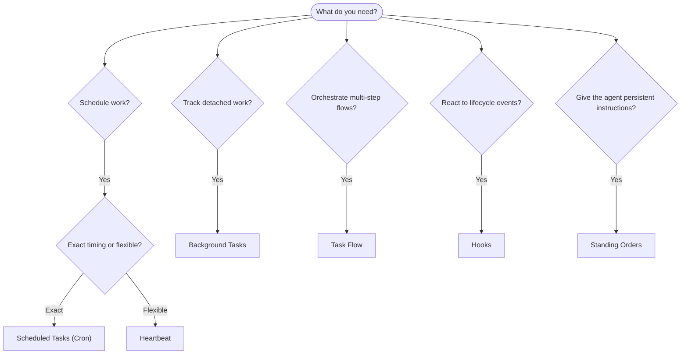

---
read_when:
    - 决定如何使用 OpenClaw 自动化工作
    - 在 heartbeat、cron、hooks 和常设指令之间进行选择
    - 寻找合适的自动化入口点
summary: 自动化机制概览：任务、cron、hooks、常设指令和任务流
title: 自动化与任务
x-i18n:
    generated_at: "2026-04-23T20:40:39Z"
    model: gpt-5.4
    provider: openai
    source_hash: 1b4615cc05a6d0ef7c92f44072d11a2541bc5e17b7acb88dc27ddf0c36b2dcab
    source_path: automation/index.md
    workflow: 15
---

OpenClaw 通过任务、计划作业、事件 hooks 和常设指令在后台运行工作。本页可帮助你选择合适的机制，并了解它们如何协同工作。

## 快速决策指南

| 用例 | 推荐方案 | 原因 |
| --------------------------------------- | ---------------------- | ------------------------------------------------ |
| 在上午 9 点准时发送每日报告 | 计划任务（Cron） | 时间精确，执行隔离 |
| 20 分钟后提醒我 | 计划任务（Cron） | 一次性任务，时间精确（`--at`） |
| 每周运行一次深度分析 | 计划任务（Cron） | 独立任务，可使用不同模型 |
| 每 30 分钟检查一次收件箱 | Heartbeat | 可与其他检查批量处理，且具备上下文感知 |
| 监控日历中的即将到来的事件 | Heartbeat | 非常适合周期性感知类任务 |
| 检查 subagent 或 ACP 运行的状态 | 后台任务 | 任务台账会跟踪所有分离工作 |
| 审计运行了什么以及运行时间 | 后台任务 | `openclaw tasks list` 和 `openclaw tasks audit` |
| 多步骤研究后再总结 | Task Flow | 具备修订跟踪的持久化编排 |
| 在会话重置时运行脚本 | Hooks | 事件驱动，在生命周期事件上触发 |
| 在每次工具调用时执行代码 | Hooks | Hooks 可按事件类型过滤 |
| 始终在回复前检查合规性 | 常设指令 | 会自动注入到每个会话中 |

### 计划任务（Cron）与 Heartbeat

| 维度 | 计划任务（Cron） | Heartbeat |
| --------------- | ----------------------------------- | ------------------------------------- |
| 时间控制 | 精确（cron 表达式、一次性任务） | 近似（默认每 30 分钟一次） |
| 会话上下文 | 全新（隔离）或共享 | 完整的主会话上下文 |
| 任务记录 | 始终创建 | 从不创建 |
| 交付方式 | 渠道、webhook 或静默 | 在主会话中内联显示 |
| 最适合 | 报告、提醒、后台作业 | 收件箱检查、日历、通知 |

当你需要精确时间控制或隔离执行时，使用计划任务（Cron）。当工作受益于完整会话上下文且可接受近似时间时，使用 Heartbeat。

## 核心概念

### 计划任务（cron）

Cron 是 Gateway 网关内置的精确定时调度器。它会持久化作业，在正确时间唤醒智能体，并可将输出发送到聊天渠道或 webhook 端点。支持一次性提醒、周期性表达式以及入站 webhook 触发器。

参见 [计划任务](/zh-CN/automation/cron-jobs)。

### 任务

后台任务台账会跟踪所有分离工作：ACP 运行、subagent 启动、隔离的 cron 执行以及 CLI 操作。任务是记录，不是调度器。使用 `openclaw tasks list` 和 `openclaw tasks audit` 来检查它们。

参见 [后台任务](/zh-CN/automation/tasks)。

### Task Flow

Task Flow 是位于后台任务之上的流程编排基础层。它通过托管和镜像同步模式、修订跟踪以及 `openclaw tasks flow list|show|cancel` 检查命令来管理持久化的多步骤流程。

参见 [Task Flow](/zh-CN/automation/taskflow)。

### 常设指令

常设指令为智能体授予已定义程序的永久操作权限。它们位于工作区文件中（通常是 `AGENTS.md`），并会注入到每个会话中。可与 cron 结合，以实现基于时间的执行约束。

参见 [常设指令](/zh-CN/automation/standing-orders)。

### Hooks

Hooks 是由智能体生命周期事件（`/new`、`/reset`、`/stop`）、会话压缩、Gateway 网关启动、消息流以及工具调用触发的事件驱动脚本。Hooks 会自动从目录中发现，也可通过 `openclaw hooks` 管理。

参见 [Hooks](/zh-CN/automation/hooks)。

### Heartbeat

Heartbeat 是周期性的主会话轮次（默认每 30 分钟一次）。它会在一个具备完整会话上下文的智能体轮次中批量执行多项检查（收件箱、日历、通知）。Heartbeat 轮次不会创建任务记录。对于简单检查清单，可使用 `HEARTBEAT.md`；如果你希望在 heartbeat 内部执行仅在到期时运行的周期性检查，则可使用 `tasks:` 块。空的 heartbeat 文件会以 `empty-heartbeat-file` 跳过；仅到期任务模式会以 `no-tasks-due` 跳过。

参见 [Heartbeat](/zh-CN/gateway/heartbeat)。

## 它们如何协同工作

- **Cron** 负责精确计划（每日报告、每周回顾）和一次性提醒。所有 cron 执行都会创建任务记录。
- **Heartbeat** 负责常规监控（收件箱、日历、通知），每 30 分钟在一次批处理轮次中完成。
- **Hooks** 对特定事件（工具调用、会话重置、压缩）通过自定义脚本作出响应。
- **常设指令** 为智能体提供持久上下文和权限边界。
- **Task Flow** 在单个任务之上协调多步骤流程。
- **任务** 会自动跟踪所有分离工作，以便你进行检查和审计。

## 相关内容

- [计划任务](/zh-CN/automation/cron-jobs) — 精确定时与一次性提醒
- [后台任务](/zh-CN/automation/tasks) — 所有分离工作的任务台账
- [Task Flow](/zh-CN/automation/taskflow) — 持久化多步骤流程编排
- [Hooks](/zh-CN/automation/hooks) — 事件驱动的生命周期脚本
- [常设指令](/zh-CN/automation/standing-orders) — 持久化智能体指令
- [Heartbeat](/zh-CN/gateway/heartbeat) — 周期性的主会话轮次
- [配置参考](/zh-CN/gateway/configuration-reference) — 所有配置键名
