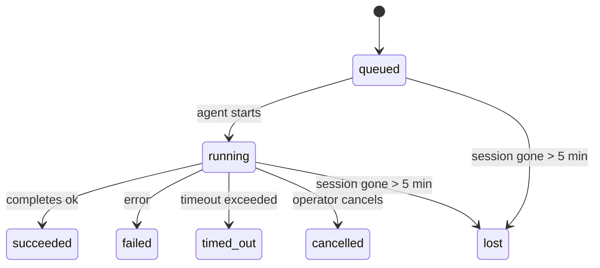

---
read_when:
    - 检查正在进行中或最近完成的后台工作
    - 调试分离式智能体运行的投递失败问题
    - 了解后台运行如何与会话、cron 和 heartbeat 关联
summary: 用于跟踪 ACP 运行、子智能体、隔离的 cron 作业以及 CLI 操作的后台任务
title: 后台任务
x-i18n:
    generated_at: "2026-04-05T23:52:42Z"
    model: gpt-5.4
    provider: openai
    source_hash: 68ba60b352c8d8fc57fed081856581107c6c0eb09ef4047264c3052abc30520d
    source_path: automation/tasks.md
    workflow: 15
---

# 后台任务

> **在找调度方式？** 请参阅 [自动化与任务](/zh-CN/automation)，以选择合适的机制。本页介绍的是如何**跟踪**后台工作，而不是如何调度它。

后台任务用于跟踪**在你的主对话会话之外**运行的工作：
ACP 运行、子智能体生成、隔离的 cron 作业执行，以及由 CLI 发起的操作。

任务**不会**替代会话、cron 作业或 heartbeat——它们是用于记录分离式工作何时发生、发生了什么以及是否成功的**活动账本**。

<Note>
并非每次智能体运行都会创建任务。Heartbeat 轮次和普通交互式聊天不会。所有 cron 执行、ACP 生成、子智能体生成以及 CLI 智能体命令都会创建任务。
</Note>

## TL;DR

- 任务是**记录**，不是调度器——cron 和 heartbeat 决定工作_何时_运行，任务负责跟踪_发生了什么_。
- ACP、子智能体、所有 cron 作业和 CLI 操作都会创建任务。Heartbeat 轮次不会。
- 每个任务都会经历 `queued → running → terminal`（succeeded、failed、timed_out、cancelled 或 lost）。
- 只要 cron 运行时仍然拥有该作业，cron 任务就会保持存活；而基于聊天的 CLI 任务只会在其所属的运行上下文仍处于活动状态时保持存活。
- 完成机制是推送驱动的：分离式工作完成时可以直接通知，或唤醒请求者会话 / heartbeat，因此轮询状态通常不是正确的方式。
- 隔离的 cron 运行和子智能体完成时，会尽力在最终清理记账之前清理其子会话中已跟踪的浏览器标签页 / 进程。
- 在后代子智能体工作仍在排空期间，隔离 cron 的投递会抑制过时的中间父级回复；如果最终的后代输出先到达，则优先使用该输出。
- 完成通知会直接投递到某个渠道，或排队等待下一次 heartbeat。
- `openclaw tasks list` 会显示所有任务；`openclaw tasks audit` 会显示问题。
- 终态记录会保留 7 天，之后自动清理。

## 快速开始

```bash
# 列出所有任务（最新优先）
openclaw tasks list

# 按运行时或状态筛选
openclaw tasks list --runtime acp
openclaw tasks list --status running

# 显示特定任务的详情（按 ID、run ID 或 session key）
openclaw tasks show <lookup>

# 取消正在运行的任务（终止子会话）
openclaw tasks cancel <lookup>

# 更改任务的通知策略
openclaw tasks notify <lookup> state_changes

# 运行健康审计
openclaw tasks audit

# 预览或应用维护
openclaw tasks maintenance
openclaw tasks maintenance --apply

# 检查 TaskFlow 状态
openclaw tasks flow list
openclaw tasks flow show <lookup>
openclaw tasks flow cancel <lookup>
```

## 什么会创建任务

| 来源 | 运行时类型 | 何时创建任务记录 | 默认通知策略 |
| ---------------------- | ------------ | ------------------------------------------------------ | --------------------- |
| ACP 后台运行 | `acp` | 生成子 ACP 会话时 | `done_only` |
| 子智能体编排 | `subagent` | 通过 `sessions_spawn` 生成子智能体时 | `done_only` |
| Cron 作业（所有类型） | `cron` | 每次 cron 执行时（主会话和隔离式都包括） | `silent` |
| CLI 操作 | `cli` | 通过 Gateway 网关 运行的 `openclaw agent` 命令 | `silent` |
| 智能体媒体作业 | `cli` | 基于会话的 `video_generate` 运行 | `silent` |

主会话 cron 任务默认使用 `silent` 通知策略——它们会创建记录用于跟踪，但不会生成通知。隔离式 cron 任务默认也使用 `silent`，但由于它们在自己的会话中运行，因此可见性更高。

基于会话的 `video_generate` 运行同样使用 `silent` 通知策略。它们仍会创建任务记录，但完成结果会作为内部唤醒返回给原始智能体会话，以便智能体自行编写后续消息并附加已完成的视频。

**不会创建任务的情况：**

- Heartbeat 轮次——主会话；参见 [Heartbeat](/zh-CN/gateway/heartbeat)
- 普通交互式聊天轮次
- 直接 `/command` 响应

## 任务生命周期



| 状态 | 含义 |
| ----------- | -------------------------------------------------------------------------- |
| `queued` | 已创建，等待智能体启动 |
| `running` | 智能体轮次正在执行 |
| `succeeded` | 已成功完成 |
| `failed` | 已因错误完成 |
| `timed_out` | 超过已配置的超时时间 |
| `cancelled` | 由操作员通过 `openclaw tasks cancel` 停止 |
| `lost` | 在 5 分钟宽限期后，运行时丢失了权威性后端状态 |

状态转换会自动发生——当关联的智能体运行结束时，任务状态会更新为对应结果。

`lost` 是运行时感知的：

- ACP 任务：后端 ACP 子会话元数据已消失。
- 子智能体任务：后端子会话已从目标智能体存储中消失。
- Cron 任务：cron 运行时不再将该作业视为活动状态。
- CLI 任务：隔离式子会话任务使用子会话；基于聊天的 CLI 任务则改用活动运行上下文，因此残留的渠道 / 群组 / 直接会话行不会让它们继续保持存活。

## 投递和通知

当任务进入终态时，OpenClaw 会通知你。共有两种投递路径：

**直接投递**——如果任务具有渠道目标（`requesterOrigin`），完成消息会直接发送到该渠道（Telegram、Discord、Slack 等）。对于子智能体完成，OpenClaw 也会在可用时保留已绑定的线程 / 话题路由，并且在放弃直接投递之前，可以从请求者会话存储的路由（`lastChannel` / `lastTo` / `lastAccountId`）中补齐缺失的 `to` / account。

**会话排队投递**——如果直接投递失败，或未设置来源，更新会作为系统事件排入请求者会话，并在下一次 heartbeat 时显示出来。

<Tip>
任务完成会立即触发一次 heartbeat 唤醒，因此你可以很快看到结果——无需等到下一次计划中的 heartbeat tick。
</Tip>

这意味着常规工作流是基于推送的：启动一次分离式工作，然后让运行时在完成时唤醒或通知你。只有在需要调试、干预或进行明确审计时，才去轮询任务状态。

### 通知策略

控制你会收到多少关于每个任务的信息：

| 策略 | 会投递什么 |
| --------------------- | ----------------------------------------------------------------------- |
| `done_only`（默认） | 仅终态（succeeded、failed 等）——**这是默认值** |
| `state_changes` | 每次状态转换和进度更新 |
| `silent` | 完全不通知 |

在任务运行期间更改策略：

```bash
openclaw tasks notify <lookup> state_changes
```

## CLI 参考

### `tasks list`

```bash
openclaw tasks list [--runtime <acp|subagent|cron|cli>] [--status <status>] [--json]
```

输出列：任务 ID、类型、状态、投递、运行 ID、子会话、摘要。

### `tasks show`

```bash
openclaw tasks show <lookup>
```

查找标记接受任务 ID、运行 ID 或会话键。会显示完整记录，包括时间、投递状态、错误和终态摘要。

### `tasks cancel`

```bash
openclaw tasks cancel <lookup>
```

对于 ACP 和子智能体任务，这会终止子会话。状态会切换为 `cancelled`，并发送投递通知。

### `tasks notify`

```bash
openclaw tasks notify <lookup> <done_only|state_changes|silent>
```

### `tasks audit`

```bash
openclaw tasks audit [--json]
```

显示运维问题。检测到问题时，结果也会显示在 `openclaw status` 中。

| 发现项 | 严重性 | 触发条件 |
| ------------------------- | -------- | ----------------------------------------------------- |
| `stale_queued` | warn | 已排队超过 10 分钟 |
| `stale_running` | error | 已运行超过 30 分钟 |
| `lost` | error | 运行时支持的任务归属已消失 |
| `delivery_failed` | warn | 投递失败且通知策略不是 `silent` |
| `missing_cleanup` | warn | 终态任务没有清理时间戳 |
| `inconsistent_timestamps` | warn | 时间线违规（例如结束早于开始） |

### `tasks maintenance`

```bash
openclaw tasks maintenance [--json]
openclaw tasks maintenance --apply [--json]
```

用它来预览或应用任务与 Task Flow 状态的对账、清理时间戳写入和清理删除。

对账是运行时感知的：

- ACP / 子智能体任务会检查其后端子会话。
- Cron 任务会检查 cron 运行时是否仍然拥有该作业。
- 基于聊天的 CLI 任务会检查其所属的活动运行上下文，而不仅仅是聊天会话行。

完成清理同样是运行时感知的：

- 子智能体完成时，会尽力在继续执行通知后的清理之前，关闭该子会话中已跟踪的浏览器标签页 / 进程。
- 隔离式 cron 完成时，会尽力在运行完全拆除之前，关闭该 cron 会话中已跟踪的浏览器标签页 / 进程。
- 隔离式 cron 投递会在需要时等待后代子智能体的后续处理完成，并抑制过时的父级确认文本，而不是将其作为结果通知。
- 子智能体完成投递会优先选择最新可见的 assistant 文本；如果该文本为空，则回退到已清洗的最新 tool / toolResult 文本，而仅有超时工具调用的运行则可折叠为简短的部分进度摘要。
- 清理失败不会掩盖真实的任务结果。

### `tasks flow list|show|cancel`

```bash
openclaw tasks flow list [--status <status>] [--json]
openclaw tasks flow show <lookup> [--json]
openclaw tasks flow cancel <lookup>
```

当你关心的是编排型 Task Flow，而不是某一条单独的后台任务记录时，请使用这些命令。

## 聊天任务面板（`/tasks`）

在任意聊天会话中使用 `/tasks`，即可查看与该会话关联的后台任务。面板会显示活动中和最近完成的任务，包括运行时、状态、时间，以及进度或错误详情。

当当前会话没有可见的关联任务时，`/tasks` 会回退显示智能体本地任务计数，这样你仍然可以获得概览，同时不会泄露其他会话的详情。

如需完整的操作员账本，请使用 CLI：`openclaw tasks list`。

## 状态集成（任务压力）

`openclaw status` 包含一个任务概览摘要：

```
Tasks: 3 queued · 2 running · 1 issues
```

该摘要会报告：

- **active**——`queued` + `running` 的数量
- **failures**——`failed` + `timed_out` + `lost` 的数量
- **byRuntime**——按 `acp`、`subagent`、`cron`、`cli` 的细分

`/status` 和 `session_status` 工具都使用清理感知的任务快照：优先显示活动任务，隐藏过时的已完成行，只有在没有活动工作剩余时才显示最近失败项。这样可以让状态卡片聚焦于当前真正重要的内容。

## 存储和维护

### 任务存储位置

任务记录持久化在 SQLite 中，路径为：

```
$OPENCLAW_STATE_DIR/tasks/runs.sqlite
```

注册表会在 Gateway 网关 启动时加载到内存中，并将写入同步到 SQLite，以便在重启后仍能保持持久性。

### 自动维护

每 **60 秒** 会运行一次清理器，处理三件事：

1. **对账**——检查活动任务是否仍然具有权威的运行时后端。ACP / 子智能体任务使用子会话状态，cron 任务使用活动作业归属，基于聊天的 CLI 任务使用其所属运行上下文。如果该后端状态消失超过 5 分钟，任务会被标记为 `lost`。
2. **清理时间戳写入**——为终态任务设置 `cleanupAfter` 时间戳（`endedAt + 7 days`）。
3. **清理删除**——删除已超过其 `cleanupAfter` 日期的记录。

**保留期**：终态任务记录会保留 **7 天**，之后自动清理。无需任何配置。

## 任务与其他系统的关系

### 任务与 Task Flow

[Task Flow](/zh-CN/automation/taskflow) 是位于后台任务之上的流程编排层。单个 flow 在其生命周期内可以通过托管或镜像同步模式协调多个任务。使用 `openclaw tasks` 检查单个任务记录，使用 `openclaw tasks flow` 检查编排 flow。

详情请参阅 [Task Flow](/zh-CN/automation/taskflow)。

### 任务与 cron

cron 作业**定义**存储在 `~/.openclaw/cron/jobs.json` 中。**每一次** cron 执行都会创建一条任务记录——无论是主会话还是隔离式执行。主会话 cron 任务默认使用 `silent` 通知策略，因此它们会被跟踪，但不会生成通知。

参见 [Cron Jobs](/zh-CN/automation/cron-jobs)。

### 任务与 heartbeat

Heartbeat 运行属于主会话轮次——它们不会创建任务记录。任务完成时，可以触发 heartbeat 唤醒，以便你及时看到结果。

参见 [Heartbeat](/zh-CN/gateway/heartbeat)。

### 任务与会话

一个任务可能会引用 `childSessionKey`（工作运行的位置）和 `requesterSessionKey`（启动它的人）。会话是对话上下文；任务则是在其之上的活动跟踪。

### 任务与智能体运行

任务的 `runId` 会链接到执行该工作的智能体运行。智能体生命周期事件（开始、结束、错误）会自动更新任务状态——你无需手动管理生命周期。

## 相关内容

- [自动化与任务](/zh-CN/automation)——所有自动化机制总览
- [Task Flow](/zh-CN/automation/taskflow)——位于任务之上的流程编排
- [计划任务](/zh-CN/automation/cron-jobs)——调度后台工作
- [Heartbeat](/zh-CN/gateway/heartbeat)——周期性主会话轮次
- [CLI：任务](/cli/index#tasks)——CLI 命令参考
