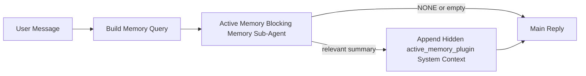

---
read_when:
    - 你想了解活动记忆的用途
    - 你想为一个对话式智能体开启活动记忆
    - 你想调整活动记忆的行为，而不在所有地方都启用它
summary: 一个由插件拥有的阻塞式记忆子智能体，会将相关记忆注入交互式聊天会话中
title: 活动记忆
x-i18n:
    generated_at: "2026-04-12T01:25:39Z"
    model: gpt-5.4
    provider: openai
    source_hash: 8407d8f877429a6fa76b3bb5688e33fdab372766288e6de4944b26073b383ddc
    source_path: concepts/active-memory.md
    workflow: 15
---

# 活动记忆

活动记忆是一个可选的、由插件拥有的阻塞式记忆子智能体，会在符合条件的对话式会话中于主回复之前运行。

它存在的原因是，大多数记忆系统虽然功能强大，但都是被动响应的。它们依赖主智能体决定何时搜索记忆，或者依赖用户说出诸如“记住这个”或“搜索记忆”之类的话。等到那时，原本能让回复显得自然的那个记忆介入时机，往往已经过去了。

活动记忆为系统提供了一次有边界的机会，在生成主回复之前呈现相关记忆。

## 将这段内容粘贴到你的智能体中

如果你想让你的智能体通过一个自包含且默认安全的设置来启用活动记忆，请将以下内容粘贴到你的智能体中：

```json5
{
  plugins: {
    entries: {
      "active-memory": {
        enabled: true,
        config: {
          enabled: true,
          agents: ["main"],
          allowedChatTypes: ["direct"],
          modelFallbackPolicy: "default-remote",
          queryMode: "recent",
          promptStyle: "balanced",
          timeoutMs: 15000,
          maxSummaryChars: 220,
          persistTranscripts: false,
          logging: true,
        },
      },
    },
  },
}
```

这会为 `main` 智能体开启该插件，默认将其限制在私信风格的会话中，先让它继承当前会话模型，并且在没有显式或继承模型可用时，仍然允许使用内置的远程回退。

之后，重启 Gateway 网关：

```bash
openclaw gateway
```

要在对话中实时查看它：

```text
/verbose on
```

## 开启活动记忆

最安全的设置是：

1. 启用插件
2. 只针对一个对话式智能体
3. 仅在调优期间保持日志开启

先在 `openclaw.json` 中加入以下内容：

```json5
{
  plugins: {
    entries: {
      "active-memory": {
        enabled: true,
        config: {
          agents: ["main"],
          allowedChatTypes: ["direct"],
          modelFallbackPolicy: "default-remote",
          queryMode: "recent",
          promptStyle: "balanced",
          timeoutMs: 15000,
          maxSummaryChars: 220,
          persistTranscripts: false,
          logging: true,
        },
      },
    },
  },
}
```

然后重启 Gateway 网关：

```bash
openclaw gateway
```

这意味着：

- `plugins.entries.active-memory.enabled: true` 会开启该插件
- `config.agents: ["main"]` 仅让 `main` 智能体启用活动记忆
- `config.allowedChatTypes: ["direct"]` 默认仅在私信风格的会话中开启活动记忆
- 如果未设置 `config.model`，活动记忆会先继承当前会话模型
- `config.modelFallback` 可以选择性提供你自己的回退提供商/模型用于回忆
- `config.promptStyle: "balanced"` 会为 `recent` 模式使用默认的通用提示风格
- 活动记忆仍然只会在符合条件的交互式持久聊天会话中运行

## 如何查看它

活动记忆会为模型注入隐藏的系统上下文。它不会向客户端暴露原始的 `<active_memory_plugin>...</active_memory_plugin>` 标签。

## 会话开关

当你想在不编辑配置的情况下，为当前聊天会话暂停或恢复活动记忆时，请使用插件命令：

```text
/active-memory status
/active-memory off
/active-memory on
```

这是会话级别的。它不会更改
`plugins.entries.active-memory.enabled`、智能体目标设置或其他全局配置。

如果你希望该命令写入配置，并为所有会话暂停或恢复活动记忆，请使用显式的全局形式：

```text
/active-memory status --global
/active-memory off --global
/active-memory on --global
```

全局形式会写入 `plugins.entries.active-memory.config.enabled`。它会保留
`plugins.entries.active-memory.enabled` 为开启状态，以便该命令之后仍可用于重新开启活动记忆。

如果你想查看活动记忆在实时会话中做了什么，请为该会话开启详细模式：

```text
/verbose on
```

启用详细模式后，OpenClaw 可以显示：

- 一条活动记忆状态行，例如 `Active Memory: ok 842ms recent 34 chars`
- 一条可读的调试摘要，例如 `Active Memory Debug: Lemon pepper wings with blue cheese.`

这些行来自同一次活动记忆处理流程，该流程也会为隐藏系统上下文提供内容；但这里会以适合人类阅读的形式呈现，而不是暴露原始提示标记。

默认情况下，这个阻塞式记忆子智能体的转录记录是临时的，并会在运行完成后删除。

示例流程：

```text
/verbose on
what wings should i order?
```

预期可见回复形式：

```text
...normal assistant reply...

🧩 Active Memory: ok 842ms recent 34 chars
🔎 Active Memory Debug: Lemon pepper wings with blue cheese.
```

## 何时运行

活动记忆使用两个门槛：

1. **配置选择启用**
   插件必须已启用，并且当前智能体 id 必须出现在
   `plugins.entries.active-memory.config.agents` 中。
2. **严格的运行时适用条件**
   即使已启用且已定向，活动记忆也只会在符合条件的交互式持久聊天会话中运行。

实际规则是：

```text
plugin enabled
+
agent id targeted
+
allowed chat type
+
eligible interactive persistent chat session
=
active memory runs
```

如果其中任一条件不满足，活动记忆就不会运行。

## 会话类型

`config.allowedChatTypes` 控制哪些类型的对话可以运行活动记忆。

默认值是：

```json5
allowedChatTypes: ["direct"]
```

这意味着，默认情况下活动记忆会在私信风格的会话中运行，但不会在群组或渠道会话中运行，除非你显式选择启用它们。

示例：

```json5
allowedChatTypes: ["direct"]
```

```json5
allowedChatTypes: ["direct", "group"]
```

```json5
allowedChatTypes: ["direct", "group", "channel"]
```

## 在哪里运行

活动记忆是一项对话增强功能，而不是一个平台范围的推理功能。

| 界面 | 会运行活动记忆吗？ |
| ------------------------------------------------------------------- | ------------------------------------------------------- |
| Control UI / web chat 持久会话 | 是，如果插件已启用且已定向到该智能体 |
| 同一持久聊天路径上的其他交互式渠道会话 | 是，如果插件已启用且已定向到该智能体 |
| 无头一次性运行 | 否 |
| 心跳/后台运行 | 否 |
| 通用内部 `agent-command` 路径 | 否 |
| 子智能体/内部辅助执行 | 否 |

## 为什么要使用它

适合在以下情况下使用活动记忆：

- 会话是持久的且面向用户
- 智能体拥有可供搜索的有意义长期记忆
- 连贯性和个性化比原始提示确定性更重要

它尤其适用于：

- 稳定偏好
- 重复习惯
- 应该自然浮现的长期用户上下文

它不适合用于：

- 自动化
- 内部工作器
- 一次性 API 任务
- 那些隐藏个性化会让人意外的地方

## 工作原理

运行时形态如下：



这个阻塞式记忆子智能体只能使用：

- `memory_search`
- `memory_get`

如果连接较弱，它应返回 `NONE`。

## 查询模式

`config.queryMode` 控制这个阻塞式记忆子智能体能看到多少对话内容。

## 提示风格

`config.promptStyle` 控制这个阻塞式记忆子智能体在决定是否返回记忆时的积极程度或严格程度。

可用风格：

- `balanced`：适用于 `recent` 模式的通用默认值
- `strict`：最不积极；适合你希望附近上下文影响尽量少的时候
- `contextual`：最有利于连续性；适合对话历史应更重要的时候
- `recall-heavy`：更愿意在较弱但仍合理的匹配中呈现记忆
- `precision-heavy`：除非匹配非常明显，否则会强烈倾向返回 `NONE`
- `preference-only`：针对收藏、习惯、日常规律、口味和重复出现的个人事实进行了优化

当未设置 `config.promptStyle` 时，默认映射为：

```text
message -> strict
recent -> balanced
full -> contextual
```

如果你显式设置了 `config.promptStyle`，则以该覆盖值为准。

示例：

```json5
promptStyle: "preference-only"
```

## 模型回退策略

如果未设置 `config.model`，活动记忆会按以下顺序尝试解析模型：

```text
explicit plugin model
-> current session model
-> agent primary model
-> optional configured fallback model
```

`config.modelFallback` 控制配置中的回退步骤。

可选的自定义回退：

```json5
modelFallback: "google/gemini-3-flash"
```

如果无法解析出显式、继承或已配置回退模型，活动记忆会在该轮跳过回忆。

`config.modelFallbackPolicy` 仅作为已弃用的兼容字段保留，用于较旧的配置。它不再改变运行时行为。

## 高级兜底选项

这些选项是有意不纳入推荐设置中的。

`config.thinking` 可以覆盖这个阻塞式记忆子智能体的思考级别：

```json5
thinking: "medium"
```

默认值：

```json5
thinking: "off"
```

不要默认启用它。活动记忆运行在回复路径上，因此额外的思考时间会直接增加用户可见延迟。

`config.promptAppend` 会在默认的活动记忆提示之后、对话上下文之前添加额外的操作员指令：

```json5
promptAppend: "Prefer stable long-term preferences over one-off events."
```

`config.promptOverride` 会替换默认的活动记忆提示。OpenClaw 仍会在其后追加对话上下文：

```json5
promptOverride: "You are a memory search agent. Return NONE or one compact user fact."
```

除非你是在有意测试不同的回忆契约，否则不建议自定义提示。默认提示已调优为返回 `NONE` 或供主模型使用的紧凑用户事实上下文。

### `message`

只发送最新的用户消息。

```text
Latest user message only
```

适用于以下情况：

- 你希望获得最快的行为
- 你希望对稳定偏好回忆有最强偏向
- 后续轮次不需要对话上下文

建议超时时间：

- 从 `3000` 到 `5000` ms 左右开始

### `recent`

发送最新用户消息以及一小段最近的对话尾部内容。

```text
Recent conversation tail:
user: ...
assistant: ...
user: ...

Latest user message:
...
```

适用于以下情况：

- 你希望在速度和对话语境之间取得更好的平衡
- 追问通常依赖前几轮内容

建议超时时间：

- 从 `15000` ms 左右开始

### `full`

将完整对话发送给这个阻塞式记忆子智能体。

```text
Full conversation context:
user: ...
assistant: ...
user: ...
...
```

适用于以下情况：

- 你最看重回忆质量，而不是延迟
- 对话中在线程较早位置包含重要铺垫信息

建议超时时间：

- 相比 `message` 或 `recent` 明显增大
- 根据线程大小，从 `15000` ms 或更高开始

一般来说，超时时间应随着上下文大小增加而增加：

```text
message < recent < full
```

## 转录持久化

活动记忆阻塞式记忆子智能体的运行会在阻塞式记忆子智能体调用期间创建一个真实的 `session.jsonl` 转录记录。

默认情况下，该转录记录是临时的：

- 它会写入临时目录
- 它仅用于该阻塞式记忆子智能体运行
- 它会在运行结束后立即删除

如果你希望出于调试或检查目的，将这些阻塞式记忆子智能体转录记录保留在磁盘上，请显式开启持久化：

```json5
{
  plugins: {
    entries: {
      "active-memory": {
        enabled: true,
        config: {
          agents: ["main"],
          persistTranscripts: true,
          transcriptDir: "active-memory",
        },
      },
    },
  },
}
```

启用后，活动记忆会将转录记录存储在目标智能体会话文件夹下的一个单独目录中，而不是主用户对话转录记录路径中。

默认布局在概念上是：

```text
agents/<agent>/sessions/active-memory/<blocking-memory-sub-agent-session-id>.jsonl
```

你可以通过 `config.transcriptDir` 更改这个相对的子目录。

请谨慎使用：

- 阻塞式记忆子智能体转录记录在繁忙会话中可能会很快累积
- `full` 查询模式可能会复制大量对话上下文
- 这些转录记录包含隐藏的提示上下文和已回忆的记忆

## 配置

所有活动记忆配置都位于：

```text
plugins.entries.active-memory
```

最重要的字段有：

| 键 | 类型 | 含义 |
| --------------------------- | ---------------------------------------------------------------------------------------------------- | ------------------------------------------------------------------------------------------------------ |
| `enabled` | `boolean` | 启用插件本身 |
| `config.agents` | `string[]` | 可使用活动记忆的智能体 id |
| `config.model` | `string` | 可选的阻塞式记忆子智能体模型引用；未设置时，活动记忆会使用当前会话模型 |
| `config.queryMode` | `"message" \| "recent" \| "full"` | 控制阻塞式记忆子智能体能看到多少对话内容 |
| `config.promptStyle` | `"balanced" \| "strict" \| "contextual" \| "recall-heavy" \| "precision-heavy" \| "preference-only"` | 控制阻塞式记忆子智能体在决定是否返回记忆时的积极程度或严格程度 |
| `config.thinking` | `"off" \| "minimal" \| "low" \| "medium" \| "high" \| "xhigh" \| "adaptive"` | 阻塞式记忆子智能体的高级思考覆盖项；默认为 `off` 以保证速度 |
| `config.promptOverride` | `string` | 高级完整提示替换；不建议正常使用 |
| `config.promptAppend` | `string` | 附加到默认或覆盖提示后的高级额外指令 |
| `config.timeoutMs` | `number` | 阻塞式记忆子智能体的硬超时时间 |
| `config.maxSummaryChars` | `number` | 活动记忆摘要允许的最大总字符数 |
| `config.logging` | `boolean` | 在调优期间输出活动记忆日志 |
| `config.persistTranscripts` | `boolean` | 将阻塞式记忆子智能体转录记录保留在磁盘上，而不是删除临时文件 |
| `config.transcriptDir` | `string` | 智能体会话文件夹下阻塞式记忆子智能体转录记录的相对子目录 |

实用的调优字段：

| 键 | 类型 | 含义 |
| ----------------------------- | -------- | ------------------------------------------------------------- |
| `config.maxSummaryChars` | `number` | 活动记忆摘要允许的最大总字符数 |
| `config.recentUserTurns` | `number` | 当 `queryMode` 为 `recent` 时包含的先前用户轮次数 |
| `config.recentAssistantTurns` | `number` | 当 `queryMode` 为 `recent` 时包含的先前助手轮次数 |
| `config.recentUserChars` | `number` | 每个最近用户轮次的最大字符数 |
| `config.recentAssistantChars` | `number` | 每个最近助手轮次的最大字符数 |
| `config.cacheTtlMs` | `number` | 对重复相同查询的缓存复用时间 |

## 推荐设置

从 `recent` 开始。

```json5
{
  plugins: {
    entries: {
      "active-memory": {
        enabled: true,
        config: {
          agents: ["main"],
          queryMode: "recent",
          promptStyle: "balanced",
          timeoutMs: 15000,
          maxSummaryChars: 220,
          logging: true,
        },
      },
    },
  },
}
```

如果你想在调优期间检查实时行为，请在会话中使用 `/verbose on`，而不是去寻找单独的活动记忆调试命令。

然后再考虑切换到：

- `message`，如果你想要更低延迟
- `full`，如果你认为额外上下文值得接受更慢的阻塞式记忆子智能体

## 调试

如果活动记忆没有按你的预期出现：

1. 确认 `plugins.entries.active-memory.enabled` 下的插件已启用。
2. 确认当前智能体 id 已列在 `config.agents` 中。
3. 确认你是通过交互式持久聊天会话进行测试。
4. 开启 `config.logging: true` 并查看 Gateway 网关日志。
5. 使用 `openclaw memory status --deep` 验证记忆搜索本身是否正常工作。

如果记忆命中过于嘈杂，请收紧：

- `maxSummaryChars`

如果活动记忆太慢：

- 降低 `queryMode`
- 降低 `timeoutMs`
- 减少最近轮次数
- 减少每轮字符上限

## 相关页面

- [记忆搜索](/zh-CN/concepts/memory-search)
- [记忆配置参考](/zh-CN/reference/memory-config)
- [插件 SDK 设置](/zh-CN/plugins/sdk-setup)
