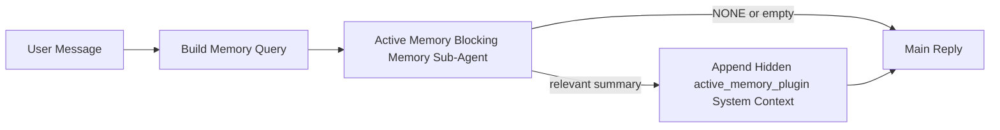

---
read_when:
    - 你想了解 Active Memory 的用途
    - 你想为一个对话型智能体启用 active memory
    - 你想调整 active memory 的行为，而不在所有地方都启用它
summary: 一个由插件拥有的阻塞式 Memory 子智能体，会将相关记忆注入到交互式聊天会话中
title: Active Memory
x-i18n:
    generated_at: "2026-04-12T19:29:18Z"
    model: gpt-5.4
    provider: openai
    source_hash: 11665dbc888b6d4dc667a47624cc1f2e4cc71e1d58e1f7d9b5fe4057ec4da108
    source_path: concepts/active-memory.md
    workflow: 15
---

# Active Memory

Active Memory 是一个可选的、由插件拥有的阻塞式 Memory 子智能体，会在符合条件的对话会话中于主回复之前运行。

它之所以存在，是因为大多数记忆系统虽然能力强，但都是被动响应式的。它们依赖主智能体决定何时搜索记忆，或者依赖用户说出类似“记住这个”或“搜索记忆”这样的话。到了那时，记忆本可以让回复显得自然的那个时机其实已经过去了。

Active Memory 为系统提供了一次有边界的机会，在生成主回复之前主动呈现相关记忆。

## 将这段粘贴到你的智能体中

如果你希望你的智能体以一种自包含且安全默认的方式启用 Active Memory，请将下面这段内容粘贴到你的智能体中：

```json5
{
  plugins: {
    entries: {
      "active-memory": {
        enabled: true,
        config: {
          enabled: true,
          agents: ["main"],
          allowedChatTypes: ["direct"],
          modelFallback: "google/gemini-3-flash",
          queryMode: "recent",
          promptStyle: "balanced",
          timeoutMs: 15000,
          maxSummaryChars: 220,
          persistTranscripts: false,
          logging: true,
        },
      },
    },
  },
}
```

这会为 `main` 智能体启用该插件，默认将其限制为仅用于私信风格的会话，优先让它继承当前会话的模型，并且仅在没有可用的显式模型或继承模型时，才使用已配置的回退模型。

之后，重启 Gateway 网关：

```bash
openclaw gateway
```

如果你想在对话中实时查看它的行为：

```text
/verbose on
/trace on
```

## 启用 active memory

最安全的设置方式是：

1. 启用该插件
2. 指定一个对话型智能体
3. 仅在调优期间保持日志开启

先在 `openclaw.json` 中加入以下内容：

```json5
{
  plugins: {
    entries: {
      "active-memory": {
        enabled: true,
        config: {
          agents: ["main"],
          allowedChatTypes: ["direct"],
          modelFallback: "google/gemini-3-flash",
          queryMode: "recent",
          promptStyle: "balanced",
          timeoutMs: 15000,
          maxSummaryChars: 220,
          persistTranscripts: false,
          logging: true,
        },
      },
    },
  },
}
```

然后重启 Gateway 网关：

```bash
openclaw gateway
```

这意味着：

- `plugins.entries.active-memory.enabled: true` 会启用该插件
- `config.agents: ["main"]` 只让 `main` 智能体加入 active memory
- `config.allowedChatTypes: ["direct"]` 默认仅在私信风格的会话中启用 active memory
- 如果未设置 `config.model`，active memory 会优先继承当前会话模型
- `config.modelFallback` 可选地为回忆提供你自己的回退提供商 / 模型
- `config.promptStyle: "balanced"` 会为 `recent` 模式使用默认的通用提示风格
- active memory 仍然只会在符合条件的交互式持久聊天会话中运行

## 如何看到它

Active Memory 会为模型注入隐藏的系统上下文。它不会将原始的 `<active_memory_plugin>...</active_memory_plugin>` 标签暴露给客户端。

## 会话开关

当你想在不编辑配置的情况下，为当前聊天会话暂停或恢复 active memory 时，请使用插件命令：

```text
/active-memory status
/active-memory off
/active-memory on
```

这是会话级的。它不会更改
`plugins.entries.active-memory.enabled`、智能体目标设置或其他全局配置。

如果你希望该命令写入配置，并为所有会话暂停或恢复 active memory，请使用显式的全局形式：

```text
/active-memory status --global
/active-memory off --global
/active-memory on --global
```

全局形式会写入 `plugins.entries.active-memory.config.enabled`。它会保留
`plugins.entries.active-memory.enabled` 为开启状态，以便该命令之后仍可用于重新启用 active memory。

如果你想在实时会话中查看 active memory 正在做什么，请启用与你想要输出相匹配的会话开关：

```text
/verbose on
/trace on
```

启用后，OpenClaw 可以显示：

- 一个 active memory 状态行，例如在 `/verbose on` 时显示 `Active Memory: ok 842ms recent 34 chars`
- 一个可读的调试摘要，例如在 `/trace on` 时显示 `Active Memory Debug: Lemon pepper wings with blue cheese.`

这些行来源于同一次 active memory 处理流程，该流程也会为隐藏的系统上下文提供内容，但它们是面向人类格式化的，而不会暴露原始提示标记。它们会在正常的助手回复之后作为后续诊断消息发送，因此像 Telegram 这样的渠道客户端不会在回复前闪现一个单独的诊断气泡。

默认情况下，这个阻塞式 Memory 子智能体的转录是临时的，并会在运行完成后删除。

示例流程：

```text
/verbose on
/trace on
what wings should i order?
```

预期的可见回复形态：

```text
...normal assistant reply...

🧩 Active Memory: ok 842ms recent 34 chars
🔎 Active Memory Debug: Lemon pepper wings with blue cheese.
```

## 它何时运行

Active Memory 使用两个门槛：

1. **配置选择加入**
   必须启用该插件，并且当前智能体 id 必须出现在
   `plugins.entries.active-memory.config.agents` 中。
2. **严格的运行时条件**
   即使已启用且已指定目标，Active Memory 也只会在符合条件的交互式持久聊天会话中运行。

实际规则是：

```text
plugin enabled
+
agent id targeted
+
allowed chat type
+
eligible interactive persistent chat session
=
active memory runs
```

如果其中任何一项不满足，active memory 就不会运行。

## 会话类型

`config.allowedChatTypes` 控制哪些类型的对话可以运行 Active
Memory。

默认值是：

```json5
allowedChatTypes: ["direct"]
```

这意味着，默认情况下 Active Memory 会在私信风格的会话中运行，但不会在群组或渠道会话中运行，除非你显式将它们加入。

示例：

```json5
allowedChatTypes: ["direct"]
```

```json5
allowedChatTypes: ["direct", "group"]
```

```json5
allowedChatTypes: ["direct", "group", "channel"]
```

## 它在哪里运行

Active Memory 是一种对话增强功能，而不是平台范围内的推理功能。

| Surface                                                             | 是否运行 active memory？ |
| ------------------------------------------------------------------- | ------------------------ |
| Control UI / web chat 持久会话                                      | 是，如果插件已启用且已指定该智能体 |
| 同一持久聊天路径上的其他交互式渠道会话                            | 是，如果插件已启用且已指定该智能体 |
| 无头单次运行                                                        | 否 |
| 心跳 / 后台运行                                                     | 否 |
| 通用内部 `agent-command` 路径                                       | 否 |
| 子智能体 / 内部辅助执行                                             | 否 |

## 为什么要使用它

在以下情况下使用 active memory：

- 会话是持久的且面向用户
- 智能体拥有值得搜索的长期记忆
- 连贯性和个性化比纯粹的提示确定性更重要

它尤其适合：

- 稳定偏好
- 重复习惯
- 应该自然浮现的长期用户上下文

它不适合：

- 自动化
- 内部工作器
- 单次 API 任务
- 那些隐藏个性化会让人意外的地方

## 它如何工作

运行时结构如下：



这个阻塞式 Memory 子智能体只能使用：

- `memory_search`
- `memory_get`

如果连接较弱，它应返回 `NONE`。

## 查询模式

`config.queryMode` 控制这个阻塞式 Memory 子智能体能看到多少对话内容。

## 提示风格

`config.promptStyle` 控制这个阻塞式 Memory 子智能体在决定是否返回记忆时有多积极或多严格。

可用风格：

- `balanced`：`recent` 模式的通用默认值
- `strict`：最不积极；适合你希望附近上下文几乎不产生串扰时使用
- `contextual`：最有利于连续性；适合对话历史应当更重要时使用
- `recall-heavy`：对于较弱但仍合理的匹配，更愿意呈现记忆
- `precision-heavy`：除非匹配非常明显，否则会强烈倾向于返回 `NONE`
- `preference-only`：专门针对最爱、习惯、日常规律、口味以及重复出现的个人事实进行优化

当未设置 `config.promptStyle` 时，默认映射为：

```text
message -> strict
recent -> balanced
full -> contextual
```

如果你显式设置了 `config.promptStyle`，则以该覆盖值为准。

示例：

```json5
promptStyle: "preference-only"
```

## 模型回退策略

如果未设置 `config.model`，Active Memory 会按以下顺序尝试解析模型：

```text
explicit plugin model
-> current session model
-> agent primary model
-> optional configured fallback model
```

`config.modelFallback` 控制已配置回退步骤。

可选的自定义回退：

```json5
modelFallback: "google/gemini-3-flash"
```

如果没有解析出显式模型、继承模型或已配置的回退模型，Active Memory 会在该轮跳过回忆。

`config.modelFallbackPolicy` 仅作为已弃用的兼容字段保留，用于旧配置。它不再改变运行时行为。

## 高级逃生口

这些选项有意不属于推荐设置的一部分。

`config.thinking` 可以覆盖这个阻塞式 Memory 子智能体的 thinking 级别：

```json5
thinking: "medium"
```

默认值：

```json5
thinking: "off"
```

不要默认启用它。Active Memory 运行在回复路径中，因此额外的 thinking 时间会直接增加用户可见的延迟。

`config.promptAppend` 会在默认的 Active
Memory 提示之后、对话上下文之前，附加额外的操作员说明：

```json5
promptAppend: "Prefer stable long-term preferences over one-off events."
```

`config.promptOverride` 会替换默认的 Active Memory 提示。OpenClaw
之后仍会附加对话上下文：

```json5
promptOverride: "You are a memory search agent. Return NONE or one compact user fact."
```

除非你是在有意测试不同的回忆契约，否则不建议自定义提示。默认提示经过调优，旨在为主模型返回 `NONE` 或紧凑的用户事实上下文。

### `message`

只发送最新的用户消息。

```text
Latest user message only
```

适用场景：

- 你希望行为最快
- 你希望最强烈地偏向稳定偏好回忆
- 后续轮次不需要对话上下文

建议超时时间：

- 从 `3000` 到 `5000` ms 左右开始

### `recent`

会发送最新的用户消息加上一小段最近对话尾部内容。

```text
Recent conversation tail:
user: ...
assistant: ...
user: ...

Latest user message:
...
```

适用场景：

- 你希望在速度和对话语境之间取得更好的平衡
- 后续问题经常依赖最近几轮对话

建议超时时间：

- 从 `15000` ms 左右开始

### `full`

会将完整对话发送给这个阻塞式 Memory 子智能体。

```text
Full conversation context:
user: ...
assistant: ...
user: ...
...
```

适用场景：

- 最强的回忆质量比延迟更重要
- 对话中在线程较早位置包含重要铺垫信息

建议超时时间：

- 相比 `message` 或 `recent` 明显提高
- 根据线程大小，从 `15000` ms 或更高开始

通常来说，超时时间应随着上下文大小增加而增加：

```text
message < recent < full
```

## 转录持久化

Active memory 阻塞式 Memory 子智能体运行会在阻塞式 Memory 子智能体调用期间创建一个真实的 `session.jsonl` 转录文件。

默认情况下，该转录是临时的：

- 它会写入临时目录
- 它仅用于这次阻塞式 Memory 子智能体运行
- 运行结束后会立即删除

如果你想为了调试或检查而将这些阻塞式 Memory 子智能体转录保存在磁盘上，请显式开启持久化：

```json5
{
  plugins: {
    entries: {
      "active-memory": {
        enabled: true,
        config: {
          agents: ["main"],
          persistTranscripts: true,
          transcriptDir: "active-memory",
        },
      },
    },
  },
}
```

启用后，active memory 会将转录存储在目标智能体 sessions 文件夹下的单独目录中，而不是主用户对话转录路径中。

默认布局在概念上是：

```text
agents/<agent>/sessions/active-memory/<blocking-memory-sub-agent-session-id>.jsonl
```

你可以使用 `config.transcriptDir` 修改这个相对子目录。

请谨慎使用：

- 在繁忙会话中，阻塞式 Memory 子智能体转录可能会很快累积
- `full` 查询模式可能会复制大量对话上下文
- 这些转录包含隐藏提示上下文和被回忆出的记忆

## 配置

所有 active memory 配置都位于：

```text
plugins.entries.active-memory
```

最重要的字段包括：

| Key                         | Type                                                                                                 | 含义 |
| --------------------------- | ---------------------------------------------------------------------------------------------------- | ---- |
| `enabled`                   | `boolean`                                                                                            | 启用插件本身 |
| `config.agents`             | `string[]`                                                                                           | 可使用 active memory 的智能体 id |
| `config.model`              | `string`                                                                                             | 可选的阻塞式 Memory 子智能体模型引用；未设置时，active memory 会使用当前会话模型 |
| `config.queryMode`          | `"message" \| "recent" \| "full"`                                                                    | 控制阻塞式 Memory 子智能体能看到多少对话内容 |
| `config.promptStyle`        | `"balanced" \| "strict" \| "contextual" \| "recall-heavy" \| "precision-heavy" \| "preference-only"` | 控制阻塞式 Memory 子智能体在决定是否返回记忆时有多积极或多严格 |
| `config.thinking`           | `"off" \| "minimal" \| "low" \| "medium" \| "high" \| "xhigh" \| "adaptive"`                         | 阻塞式 Memory 子智能体的高级 thinking 覆盖；默认为 `off` 以保证速度 |
| `config.promptOverride`     | `string`                                                                                             | 高级完整提示替换；不建议常规使用 |
| `config.promptAppend`       | `string`                                                                                             | 附加到默认或覆盖提示后的高级额外说明 |
| `config.timeoutMs`          | `number`                                                                                             | 阻塞式 Memory 子智能体的硬超时 |
| `config.maxSummaryChars`    | `number`                                                                                             | active-memory 摘要允许的最大总字符数 |
| `config.logging`            | `boolean`                                                                                            | 调优期间输出 active memory 日志 |
| `config.persistTranscripts` | `boolean`                                                                                            | 将阻塞式 Memory 子智能体转录保存在磁盘上，而不是删除临时文件 |
| `config.transcriptDir`      | `string`                                                                                             | 智能体 sessions 文件夹下阻塞式 Memory 子智能体转录的相对目录 |

有用的调优字段：

| Key                           | Type     | 含义 |
| ----------------------------- | -------- | ---- |
| `config.maxSummaryChars`      | `number` | active-memory 摘要允许的最大总字符数 |
| `config.recentUserTurns`      | `number` | 当 `queryMode` 为 `recent` 时，包含的先前用户轮次数 |
| `config.recentAssistantTurns` | `number` | 当 `queryMode` 为 `recent` 时，包含的先前助手轮次数 |
| `config.recentUserChars`      | `number` | 每个最近用户轮次的最大字符数 |
| `config.recentAssistantChars` | `number` | 每个最近助手轮次的最大字符数 |
| `config.cacheTtlMs`           | `number` | 对重复的相同查询复用缓存 |

## 推荐设置

从 `recent` 开始。

```json5
{
  plugins: {
    entries: {
      "active-memory": {
        enabled: true,
        config: {
          agents: ["main"],
          queryMode: "recent",
          promptStyle: "balanced",
          timeoutMs: 15000,
          maxSummaryChars: 220,
          logging: true,
        },
      },
    },
  },
}
```

如果你想在调优时检查实时行为，请使用 `/verbose on` 查看常规状态行，使用 `/trace on` 查看 active-memory 调试摘要，而不是寻找单独的 active-memory 调试命令。在聊天渠道中，这些诊断行会在主助手回复之后发送，而不是在其之前。

然后再调整为：

- 如果你想降低延迟，使用 `message`
- 如果你认为更多上下文值得更慢的阻塞式 Memory 子智能体速度，使用 `full`

## 调试

如果 active memory 没有在你预期的地方出现：

1. 确认插件已在 `plugins.entries.active-memory.enabled` 下启用。
2. 确认当前智能体 id 已列在 `config.agents` 中。
3. 确认你是在交互式持久聊天会话中测试。
4. 打开 `config.logging: true` 并观察 Gateway 网关日志。
5. 使用 `openclaw memory status --deep` 验证 memory search 本身能正常工作。

如果记忆命中过于嘈杂，请收紧：

- `maxSummaryChars`

如果 active memory 过慢：

- 降低 `queryMode`
- 降低 `timeoutMs`
- 减少最近轮次数
- 减少每轮字符上限

## 常见问题

### Embedding 提供商意外变化

Active Memory 使用 `agents.defaults.memorySearch` 下的常规 `memory_search` 流程。这意味着，仅当你的 `memorySearch` 设置需要 embeddings 才能实现你想要的行为时，embedding 提供商设置才是必需的。

在实践中：

- 如果你想使用一个不会被自动检测到的提供商（例如 `ollama`），则**必须**进行显式提供商设置
- 如果自动检测无法为你的环境解析出任何可用的 embedding 提供商，则**必须**进行显式提供商设置
- 如果你想获得确定性的提供商选择，而不是“第一个可用者胜出”，则**强烈建议**进行显式提供商设置
- 如果自动检测已经解析出你想要的提供商，并且该提供商在你的部署中稳定，则通常**不需要**显式提供商设置

如果未设置 `memorySearch.provider`，OpenClaw 会自动检测第一个可用的 embedding 提供商。

这在真实部署中可能会令人困惑：

- 新增一个可用的 API key 可能会改变 memory search 使用的提供商
- 某个命令或诊断界面可能让所选提供商看起来与你在实时 memory 同步或 search bootstrap 期间实际命中的路径不同
- 托管提供商可能会因配额或速率限制而失败，而这些错误只有在 Active Memory 开始于每次回复前发起回忆搜索时才会显现

当 `memory_search` 能以降级的纯词法模式运行时，即使没有 embeddings，Active Memory 仍然可以运行，这通常发生在无法解析出任何 embedding 提供商时。

不要假设在提供商运行时失败时也会有同样的回退行为，例如配额耗尽、速率限制、网络 / 提供商错误，或在提供商已经被选中后本地 / 远程模型缺失。

在实践中：

- 如果无法解析出 embedding 提供商，`memory_search` 可能会降级为纯词法检索
- 如果 embedding 提供商已被解析但随后在运行时失败，OpenClaw 目前不保证该请求会回退到词法模式
- 如果你需要确定性的提供商选择，请固定
  `agents.defaults.memorySearch.provider`
- 如果你需要在运行时错误时进行提供商故障切换，请显式配置
  `agents.defaults.memorySearch.fallback`

如果你依赖基于 embedding 的回忆、多模态索引，或某个特定的本地 / 远程提供商，请显式固定该提供商，而不要依赖自动检测。

常见固定示例：

OpenAI：

```json5
{
  agents: {
    defaults: {
      memorySearch: {
        provider: "openai",
        model: "text-embedding-3-small",
      },
    },
  },
}
```

Gemini：

```json5
{
  agents: {
    defaults: {
      memorySearch: {
        provider: "gemini",
        model: "gemini-embedding-001",
      },
    },
  },
}
```

Ollama：

```json5
{
  agents: {
    defaults: {
      memorySearch: {
        provider: "ollama",
        model: "nomic-embed-text",
      },
    },
  },
}
```

如果你希望在运行时错误（例如配额耗尽）时进行提供商故障切换，仅固定一个提供商还不够。还需要配置显式回退：

```json5
{
  agents: {
    defaults: {
      memorySearch: {
        provider: "openai",
        fallback: "gemini",
      },
    },
  },
}
```

### 调试提供商问题

如果 Active Memory 很慢、为空，或似乎意外切换了提供商：

- 在复现问题时观察 Gateway 网关日志；查找诸如
  `active-memory: ... start|done`、`memory sync failed (search-bootstrap)` 或特定于提供商的 embedding 错误等日志行
- 打开 `/trace on`，在会话中显示插件拥有的 Active Memory 调试摘要
- 如果你还想在每次回复后看到常规的 `🧩 Active Memory: ...`
  状态行，请打开 `/verbose on`
- 运行 `openclaw memory status --deep` 以检查当前的 memory-search 后端和索引健康状态
- 检查 `agents.defaults.memorySearch.provider` 以及相关凭证 / 配置，确保你期望的提供商实际上就是运行时可解析到的那个
- 如果你使用 `ollama`，请验证已安装所配置的 embedding 模型，例如运行 `ollama list`

示例调试流程：

```text
1. Start the gateway and watch its logs
2. In the chat session, run /trace on
3. Send one message that should trigger Active Memory
4. Compare the chat-visible debug line with the gateway log lines
5. If provider choice is ambiguous, pin agents.defaults.memorySearch.provider explicitly
```

示例：

```json5
{
  agents: {
    defaults: {
      memorySearch: {
        provider: "ollama",
        model: "nomic-embed-text",
      },
    },
  },
}
```

或者，如果你想使用 Gemini embeddings：

```json5
{
  agents: {
    defaults: {
      memorySearch: {
        provider: "gemini",
      },
    },
  },
}
```

更改提供商后，重启 Gateway 网关，并使用 `/trace on` 运行一次新的测试，这样 Active Memory 调试行就会反映新的 embedding 路径。

## 相关页面

- [Memory Search](/zh-CN/concepts/memory-search)
- [Memory 配置参考](/zh-CN/reference/memory-config)
- [插件 SDK 设置](/zh-CN/plugins/sdk-setup)
