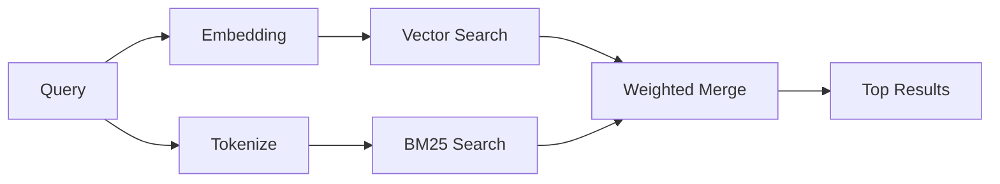

---
read_when:
    - 你想了解 `memory_search` 的工作原理
    - 你想选择一个 embedding 提供商
    - 你想调整搜索质量
summary: 记忆搜索如何使用 embeddings 和混合检索来找到相关笔记
title: 记忆搜索
x-i18n:
    generated_at: "2026-04-23T20:46:29Z"
    model: gpt-5.4
    provider: openai
    source_hash: 7e3db2426abe631191d810a753504122b3b7daf7992f56c030a2823b1835ddca
    source_path: concepts/memory-search.md
    workflow: 15
---

`memory_search` 可以从你的记忆文件中找到相关笔记，即使
措辞与原始文本不同也可以。它的工作方式是将记忆索引为小块，
然后使用 embeddings、关键词，或两者结合来搜索这些内容。

## 快速开始

如果你已配置 GitHub Copilot 订阅、OpenAI、Gemini、Voyage 或 Mistral
API key，记忆搜索会自动工作。如需显式设置提供商：

```json5
{
  agents: {
    defaults: {
      memorySearch: {
        provider: "openai", // or "gemini", "local", "ollama", etc.
      },
    },
  },
}
```

如需使用无需 API key 的本地 embeddings，请使用 `provider: "local"`（需要
`node-llama-cpp`）。

## 支持的提供商

| 提供商 | ID | 需要 API key | 说明 |
| -------------- | ---------------- | ------------- | ---------------------------------------------------- |
| Bedrock | `bedrock` | 否 | 当 AWS 凭证链可解析时自动检测 |
| Gemini | `gemini` | 是 | 支持图像 / 音频索引 |
| GitHub Copilot | `github-copilot` | 否 | 自动检测，使用 Copilot 订阅 |
| Local | `local` | 否 | GGUF 模型，下载约 0.6 GB |
| Mistral | `mistral` | 是 | 自动检测 |
| Ollama | `ollama` | 否 | 本地，必须显式设置 |
| OpenAI | `openai` | 是 | 自动检测，速度快 |
| Voyage | `voyage` | 是 | 自动检测 |

## 搜索如何工作

OpenClaw 会并行运行两条检索路径，并合并结果：



- **向量搜索**会找到语义相近的笔记（“gateway host” 可以匹配
  “运行 OpenClaw 的那台机器”）。
- **BM25 关键词搜索**会找到精确匹配项（ID、错误字符串、配置
  键名）。

如果只有一条路径可用（没有 embeddings 或没有 FTS），则仅运行另一条路径。

当 embeddings 不可用时，OpenClaw 仍会对 FTS 结果使用词法排序，而不是只回退到原始精确匹配顺序。在这种降级模式下，它会提升那些查询词覆盖更强、文件路径更相关的内容块，因此即使没有 `sqlite-vec` 或 embedding 提供商，recall 仍然有用。

## 提升搜索质量

当你有大量历史笔记时，有两项可选功能会很有帮助：

### 时间衰减

旧笔记的排序权重会逐渐降低，从而让近期信息优先显示。
使用默认的 30 天半衰期时，上个月的笔记得分会降到其原始权重的 50%。
像 `MEMORY.md` 这样的常青文件永远不会衰减。

<Tip>
如果你的智能体已有数月的每日笔记，而过时信息总是压过近期上下文，请启用时间衰减。
</Tip>

### MMR（多样性）

减少重复结果。如果有五条笔记都提到了相同的路由器配置，MMR
会确保顶部结果覆盖不同主题，而不是重复显示。

<Tip>
如果 `memory_search` 总是返回来自不同每日笔记、但几乎重复的片段，请启用 MMR。
</Tip>

### 同时启用两者

```json5
{
  agents: {
    defaults: {
      memorySearch: {
        query: {
          hybrid: {
            mmr: { enabled: true },
            temporalDecay: { enabled: true },
          },
        },
      },
    },
  },
}
```

## 多模态记忆

借助 Gemini Embedding 2，你可以在索引 Markdown 的同时索引图像和音频文件。
搜索查询仍然是文本，但它们可以匹配视觉和音频内容。设置方法请参阅
[Memory 配置参考](/zh-CN/reference/memory-config)。

## 会话记忆搜索

你还可以选择为会话转录建立索引，以便 `memory_search` 可以回忆
更早的对话。此功能需要通过
`memorySearch.experimental.sessionMemory` 显式启用。详见
[配置参考](/zh-CN/reference/memory-config)。

## 故障排除

**没有结果？** 运行 `openclaw memory status` 检查索引。如果为空，请运行
`openclaw memory index --force`。

**只有关键词匹配？** 你的 embedding 提供商可能未配置。请检查
`openclaw memory status --deep`。

**找不到 CJK 文本？** 请使用
`openclaw memory index --force` 重建 FTS 索引。

## 延伸阅读

- [Active Memory](/zh-CN/concepts/active-memory) -- 用于交互式聊天会话的子智能体记忆
- [Memory](/zh-CN/concepts/memory) -- 文件布局、后端、工具
- [Memory 配置参考](/zh-CN/reference/memory-config) -- 所有配置项
