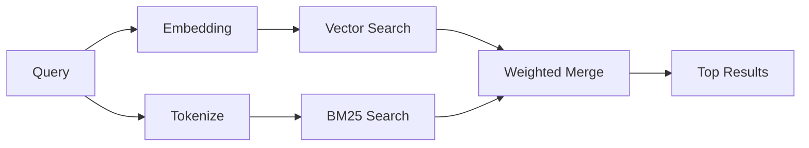

---
read_when:
    - 你想了解 `memory_search` 的工作原理
    - 你想选择一个嵌入提供商
    - 你想调整搜索质量
summary: 内存搜索如何使用嵌入和混合检索来查找相关笔记
title: 内存搜索
x-i18n:
    generated_at: "2026-04-12T17:37:51Z"
    model: gpt-5.4
    provider: openai
    source_hash: 71fde251b7d2dc455574aa458e7e09136f30613609ad8dafeafd53b2729a0310
    source_path: concepts/memory-search.md
    workflow: 15
---

# 内存搜索

`memory_search` 会从你的内存文件中查找相关笔记，即使措辞与原文不同也可以。它的工作方式是先将内存索引为较小的分块，然后使用嵌入、关键词或两者结合来搜索这些分块。

## 快速开始

如果你已配置 OpenAI、Gemini、Voyage 或 Mistral 的 API 密钥，内存搜索会自动工作。要显式设置提供商：

```json5
{
  agents: {
    defaults: {
      memorySearch: {
        provider: "openai", // 或 "gemini"、"local"、"ollama" 等
      },
    },
  },
}
```

如果要在没有 API 密钥的情况下使用本地嵌入，请使用 `provider: "local"`（需要 `node-llama-cpp`）。

## 支持的提供商

| 提供商 | ID        | 需要 API 密钥 | 说明 |
| ------ | --------- | ------------- | ---- |
| OpenAI | `openai`  | 是            | 自动检测，速度快 |
| Gemini | `gemini`  | 是            | 支持图像/音频索引 |
| Voyage | `voyage`  | 是            | 自动检测 |
| Mistral | `mistral` | 是           | 自动检测 |
| Bedrock | `bedrock` | 否           | 当 AWS 凭证链可解析时自动检测 |
| Ollama | `ollama`  | 否            | 本地，必须显式设置 |
| Local  | `local`   | 否            | GGUF 模型，约需下载 0.6 GB |

## 搜索如何工作

OpenClaw 会并行运行两条检索路径，并合并结果：



- **向量搜索** 会查找语义相近的笔记（“gateway host” 可以匹配 “the machine running OpenClaw”）。
- **BM25 关键词搜索** 会查找精确匹配项（ID、错误字符串、配置键）。

如果只有一条路径可用（没有嵌入或没有 FTS），则仅运行另一条路径。

当嵌入不可用时，OpenClaw 仍会对 FTS 结果使用词法排序，而不是仅退回到原始精确匹配顺序。这种降级模式会提升那些对查询词覆盖更强、文件路径更相关的分块，因此即使没有 `sqlite-vec` 或嵌入提供商，也能保持不错的召回效果。

## 提升搜索质量

当你有大量笔记历史时，有两个可选功能会很有帮助：

### 时间衰减

旧笔记的排名权重会逐渐降低，因此最近的信息会优先显示。默认半衰期为 30 天，这意味着上个月的笔记得分会降到原始权重的 50%。像 `MEMORY.md` 这样的常青文件永远不会衰减。

<Tip>
如果你的智能体积累了数月的每日笔记，并且过时信息总是排在最近上下文之前，请启用时间衰减。
</Tip>

### MMR（多样性）

可减少重复结果。如果五条笔记都提到同一个路由器配置，MMR 会确保顶部结果覆盖不同主题，而不是反复重复。

<Tip>
如果 `memory_search` 总是从不同的每日笔记中返回几乎重复的片段，请启用 MMR。
</Tip>

### 同时启用两者

```json5
{
  agents: {
    defaults: {
      memorySearch: {
        query: {
          hybrid: {
            mmr: { enabled: true },
            temporalDecay: { enabled: true },
          },
        },
      },
    },
  },
}
```

## 多模态内存

借助 Gemini Embedding 2，你可以在 Markdown 之外一并索引图像和音频文件。搜索查询仍然是文本，但可以匹配视觉和音频内容。有关设置，请参阅 [内存配置参考](/zh-CN/reference/memory-config)。

## 会话内存搜索

你还可以选择为会话转录建立索引，这样 `memory_search` 就能回忆更早的对话。这是通过 `memorySearch.experimental.sessionMemory` 选择启用的。详见 [配置参考](/zh-CN/reference/memory-config)。

## 故障排除

**没有结果？** 运行 `openclaw memory status` 检查索引。如果为空，请运行 `openclaw memory index --force`。

**只有关键词匹配？** 你的嵌入提供商可能尚未配置。请检查 `openclaw memory status --deep`。

**找不到 CJK 文本？** 请使用 `openclaw memory index --force` 重建 FTS 索引。

## 延伸阅读

- [Active Memory](/zh-CN/concepts/active-memory) —— 用于交互式聊天会话的子智能体内存
- [Memory](/zh-CN/concepts/memory) —— 文件布局、后端、工具
- [Memory configuration reference](/zh-CN/reference/memory-config) —— 所有配置项
