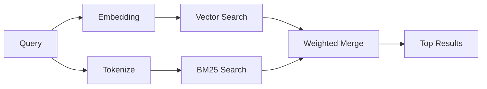

---
read_when:
    - 你想了解 `memory_search` 是如何工作的
    - 你想选择一个嵌入提供商
    - 你想调整搜索质量
summary: 记忆搜索如何使用嵌入和混合检索来查找相关笔记
title: 记忆搜索
x-i18n:
    generated_at: "2026-04-25T07:22:21Z"
    model: gpt-5.4
    provider: openai
    source_hash: 5cc6bbaf7b0a755bbe44d3b1b06eed7f437ebdc41a81c48cca64bd08bbc546b7
    source_path: concepts/memory-search.md
    workflow: 15
---

`memory_search` 会从你的记忆文件中查找相关笔记，即使措辞与原始文本不同也可以。它通过将记忆索引为小块，并使用嵌入、关键词或两者结合来搜索这些内容。

## 快速开始

如果你已配置 GitHub Copilot 订阅、OpenAI、Gemini、Voyage 或 Mistral 的 API key，记忆搜索会自动生效。要显式设置提供商：

```json5
{
  agents: {
    defaults: {
      memorySearch: {
        provider: "openai", // 或 "gemini"、"local"、"ollama" 等
      },
    },
  },
}
```

如果你想使用无需 API key 的本地嵌入，请在 OpenClaw 旁边安装可选的 `node-llama-cpp` 运行时包，并使用 `provider: "local"`。

## 支持的提供商

| 提供商 | ID | 需要 API key | 说明 |
| -------------- | ---------------- | ------------- | ---------------------------------------------------- |
| Bedrock | `bedrock` | 否 | 当 AWS 凭证链解析成功时自动检测 |
| Gemini | `gemini` | 是 | 支持图像/音频索引 |
| GitHub Copilot | `github-copilot` | 否 | 自动检测，使用 Copilot 订阅 |
| Local | `local` | 否 | GGUF 模型，下载大小约 0.6 GB |
| Mistral | `mistral` | 是 | 自动检测 |
| Ollama | `ollama` | 否 | 本地，必须显式设置 |
| OpenAI | `openai` | 是 | 自动检测，速度快 |
| Voyage | `voyage` | 是 | 自动检测 |

## 搜索如何工作

OpenClaw 会并行运行两条检索路径，并合并结果：



- **向量搜索** 会查找语义相近的笔记（“gateway host” 可匹配 “the machine running OpenClaw”）。
- **BM25 关键词搜索** 会查找精确匹配（ID、错误字符串、配置键）。

如果只有一条路径可用（没有嵌入或没有 FTS），则只运行另一条路径。

当嵌入不可用时，OpenClaw 仍会对 FTS 结果使用词法排序，而不是只退回到原始精确匹配顺序。这种降级模式会提升那些查询词覆盖更强、文件路径更相关的内容块，因此即使没有 `sqlite-vec` 或嵌入提供商，也能保持较好的召回效果。

## 改进搜索质量

当你拥有大量笔记历史时，有两个可选功能会很有帮助：

### 时间衰减

旧笔记的排序权重会逐渐降低，因此最近的信息会优先显示。使用默认的 30 天半衰期时，上个月的笔记得分会降到原始权重的 50%。像 `MEMORY.md` 这样的常青文件永远不会衰减。

<Tip>
如果你的智能体已经积累了数月的每日笔记，而过时信息总是排在最近上下文之前，请启用时间衰减。
</Tip>

### MMR（多样性）

减少重复结果。如果五条笔记都提到了同一个路由器配置，MMR 会确保顶部结果覆盖不同主题，而不是重复相同内容。

<Tip>
如果 `memory_search` 总是从不同的每日笔记中返回几乎重复的片段，请启用 MMR。
</Tip>

### 同时启用两者

```json5
{
  agents: {
    defaults: {
      memorySearch: {
        query: {
          hybrid: {
            mmr: { enabled: true },
            temporalDecay: { enabled: true },
          },
        },
      },
    },
  },
}
```

## 多模态记忆

使用 Gemini Embedding 2 时，你可以在 Markdown 之外为图像和音频文件建立索引。搜索查询仍然是文本，但会匹配视觉和音频内容。设置方法请参阅[记忆配置参考](/zh-CN/reference/memory-config)。

## 会话记忆搜索

你还可以选择为会话转录建立索引，这样 `memory_search` 就能回忆更早的对话。这是通过 `memorySearch.experimental.sessionMemory` 选择启用的。详情请参阅[配置参考](/zh-CN/reference/memory-config)。

## 故障排除

**没有结果？** 运行 `openclaw memory status` 检查索引。如果为空，运行 `openclaw memory index --force`。

**只有关键词匹配？** 你的嵌入提供商可能尚未配置。检查 `openclaw memory status --deep`。

**找不到 CJK 文本？** 使用 `openclaw memory index --force` 重建 FTS 索引。

## 延伸阅读

- [Active Memory](/zh-CN/concepts/active-memory) -- 用于交互式聊天会话的子智能体记忆
- [Memory](/zh-CN/concepts/memory) -- 文件布局、后端、工具
- [记忆配置参考](/zh-CN/reference/memory-config) -- 所有配置项

## 相关内容

- [记忆概览](/zh-CN/concepts/memory)
- [Active memory](/zh-CN/concepts/active-memory)
- [内置记忆引擎](/zh-CN/concepts/memory-builtin)
