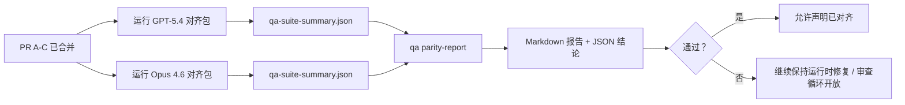

---
read_when:
    - 审查 GPT-5.4 / Codex 对齐 PR 系列
    - 维护支撑对齐计划的六合约智能体架构
summary: 如何将 GPT-5.4 / Codex 对齐计划作为四个合并单元进行审查
title: GPT-5.4 / Codex 对齐维护者说明
x-i18n:
    generated_at: "2026-04-23T20:51:03Z"
    model: gpt-5.4
    provider: openai
    source_hash: be9b5d6d0d4700355c476f04405c470ab3d44511cdae00c45b97a10a68491be7
    source_path: help/gpt54-codex-agentic-parity-maintainers.md
    workflow: 15
---

这份说明解释了如何将 GPT-5.4 / Codex 对齐计划作为四个合并单元进行审查，同时不丢失原本的六合约架构。

## 合并单元

### PR A：严格智能体式执行

负责：

- `executionContract`
- GPT-5 优先的同轮后续执行
- 将 `update_plan` 作为非终止性的进度跟踪
- 用显式阻塞状态替代仅有计划但静默停止的情况

不负责：

- 身份验证/运行时故障分类
- 权限真实性
- 回放/续跑重设计
- 对齐基准测试

### PR B：运行时真实性

负责：

- Codex OAuth 作用域正确性
- 类型化的提供商/运行时故障分类
- 对 `/elevated full` 可用性及阻塞原因的真实描述

不负责：

- 工具 schema 规范化
- 回放/活性状态
- 基准门控

### PR C：执行正确性

负责：

- 由提供商拥有的 OpenAI/Codex 工具兼容性
- 无参数严格 schema 处理
- replay-invalid 的暴露
- paused、blocked 和 abandoned 长任务状态可见性

不负责：

- 自主选择的续跑
- 提供商钩子之外的通用 Codex 方言行为
- 基准门控

### PR D：对齐验证 harness

负责：

- 第一波 GPT-5.4 与 Opus 4.6 场景包
- 对齐文档
- 对齐报告和发布门控机制

不负责：

- QA-lab 之外的运行时行为变更
- harness 内部的身份验证/代理/DNS 模拟

## 映射回原始的六合约

| 原始合约                                 | 合并单元   |
| ---------------------------------------- | ---------- |
| 提供商传输/身份验证正确性                | PR B       |
| 工具合约/schema 兼容性                   | PR C       |
| 同轮执行                                 | PR A       |
| 权限真实性                               | PR B       |
| 回放/续跑/活性正确性                     | PR C       |
| 基准/发布门控                            | PR D       |

## 审查顺序

1. PR A
2. PR B
3. PR C
4. PR D

PR D 是证明层。它不应成为运行时正确性 PR 被拖延的理由。

## 审查要点

### PR A

- GPT-5 运行要么执行，要么以失败关闭，而不是停留在说明性文本
- `update_plan` 本身不再看起来像进展
- 行为保持 GPT-5 优先，并限定在内嵌 Pi 范围内

### PR B

- 身份验证/代理/运行时故障不再被折叠为泛化的“模型失败”处理
- 只有在实际可用时，`/elevated full` 才会被描述为可用
- 阻塞原因对模型和面向用户的运行时都可见

### PR C

- 严格的 OpenAI/Codex 工具注册行为可预测
- 无参数工具不会因严格 schema 检查而失败
- 回放和压缩结果会保留真实的活性状态

### PR D

- 场景包易于理解并可复现
- 场景包包含变更型回放安全路径，而不只是只读流程
- 报告对人工和自动化都可读
- 对齐声明基于证据，而不是轶事

PR D 的预期工件：

- 每次模型运行的 `qa-suite-report.md` / `qa-suite-summary.json`
- 包含聚合与场景级对比的 `qa-agentic-parity-report.md`
- 带有机器可读结论的 `qa-agentic-parity-summary.json`

## 发布门控

在以下条件满足之前，不要声称 GPT-5.4 与 Opus 4.6 达到对齐或优于后者：

- PR A、PR B 和 PR C 已合并
- PR D 已干净地跑通第一波对齐包
- 运行时真实性回归测试套件持续保持绿色
- 对齐报告显示不存在伪成功案例，且停止行为没有回归

对齐 harness 不是唯一的证据来源。在审查中请明确保持以下拆分：

- PR D 负责基于场景的 GPT-5.4 与 Opus 4.6 对比
- PR B 的确定性测试套件仍负责身份验证/代理/DNS 和完全访问真实性证据

## 目标到证据映射

| 完成门控项                               | 主要负责人   | 审查工件                                                            |
| ---------------------------------------- | ------------ | ------------------------------------------------------------------- |
| 不再出现仅有计划的停滞                   | PR A         | 严格智能体式运行时测试和 `approval-turn-tool-followthrough`         |
| 不再出现伪进展或伪工具完成               | PR A + PR D  | 对齐伪成功计数以及场景级报告细节                                   |
| 不再出现错误的 `/elevated full` 指引     | PR B         | 确定性的运行时真实性测试套件                                        |
| 回放/活性故障保持显式                    | PR C + PR D  | 生命周期/回放测试套件以及 `compaction-retry-mutating-tool`          |
| GPT-5.4 达到或超过 Opus 4.6              | PR D         | `qa-agentic-parity-report.md` 和 `qa-agentic-parity-summary.json`   |

## 审查者速记：前后对比

| 之前面向用户的问题                                           | 之后的审查信号                                                                         |
| ------------------------------------------------------------ | -------------------------------------------------------------------------------------- |
| GPT-5.4 在规划后就停止                                       | PR A 展示执行或阻塞行为，而不是仅有说明性完成                                         |
| 在严格 OpenAI/Codex schema 下，工具使用显得脆弱             | PR C 让工具注册和无参数调用保持可预测                                                 |
| `/elevated full` 提示有时具有误导性                          | PR B 将指引绑定到真实的运行时能力和阻塞原因                                           |
| 长任务可能消失在回放/压缩歧义中                              | PR C 发出显式的 paused、blocked、abandoned 和 replay-invalid 状态                     |
| 对齐声明只是轶事                                             | PR D 在两种模型上基于相同场景覆盖产出报告和 JSON 结论
