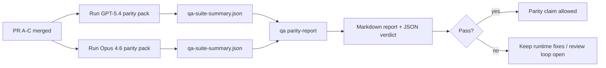

---
read_when:
    - 审查 GPT-5.4 / Codex 一致性 PR 系列
    - 维护一致性计划背后的六契约智能体架构
summary: 如何将 GPT-5.4 / Codex 一致性计划作为四个合并单元进行审查
title: GPT-5.4 / Codex 一致性维护者说明
x-i18n:
    generated_at: "2026-04-25T10:34:40Z"
    model: gpt-5.4
    provider: openai
    source_hash: 162ea68476880d4dbf9b8c3b9397a51a2732c3eb10ac52e421a9c9d90e04eec2
    source_path: help/gpt54-codex-agentic-parity-maintainers.md
    workflow: 15
---

这份说明解释了如何将 GPT-5.4 / Codex 一致性计划作为四个合并单元进行审查，同时不丢失原始的六契约架构。

## 合并单元

### PR A：严格智能体执行

负责：

- `executionContract`
- 以 GPT-5 为优先的同轮跟进行为
- 将 `update_plan` 作为非终态的进度跟踪
- 使用显式阻塞状态，而不是仅有计划的静默停止

不负责：

- 认证/运行时故障分类
- 权限真实性
- 回放/续接重设计
- 一致性基准测试

### PR B：运行时真实性

负责：

- Codex OAuth scope 正确性
- 类型化的 provider / 运行时故障分类
- 真实反映 `/elevated full` 的可用性和阻塞原因

不负责：

- 工具 schema 标准化
- 回放/存活状态
- 基准门禁

### PR C：执行正确性

负责：

- 由 provider 负责的 OpenAI / Codex 工具兼容性
- 无参数严格 schema 处理
- 暴露 replay-invalid
- 已暂停、已阻塞和已放弃的长任务状态可见性

不负责：

- 自主选择的续接
- provider hooks 之外的通用 Codex 方言行为
- 基准门禁

### PR D：一致性 harness

负责：

- 第一波 GPT-5.4 对比 Opus 4.6 的场景包
- 一致性文档
- 一致性报告和发布门禁机制

不负责：

- QA-lab 之外的运行时行为变更
- harness 内的认证/代理/DNS 模拟

## 映射回原始六项契约

| 原始契约 | 合并单元 |
| ---------------------------------------- | ---------- |
| provider 传输/认证正确性 | PR B |
| 工具契约/schema 兼容性 | PR C |
| 同轮执行 | PR A |
| 权限真实性 | PR B |
| 回放/续接/存活性正确性 | PR C |
| 基准/发布门禁 | PR D |

## 审查顺序

1. PR A
2. PR B
3. PR C
4. PR D

PR D 是证明层。它不应成为运行时正确性 PR 被延迟的原因。

## 需要关注的内容

### PR A

- GPT-5 运行时会执行操作或以封闭失败结束，而不是停留在说明性文字
- `update_plan` 本身不再看起来像是进展
- 行为保持以 GPT-5 为优先，并限定在嵌入式 Pi 范围内

### PR B

- 认证/代理/运行时故障不再被统一压缩为通用的“模型失败”处理
- 仅当 `/elevated full` 实际可用时，才将其描述为可用
- 阻塞原因对模型和面向用户的运行时都可见

### PR C

- 严格的 OpenAI / Codex 工具注册行为可预测
- 无参数工具不会因严格 schema 检查而失败
- 回放和压缩结果能够保留真实的存活状态

### PR D

- 场景包易于理解且可复现
- 场景包包含变更型的回放安全通道，而不仅仅是只读流程
- 报告同时便于人工和自动化读取
- 一致性结论有证据支撑，而不是轶事式描述

PR D 的预期产物：

- 每次模型运行对应的 `qa-suite-report.md` / `qa-suite-summary.json`
- 包含聚合对比和场景级对比的 `qa-agentic-parity-report.md`
- 带有机器可读结论的 `qa-agentic-parity-summary.json`

## 发布门禁

在以下条件满足之前，不要声称 GPT-5.4 与 Opus 4.6 一致，或优于 Opus 4.6：

- PR A、PR B 和 PR C 已合并
- PR D 已干净地跑通第一波一致性场景包
- 运行时真实性回归测试套件保持绿色
- 一致性报告显示没有伪成功案例，也没有停止行为回归

一致性 harness 不是唯一的证据来源。在审查时要明确保持这一拆分：

- PR D 负责基于场景的 GPT-5.4 与 Opus 4.6 对比
- PR B 的确定性测试套件仍然负责认证/代理/DNS 和完全访问真实性证据

## 维护者快速合并工作流

当你准备合并一个一致性 PR，并希望采用可重复、低风险的流程时，请使用这个步骤。

1. 合并前确认已达到证据门槛：
   - 可复现的症状或失败测试
   - 已在修改代码中验证根因
   - 问题路径中已有修复
   - 回归测试或明确的人工验证说明
2. 合并前进行分诊/打标签：
   - 如果 PR 不应合并，应用任何 `r:*` 自动关闭标签
   - 保持候选合并 PR 没有未解决的阻塞讨论线程
3. 在本地验证修改表面：
   - `pnpm check:changed`
   - 如果测试发生变化，或修复置信度依赖测试覆盖，则运行 `pnpm test:changed`
4. 按标准维护者流程合并（`/landpr` 流程），然后验证：
   - 已关联 issue 的自动关闭行为
   - `main` 上的 CI 和合并后状态
5. 合并后，对相关未关闭 PR / issue 进行重复搜索，并且只在附带规范引用时再关闭它们。

如果证据门槛中的任意一项缺失，应请求修改，而不是直接合并。

## 目标到证据映射

| 完成门禁项 | 主要负责人 | 审查产物 |
| ---------------------------------------- | ------------- | ------------------------------------------------------------------- |
| 没有仅计划型停滞 | PR A | 严格智能体运行时测试和 `approval-turn-tool-followthrough` |
| 没有伪进展或伪工具完成 | PR A + PR D | 一致性伪成功计数，以及场景级报告细节 |
| 没有错误的 `/elevated full` 指引 | PR B | 确定性的运行时真实性测试套件 |
| 回放/存活性故障保持显式可见 | PR C + PR D | 生命周期/回放测试套件，以及 `compaction-retry-mutating-tool` |
| GPT-5.4 达到或超过 Opus 4.6 | PR D | `qa-agentic-parity-report.md` 和 `qa-agentic-parity-summary.json` |

## 审查者速记：前后对比

| 之前用户可见的问题 | 之后的审查信号 |
| ----------------------------------------------------------- | --------------------------------------------------------------------------------------- |
| GPT-5.4 在规划后停止 | PR A 展示执行或阻塞行为，而不是仅有说明性完成 |
| 在严格 OpenAI / Codex schema 下，工具使用显得脆弱 | PR C 保持工具注册和无参数调用的可预测性 |
| `/elevated full` 提示有时具有误导性 | PR B 将指引与真实运行时能力和阻塞原因绑定 |
| 长任务可能消失在回放/压缩歧义中 | PR C 发出显式的已暂停、已阻塞、已放弃和 replay-invalid 状态 |
| 一致性结论只是轶事式描述 | PR D 生成报告和 JSON 结论，并在两个模型上使用相同的场景覆盖 |

## 相关内容

- [GPT-5.4 / Codex 智能体一致性](/zh-CN/help/gpt54-codex-agentic-parity)
