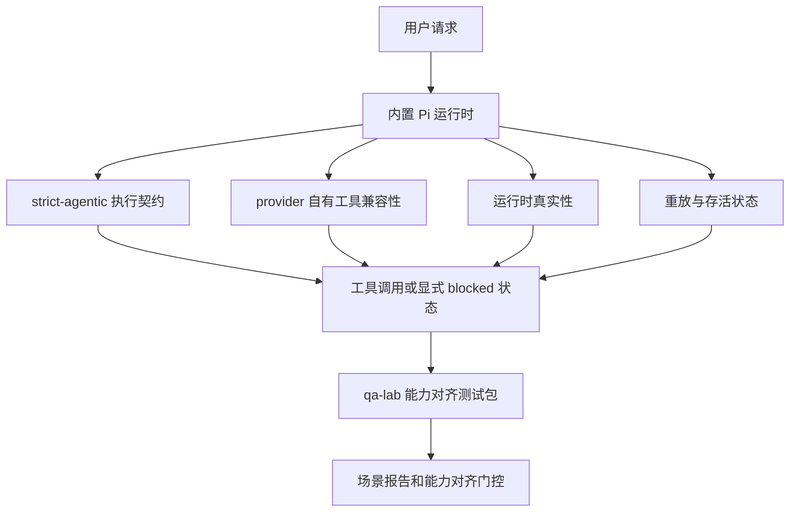
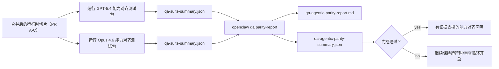

---
read_when:
    - 调试 GPT-5.4 或 Codex 智能体行为
    - 比较 OpenClaw 在不同前沿模型上的智能体行为
    - 审查 strict-agentic、工具 schema、提权和重放修复 银雀analysis to=functions.read ՞նչ_input={"path":"/home/runner/work/docs/docs/source/.agents/skills/openclaw-qa-testing/SKILL.md"} code ಪ್ರಜಾವ to=functions.read  ҭыԥ_input={"path":"/home/runner/work/docs/docs/source/.agents/skills/openclaw-qa-testing/SKILL.md"} code  天天彩票app to=functions.read ￣奇米影视_input={"path":"/home/runner/work/docs/docs/source/.agents/skills/openclaw-qa-testing/SKILL.md"} code
summary: OpenClaw 如何为 GPT-5.4 和 Codex 风格模型弥补智能体执行缺口
title: GPT-5.4 / Codex 智能体能力对齐
x-i18n:
    generated_at: "2026-04-23T20:51:13Z"
    model: gpt-5.4
    provider: openai
    source_hash: cafd8aaffec102e1cedcbcdeb25a87e3433f411b3df1c3232d65ce1a1f4d067e
    source_path: help/gpt54-codex-agentic-parity.md
    workflow: 15
---

# OpenClaw 中的 GPT-5.4 / Codex 智能体能力对齐

OpenClaw 早已能很好地配合使用工具的前沿模型，但 GPT-5.4 和 Codex 风格模型在一些实际方面仍然表现不足：

- 它们可能在规划之后就停止，而不真正执行工作
- 它们可能错误使用严格的 OpenAI/Codex 工具 schema
- 即使根本不可能获得 full access，它们仍可能请求 `/elevated full`
- 它们可能在重放或压缩期间丢失长任务状态
- 与 Claude Opus 4.6 的能力对齐结论此前更多基于轶事，而不是可重复场景

这个能力对齐计划将这些缺口拆分为四个可审查的部分进行修复。

## 有哪些变化

### PR A：strict-agentic 执行

这一部分为内置 Pi GPT-5 运行添加了一个可选的 `strict-agentic` 执行契约。

启用后，OpenClaw 不再接受仅有规划的轮次作为“足够好”的完成状态。如果模型只是说自己打算做什么，却没有真正使用工具或取得进展，OpenClaw 会通过一个“立即行动”的 steer 进行重试；如果仍不行，则会以显式 blocked 状态失败关闭，而不是悄悄结束任务。

这对 GPT-5.4 体验改善最明显的场景包括：

- 简短的 “ok do it” 后续消息
- 第一步非常明确的代码任务
- `update_plan` 本应作为进度跟踪、而不是填充文本的流程

### PR B：运行时真实性

这一部分让 OpenClaw 在两个方面“说实话”：

- provider/runtime 调用失败的真正原因
- `/elevated full` 是否真的可用

这意味着 GPT-5.4 能获得更好的运行时信号，用于识别缺失作用域、认证刷新失败、HTML 403 认证失败、代理问题、DNS 或超时失败，以及被阻止的 full-access 模式。模型不再那么容易编造错误的修复方案，或不断请求运行时根本无法提供的权限模式。

### PR C：执行正确性

这一部分改进了两类正确性：

- provider 自己拥有的 OpenAI/Codex 工具 schema 兼容性
- 重放和长任务存活状态的可见性

工具兼容性工作减少了严格 OpenAI/Codex 工具注册时的 schema 摩擦，尤其是在无参数工具和严格对象根预期方面。重放/存活性工作让长时间运行的任务更易观察，因此暂停、阻塞和放弃状态将变得可见，而不再消失在通用失败文本中。

### PR D：能力对齐测试框架

这一部分加入了第一波 qa-lab 能力对齐测试包，使 GPT-5.4 和 Opus 4.6 能在同一组场景下接受测试，并基于共享证据进行比较。

这个测试包是证据层。它本身不会改变运行时行为。

在你拿到两个 `qa-suite-summary.json` 工件之后，可使用以下命令生成发布门控对比：

```bash
pnpm openclaw qa parity-report \
  --repo-root . \
  --candidate-summary .artifacts/qa-e2e/gpt54/qa-suite-summary.json \
  --baseline-summary .artifacts/qa-e2e/opus46/qa-suite-summary.json \
  --output-dir .artifacts/qa-e2e/parity
```

该命令会写出：

- 一份人类可读的 Markdown 报告
- 一份机器可读的 JSON 判定
- 一个明确的 `pass` / `fail` 门控结果

## 为什么这能在实践中改善 GPT-5.4

在这项工作之前，GPT-5.4 在 OpenClaw 中的真实编码会话里，有时会显得比 Opus 更不“智能体化”，因为运行时容忍了一些对 GPT-5 风格模型尤其有害的行为：

- 只有评论、没有执行的轮次
- 围绕工具的 schema 摩擦
- 模糊的权限反馈
- 无声的重放或压缩损坏

目标不是让 GPT-5.4 模仿 Opus。目标是给 GPT-5.4 一个运行时契约，鼓励真实进展，提供更干净的工具和权限语义，并把失败模式转换为显式的、机器和人类都能理解的状态。

这会把用户体验从：

- “模型有个不错的计划，但停下来了”

变成：

- “模型要么真的执行了，要么 OpenClaw 明确说明了它为什么无法执行”

## GPT-5.4 用户的前后对比

| 在该计划之前 | 在 PR A-D 之后 |
| ---------------------------------------------------------------------------------------------- | ---------------------------------------------------------------------------------------- |
| GPT-5.4 可能在给出一个合理计划后停止，而不采取下一步工具动作 | PR A 将“只有计划”变成“立即行动，或显式呈现 blocked 状态” |
| 严格工具 schema 可能会以令人困惑的方式拒绝无参数工具或 OpenAI/Codex 形态的工具 | PR C 让 provider 自己拥有的工具注册和调用更可预测 |
| `/elevated full` 指引在受阻运行时中可能模糊甚至错误 | PR B 为 GPT-5.4 和用户提供真实的运行时与权限提示 |
| 重放或压缩失败可能让任务看起来像是悄悄消失了 | PR C 会显式呈现 paused、blocked、abandoned 和 replay-invalid 结果 |
| “GPT-5.4 感觉比 Opus 差” 主要是轶事 | PR D 将其转化为同一测试包、同一指标和硬性的 pass/fail 门控 |

## 架构



## 发布流程



## 场景测试包

当前第一波能力对齐测试包包含五个场景：

### `approval-turn-tool-followthrough`

检查模型在收到简短批准后，是否不会停在 “I’ll do that”。它应在同一轮中采取第一个具体动作。

### `model-switch-tool-continuity`

检查在模型/运行时切换边界上，使用工具的工作是否仍保持连贯，而不是退回到评论性文字或丢失执行上下文。

### `source-docs-discovery-report`

检查模型是否能读取源代码和文档、综合发现，并继续以智能体方式推进任务，而不是只生成一份薄弱摘要后过早停止。

### `image-understanding-attachment`

检查涉及附件的混合模式任务是否仍然可执行，而不会退化成模糊叙述。

### `compaction-retry-mutating-tool`

检查一个包含真实写入副作用的任务，在压缩、重试或在压力下丢失回复状态时，是否仍能将重放不安全性明确呈现，而不是悄悄看起来像是重放安全的。

## 场景矩阵

| 场景 | 测试内容 | 良好的 GPT-5.4 行为 | 失败信号 |
| ---------------------------------- | --------------------------------------- | ------------------------------------------------------------------------------ | ------------------------------------------------------------------------------ |
| `approval-turn-tool-followthrough` | 计划之后的简短批准轮次 | 立即开始第一个具体工具动作，而不是重述意图 | 只有计划的后续消息、没有工具活动，或没有真实阻塞原因的 blocked 轮次 |
| `model-switch-tool-continuity` | 工具使用期间的运行时/模型切换 | 保持任务上下文并持续连贯执行 | 退回评论性文字、丢失工具上下文，或切换后停止 |
| `source-docs-discovery-report` | 源码读取 + 综合 + 行动 | 找到来源、使用工具，并生成有用报告而不发生停滞 | 薄弱摘要、缺少工具工作，或不完整轮次即停止 |
| `image-understanding-attachment` | 由附件驱动的智能体任务 | 正确理解附件、将其与工具连接，并继续执行任务 | 模糊叙述、忽略附件，或没有具体下一步动作 |
| `compaction-retry-mutating-tool` | 压缩压力下的变更型任务 | 执行真实写入，并在副作用发生后仍明确保持重放不安全性 | 已发生变更写入，但重放安全性被暗示、缺失或自相矛盾 |

## 发布门控

只有在合并后的运行时同时通过能力对齐测试包以及运行时真实性回归测试时，GPT-5.4 才能被视为已达到或超过能力对齐。

必需结果：

- 当下一步工具动作明确时，不得出现仅规划停滞
- 不得出现没有真实执行的伪完成
- 不得出现错误的 `/elevated full` 指引
- 不得出现无声的重放或压缩放弃
- 能力对齐测试包指标必须至少与约定的 Opus 4.6 基线一样强

对于第一波测试框架，门控比较以下指标：

- 完成率
- 非预期停止率
- 有效工具调用率
- fake-success 数量

能力对齐证据被有意拆分为两层：

- PR D 通过 QA-lab 证明在相同场景下 GPT-5.4 与 Opus 4.6 的行为
- PR B 的确定性测试套件则在测试框架之外证明认证、代理、DNS 和 `/elevated full` 的真实性

## 目标到证据矩阵

| 完成门控项 | 负责 PR | 证据来源 | 通过信号 |
| -------------------------------------------------------- | ----------- | ------------------------------------------------------------------ | ---------------------------------------------------------------------------------------- |
| GPT-5.4 不再在规划后停滞 | PR A | `approval-turn-tool-followthrough` 加上 PR A 运行时测试套件 | 批准轮次会触发真实工作或显式 blocked 状态 |
| GPT-5.4 不再伪造进展或伪造工具完成 | PR A + PR D | 能力对齐报告的场景结果和 fake-success 计数 | 没有可疑的通过结果，也没有仅评论的完成 |
| GPT-5.4 不再给出错误的 `/elevated full` 指引 | PR B | 确定性真实性测试套件 | blocked 原因和 full-access 提示保持运行时准确 |
| 重放/存活失败保持显式 | PR C + PR D | PR C 生命周期/重放测试套件加上 `compaction-retry-mutating-tool` | 变更型工作会明确保留重放不安全性，而不是悄悄消失 |
| GPT-5.4 在约定指标上达到或超过 Opus 4.6 | PR D | `qa-agentic-parity-report.md` 和 `qa-agentic-parity-summary.json` | 相同场景覆盖，且在完成率、停止行为或有效工具使用上没有回退 |

## 如何读取能力对齐判定

请使用 `qa-agentic-parity-summary.json` 中的判定结果，作为第一波能力对齐测试包最终的机器可读决策。

- `pass` 表示 GPT-5.4 覆盖了与 Opus 4.6 相同的场景，并且在约定的聚合指标上没有回退。
- `fail` 表示至少触发了一个硬门控：完成率更弱、非预期停止更差、有效工具使用更弱、出现任意 fake-success 案例，或场景覆盖不匹配。
- “shared/base CI issue” 本身并不是能力对齐结果。如果 PR D 之外的 CI 噪声阻碍了运行，则应等待一次干净的合并后运行时执行结果，再做判定，而不是从分支时期的日志中推断。
- 认证、代理、DNS 和 `/elevated full` 的真实性仍然来自 PR B 的确定性测试套件，因此最终发布声明需要同时满足两点：PR D 的能力对齐判定通过，以及 PR B 的真实性覆盖为绿色。

## 谁应该启用 `strict-agentic`

在以下情况下使用 `strict-agentic`：

- 当下一步明显时，预期智能体立即行动
- GPT-5.4 或 Codex 家族模型是主要运行时
- 你更偏好显式 blocked 状态，而不是“有帮助的”仅回顾式回复

在以下情况下保留默认契约：

- 你希望保留现有更宽松的行为
- 你没有使用 GPT-5 家族模型
- 你在测试提示词，而不是运行时强制机制
