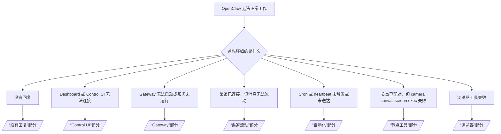

---
read_when:
    - OpenClaw 无法正常工作，你需要最快的修复路径
    - 你希望在深入查看详细操作手册之前，先走一遍分诊流程
summary: OpenClaw 按症状分类的故障排除中心
title: 常规故障排除
x-i18n:
    generated_at: "2026-04-23T20:51:23Z"
    model: gpt-5.4
    provider: openai
    source_hash: ce06ddce9de9e5824b4c5e8c182df07b29ce3ff113eb8e29c62aef9a4682e8e9
    source_path: help/troubleshooting.md
    workflow: 15
---

# 故障排除

如果你只有 2 分钟时间，请把本页当作分诊入口。

## 最初的六十秒

按顺序运行下面这组命令：

```bash
openclaw status
openclaw status --all
openclaw gateway probe
openclaw gateway status
openclaw doctor
openclaw channels status --probe
openclaw logs --follow
```

良好的输出可以概括为：

- `openclaw status` → 显示已配置的渠道，且没有明显的认证错误。
- `openclaw status --all` → 完整报告存在且可分享。
- `openclaw gateway probe` → 预期的 gateway 目标可达（`Reachable: yes`）。`Capability: ...` 表示探测所能证明的认证级别，而 `Read probe: limited - missing scope: operator.read` 表示诊断能力受限，不代表连接失败。
- `openclaw gateway status` → 显示 `Runtime: running`、`Connectivity probe: ok` 以及合理的 `Capability: ...` 行。如果你还需要读作用域的 RPC 证明，可使用 `--require-rpc`。
- `openclaw doctor` → 没有阻塞性的配置/服务错误。
- `openclaw channels status --probe` → 当 gateway 可达时，会返回实时的逐账户传输状态，以及如 `works` 或 `audit ok` 之类的 probe/audit 结果；如果 gateway 不可达，该命令会回退为仅配置摘要。
- `openclaw logs --follow` → 有稳定活动，没有重复出现的致命错误。

## Anthropic 长上下文 429

如果你看到：
`HTTP 429: rate_limit_error: Extra usage is required for long context requests`，
请前往 [/gateway/troubleshooting#anthropic-429-extra-usage-required-for-long-context](/zh-CN/gateway/troubleshooting#anthropic-429-extra-usage-required-for-long-context)。

## 本地 OpenAI 兼容后端可直接工作，但在 OpenClaw 中失败

如果你的本地或自托管 `/v1` 后端能响应小型直接
`/v1/chat/completions` 探测，但在 `openclaw infer model run` 或正常
智能体轮次中失败：

1. 如果错误提到 `messages[].content` 需要字符串，请设置
   `models.providers.<provider>.models[].compat.requiresStringContent: true`。
2. 如果后端仍只在 OpenClaw 智能体轮次中失败，请设置
   `models.providers.<provider>.models[].compat.supportsTools: false` 并重试。
3. 如果微小的直接调用仍然可以工作，但更大的 OpenClaw 提示导致后端崩溃，
   则应将剩余问题视为上游模型/服务器限制，并继续阅读详细操作手册：
   [/gateway/troubleshooting#local-openai-compatible-backend-passes-direct-probes-but-agent-runs-fail](/zh-CN/gateway/troubleshooting#local-openai-compatible-backend-passes-direct-probes-but-agent-runs-fail)

## 插件安装因缺少 openclaw extensions 而失败

如果安装因 `package.json missing openclaw.extensions` 失败，说明该插件包
使用了 OpenClaw 已不再接受的旧结构。

在插件包中修复：

1. 在 `package.json` 中添加 `openclaw.extensions`。
2. 将条目指向已构建的运行时文件（通常是 `./dist/index.js`）。
3. 重新发布插件，再次运行 `openclaw plugins install <package>`。

示例：

```json
{
  "name": "@openclaw/my-plugin",
  "version": "1.2.3",
  "openclaw": {
    "extensions": ["./dist/index.js"]
  }
}
```

参考：[插件架构](/zh-CN/plugins/architecture)

## 决策树



<AccordionGroup>
  <Accordion title="没有回复">
    ```bash
    openclaw status
    openclaw gateway status
    openclaw channels status --probe
    openclaw pairing list --channel <channel> [--account <id>]
    openclaw logs --follow
    ```

    良好的输出应表现为：

    - `Runtime: running`
    - `Connectivity probe: ok`
    - `Capability: read-only`、`write-capable` 或 `admin-capable`
    - 你的渠道显示传输已连接，并且在支持时，`channels status --probe` 中会出现 `works` 或 `audit ok`
    - 发送者显示为已批准（或私信策略为 open/allowlist）

    常见日志特征：

    - `drop guild message (mention required` → Discord 中，提及门控阻止了该消息。
    - `pairing request` → 发送者尚未获批，正在等待私信配对批准。
    - 渠道日志中的 `blocked` / `allowlist` → 发送者、房间或群组被过滤。

    深入页面：

    - [/gateway/troubleshooting#no-replies](/zh-CN/gateway/troubleshooting#no-replies)
    - [/channels/troubleshooting](/zh-CN/channels/troubleshooting)
    - [/channels/pairing](/zh-CN/channels/pairing)

  </Accordion>

  <Accordion title="Dashboard 或 Control UI 无法连接">
    ```bash
    openclaw status
    openclaw gateway status
    openclaw logs --follow
    openclaw doctor
    openclaw channels status --probe
    ```

    良好的输出应表现为：

    - `openclaw gateway status` 中显示 `Dashboard: http://...`
    - `Connectivity probe: ok`
    - `Capability: read-only`、`write-capable` 或 `admin-capable`
    - 日志中没有认证循环

    常见日志特征：

    - `device identity required` → HTTP/非安全上下文无法完成设备认证。
    - `origin not allowed` → 浏览器 `Origin` 不在 Control UI
      gateway 目标的允许范围内。
    - `AUTH_TOKEN_MISMATCH` 并带有重试提示（`canRetryWithDeviceToken=true`）→ 可能会自动进行一次受信任的 device-token 重试。
    - 该缓存 token 重试会复用与已配对
      设备 token 一起存储的缓存作用域集合。显式 `deviceToken` / 显式 `scopes` 调用方则保留其请求的作用域集合。
    - 在异步 Tailscale Serve Control UI 路径中，对于相同
      `{scope, ip}` 的失败尝试，会在 limiter 记录失败前进行串行化，因此第二个并发错误重试可能已经显示 `retry later`。
    - 来自 localhost 浏览器 origin 的 `too many failed authentication attempts (retry later)` → 同一 `Origin` 的重复失败已被暂时锁定；另一个 localhost origin 使用的是单独的配额桶。
    - 在那次重试之后仍反复出现 `unauthorized` → token/密码错误、认证模式不匹配，或已配对设备 token 已过期。
    - `gateway connect failed:` → UI 指向了错误的 URL/端口，或 gateway 不可达。

    深入页面：

    - [/gateway/troubleshooting#dashboard-control-ui-connectivity](/zh-CN/gateway/troubleshooting#dashboard-control-ui-connectivity)
    - [/web/control-ui](/zh-CN/web/control-ui)
    - [/gateway/authentication](/zh-CN/gateway/authentication)

  </Accordion>

  <Accordion title="Gateway 无法启动，或服务已安装但未运行">
    ```bash
    openclaw status
    openclaw gateway status
    openclaw logs --follow
    openclaw doctor
    openclaw channels status --probe
    ```

    良好的输出应表现为：

    - `Service: ... (loaded)`
    - `Runtime: running`
    - `Connectivity probe: ok`
    - `Capability: read-only`、`write-capable` 或 `admin-capable`

    常见日志特征：

    - `Gateway start blocked: set gateway.mode=local` 或 `existing config is missing gateway.mode` → gateway 模式是 remote，或者配置文件缺少 local-mode 标记，需要修复。
    - `refusing to bind gateway ... without auth` → 在没有有效 gateway 认证路径（token/password，或在已配置时使用 trusted-proxy）的情况下，尝试进行非 loopback 绑定。
    - `another gateway instance is already listening` 或 `EADDRINUSE` → 端口已被占用。

    深入页面：

    - [/gateway/troubleshooting#gateway-service-not-running](/zh-CN/gateway/troubleshooting#gateway-service-not-running)
    - [/gateway/background-process](/zh-CN/gateway/background-process)
    - [/gateway/configuration](/zh-CN/gateway/configuration)

  </Accordion>

  <Accordion title="渠道已连接，但消息无法流动">
    ```bash
    openclaw status
    openclaw gateway status
    openclaw logs --follow
    openclaw doctor
    openclaw channels status --probe
    ```

    良好的输出应表现为：

    - 渠道传输已连接。
    - 配对/允许列表检查通过。
    - 在需要时，提及可被检测到。

    常见日志特征：

    - `mention required` → 群组提及门控阻止了处理。
    - `pairing` / `pending` → 私信发送者尚未获批。
    - `not_in_channel`、`missing_scope`、`Forbidden`、`401/403` → 渠道权限 token 问题。

    深入页面：

    - [/gateway/troubleshooting#channel-connected-messages-not-flowing](/zh-CN/gateway/troubleshooting#channel-connected-messages-not-flowing)
    - [/channels/troubleshooting](/zh-CN/channels/troubleshooting)

  </Accordion>

  <Accordion title="Cron 或 heartbeat 未触发或未送达">
    ```bash
    openclaw status
    openclaw gateway status
    openclaw cron status
    openclaw cron list
    openclaw cron runs --id <jobId> --limit 20
    openclaw logs --follow
    ```

    良好的输出应表现为：

    - `cron.status` 显示已启用，并有下次唤醒时间。
    - `cron runs` 显示最近的 `ok` 条目。
    - heartbeat 已启用，且不在静默时段之外。

    常见日志特征：

    - `cron: scheduler disabled; jobs will not run automatically` → cron 已禁用。
    - `heartbeat skipped` 且 `reason=quiet-hours` → 当前处于配置的静默时段外。
    - `heartbeat skipped` 且 `reason=empty-heartbeat-file` → `HEARTBEAT.md` 存在，但只包含空白/仅标题脚手架。
    - `heartbeat skipped` 且 `reason=no-tasks-due` → `HEARTBEAT.md` 任务模式已启用，但当前没有到期的任务间隔。
    - `heartbeat skipped` 且 `reason=alerts-disabled` → 所有 heartbeat 可见性都被禁用（`showOk`、`showAlerts` 和 `useIndicator` 全部关闭）。
    - `requests-in-flight` → 主通道繁忙；heartbeat 唤醒被延后。
    - `unknown accountId` → heartbeat 投递目标账户不存在。

    深入页面：

    - [/gateway/troubleshooting#cron-and-heartbeat-delivery](/zh-CN/gateway/troubleshooting#cron-and-heartbeat-delivery)
    - [/automation/cron-jobs#troubleshooting](/zh-CN/automation/cron-jobs#troubleshooting)
    - [/gateway/heartbeat](/zh-CN/gateway/heartbeat)

  </Accordion>

  <Accordion title="节点已配对，但工具失败：camera canvas screen exec">
    ```bash
    openclaw status
    openclaw gateway status
    openclaw nodes status
    openclaw nodes describe --node <idOrNameOrIp>
    openclaw logs --follow
    ```

    良好的输出应表现为：

    - 节点被列为已连接，并以 `node` 角色完成配对。
    - 你调用的命令所需能力存在。
    - 工具的权限状态已授予。

    常见日志特征：

    - `NODE_BACKGROUND_UNAVAILABLE` → 请将节点应用切回前台。
    - `*_PERMISSION_REQUIRED` → OS 权限被拒绝或缺失。
    - `SYSTEM_RUN_DENIED: approval required` → exec 批准仍在等待中。
    - `SYSTEM_RUN_DENIED: allowlist miss` → 命令不在 exec 允许列表中。

    深入页面：

    - [/gateway/troubleshooting#node-paired-tool-fails](/zh-CN/gateway/troubleshooting#node-paired-tool-fails)
    - [/nodes/troubleshooting](/zh-CN/nodes/troubleshooting)
    - [/tools/exec-approvals](/zh-CN/tools/exec-approvals)

  </Accordion>

  <Accordion title="Exec 突然开始请求批准">
    ```bash
    openclaw config get tools.exec.host
    openclaw config get tools.exec.security
    openclaw config get tools.exec.ask
    openclaw gateway restart
    ```

    发生了什么变化：

    - 如果未设置 `tools.exec.host`，默认值是 `auto`。
    - `host=auto` 在存在沙箱运行时时会解析为 `sandbox`，否则解析为 `gateway`。
    - `host=auto` 只负责路由；无提示的 “YOLO” 行为来自于 gateway/node 上的 `security=full` 加 `ask=off`。
    - 在 `gateway` 和 `node` 上，未设置的 `tools.exec.security` 默认值为 `full`。
    - 未设置的 `tools.exec.ask` 默认值为 `off`。
    - 结果是：如果你现在看到了批准提示，说明某些宿主机本地策略或按会话策略，相对于当前默认值收紧了 exec。

    恢复为当前默认的无批准行为：

    ```bash
    openclaw config set tools.exec.host gateway
    openclaw config set tools.exec.security full
    openclaw config set tools.exec.ask off
    openclaw gateway restart
    ```

    更安全的替代方案：

    - 如果你只是想要稳定的宿主机路由，只设置 `tools.exec.host=gateway`。
    - 如果你想使用宿主机 exec，但仍希望在 allowlist 未命中时进行审核，可使用 `security=allowlist` 搭配 `ask=on-miss`。
    - 如果你希望 `host=auto` 重新解析为 `sandbox`，请启用沙箱模式。

    常见日志特征：

    - `Approval required.` → 命令正在等待 `/approve ...`。
    - `SYSTEM_RUN_DENIED: approval required` → node-host exec 批准仍在等待中。
    - `exec host=sandbox requires a sandbox runtime for this session` → 已隐式/显式选择了 sandbox，但当前会话的沙箱模式已关闭。

    深入页面：

    - [/tools/exec](/zh-CN/tools/exec)
    - [/tools/exec-approvals](/zh-CN/tools/exec-approvals)
    - [/gateway/security#what-the-audit-checks-high-level](/zh-CN/gateway/security#what-the-audit-checks-high-level)

  </Accordion>

  <Accordion title="浏览器工具失败">
    ```bash
    openclaw status
    openclaw gateway status
    openclaw browser status
    openclaw logs --follow
    openclaw doctor
    ```

    良好的输出应表现为：

    - 浏览器状态显示 `running: true`，并已选定某个浏览器/profile。
    - `openclaw` 能启动，或者 `user` 能看到本地 Chrome 标签页。

    常见日志特征：

    - `unknown command "browser"` 或 `unknown command 'browser'` → 设置了 `plugins.allow`，但其中不包含 `browser`。
    - `Failed to start Chrome CDP on port` → 本地浏览器启动失败。
    - `browser.executablePath not found` → 配置的二进制路径错误。
    - `browser.cdpUrl must be http(s) or ws(s)` → 配置的 CDP URL 使用了不受支持的 scheme。
    - `browser.cdpUrl has invalid port` → 配置的 CDP URL 使用了错误或超范围的端口。
    - `No Chrome tabs found for profile="user"` → Chrome MCP 附加 profile 没有打开的本地 Chrome 标签页。
    - `Remote CDP for profile "<name>" is not reachable` → 从当前主机无法访问所配置的远程 CDP 端点。
    - `Browser attachOnly is enabled ... not reachable` 或 `Browser attachOnly is enabled and CDP websocket ... is not reachable` → 仅附加 profile 没有可用的实时 CDP 目标。
    - attach-only 或远程 CDP profile 上出现过期的 viewport / dark-mode / locale / offline 覆盖状态 → 运行 `openclaw browser stop --browser-profile <name>`，即可关闭当前控制会话并释放仿真状态，而无需重启 gateway。

    深入页面：

    - [/gateway/troubleshooting#browser-tool-fails](/zh-CN/gateway/troubleshooting#browser-tool-fails)
    - [/tools/browser#missing-browser-command-or-tool](/zh-CN/tools/browser#missing-browser-command-or-tool)
    - [/tools/browser-linux-troubleshooting](/zh-CN/tools/browser-linux-troubleshooting)
    - [/tools/browser-wsl2-windows-remote-cdp-troubleshooting](/zh-CN/tools/browser-wsl2-windows-remote-cdp-troubleshooting)

  </Accordion>

</AccordionGroup>

## 相关内容

- [常见问题](/zh-CN/help/faq) — 常见问题
- [Gateway 网关故障排除](/zh-CN/gateway/troubleshooting) — Gateway 网关特定问题
- [Doctor](/zh-CN/gateway/doctor) — 自动健康检查与修复
- [渠道故障排除](/zh-CN/channels/troubleshooting) — 渠道连接问题
- [自动化故障排除](/zh-CN/automation/cron-jobs#troubleshooting) — cron 和 heartbeat 问题
