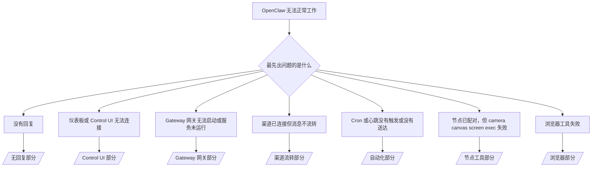

---
read_when:
    - OpenClaw 无法正常工作，而你需要最快速的修复路径
    - 在深入查看详细操作手册之前，你想先走一遍分诊流程
summary: OpenClaw 的按症状优先故障排除中心
title: 常见故障排除
x-i18n:
    generated_at: "2026-04-20T06:31:02Z"
    model: gpt-5.4
    provider: openai
    source_hash: cc5d8c9f804084985c672c5a003ce866e8142ab99fe81abb7a0d38e22aea4b88
    source_path: help/troubleshooting.md
    workflow: 15
---

# 故障排除

如果你只有 2 分钟，把这个页面当作分诊入口。

## 最初的六十秒

按顺序运行下面这组精确的排查步骤：

```bash
openclaw status
openclaw status --all
openclaw gateway probe
openclaw gateway status
openclaw doctor
openclaw channels status --probe
openclaw logs --follow
```

一行看懂“正常输出”：

- `openclaw status` → 显示已配置的渠道，且没有明显的认证错误。
- `openclaw status --all` → 完整报告存在，并且可以分享。
- `openclaw gateway probe` → 可以访问预期的 Gateway 网关目标（`Reachable: yes`）。`Capability: ...` 会告诉你探测能够证明的认证级别，而 `Read probe: limited - missing scope: operator.read` 表示诊断能力降级，不是连接失败。
- `openclaw gateway status` → 显示 `Runtime: running`、`Connectivity probe: ok`，以及合理的 `Capability: ...` 行。如果你还需要验证读权限范围的 RPC 证明，请使用 `--require-rpc`。
- `openclaw doctor` → 没有阻塞性的配置或服务错误。
- `openclaw channels status --probe` → 当 Gateway 网关可达时，会返回每个账户的实时传输状态，以及诸如 `works` 或 `audit ok` 这样的探测/审计结果；如果 Gateway 网关不可达，该命令会回退为仅配置摘要。
- `openclaw logs --follow` → 活动持续稳定，没有反复出现的致命错误。

## Anthropic 长上下文 429

如果你看到：
`HTTP 429: rate_limit_error: Extra usage is required for long context requests`，
请前往 [/gateway/troubleshooting#anthropic-429-extra-usage-required-for-long-context](/zh-CN/gateway/troubleshooting#anthropic-429-extra-usage-required-for-long-context)。

## 本地 OpenAI 兼容后端直接可用，但在 OpenClaw 中失败

如果你的本地或自托管 `/v1` 后端可以响应小型直接
`/v1/chat/completions` 探测，但在 `openclaw infer model run` 或正常
智能体 回合中失败：

1. 如果错误提到 `messages[].content` 需要字符串，设置
   `models.providers.<provider>.models[].compat.requiresStringContent: true`。
2. 如果该后端仍然只在 OpenClaw 智能体 回合中失败，设置
   `models.providers.<provider>.models[].compat.supportsTools: false` 然后重试。
3. 如果极小的直接调用仍然可用，但更大的 OpenClaw 提示词会让后端崩溃，将剩余问题视为上游模型/服务器限制，并继续查看详细操作手册：
   [/gateway/troubleshooting#local-openai-compatible-backend-passes-direct-probes-but-agent-runs-fail](/zh-CN/gateway/troubleshooting#local-openai-compatible-backend-passes-direct-probes-but-agent-runs-fail)

## 插件安装失败，提示缺少 openclaw extensions

如果安装失败并显示 `package.json missing openclaw.extensions`，说明该插件包
使用了 OpenClaw 已不再接受的旧结构。

在插件包中这样修复：

1. 在 `package.json` 中添加 `openclaw.extensions`。
2. 将入口指向已构建的运行时文件（通常是 `./dist/index.js`）。
3. 重新发布该插件，然后再次运行 `openclaw plugins install <package>`。

示例：

```json
{
  "name": "@openclaw/my-plugin",
  "version": "1.2.3",
  "openclaw": {
    "extensions": ["./dist/index.js"]
  }
}
```

参考：[插件架构](/zh-CN/plugins/architecture)

## 决策树



<AccordionGroup>
  <Accordion title="没有回复">
    ```bash
    openclaw status
    openclaw gateway status
    openclaw channels status --probe
    openclaw pairing list --channel <channel> [--account <id>]
    openclaw logs --follow
    ```

    正常输出应类似于：

    - `Runtime: running`
    - `Connectivity probe: ok`
    - `Capability: read-only`、`write-capable` 或 `admin-capable`
    - 你的渠道显示传输已连接，并且在支持的情况下，`channels status --probe` 中会显示 `works` 或 `audit ok`
    - 发送方显示已获批准（或 私信 策略为开放/允许列表）

    常见日志特征：

    - `drop guild message (mention required` → Discord 中的提及门控阻止了该消息。
    - `pairing request` → 发送方未获批准，正在等待 私信 配对批准。
    - 渠道日志中的 `blocked` / `allowlist` → 发送方、房间或群组被过滤。

    详细页面：

    - [/gateway/troubleshooting#no-replies](/zh-CN/gateway/troubleshooting#no-replies)
    - [/channels/troubleshooting](/zh-CN/channels/troubleshooting)
    - [/channels/pairing](/zh-CN/channels/pairing)

  </Accordion>

  <Accordion title="仪表板或 Control UI 无法连接">
    ```bash
    openclaw status
    openclaw gateway status
    openclaw logs --follow
    openclaw doctor
    openclaw channels status --probe
    ```

    正常输出应类似于：

    - `openclaw gateway status` 中显示 `Dashboard: http://...`
    - `Connectivity probe: ok`
    - `Capability: read-only`、`write-capable` 或 `admin-capable`
    - 日志中没有认证循环

    常见日志特征：

    - `device identity required` → HTTP/非安全上下文无法完成设备认证。
    - `origin not allowed` → 浏览器 `Origin` 不被该 Control UI Gateway 网关目标允许。
    - 带有重试提示（`canRetryWithDeviceToken=true`）的 `AUTH_TOKEN_MISMATCH` → 可能会自动进行一次可信设备令牌重试。
    - 该缓存令牌重试会复用与已配对设备令牌一起存储的缓存作用域集合。显式 `deviceToken` / 显式 `scopes` 调用方则会保留其请求的作用域集合。
    - 在异步 Tailscale Serve Control UI 路径中，对于同一个 `{scope, ip}` 的失败尝试会在限制器记录失败之前被串行化，因此第二个并发的错误重试可能已经显示 `retry later`。
    - 来自 localhost 浏览器来源的 `too many failed authentication attempts (retry later)` → 来自同一个 `Origin` 的重复失败会被临时锁定；另一个 localhost 来源会使用单独的桶。
    - 在该重试之后反复出现 `unauthorized` → 令牌/密码错误、认证模式不匹配，或已配对设备令牌已过期。
    - `gateway connect failed:` → UI 指向了错误的 URL/端口，或 Gateway 网关不可达。

    详细页面：

    - [/gateway/troubleshooting#dashboard-control-ui-connectivity](/zh-CN/gateway/troubleshooting#dashboard-control-ui-connectivity)
    - [/web/control-ui](/web/control-ui)
    - [/gateway/authentication](/zh-CN/gateway/authentication)

  </Accordion>

  <Accordion title="Gateway 网关无法启动，或服务已安装但未运行">
    ```bash
    openclaw status
    openclaw gateway status
    openclaw logs --follow
    openclaw doctor
    openclaw channels status --probe
    ```

    正常输出应类似于：

    - `Service: ... (loaded)`
    - `Runtime: running`
    - `Connectivity probe: ok`
    - `Capability: read-only`、`write-capable` 或 `admin-capable`

    常见日志特征：

    - `Gateway start blocked: set gateway.mode=local` 或 `existing config is missing gateway.mode` → Gateway 网关模式为 remote，或者配置文件缺少本地模式标记，需要修复。
    - `refusing to bind gateway ... without auth` → 在没有有效 Gateway 网关认证路径（令牌/密码，或已配置的 trusted-proxy）的情况下拒绝绑定非 loopback 地址。
    - `another gateway instance is already listening` 或 `EADDRINUSE` → 端口已被占用。

    详细页面：

    - [/gateway/troubleshooting#gateway-service-not-running](/zh-CN/gateway/troubleshooting#gateway-service-not-running)
    - [/gateway/background-process](/zh-CN/gateway/background-process)
    - [/gateway/configuration](/zh-CN/gateway/configuration)

  </Accordion>

  <Accordion title="渠道已连接但消息不流转">
    ```bash
    openclaw status
    openclaw gateway status
    openclaw logs --follow
    openclaw doctor
    openclaw channels status --probe
    ```

    正常输出应类似于：

    - 渠道传输已连接。
    - 配对/允许列表检查已通过。
    - 在需要时，提及已被检测到。

    常见日志特征：

    - `mention required` → 群组提及门控阻止了处理。
    - `pairing` / `pending` → 私信 发送方尚未获批准。
    - `not_in_channel`、`missing_scope`、`Forbidden`、`401/403` → 渠道权限令牌问题。

    详细页面：

    - [/gateway/troubleshooting#channel-connected-messages-not-flowing](/zh-CN/gateway/troubleshooting#channel-connected-messages-not-flowing)
    - [/channels/troubleshooting](/zh-CN/channels/troubleshooting)

  </Accordion>

  <Accordion title="Cron 或心跳没有触发或没有送达">
    ```bash
    openclaw status
    openclaw gateway status
    openclaw cron status
    openclaw cron list
    openclaw cron runs --id <jobId> --limit 20
    openclaw logs --follow
    ```

    正常输出应类似于：

    - `cron.status` 显示已启用，并带有下一次唤醒时间。
    - `cron runs` 显示最近的 `ok` 条目。
    - 心跳已启用，且不在活跃时段之外。

    常见日志特征：

    - `cron: scheduler disabled; jobs will not run automatically` → cron 已禁用。
    - 带有 `reason=quiet-hours` 的 `heartbeat skipped` → 当前不在配置的活跃时段内。
    - 带有 `reason=empty-heartbeat-file` 的 `heartbeat skipped` → `HEARTBEAT.md` 存在，但只包含空白/仅标题的骨架内容。
    - 带有 `reason=no-tasks-due` 的 `heartbeat skipped` → `HEARTBEAT.md` 任务模式已启用，但尚无任务到达间隔时间。
    - 带有 `reason=alerts-disabled` 的 `heartbeat skipped` → 所有心跳可见性均被禁用（`showOk`、`showAlerts` 和 `useIndicator` 全部关闭）。
    - `requests-in-flight` → 主通道繁忙；心跳唤醒被延后。
    - `unknown accountId` → 心跳投递目标账户不存在。

    详细页面：

    - [/gateway/troubleshooting#cron-and-heartbeat-delivery](/zh-CN/gateway/troubleshooting#cron-and-heartbeat-delivery)
    - [/automation/cron-jobs#troubleshooting](/zh-CN/automation/cron-jobs#troubleshooting)
    - [/gateway/heartbeat](/zh-CN/gateway/heartbeat)

    </Accordion>

    <Accordion title="节点已配对，但工具中的 camera canvas screen exec 失败">
      ```bash
      openclaw status
      openclaw gateway status
      openclaw nodes status
      openclaw nodes describe --node <idOrNameOrIp>
      openclaw logs --follow
      ```

      正常输出应类似于：

      - 节点显示为已连接，并且已按 `node` 角色完成配对。
      - 你正在调用的命令具备相应能力。
      - 该工具的权限状态已授予。

      常见日志特征：

      - `NODE_BACKGROUND_UNAVAILABLE` → 将节点应用切到前台。
      - `*_PERMISSION_REQUIRED` → 操作系统权限被拒绝或缺失。
      - `SYSTEM_RUN_DENIED: approval required` → exec 审批仍在等待中。
      - `SYSTEM_RUN_DENIED: allowlist miss` → 命令不在 exec 允许列表中。

      详细页面：

      - [/gateway/troubleshooting#node-paired-tool-fails](/zh-CN/gateway/troubleshooting#node-paired-tool-fails)
      - [/nodes/troubleshooting](/zh-CN/nodes/troubleshooting)
      - [/tools/exec-approvals](/zh-CN/tools/exec-approvals)

    </Accordion>

    <Accordion title="Exec 突然开始要求审批">
      ```bash
      openclaw config get tools.exec.host
      openclaw config get tools.exec.security
      openclaw config get tools.exec.ask
      openclaw gateway restart
      ```

      发生了什么变化：

      - 如果 `tools.exec.host` 未设置，默认值是 `auto`。
      - `host=auto` 在沙箱运行时处于活动状态时会解析为 `sandbox`，否则解析为 `gateway`。
      - `host=auto` 只负责路由；无提示的 “YOLO” 行为来自 gateway/node 上的 `security=full` 加 `ask=off`。
      - 在 `gateway` 和 `node` 上，未设置的 `tools.exec.security` 默认是 `full`。
      - 未设置的 `tools.exec.ask` 默认是 `off`。
      - 结果：如果你看到了审批提示，说明某些主机本地或按会话生效的策略把 exec 收紧到了偏离当前默认值的状态。

      恢复当前默认的“无需审批”行为：

      ```bash
      openclaw config set tools.exec.host gateway
      openclaw config set tools.exec.security full
      openclaw config set tools.exec.ask off
      openclaw gateway restart
      ```

      更安全的替代方案：

      - 如果你只是想要稳定的主机路由，只设置 `tools.exec.host=gateway`。
      - 如果你想使用主机 exec，但仍希望在允许列表未命中时进行审查，可使用 `security=allowlist` 搭配 `ask=on-miss`。
      - 如果你希望 `host=auto` 重新解析为 `sandbox`，请启用沙箱模式。

      常见日志特征：

      - `Approval required.` → 命令正在等待 `/approve ...`。
      - `SYSTEM_RUN_DENIED: approval required` → 节点主机 exec 审批仍在等待中。
      - `exec host=sandbox requires a sandbox runtime for this session` → 隐式或显式选择了 sandbox，但沙箱模式未开启。

      详细页面：

      - [/tools/exec](/zh-CN/tools/exec)
      - [/tools/exec-approvals](/zh-CN/tools/exec-approvals)
      - [/gateway/security#what-the-audit-checks-high-level](/zh-CN/gateway/security#what-the-audit-checks-high-level)

    </Accordion>

    <Accordion title="浏览器工具失败">
      ```bash
      openclaw status
      openclaw gateway status
      openclaw browser status
      openclaw logs --follow
      openclaw doctor
      ```

      正常输出应类似于：

      - 浏览器状态显示 `running: true`，以及选定的浏览器/配置文件。
      - `openclaw` 能启动，或者 `user` 可以看到本地 Chrome 标签页。

      常见日志特征：

      - `unknown command "browser"` 或 `unknown command 'browser'` → 设置了 `plugins.allow`，但其中不包含 `browser`。
      - `Failed to start Chrome CDP on port` → 本地浏览器启动失败。
      - `browser.executablePath not found` → 配置的二进制路径错误。
      - `browser.cdpUrl must be http(s) or ws(s)` → 配置的 CDP URL 使用了不受支持的协议。
      - `browser.cdpUrl has invalid port` → 配置的 CDP URL 端口无效或超出范围。
      - `No Chrome tabs found for profile="user"` → Chrome MCP 附加配置文件没有打开的本地 Chrome 标签页。
      - `Remote CDP for profile "<name>" is not reachable` → 配置的远程 CDP 端点从当前主机无法访问。
      - `Browser attachOnly is enabled ... not reachable` 或 `Browser attachOnly is enabled and CDP websocket ... is not reachable` → 仅附加配置文件没有可用的实时 CDP 目标。
      - attach-only 或远程 CDP 配置文件上存在过期的视口 / 深色模式 / 区域设置 / 离线覆盖状态 → 运行 `openclaw browser stop --browser-profile <name>`，关闭活动控制会话并释放模拟状态，而无需重启 Gateway 网关。

      详细页面：

      - [/gateway/troubleshooting#browser-tool-fails](/zh-CN/gateway/troubleshooting#browser-tool-fails)
      - [/tools/browser#missing-browser-command-or-tool](/zh-CN/tools/browser#missing-browser-command-or-tool)
      - [/tools/browser-linux-troubleshooting](/zh-CN/tools/browser-linux-troubleshooting)
      - [/tools/browser-wsl2-windows-remote-cdp-troubleshooting](/zh-CN/tools/browser-wsl2-windows-remote-cdp-troubleshooting)

    </Accordion>

  </AccordionGroup>

## 相关内容

- [常见问题](/zh-CN/help/faq) — 常见问题
- [Gateway 网关故障排除](/zh-CN/gateway/troubleshooting) — Gateway 网关专属问题
- [Doctor](/zh-CN/gateway/doctor) — 自动健康检查与修复
- [渠道故障排除](/zh-CN/channels/troubleshooting) — 渠道连接问题
- [自动化故障排除](/zh-CN/automation/cron-jobs#troubleshooting) — cron 和心跳问题
