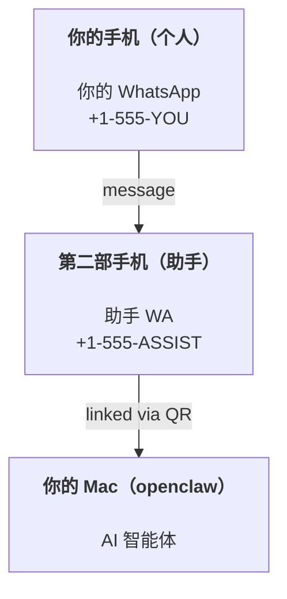

---
read_when:
    - |-
      为新的助手实例进行新手引导】【：】【“】【analysis to=functions.read code  สามสิบเอ็ดjson
      {"path":"/home/runner/work/docs/docs/source/scripts/docs-i18n/","offset":1,"limit":1}
    - 审查安全性/权限影响
summary: 将 OpenClaw 作为个人助手运行的端到端指南，并包含安全注意事项
title: 个人助手设置
x-i18n:
    generated_at: "2026-04-23T21:05:42Z"
    model: gpt-5.4
    provider: openai
    source_hash: 803740cece6c908214628256e9766530db37442693278c184e3606e44f7eb28f
    source_path: start/openclaw.md
    workflow: 15
---

# 使用 OpenClaw 构建个人助手

OpenClaw 是一个自托管 Gateway 网关，可将 Discord、Google Chat、iMessage、Matrix、Microsoft Teams、Signal、Slack、Telegram、WhatsApp、Zalo 等连接到 AI 智能体。本指南介绍“个人助手”设置：一个专用的 WhatsApp 号码，让它表现得像你始终在线的 AI 助手。

## ⚠️ 安全第一

你正在让一个智能体处于可以执行以下操作的位置：

- 在你的机器上运行命令（取决于你的工具策略）
- 读取/写入工作区中的文件
- 通过 WhatsApp/Telegram/Discord/Mattermost 以及其他内置渠道向外发送消息

请从保守配置开始：

- 一定要设置 `channels.whatsapp.allowFrom`（绝不要在你的个人 Mac 上开放给所有人）。
- 为助手使用一个专用的 WhatsApp 号码。
- Heartbeat 现在默认每 30 分钟一次。在你信任这套设置之前，请通过设置 `agents.defaults.heartbeat.every: "0m"` 来禁用它。

## 前置条件

- 已安装并完成 OpenClaw 新手引导——如果你还没做，请参见 [入门指南](/zh-CN/start/getting-started)
- 一个给助手使用的第二号码（SIM/eSIM/预付费卡均可）

## 双手机设置（推荐）

你需要的是这样的结构：



如果你把自己的个人 WhatsApp 绑定到 OpenClaw，那么发给你的每一条消息都会变成“智能体输入”。这通常并不是你想要的效果。

## 5 分钟快速开始

1. 配对 WhatsApp Web（会显示二维码；使用助手手机扫描）：

```bash
openclaw channels login
```

2. 启动 Gateway 网关（保持其运行）：

```bash
openclaw gateway --port 18789
```

3. 在 `~/.openclaw/openclaw.json` 中放入最小配置：

```json5
{
  gateway: { mode: "local" },
  channels: { whatsapp: { allowFrom: ["+15555550123"] } },
}
```

现在，从已加入允许列表的手机向助手号码发消息即可。

当新手引导完成后，我们会自动打开 dashboard，并打印一个干净的（不含 token）链接。如果它提示需要认证，请将已配置的共享 secret 粘贴到 Control UI 设置中。新手引导默认使用 token（`gateway.auth.token`），但如果你把 `gateway.auth.mode` 改成了 `password`，也可以使用密码认证。之后如需重新打开：`openclaw dashboard`。

## 给智能体一个工作区（AGENTS）

OpenClaw 会从工作区目录中读取操作指令和“记忆”。

默认情况下，OpenClaw 使用 `~/.openclaw/workspace` 作为智能体工作区，并会在 setup/首次运行智能体时自动创建它（以及初始的 `AGENTS.md`、`SOUL.md`、`TOOLS.md`、`IDENTITY.md`、`USER.md`、`HEARTBEAT.md`）。`BOOTSTRAP.md` 只会在工作区全新创建时生成一次（删除后不应再次自动出现）。`MEMORY.md` 是可选的（不会自动创建）；如果存在，它会在普通会话中加载。子智能体会话只会注入 `AGENTS.md` 和 `TOOLS.md`。

提示：请将这个文件夹当作 OpenClaw 的“记忆”，并把它做成一个 git 仓库（最好是私有的），这样你的 `AGENTS.md` 和各种记忆文件就能被备份。如果安装了 git，全新工作区会自动初始化为仓库。

```bash
openclaw setup
```

完整工作区布局与备份指南：[智能体工作区](/zh-CN/concepts/agent-workspace)  
Memory 工作流：[Memory](/zh-CN/concepts/memory)

可选：使用 `agents.defaults.workspace` 选择不同的工作区（支持 `~`）。

```json5
{
  agent: {
    workspace: "~/.openclaw/workspace",
  },
}
```

如果你已经从仓库中自行提供工作区文件，可以完全禁用 bootstrap 文件创建：

```json5
{
  agent: {
    skipBootstrap: true,
  },
}
```

## 将它变成“助手”的配置

OpenClaw 默认已经具备一个不错的助手设置，但你通常还会想调整：

- [`SOUL.md`](/zh-CN/concepts/soul) 中的人设/指令
- thinking 默认值（如果需要）
- heartbeat（等你信任这套配置之后再开启）

示例：

```json5
{
  logging: { level: "info" },
  agent: {
    model: "anthropic/claude-opus-4-6",
    workspace: "~/.openclaw/workspace",
    thinkingDefault: "high",
    timeoutSeconds: 1800,
    // Start with 0; enable later.
    heartbeat: { every: "0m" },
  },
  channels: {
    whatsapp: {
      allowFrom: ["+15555550123"],
      groups: {
        "*": { requireMention: true },
      },
    },
  },
  routing: {
    groupChat: {
      mentionPatterns: ["@openclaw", "openclaw"],
    },
  },
  session: {
    scope: "per-sender",
    resetTriggers: ["/new", "/reset"],
    reset: {
      mode: "daily",
      atHour: 4,
      idleMinutes: 10080,
    },
  },
}
```

## 会话与 Memory

- 会话文件：`~/.openclaw/agents/<agentId>/sessions/{{SessionId}}.jsonl`
- 会话元数据（token 使用量、最后路由等）：`~/.openclaw/agents/<agentId>/sessions/sessions.json`（旧版路径：`~/.openclaw/sessions/sessions.json`）
- `/new` 或 `/reset` 会为当前聊天启动一个新会话（可通过 `resetTriggers` 配置）。如果单独发送，智能体会回复一个简短问候以确认已重置。
- `/compact [instructions]` 会压缩会话上下文，并报告剩余的上下文预算。

## Heartbeat（主动模式）

默认情况下，OpenClaw 每 30 分钟运行一次 heartbeat，提示词如下：  
`Read HEARTBEAT.md if it exists (workspace context). Follow it strictly. Do not infer or repeat old tasks from prior chats. If nothing needs attention, reply HEARTBEAT_OK.`  
将 `agents.defaults.heartbeat.every: "0m"` 设为禁用。

- 如果 `HEARTBEAT.md` 存在但实际上是空的（只包含空行和诸如 `# Heading` 这样的 Markdown 标题），OpenClaw 会跳过该次 heartbeat 运行，以节省 API 调用。
- 如果该文件不存在，heartbeat 仍会运行，由模型自行决定该做什么。
- 如果智能体回复 `HEARTBEAT_OK`（可带很短的填充；参见 `agents.defaults.heartbeat.ackMaxChars`），OpenClaw 会抑制该次 heartbeat 的出站投递。
- 默认情况下，heartbeat 允许投递到私信风格的 `user:<id>` 目标。将 `agents.defaults.heartbeat.directPolicy: "block"` 设为阻止，可在保留 heartbeat 运行的同时抑制向直接目标发送。
- Heartbeat 会运行完整的智能体轮次——时间间隔越短，消耗的 token 越多。

```json5
{
  agent: {
    heartbeat: { every: "30m" },
  },
}
```

## 媒体输入与输出

入站附件（图像/音频/文档）可以通过模板暴露给你的命令：

- `{{MediaPath}}`（本地临时文件路径）
- `{{MediaUrl}}`（伪 URL）
- `{{Transcript}}`（如果启用了音频转录）

来自智能体的出站附件：请在单独一行中包含 `MEDIA:<path-or-url>`（不要有空格）。例如：

```text
Here’s the screenshot.
MEDIA:https://example.com/screenshot.png
```

OpenClaw 会提取这些内容，并将它们作为媒体与文本一起发送。

本地路径行为遵循与智能体相同的文件读取信任模型：

- 如果 `tools.fs.workspaceOnly` 为 `true`，则出站 `MEDIA:` 本地路径仍受限于 OpenClaw 临时根目录、媒体缓存、智能体工作区路径以及沙箱生成文件。
- 如果 `tools.fs.workspaceOnly` 为 `false`，则出站 `MEDIA:` 可以使用智能体本就有权读取的宿主机本地文件。
- 宿主机本地发送仍然只允许媒体和安全文档类型（图像、音频、视频、PDF 和 Office 文档）。纯文本和疑似 secret 文件不会被视为可发送媒体。

这意味着，当你的 fs 策略本就允许读取时，现在可以发送位于工作区之外的生成图像/文件，而不会重新打开任意宿主机文本附件外传的大门。

## 运维检查清单

```bash
openclaw status          # 本地状态（凭证、会话、排队事件）
openclaw status --all    # 完整诊断（只读、可粘贴）
openclaw status --deep   # 向 gateway 请求实时健康探测，并在支持时包含渠道探测
openclaw health --json   # gateway 健康状态快照（WS；默认可返回新的缓存快照）
```

日志位于 `/tmp/openclaw/` 下（默认：`openclaw-YYYY-MM-DD.log`）。

## 下一步

- WebChat：[WebChat](/zh-CN/web/webchat)
- Gateway 网关运维：[Gateway 网关运行手册](/zh-CN/gateway)
- Cron + 唤醒：[Cron jobs](/zh-CN/automation/cron-jobs)
- macOS 菜单栏配套应用：[OpenClaw macOS 应用](/zh-CN/platforms/macos)
- iOS 节点应用：[iOS 应用](/zh-CN/platforms/ios)
- Android 节点应用：[Android 应用](/zh-CN/platforms/android)
- Windows 状态：[Windows（WSL2）](/zh-CN/platforms/windows)
- Linux 状态：[Linux 应用](/zh-CN/platforms/linux)
- 安全：[安全](/zh-CN/gateway/security)
